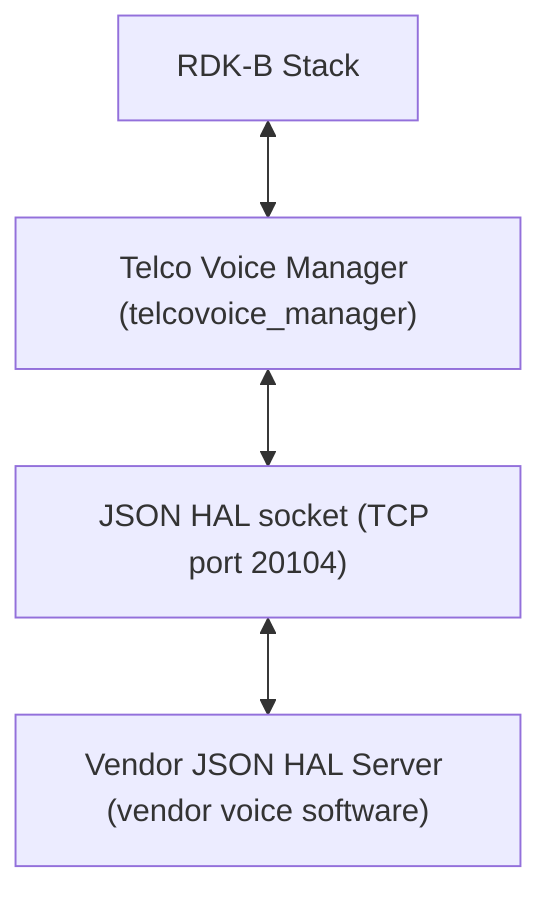
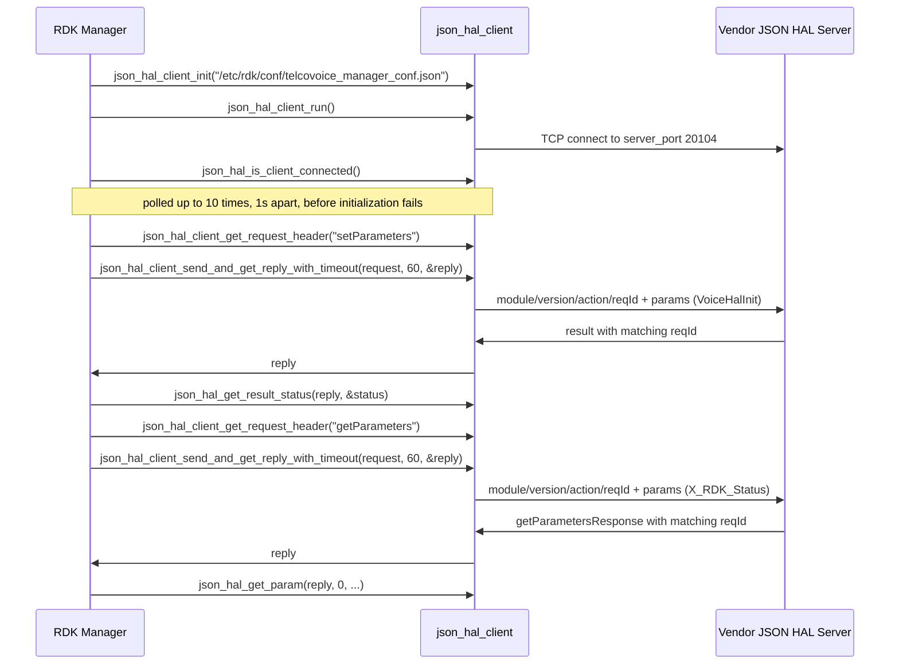
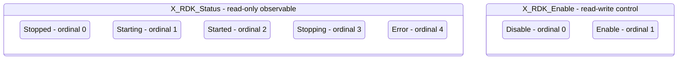

# Telco Voice HAL Documentation

## Version History

| Date | Comment | Version |
| --- | --- | --- |
| 2026-08-24 | Initial release. Specifies the Telco Voice `JSON` HAL contract carried by `hal_schema/telcovoice_hal_schema_v1.json` and `hal_schema/telcovoice_hal_schema_v2.json`, recorded as an `Unreleased` entry in [CHANGELOG.md](https://github.com/rdkcentral/telco-voice-manager/blob/b37587112cedffed65a56d3296fdb6b0e337441d/CHANGELOG.md). | 1.0.0 |

The `Version` column above is the revision of **this document** and of nothing else. Four
distinct version identities apply to this component, and conflating them is the most common way
to misread it. They are listed separately here, each with the artefact that establishes it.

| Identity | Value | Established by |
| --- | --- | --- |
| Document revision | `1.0.0` | The table above. Applies to this specification only. |
| HAL schema version | `0.0.1` | `definitions.schemaVersion.const`, identical in both shipped schemas. Travels in the envelope's `version` field. The schema states that the value must not be modified and that HAL operation cannot be performed without the correct supported version. |
| Release tag | `v2.0.5` | The repository's most recent tag, dated 2026-05-18 in [CHANGELOG.md](https://github.com/rdkcentral/telco-voice-manager/blob/b37587112cedffed65a56d3296fdb6b0e337441d/CHANGELOG.md), which also records `v2.0.4`, `v2.0.3`, `v2.0.2`, `v2.0.1` and `v2.0.0`. |
| Generated-site version string | Computed at build time, not fixed | `docs/generate_docs.sh` runs `git describe --tags` and passes the result to the documentation generator as `PROJECT_VERSION`. |

Two consequences follow. The generated-site string is **not** a version identity this document can
quote, because it is derived from the checkout at the moment the site is built: on a tagged commit
`git describe --tags` yields the bare tag, and on any commit after one it yields
`<tag>-<commits-since-tag>-g<abbreviated-hash>`. That longer form denotes a position in history
rather than a release, so it never names a version, and no literal value of it is reproduced here —
any such literal would be stale by the next commit, including the commit that recorded it. A reader
who needs the value for a particular build reads it from that build's `PROJECT_VERSION`, or runs
`git describe --tags` in the checkout the site was generated from.

And the `v1` and `v2` in the schema filenames are **not** schema versions — both files declare
`schemaVersion` `0.0.1`. They distinguish the two shipped data-model variants, as
`Optional Components` sets out.

## Acronyms

- `DECT` \- Digital Enhanced Cordless Telecommunications
- `DML` \- Data Model Layer, the `TR-181` parameter surface the manager exposes to the rest of `RDK-B`
- `FXO` \- Foreign Exchange Office, the port that connects to an external analogue line
- `FXS` \- Foreign Exchange Subscriber, the port that a telephone handset plugs into
- `HAL` \- Hardware Abstraction Layer
- `IPC` \- Inter-Process Communication
- `ISDN` \- Integrated Services Digital Network
- `JSON` \- JavaScript Object Notation
- `JSON-RPC` \- The remote procedure call convention carried over `JSON`, used by this HAL's transport
- `MGCP` \- Media Gateway Control Protocol
- `POTS` \- Plain Old Telephone Service
- `RDK-B` \- Reference Design Kit for Broadband Devices
- `RTP` \- Real-time Transport Protocol
- `SIP` \- Session Initiation Protocol
- `TCP` \- Transmission Control Protocol
- `TR-104` \- Broadband Forum Technical Report 104, which defines the `VoiceService` service data model
- `TR-181` \- Broadband Forum Technical Report 181, which defines the `Device:2` root data model
- `VoIP` \- Voice over Internet Protocol
- `WAN` \- Wide Area Network, the upstream connection whose state the voice service can be tied to

Only terms used in this document are listed. The `TR-104` and `TR-181` expansions follow the
Broadband Forum reports cited in `Description`; the telephony terms are those the
shipped `hal_schema/telcovoice_hal_schema_v1.json` and `hal_schema/telcovoice_hal_schema_v2.json` use
to name the interfaces they model.

## Description

The diagram below describes a high-level software architecture of the Telco Voice HAL module
stack.

Every diagram in this document is authored as a fenced `mermaid` block. Such blocks render as
diagrams on GitHub, which is the primary surface for a developer reading this repository. The
documentation generator used by this repository does **not** render them; it displays their source
text instead. That limitation is stated here rather than worked around, because the only available
workaround would fix the generated site at the cost of the surface most readers actually use.

**Three further limitations of the generated site, for the same reason.** Each was measured against
the site this repository's `docs/generate_docs.sh` produces, and each originates in the generator's
own page template and emitted navigation assets rather than in this document. Read this document on
GitHub where any of them matters.

- **The generated site does not adapt to a narrow viewport.** Its navigation pane is a fixed 500
  pixels wide plus a 6-pixel splitter and does not shrink, so at a 1280-pixel viewport 774 pixels are
  left for content, and below roughly 768 pixels the content column has no usable width at all. The
  same content reflows normally on GitHub.
- **Wide tables scroll inside the content column rather than reflowing.** The generator's table style
  sets no wrapping rule, so a long unbroken identifier or pattern widens its table beyond the column
  and is reached by a horizontal scrollbar. What could be fixed from this side has been: the two
  value patterns too long for a table cell are stated in their own section of
  [halSpecDetailed.md](halSpecDetailed.md) rather than inline, which reduced the widest unbroken run
  inside any table to 84 characters. The residual width comes from ordinary
  `Device.Services.VoiceService` identifiers, which cannot be shortened.
- **The generated page does not declare its language, and renders in limited-quirks mode.** The root
  element carries an unsubstituted template placeholder in place of a language code, so assistive
  technology cannot determine the document language, and the transitional doctype the generator emits
  puts the browser into limited-quirks layout.

These are recorded rather than repaired because the files that produce them are not part of this
repository: the generator is cloned at build time into `docs/build`, which `docs/.gitignore` excludes,
and the documentation plan for this work places the generator and the Doxygen toolchain out of scope.
Changing them would alter the generated output of every `RDK-B` HAL repository that uses the same
generator, which is a separate change with its own compatibility analysis.

The Telco Voice HAL is the interface between `RDK-B` middleware and a vendor's voice
implementation. It differs from most HALs in this bundle in one structural respect that governs
everything else in this document: **it is not a C header and no library is linked across the HAL
boundary.** The contract is a `JSON` Schema, the two participants are separate processes, and they
exchange messages over a `TCP` socket. Consequently there is no inline API reference to generate
from a header, and the per-parameter detail that inline documentation would carry for a C HAL is
carried instead by [halSpecDetailed.md](halSpecDetailed.md) in this folder.

Telco Voice Manager is the `RDK-B` middleware that orchestrates voice services, and it is the
**client** of this interface; the vendor supplies the **server**. The manager presents voice
configuration and status to the rest of `RDK-B` as a `TR-181` `DML` surface under
`Device.Services.VoiceService`, and translates reads and writes on that surface into `JSON` HAL
requests. The superproject inventory names `ifacemanager_telcovoice` as the service context under
which the manager runs; unlike most C HALs in this bundle, no separate middleware service sits
between the `RDK-B` stack and this interface, because the manager is itself the owning service.

The data model is a Broadband Forum model, and this document cites it in two parts because it is
assembled from two Technical Reports. Each citation names a **specific published model version**
rather than a documentation site, so that a reader checking a definition lands on the same text this
document was written against. The `Device.Services.` container comes from the root `Device:2` model
of `TR-181`, whose published definition of that container is
[`Device.Services.` in `Device:2.21`](https://cwmp-data-models.broadband-forum.org/tr-181-2-21-0-cwmp.html#D.Device:2.Device.Services.).
`VoiceService` is a *service* data model that plugs into that container, defined by
[`TR-104`](https://cwmp-data-models.broadband-forum.org/). Neither shipped schema declares the
revision it was authored against, so each was matched path by path against every published `TR-104`
revision rather than assumed. The `v2` schema is the `VoiceService:2` model published as
[tr-104-2-0-1-cwmp](https://cwmp-data-models.broadband-forum.org/tr-104-2-0-1-cwmp.html). The `v1`
schema is `TR-104` Issue 1, whose earliest compatible publication is
[tr-104-1-0-0](https://cwmp-data-models.broadband-forum.org/tr-104-1-0-0.html); the issue is
established but the minor revision within it is not.

Named as the publications name themselves, Issue 1 has two published revisions, `VoiceService:1.0`
and `VoiceService:1.1`. Both define every non-vendor path the `v1` schema uses, the matched sets are
identical between them, and nothing in that schema distinguishes one from the other, so this document
writes `VoiceService:1.x` where it means either revision and claims no minor revision it cannot
establish. The per-revision match counts are carried in
[halSpecDetailed.md](halSpecDetailed.md).
One limit on the first citation is stated rather than glossed: `Device:2.21` is cited
because it is the published version whose `Device.Services.` definition was checked when this
document was written, and **this repository records no `Device:2` amendment level**, so the citation
identifies where the container is defined and does not claim these schemas were authored against that
version.

Neither shipped schema declares a data-model version either, so the `TR-104` correspondence above
rests on matching object trees and datatypes rather than on a declared marker: `VoiceService:2.0` is
the revision that
introduced the `CallControl` and `Interwork` mapping objects, modelled each `VoIP` connection
through `Client`, `Network` and `VoIPProfile` tables, and added `FXO`, `DECT`, `ISDN` and
`SIP` proxy and registrar support — all of which are present in the `v2` schema and absent from
`v1`, whose tree is organised around `VoiceProfile` instead. The manager corroborates the same
split from inside the repository by reporting `TR104V2` or `TR104V1` on
`Device.X_RDK_TelcoVoice.DatamodelVersion`
[`source/TR-181/middle_layer_src/telcovoicemgr_dml_telcovoice.c:113-119`], and both of its `DML`
descriptions declare the module name `TR104_RdkTelcoVoiceManager`
[`config/RdkTelcoVoiceManager_v1.xml:23`, `config/RdkTelcoVoiceManager_v2.xml:24`]. No corrigendum
or amendment level is asserted anywhere in this document, because nothing in this repository
establishes one.

**How to read the rest of this document.** It is arranged in two tiers. The overview tier is this
topic plus `Component Runtime Execution Requirements`,
which together answer what this interface is and how to call it — initialization order, threading,
memory, timeouts and error handling. The protocol tier is
`Non functional requirements` and
`Interface API Documentation`, which answer what the wire actually
looks like, what varies by build, and what happens when a call fails. Within that second tier
`API Surface` is the index: it names every action and marks the point past which the
detail continues into [halSpecDetailed.md](halSpecDetailed.md).

## Optional Components

**Two data-model variants ship, and which one a deployment loads is not established by this
repository.** This is the single most important open question about this interface, and it is
stated here rather than resolved because resolving it would require asserting something the
evidence does not support.

The facts are these. The repository ships two schema files under `hal_schema/`:

| Schema file | Parameter definitions | Object definitions | Tree organised around |
| --- | --- | --- | --- |
| `telcovoice_hal_schema_v1.json` | 353 | 44 | `VoiceProfile` (280 of the 353 parameters) |
| `telcovoice_hal_schema_v2.json` | 776 | 115 | `SIP` (152), `CallControl` (148) and `CallLog` (95) |

The client configuration the manager reads names a **single** schema path,
`/etc/rdk/schemas/telcovoice_hal_schema.json` [`config/telcovoice_manager_conf.json`], and that
path matches **neither** shipped filename. Nothing in this repository binds a variant to that
path, and nothing here produces the unversioned name. The binding is therefore made outside this
repository, in the packaging or device-provisioning layer, and a reader who needs to know which
contract a given build presents must look there.

Nor can the variant be recovered from the wire. Both schemas declare the same module name,
`voicehal`, and the same `schemaVersion`, `0.0.1`, so **no field in any message distinguishes
them**. Only 23 parameter definition keys and 6 object definition keys are common to both files,
and some shared keys differ in type and constraint between the variants rather than merely being
present in both, so a client that assumed the wrong variant would not fail cleanly at the envelope
— it would fail on individual parameters. [halSpecDetailed.md](halSpecDetailed.md) carries the
divergences key by key.

What *is* determinable from this repository is the model the **manager** was compiled against,
which is a different question from which schema file is deployed:

- The preprocessor macro `FEATURE_RDKB_VOICE_DM_TR104_V2` selects which parameter header the
  manager builds against [`source/TR-181/middle_layer_src/telcovoicemgr_dml_hal.h:28-32`].
- The automake conditional `VOICE_V2`, driven by the environment variable
  `ISRDKB_VOICE_DM_TR104_V2` [`configure.ac:75`], selects the corresponding source set
  [`source/TR-181/middle_layer_src/Makefile.am`].
- The manager then reports the result at runtime on its own `DML` surface: reading
  `Device.X_RDK_TelcoVoice.DatamodelVersion` returns the literal `TR104V2` or `TR104V1`
  [`source/TR-181/middle_layer_src/telcovoicemgr_dml_telcovoice.c:113-119`].

So the model the manager drives is discoverable by a caller on the `TR-181` side, while the schema
file the vendor server validates against is not discoverable at all from here. A deployment must
ensure the two correspond; this interface provides no mechanism that checks it.

**Optional parameters within a variant.** Independently of the variant question, each shipped
schema divides its parameter surface into a supported list and an optional list, and binds both:
`getParameters` accepts `anyOf` `getParameterSupportedList` or `getParameterOptionalList`, and
`setParameters` accepts `anyOf` `setParameterSupportedList` or `setParameterOptionalList`. A
parameter reachable only through an optional list is one a vendor server may legitimately not
implement, so a caller must treat a `Not Supported` result on such a parameter as a normal
outcome rather than an error. [halSpecDetailed.md](halSpecDetailed.md) records list membership
per parameter, which is also what determines whether a parameter is writable at all.

**Optional actions.** `deleteObject` is present in the action enumeration but is **not usable
under either shipped schema**: its payload definition carries an empty `anyOf`, which no instance
can satisfy. `API Surface` states the consequence.

## Component Runtime Execution Requirements

### Initialization and Startup

The client side of this interface is brought up in a fixed order by `TelcoVoiceMgrHal_Init()`
[`source/TR-181/middle_layer_src/telcovoicemgr_dml_hal.c:65`], which is invoked from
[`telcovoicemgr_dml_apis.c:136`]. No `JSON` HAL request may be issued before this sequence
completes successfully.

**Where the three `json_hal_*` calls below come from, stated before they are used.** None
of them belongs to this HAL contract. This interface declares no functions at all — its
contract is the schema — and every `json_hal_*` name in this document is an entry point of
the transport client library the manager links, `json-hal-library`, cited at the exact
revision this workspace records for it:
[`json-hal-library` at commit `86a0a300b976f8e3295064af8fb3fd1c793c9e64`](https://github.com/rdkcentral/json-hal-library/tree/86a0a300b976f8e3295064af8fb3fd1c793c9e64).
All three are declared by
[`json_hal_client.h`](https://github.com/rdkcentral/json-hal-library/blob/86a0a300b976f8e3295064af8fb3fd1c793c9e64/json_hal_client.h)
in that revision — `json_hal_client_init` at `:56`, `json_hal_client_run` at `:62` and
`json_hal_is_client_connected` at `:134` — and that header, not this document, is their
authority. `Build Requirements` records what the manager links and why the citation is
pinned rather than floating.

The calls, in the order they must occur:

- `json_hal_client_init(TELCOVOICEMGR_CONF_FILE)` [`:68`] \- reads the client configuration from
  `/etc/rdk/conf/telcovoice_manager_conf.json` [`telcovoicemgr_dml_hal.h:98`], which supplies the
  schema path and the server port. Failure here aborts initialization.
- `json_hal_client_run()` [`:74`] \- starts the client socket thread and begins connecting to the
  vendor server. Failure here aborts initialization.
- `json_hal_is_client_connected()` [`:89`] \- polled, not waited on. The manager retries in a loop
  bounded by `HAL_CONNECTION_RETRY_MAX_COUNT`, which is `10`
  [`telcovoicemgr_dml_hal.h:54`], sleeping `1` second between attempts [`:91`]. If the client is
  still not connected after the tenth attempt, initialization fails.
- `TelcoVoiceMgrHal_InitData()` [`:107`] \- issues the first write, setting the HAL initialization
  flag to `true` or `false` as a boolean parameter. Failure here aborts initialization.

**Fixed retry interval, not exponential backoff.** The connection wait is a plain one-second
`sleep(1)` repeated at most ten times [`telcovoicemgr_dml_hal.c:87-92`], giving a bounded
establishment window of approximately ten seconds — which is what the in-source comment at
[`:80-84`] states. There is no backoff multiplier, no jitter and no unbounded retry. This is called
out explicitly because the repository's own README describes HAL reconnection as using
exponential backoff; the implementation does not, and the code is the authority.

**Vendor obligation.** The vendor server must be accepting connections on the configured port
within that window, or the manager fails initialization and no voice service is brought up. The
server side of the transport listens with a backlog of `32` connections.

**A defect in the first write, which a strictly validating server will reject.** The parameter name
the manager sends for the initialization flag is built from a macro defined as
`"Devices.Services.VoiceHalInit"` \- plural `Devices`
[`source/TR-181/middle_layer_src/telcovoicemgr_dml_hal.c:43`]. Both shipped schemas define that
parameter as `Device.Services.VoiceHalInit` \- singular `Device` \- via the `name` pattern
`^Device\.Services\.VoiceHalInit$` on the `servicesVoiceHalInit` definition. The two do not match,
and `Devices.` appears nowhere else in this repository's source, configuration or schemas, so this
is an isolated discrepancy rather than an alternative convention. A vendor server that validates
incoming `setParameters` messages against the schema will reject this write; a server that matches
the name loosely, or that ignores an unrecognised initialization parameter, will not. Implementers
should be aware that the observable behaviour of initialization therefore depends on how strictly
their server validates. This specification records the discrepancy rather than resolving it: the
schema and the manager source are both outside the scope of this documentation change, and
correcting either is a functional change with device consequences.

### Threading Model

**Transport threading is owned by the client library, not by this interface.**
`json_hal_client_run()` is documented by its own header as starting the client socket thread, so
after initialization a dedicated thread inside `json_hal_client` owns the socket and performs the
receive loop. Asynchronous event callbacks registered through `json_hal_client_subscribe_event()`
are therefore delivered on that library-owned thread and not on the thread that registered them.

**There is exactly one such thread, and it is the thread every callback runs on.** This is the
single most consequential threading fact about this interface, so it is stated here with its
evidence rather than deferred to the library. All line references in this topic are to the pinned
`json-hal-library` revision cited in `Build Requirements`.
`json_hal_client_run()` calls `json_rpc_client_run()`, which creates **one** detached thread
running the socket state machine [`tcp_client.c:81-97`]. That thread's receive state calls the
library's internal parse callback [`tcp_client.c:233-234`], installed at
[`json_hal_client.c:211`] and defined at [`:335`], and it is that callback which invokes a registered
event callback [`json_hal_client.c:440`]. The same loop also drives the request-timeout ticker
[`tcp_client.c:251-254` calling the internal idle callback at `json_hal_client.c:227-232`]. So one thread
delivers every reply, every event and every timeout, and while it is inside a caller's callback it
is doing none of those three things.

**The library's event-subscription lock is held for the duration of the callback.** The dispatch
takes `gm_event_tracking_lock` before it walks the subscription list, invokes the callback inside
that walk, and releases the lock only afterwards [`json_hal_client.c:427`, `:440`, `:472`]. The
mutex is a plain, non-recursive one [`json_hal_client.c:93`]. A caller cannot observe this lock and
cannot take it deliberately, but it constrains what a callback may do, and the obligations below
state that constraint.

**Caller obligations for callbacks. These are normative for this interface, and two of them prevent
an unrecoverable hang rather than a race.**

- **Do the minimum in the callback, and return.** For as long as the callback runs, no reply to any
  outstanding request is delivered and no request timeout is counted, because the one thread that
  would do either is executing the callback. Long or blocking work in a callback is therefore not a
  latency cost to the callback alone — it stalls every concurrent HAL exchange in the process.
- **Copy anything needed after the callback returns.** The buffer the callback is handed is not the
  caller's to keep; see `Memory Model` for the lifetime and the reason.
- **Never make a synchronous HAL call from inside a callback.** A send-and-reply call blocks on a
  condition variable [`json_hal_client.c:683`] that only two code paths ever signal — the reply
  dispatch [`json_hal_client.c:508`] and the timeout ticker [`json_hal_client.c:548`] — and both run
  on the thread now sitting inside the callback. The wait is therefore never satisfied and never
  times out: the call does not fail slowly, it does not return at all. A callback that needs to read
  or write a parameter must hand the work to a thread of the caller's own and return.
- **Never register or re-register a subscription from inside a callback.**
  `json_hal_client_subscribe_event()` takes `gm_event_tracking_lock`
  [`json_hal_client.c:741`] — the same non-recursive mutex the dispatch already holds — so the call
  self-deadlocks. `json_hal_client_terminate()` takes it too [`json_hal_client.c:798`], so tearing
  the client down from inside a callback deadlocks for the same reason.
- **Synchronize any state the callback touches.** Because the callback arrives on a thread the
  caller does not own, shared state it reads or writes needs the caller's own synchronization. The
  manager's own callback illustrates the pattern: it parses the event, resolves the affected voice
  service instance, and hands the result to the surrounding component rather than mutating shared
  state in place [`source/TR-181/middle_layer_src/telcovoicemgr_dml_hal.c:1286`].

**Concurrent request submission is not specified by this interface.** Nothing in the schemas, the
client configuration or the manager source states whether two threads may issue requests
concurrently through the same client instance, and the manager itself does not exercise that case.
A caller must not assume either behaviour. Requests are correlated by `reqId` rather than by
submission order, which means the wire format does not itself prevent interleaving — but the
absence of a stated guarantee is not a guarantee, and treating it as one is the specific mistake
this paragraph exists to prevent.

**Vendor obligation.** The vendor server must tolerate a single long-lived client connection over
which requests arrive sequentially and events are published unsolicited. Whatever internal
threading a vendor uses to satisfy that, it must ensure a reply carries the `reqId` of the request
it answers, since that is the only field a client can correlate on.

### Process Model

**Two processes across a socket, not a library linked into one.** This is the structural difference
between this HAL and the C HALs elsewhere in `RDK-B`, and it changes what a caller must plan for.
A C HAL is a shared object loaded into the calling process, so a HAL call is a function call and a
HAL fault is the caller's fault. Here the vendor implementation is a **separate process** reached
over a `TCP` socket, so:

- The two sides start, stop and fail independently. The vendor server may be restarted underneath
  a running manager, and the manager may be restarted underneath a running server.
- A HAL call is an `IPC` round trip and can fail for transport reasons that have nothing to do with
  the parameter being read or written. Every call site must handle a transport failure distinctly
  from a `Failed` result status.
- Loss of the connection is a first-class state, not an exception. It is observable through
  `json_hal_is_client_connected()`, which is why initialization polls it rather than assuming
  success.

The socket carries a `JSON-RPC` style exchange: a request names an action and the reply that answers
it is matched to the request by identifier rather than by position on the connection.

**Role assignment is fixed and asymmetric.** Telco Voice Manager is always the **client**; the
vendor voice software always supplies the **server**. The server listens on the port named by the
client configuration, which is `20104` [`config/telcovoice_manager_conf.json`]. The same
configuration file supplies both participants with the port, so that the manager and the vendor
software agree on it without a discovery step
[`source/TR-181/middle_layer_src/telcovoicemgr_dml_hal.h:93-97`].

**Direction of travel per action.** The client originates `getSchema`, `getParameters`,
`setParameters`, `subscribeEvent`, `getActiveSubscriptions` and `deleteObject`. The server
originates `getSchemaResponse`, `getParametersResponse`, `getActiveSubscriptionsResponse`,
`result` and `publishEvent`. Only `publishEvent` is unsolicited;
`API Surface` gives the full mapping.

### Memory Model

Because the vendor implementation is a separate process, no memory is shared across the HAL
boundary and no buffer lifetime spans it. What crosses the boundary is a serialized `JSON`
document. The memory model that matters to a caller is therefore entirely local: it concerns the
`json_object` handles the client library hands out and takes back, and it is reference-counted
rather than owned outright.

Two handles exist per request. The **request** object is created by the caller, conventionally from
`json_hal_client_get_request_header()`, which returns a `json_object` already populated with the
`module`, `version`, `action` and request-identifier fields. The **reply** object is produced by
the library and returned through an out-parameter of
`json_hal_client_send_and_get_reply_with_timeout()` or of the untimed
`json_hal_client_send_and_get_reply()`. Both are released with `json_object_put()`, which
decrements the reference count rather than freeing unconditionally.

#### Caller Responsibilities

- **Release both handles on every path, including every failure path.** The reply handle must be
  released even when the call reported failure, because the library may have produced a partial or
  error reply before returning. The manager's own pattern is a single `EXIT:` label that releases
  the request and then the reply, reached by `goto` from each failure branch
  [`source/TR-181/middle_layer_src/telcovoicemgr_dml_hal.c:249-253`], applied at 44 release sites
  across that file.
- **Guard the release.** The reply out-parameter is left untouched when a call fails early, so it
  must be tested before it is released. The manager wraps this in a macro that releases only a
  non-null handle [`source/TR-181/middle_layer_src/telcovoicemgr_dml_hal.h:116-120`].
- **Do not retain a value extracted from a reply beyond the reply's lifetime.** Values read out of
  a reply must be copied into caller-owned storage before the reply handle is released; a pointer
  into a released `JSON` document is not valid afterwards.
- **An event callback's buffer is borrowed, and it is borrowed only until the callback returns.**
  This is the one lifetime on the event path, and it is not the same as the reply-handle lifetime
  above. The library does not hand the callback a copy: it serializes the live `json_object` it is
  currently dispatching and passes the pointer that serialization returns
  [`json_hal_client.c:435`, `:440`], and that `json_object` — parsed a few lines earlier from the
  receive buffer [`json_hal_client.c:364`] — is released as soon as the dispatch loop finishes with
  it [`json_hal_client.c:516`]. The buffer belongs to the object, so releasing the object
  invalidates the buffer. A callback must therefore **copy every byte it will still need into
  caller-owned storage before it returns**, including the event name and the value it carries, and
  must never store the pointer, hand it to another thread, place it in a queue or keep a substring
  of it. Reading it after return is a use-after-free, not a stale-but-readable value. The buffer is
  also not the caller's to release: the callback must not call `json_object_put()` or `free()` on
  it. The accompanying length argument describes the borrowed buffer and is likewise only valid for
  the duration of the call.
- **Bound what is sent. The size limit applies to a request and not to a reply, and the asymmetry is
  a property of the transport rather than of the protocol.** `MAX_BUFFER_SIZE` is 16384 bytes in the
  pinned transport revision cited in `Build Requirements`
  [`json-rpc-common/json_rpc_common.h:87`], and the two sides of the socket use it differently:
  - **A request must fit 16384 bytes.** The server receives into a single fixed buffer
    [`tcp_server.c:106`], performs one `recv` into it [`:219`], and hands exactly what that call
    returned to its message handler [`:260`]. Nothing on the server side accumulates across reads, so
    a request larger than the buffer does not arrive as one document — it arrives as fragments, none
    of which parses as a complete message. A caller batching many parameters into one `params` array
    must split the batch itself; the transport will not do it.
  - **A reply is not capped at one buffer.** The client reads in 16384-byte chunks, and whenever a
    read fills the buffer it appends the chunk to a heap accumulator grown by `realloc` and reads
    again, handing the reassembled document to the parse callback only once a short read completes it
    [`tcp_client.c:188-212`, dispatch at `:234`]. Neither the schemas nor the transport states a ceiling
    on a reply's size, so a caller must not reject a large `getParametersResponse` on size grounds and
    must not assume a bound the transport does not impose; the practical limit is the memory the
    accumulation consumes. **A reply spanning several chunks is not guaranteed to arrive whole.**
    Completeness is inferred from read length rather than from JSON structure, so any read that does
    not fill the buffer ends the assembly and a reply delivered in short segments is parsed early as a
    truncated document. There is no length prefix and no delimiter with which to detect it;
    `Contract Defects` in [halSpecDetailed.md](halSpecDetailed.md) records this with its locator.
- **Do not reuse a request handle across two sends.** Each request carries its own request
  identifier, and correlation depends on that identifier being unique to one exchange.

#### Module Responsibilities

- The client library owns the receive buffer on the reply path and the reassembly of a reply that
  spans multiple reads [`tcp_client.c:188-212`]. That assembly is occupancy-driven rather than
  framed: a read that does not fill the buffer ends it whether or not the JSON is complete, so
  what the assembly yields is not guaranteed to be a whole document. A caller does not receive
  the partial text - the next statement explains why - but it does lose the exchange, because a
  truncated document fails to parse and no handle is produced. The server side of the transport
  provides no equivalent reassembly, which is why the bound above applies to the request
  direction only.
- The library populates the reply handle only when it has a complete, parsed document, and it
  transfers that handle to the caller, who becomes responsible for releasing it.
- The vendor server owns everything on its side of the socket. It must not assume that a client
  which disconnected has released anything on the server's behalf, and it must be able to serve a
  fresh connection from a restarted manager without operator intervention.
- Neither side may assume the other's allocation lifetimes. This is the practical benefit of the
two-process model: a vendor's allocation policy cannot reach the manager's heap, because the
  two share no address space and no allocator. That is a statement about pointers and
  allocations, and it must not be read as isolation from a hostile peer: the peer's DATA does
  cross the boundary, and this manager copies received JSON names and values into fixed buffers
  without always bounding them. `Contract Defects` in [halSpecDetailed.md](halSpecDetailed.md) records those copies
  with their locators. A malformed or hostile message can therefore corrupt manager memory
  through the parsing path, which is a different exposure from the one a C HAL in-process has
  and not an absence of exposure.

### Power Management Requirements

**This interface does not participate in device power management.** No action in the protocol
signals a power-state transition, no result status reports one, and neither shipped schema defines
a parameter that enters, leaves or reports a device power state.

The statement is made by inspecting `hal_schema/telcovoice_hal_schema_v1.json` and
`hal_schema/telcovoice_hal_schema_v2.json` rather than by assertion, because a name search alone is
misleading here. Several parameters contain the word `Power`, and none of them is power management:
the `TonePattern` `Power` entries are audio signal levels for tone generation,
`DECT.Base.RFPowerControl` is a radio transmit-power control, and `ISDN.BRI.PowerSourceOne` reports
an `ISDN` line power source. These describe signal and line characteristics, not the device's power
state. The `v2`-only `ISDN.BRI.LifeLineHold` parameter is the closest thing to a power-related
behaviour in either schema, and it concerns lifeline call continuity rather than power management of
this component.

**Consequence for a caller.** A caller must not expect the HAL to be notified of, or to react to, a
device power transition through this interface. If a deployment needs voice services quiesced ahead
of a power event, that must be driven through the ordinary parameter surface — for example by
writing the voice-service enable control described in `State Diagram` — and
sequenced by the component that owns the power event, not by this HAL.

### Asynchronous Notification Model

Asynchronous delivery uses two actions. The client registers interest with `subscribeEvent`, which
requires a parameter `name` and a `notificationType` and is acknowledged by a `result` — an
acknowledgement the client library's subscribe call does not expose to the caller, for the reason
`Internal Error Handling` gives, so a successful subscribe call is not evidence
of an accepted subscription. The server subsequently sends `publishEvent` messages, unsolicited,
each carrying the parameter `name`, its `type` and its `value`.

**A third and fourth action nominally exist for enumerating subscriptions, and neither is usable as
an enumeration.** `getActiveSubscriptions` and `getActiveSubscriptionsResponse` are members of the
`action` enumeration in both shipped schemas, so a server must be able to parse them and this
document names them for that reason. But **no `allOf` branch binds a payload to either**: the schema
defines no subscription list, no array, no object and no member of any kind for the response, so the
four envelope fields are the whole of what it specifies. Nor does the transport help — the client
library declares no entry point that issues this action or reads such a list, and the subscription
list it does keep is process-local to the client rather than something it queries from the server.
Two consequences follow, and a test author in particular should not assert past them: whatever a
server returns beyond the envelope is **undefined by this contract and vendor-specific**, and
because the schemas set no `additionalProperties: false` at the top level, an arbitrary extra member
still validates — so validation success says nothing about whether a subscription list is present or
what shape it has. A caller that needs to know what it is subscribed to must track its own
subscriptions. [halSpecDetailed.md](halSpecDetailed.md) carries the bare-envelope exchange and the
same statement beside it.

**The four notification types, and the two that are specific to this HAL.** The schema's
`notificationType` enumeration is `interval`, `onChange`, `onChangeSync` and `onChangeSyncTimeout`,
with `onChange` as the default. `onChangeSync` and `onChangeSyncTimeout` do not appear in the other
`JSON` HALs in this bundle. Note also what the enumeration does **not** contain: there is no
`periodic` member, and a caller that sends one will be rejected. The manager itself defines only two
of the four as constants [`source/TR-181/middle_layer_src/telcovoicemgr_dml_hal.h:44-45`] and
subscribes using `onChangeSyncTimeout`
[`source/TelcoVoiceManager/telcovoicemgr_controller.c:41-42`].

**The subscribable surface is a single parameter, in both variants.** This is the most easily
over-estimated part of the interface. `subscribeEventSupportedList` binds exactly one parameter
definition in `v1` and in `v2`:
`Device.Services.VoiceService.{i}.X_RDK_Firewall_Rule_Data`. Every other parameter in either schema
must be polled with `getParameters`; none of them can be subscribed to. A caller that plans an
event-driven design around voice line status or registration state has no mechanism here to do it.

That single event carries a semicolon-terminated list of firewall rule tuples — per tuple an enable
flag, a protocol, a port and an address. The schema constrains the protocol to `SIP` or `RTP` and the
address to an `IPv4` or `IPv6` literal, with the exact validating expression given in
[halSpecDetailed.md](halSpecDetailed.md) rather than reproduced here. The manager consumes the
event by matching the event name and applying the rules for the affected voice service instance
[`source/TR-181/middle_layer_src/telcovoicemgr_dml_hal.c:1286`].

**Threading, and the two things a callback must never do.** Event callbacks are delivered on the
client library's single socket thread, not on the registering thread, and the library holds its
subscription lock for the whole of the call [`json_hal_client.c:427`, `:440`, `:472`]. Two
consequences bind every caller and neither is recoverable at runtime: a **synchronous HAL call**
made from inside a callback waits on a signal that only the now-blocked thread can send
[`json_hal_client.c:683`, signalled at `:508` and `:548`], and **subscribing, re-subscribing or
terminating the client** from inside a callback retakes the non-recursive lock the dispatch already
holds [`json_hal_client.c:741`, `:798`]. Both hang the process's entire HAL exchange. The buffer the
callback receives is borrowed from the library's live `JSON` object and is invalid the moment the
callback returns, so anything still needed must be copied first. `Threading Model` and
`Memory Model` state each of these as an obligation with its evidence, and
[halSpecDetailed.md](halSpecDetailed.md) repeats the contract beside the event messages it
governs.

**Vendor obligation.** A server must accept a subscription for the supported parameter, acknowledge
it with a `result`, and thereafter publish on change. It must not publish an event for a parameter
that was never subscribed to, and it must not rely on a subscription surviving a client
reconnection — a manager that restarts re-subscribes as part of its own startup, so a server must
treat a repeat subscription for the same parameter as valid rather than as a duplicate to reject.

### Blocking calls

**The request path is synchronous and it blocks.** Unlike the C HALs in this bundle, which require
that no call blocks, this interface's send-and-reply calls block the calling thread until the
server answers or the wait expires. Both forms are documented by the client library as blocking
calls that unblock on a response or on a timeout. A caller must therefore not issue HAL requests
from a thread that has latency obligations of its own.

**Two forms, and the manager uses both.** The timeout form takes an explicit wait in seconds; the
untimed form takes none and uses the library's own default. In the manager, the timeout form is
used at **nine** call sites, always with `HAL_SEND_AND_REPLY_TIMEOUT`, which is `60` seconds
[`source/TR-181/middle_layer_src/telcovoicemgr_dml_hal.h:46`] — at
[`telcovoicemgr_dml_hal.c:231`, `:268`, `:302`, `:625`, `:721`, `:783`, `:835`, `:900`, `:963`] —
and the untimed form at exactly **one**, [`:1027`], for ten send-and-reply call sites in total.

**The requested timeout is clamped, it is counted in ticks rather than in seconds, and the floor is
the part that surprises callers.** A requested timeout is converted to a whole number of ticks and
bounded at both ends: raised to a **floor of 40 ticks** if a shorter value is requested, and capped
at **480 ticks** if a longer one is. A tick is one pass of the library's receive loop, whose `select`
waits *up to* 250 milliseconds, so those two bounds are **nominally about 10 seconds and about 120
seconds** — the figures the library's own comments give them — rather than elapsed-time guarantees.
The mapping is approximate in both directions: a busy connection completes passes faster than four
per second and spends the budget sooner, while a reply large enough to need more than one read
suspends the countdown until reassembly finishes. `Memory and performance requirements` sets out why,
and [halSpecDetailed.md](halSpecDetailed.md) gives the source lines under
*Transport and Protocol*. The practical
consequences are worth stating plainly:

| Requested wait | Effective wait | Why |
| --- | --- | --- |
| Under 10 seconds | 40 ticks, nominally about 10 seconds | Raised to the library's tick floor. A short timeout is not honoured. |
| The manager's 60 seconds | 240 ticks, nominally about 60 seconds | Between the floor and the cap, so used as requested. |
| Over 120 seconds | 480 ticks, nominally about 120 seconds | Reduced to the library's cap. |
| The untimed form | 40 ticks, nominally about 10 seconds | The untimed form uses the floor value as its budget, so it is the *shortest*-waiting form, not the longest. |

That last row is the one most likely to be got wrong. The untimed call is not an unbounded wait; it
is a 40-tick wait, which is the shortest budget the library offers. A caller choosing between the
two forms is choosing between roughly ten seconds and whatever it asks for within the
ten-to-one-hundred-and-twenty-second band — and in either case must impose its own deadline if it
needs a hard one, because the budget the library enforces is a tick count and not a clock.

**Connection establishment blocks too, for its own bounded window.** Initialization polls for
connectivity for up to ten one-second attempts before failing, as
`Initialization and Startup` sets out. So the worst case for a cold
start is that window, followed by whatever the first request's wait turns out to be.

**Vendor obligation.** A server must answer every request it receives, including one it cannot
satisfy — an unanswered request costs the caller its full timeout and yields no information. Where
a request cannot be serviced, the correct behaviour is a prompt `result` carrying `Failed`,
`Invalid Argument` or `Not Supported`, not silence.

### Internal Error Handling

**Errors are reported in the reply, not out of band.** There is no error callback and no error
event. A failure is either a transport failure, visible as a failed send-and-reply call, or an
application failure, carried in the reply's `Result.Status` field. A caller must distinguish the
two: the first means the message may never have been processed, the second means it was processed
and refused.

`Result.Status` takes one of four values, from the schema's `resultStatusEnumList`, with `Success`
as the default. The value is retrieved with the client library's result-status accessor rather than
by reading the field directly. What a caller should do differs per value:

| Status | Meaning | What the caller should do |
| --- | --- | --- |
| `Success` | The request was accepted and applied. | Proceed. For a write, note that success means the vendor accepted the value, not that any dependent state has finished converging. |
| `Failed` | The request was understood but could not be applied. | Do not retry blindly; the same request will usually fail again. Log the parameter and the status, and surface the failure to the caller above. |
| `Invalid Argument` | A parameter name, type or value was not acceptable. | Treat as a defect in the request, not a transient condition. Check the name against the schema, the `type` against the parameter's declared datatype, and the value against its constraint. |
| `Not Supported` | The vendor does not implement this parameter or action. | Treat as a normal outcome rather than an error where the parameter is reachable only through an optional list, and stop requesting it. See `Optional Components`. |

<b>`Invalid Argument` and `Not Supported` are the two a caller most often mishandles</b>, because both
are permanent for a given request and neither should be retried. Retrying either produces load
without progress.

**A write is acknowledged by `result`, not by a dedicated response action.** There is no
`setParametersResponse` in this protocol; `API Surface` states this in full,
because assuming otherwise is the single most common misreading of this interface.

**One exception, and it removes the status from the caller's reach: subscription.** A
`subscribeEvent` is acknowledged by `result` like a write, but the client library's subscribe call
does not give that `result` to the caller. It sends the message, tests only whether *a reply
arrived*, releases the reply unread and returns success [`json_hal_client.c:719-727`, returning at
`:745`]. So for this one action the two propositions above collapse into one observable: the return
code reports the transport outcome and nothing else, and a `Failed`, `Invalid Argument` or
`Not Supported` status is indistinguishable from `Success`. **Semantic acceptance of a subscription
cannot be established from the return code**, and a test must not assert it from one. The only
evidence that a subscription is live is a subsequent `publishEvent` for the subscribed parameter;
[halSpecDetailed.md](halSpecDetailed.md) states the limitation with its source lines and the
workaround for a caller that needs the status sooner. This is a limitation of the transport API, not
of the schemas — the schemas bind `result` to `subscribeEvent` correctly and the four statuses above
apply to it unchanged.

Per-status detail, including the exact enumeration definition, is in
[halSpecDetailed.md](halSpecDetailed.md) and is not duplicated here.

**Vendor obligation.** A server must choose the status that describes the actual outcome rather than
defaulting to `Failed` for every refusal, because the caller's correct response differs per value —
and it must not report `Success` for a write it did not apply.

### Persistence Model

**This interface makes no persistence guarantee.** Neither shipped schema states whether a value
written with `setParameters` survives a reboot, a vendor-process restart or a client reconnection.
No action requests persistence, no parameter reports whether a value is persisted, and no result
status distinguishes a value that was applied from one that was applied and stored. A caller must
therefore not infer durability from a `Success` result.

**Persistence is a manager-side concern, implemented above the HAL boundary.** Where it happens, it
happens in Telco Voice Manager's own local store rather than in the vendor implementation, and it is
gated by the preprocessor macro `TELCO_VOICE_FEATURE_ENABLE_PERSIST`. That macro is **consumed** by
this repository at exactly three sites and **defined** nowhere in it, so the blocks it guards compile
out unless the build layer supplies it; `Variability Management` records what
this repository does and does not establish about it. The macro changes observable behaviour in two
places, and the difference matters to anyone reasoning about the voice enable control:

- **With the feature enabled**, the manager stores the enable value locally after the HAL write has
  succeeded [`source/TR-181/integration_src.shared/telcovoicemgr_services_apis.c:2144-2151`], and
  the cached enable state is maintained from the reported value
  [`source/TR-181/middle_layer_src/telcovoicemgr_dml_hal_param_v2.c:255-264`]. The persisted
  configuration is authoritative.
- **With the feature disabled**, which is the default, the manager instead derives the enable state
  from the `WAN` link state [`telcovoicemgr_services_apis.c:1846-1848`]. Nothing is stored, and the
  enable state follows connectivity rather than a remembered setting.

**Consequence for a caller.** Whether a written enable value is remembered across a restart is
decided by how the *manager* was built, not by this HAL and not by the vendor implementation. A
caller that needs a value to hold must re-apply it after any restart on either side of the socket
rather than assuming it survived, and a vendor server must not assume that a value it received once
will not be sent again — re-application after reconnection is expected behaviour, not a defect.

## Non functional requirements

### Logging and debugging requirements

**The debug surface is part of the interface, not a vendor convention.** Both shipped schemas define
an `X_RDK_Debug` object under each voice service instance, at
`Device.Services.VoiceService.{i}.X_RDK_Debug.`, carrying five read-write parameters. These are the
controls a caller uses to raise or lower diagnostic output from the vendor voice software, and they
are the only logging controls this interface defines:

| Parameter | Type | Purpose |
| --- | --- | --- |
| `X_RDK_Debug.ModuleLogLevels` | `string` | Per-module log levels, as a comma-separated list of `name=value` pairs where `name` is a voice module and `value` is its level. |
| `X_RDK_Debug.LogServer` | `string` | Destination for remote logging of protocol messages. |
| `X_RDK_Debug.LogServerPort` | `unsignedInt` | Port on that log server. |
| `X_RDK_Debug.CCTKTraceGroup` | `string` | Trace group bitmask for the vendor voice stack, bounded at 256 characters. |
| `X_RDK_Debug.CCTKTraceLevel` | `string` | Trace level for the same facility, bounded at 256 characters. |

**Log levels are the `printk` scale, 0 to 7 — not a syslog keyword set.** The schema states this
directly in the description of `ModuleLogLevels`: values run from 0 to 7, corresponding to `printk`
logging levels, where **0 is an emergency log and 7 is a debug log**. So the numbers ascend with
verbosity and descend with severity, which is the opposite of the convention used by several other
HALs in this bundle, and writing a keyword such as `ERROR` where a digit is expected will be
refused. The two endpoints are the schema's own; the intervening values follow the standard `printk`
ordering, which runs from emergency at 0 through alert, critical, error, warning, notice and
informational to debug at 7. This document does not claim the schema enumerates those intermediate
names — it does not — only that the scale it names has them.

**Per-module granularity is the point of the parameter.** Because the value is a list of
`name=value` pairs rather than a single global level, a caller can raise verbosity for one voice
module while leaving the rest quiet, which is the intended way to diagnose a specific area without
flooding the log. The set of valid module names is vendor-defined; neither schema enumerates it, and
this specification does not invent one.

**Where output goes is a vendor decision this interface does not constrain.** Neither schema names
a log file, a directory or a log format, and no parameter reports where the vendor writes. A caller
that needs logs collected off-box has `LogServer` and `LogServerPort` and nothing else. Any specific
log path a reader may have seen for another HAL in this bundle does not apply here, and none is
asserted.

**Manager-side logging is separate.** Telco Voice Manager's own diagnostics go through the `RDK-B`
trace facility, which it links against explicitly [`source/TelcoVoiceManager/Makefile.am`], and it
traces each `JSON` request and reply at informational level and each failure at error level — the
send-and-reply call sites in
[`source/TR-181/middle_layer_src/telcovoicemgr_dml_hal.c`] show the pattern. That output is the
manager's, not the vendor's, and the two are collected independently.

**Warning: that manager-side tracing emits whole `JSON` messages, and its credential suppression
covers one field at one call site.** This is stated as a warning rather than as a description
because a reader who follows the pattern above will disclose credentials. The suppression that
exists is a single substring test — the request trace is skipped only when the serialized message
contains the literal `.AuthPassword`
[`source/TR-181/middle_layer_src/telcovoicemgr_dml_hal.c:620-623`]. Three further traces in the same
file emit the serialized message with no test of any kind: a request at `:229`, the **reply** at
`:238`, and another request at `:701`. So the reply direction is never filtered at all, which is the
direction that carries a `getParametersResponse` — the message in which a password, an
authentication user name, a subscriber telephone number, a call record or a `DECT` identity is
actually returned.

**The one filter that exists does not even cover every password.** Because the test looks for a
literal dot followed by `AuthPassword`, a path whose leaf merely *ends* in `AuthPassword` does not
match it. Four credential paths are therefore traced in full at the guarded call site as well:
`SIP.Network.{i}.InboundAuthPassword` and `VoiceProfile.{i}.SIP.InboundAuthPassword`, where the
preceding character is the `d` of `Inbound` rather than a dot; `CallControl.Mailbox.{i}.SMTPPassword`;
and `DECT.Base.{i}.PIN`. Every authentication user name is likewise unmatched, as is every telephone
number and every call-log field. The test is over-inclusive as well as under-inclusive: it applies to
the whole serialized message rather than to one element, so a `setParameters` that batches a matching
password alongside other parameters suppresses the entire trace and yields no diagnostic at all.

**Consequently, whole-message tracing must be sanitized or disabled before a build reaches a
subscriber device.** A caller must not treat the existing suppression as sufficient, must not add a
whole-message trace of its own, and must not enable `X_RDK_Debug.LogServer` and
`X_RDK_Debug.LogServerPort` to ship protocol messages off-box without applying the redaction rules
below first — the schema describes those two parameters as a destination for remote logging of
protocol messages, so enabling them exports whatever the vendor traces, credentials included.

**Handling of credentials and subscriber data in log and debug output.** Some of what crosses this
interface is credential material and much of the rest is subscriber personal data. The
authentication passwords, authentication user names and the `v2` `DECT` base `PIN` are secrets: they
authenticate the device to the operator's network, and their disclosure lets a third party register
as the subscriber. Directory numbers, extension numbers and forwarding targets in both variants,
together with the `v2`-only trunk number ranges and the whole `v2` `CallLog` subtree, are personal
data describing who a subscriber called and when. The
requirements below are therefore **normative for this interface**, and they bind the vendor
implementation and the `RDK-B` caller equally. They are stated here because neither schema declares
a redaction helper, a sensitivity marker or an opaque credential type, so nothing enforces them
mechanically. [halSpecDetailed.md](halSpecDetailed.md) names the exact parameter definitions each
rule applies to, per variant.

- **No credential is written to log output at any severity.** Neither a vendor implementation nor a
  caller may write an authentication password, an authentication user name, a `DECT` `PIN` or any
  part of one — plaintext, encrypted, encoded, hashed or truncated — to a vendor log, to the
  configured remote log server, to `syslog`, to standard output, to standard error, to a core file,
  to a trace buffer or to any diagnostic dump. This holds at every point on the `printk` scale
  above, including 7: a value too sensitive to appear at level 3 is not made acceptable by moving it
  to level 7, and a debug build must not be a build that discloses credentials.
- **A message that must refer to a credential names the parameter and redacts the value.** Where a
  diagnostic has to identify what it operated on, it records the operation, the outcome and the
  parameter path — that a write to `SIP.Client.{i}.AuthPassword` was rejected, for instance — and
  never the value. A **fixed** redaction marker replaces the value, of a length unrelated to the
  value's own: no prefix, no suffix, no first and last character, no character count and no hash. A
  fragment or a length narrows a search, so publishing either is publishing part of the secret.
- **A rejected value is not logged.** A validation failure is the case most likely to prompt an
  implementer to log the offending input, and the case where doing so is most damaging: a rejected
  password is frequently a valid credential for another account, another line or another device.
  The verdict is logged; the input is not.
- **Credentials and subscriber data are excluded from crash artefacts and from telemetry.** A core
  dump, a minidump, a stack trace, an exception report, a heap snapshot or a support bundle must not
  carry these values, and neither may any telemetry, analytics, metric label or usage report. This
  is a separate obligation from the logging rule and it fails separately: a build with disciplined
  logging still discloses everything if it uploads unfiltered cores. Where a platform's crash
  handler cannot be constrained, the value must not be resident at the time the artefact can be
  taken — which is what the clearing rule below achieves.
- **Buffers holding a credential are cleared after use, on every path.** A caller overwrites the
  storage holding a password, an authentication user name or a `PIN` as soon as it has finished with
  it, including on the failure path, because a failed write or a failed read may have left part of a
  value behind. The same applies to the serialized `JSON` request or reply that carried it: that
  buffer is a copy of the secret, and releasing the `json_object` that owns it does not overwrite
  it. A credential must not be copied into a longer-lived home — a data-model cache, a
  configuration file, an environment variable, a message queue or a retry buffer — and must not be
  passed to a component that has no need of it.
- **Subscriber data follows the same discipline at a proportionate strength.** Telephone numbers,
  call records and device identities are not secrets in the credential sense, but logging them
  builds a record of a subscriber's calling behaviour. They are logged only where a specific
  diagnostic requires them, never at informational level in normal operation, never in whole-message
  form, and never shipped off-box without the redaction above. Where a diagnostic needs to
  distinguish two calls, a stable non-reversible reference serves; the number itself does not need
  to appear.
- **The interface guarantees none of this.** Neither schema marks a parameter as sensitive, neither
  offers a scrubbing action or an opaque type, and nothing lets a caller ask a vendor server to
  suppress its own logging or verify that it does. A caller integrating a vendor implementation must
  establish compliance by inspection or by contract, and must treat the absence of credentials from
  a vendor log as unverified until it has done so.

*Derived from `hal_schema/telcovoice_hal_schema_v1.json` and
`hal_schema/telcovoice_hal_schema_v2.json` (the credential and subscriber-data parameter
definitions, enumerated per variant in [halSpecDetailed.md](halSpecDetailed.md)), and from
`source/TR-181/middle_layer_src/telcovoicemgr_dml_hal.c:620-623` together with the unguarded traces
at `:229`, `:238` and `:701` (the scope of the suppression that exists).*

**Vendor obligation.** A vendor implementation must honour the level written to `ModuleLogLevels`
rather than treating it as advisory, must not emit at a verbosity above the configured level in
normal operation, and should include enough context in each entry — a timestamp, the level and a
message identifying the event — that entries from different vendors can be parsed and correlated
consistently.

### Memory and performance requirements

**No memory footprint limit is specified for this interface.** Neither shipped schema, the client
configuration nor the manager source states a resident-size budget, a heap ceiling or an allocation
limit for either participant. This is recorded as a fact about the interface rather than left as
work to be done later: a reader should not expect to find a footprint figure here, and none is
invented.

**The performance envelope that *is* specified is a set of bounds on the transport**, and these are
the numbers a caller can design against. The message and tick bounds are properties of the pinned
transport revision cited in `Build Requirements` — its
`json-rpc-common/json_rpc_common.h`, `tcp_client.h` and `tcp_server.c` — and the connection window is
the retry loop in `source/TR-181/middle_layer_src/telcovoicemgr_dml_hal.c`. None of them is a budget
this document invents. Two of the five are exact and two are nominal, and the difference matters when
sizing a caller: the size and backlog bounds are fixed constants, whereas the reply-wait bounds are
counts of receive-loop passes. A pass ends either when its 250-millisecond `select` expires or as soon
as data is readable, and the pass that services the countdown is skipped while a multi-read reply is
being reassembled, so the same tick budget can be spent in appreciably less than its nominal seconds
on a busy connection and in appreciably more while a large reply arrives. A caller that needs a hard
latency bound must impose its own:

| Bound | Value | Consequence |
| --- | --- | --- |
| Request size | 16384 bytes, the fixed server receive buffer [`json_rpc_common.h:87`, `tcp_server.c:106,219,260`] | A single request must fit. The server does not accumulate across reads, so a larger request arrives as unparseable fragments; the caller must split the payload across requests. |
| Reply size | No stated ceiling, and no framing. The client accumulates a multi-chunk reply on the heap and treats any short read as the end of it [`tcp_client.c:188-212`] | A reply larger than one buffer is delivered whole. A caller must not impose a 16384-byte expectation on a reply, and must not assume a bound the transport does not state. |
| Reply wait, shortest | 40 ticks, nominally about 10 seconds | The floor described in `Blocking calls`. It bounds receive-loop passes rather than elapsed time, so treat the seconds figure as nominal. |
| Reply wait, longest | 480 ticks, nominally about 120 seconds | The cap. A longer request timeout is reduced to it, and the same tick-versus-clock caveat applies. |
| Connection establishment | approximately 10 seconds | Ten one-second attempts before initialization fails. |
| Server connection backlog | 32 | The listen backlog on the vendor side of the socket. |

**Caller Responsibilities:**

- Size a `params` batch against the **request** bound rather than assuming the transport will
  reassemble an arbitrarily large request. Reassembly exists on the reply path only.
- Do not issue HAL requests from a latency-sensitive thread. A single request can occupy its thread
  for the full reply wait, and that wait is seconds rather than milliseconds.
- Poll rather than subscribe for anything other than the one subscribable parameter, and choose a
  poll interval accordingly — a tight poll loop over a socket round trip is the most likely way to
  make this interface a bottleneck.
- Release reply handles promptly, as `Memory Model` requires. A leaked `JSON`
  document is the only unbounded growth this interface makes easy.

**Vendor Implementation Responsibility:**

- Answer promptly. Because the reply wait has a floor of roughly ten seconds, a server that simply
  fails to answer imposes that cost on the caller for every such request; returning a status
  immediately is always better than silence.
- Keep steady-state resource use bounded across a long-lived connection, since the manager connects
  once at startup and does not reconnect on a timer.
- Publish events only for genuine changes on the one subscribable parameter. There is no rate limit
  in the protocol, so an implementation that publishes on every internal update rather than on
  change is unconstrained by anything but its own restraint.

### Quality Control

**This repository names no documentation owner, and this specification states that rather than
inventing one.** There is no `CODEOWNERS` file anywhere in the repository, and [CONTRIBUTING.md](https://github.com/rdkcentral/telco-voice-manager/blob/b37587112cedffed65a56d3296fdb6b0e337441d/CONTRIBUTING.md)
names no maintainer group — it states only that contributions are made by forking and opening a
pull request, and that a contributor must have signed the RDK Contributor License Agreement. No
handle from another repository is borrowed to fill the gap, because an owner who has not accepted
the obligation is worse than a stated absence.

**The review route that does exist.** Changes reach this repository through a GitHub pull request,
gated by the one automated check the repository defines: the `CLA` workflow at
`.github/workflows/cla.yml`, which delegates to
`rdkcentral/cmf-actions/.github/workflows/cla.yml@v1` and runs on pull request open, update and
close as well as on issue comments. There is no documentation build job, no test job and no linting
job in this repository, so nothing verifies this document automatically. A reviewer is the only
check, and the paragraph below is what that reviewer should re-check.

**Freshness trigger, expressed as a condition rather than a date.** A review-by date would be stale
the moment the interface moved and honoured by nobody. Instead: **any change to a file this document
cites as a source obliges a review of the topics that cite it.** In practice that means the topics
listed here are re-checked when their source changes, and the trigger is detectable from a diff
rather than from a calendar:

- `hal_schema/telcovoice_hal_schema_v1.json`, `hal_schema/telcovoice_hal_schema_v2.json` \- the
  action vocabulary, the envelope, every enumeration, and everything in
  `API Surface`, `Data Structures and Defines` and
  `State Diagram`.
- `config/telcovoice_manager_conf.json` \- the schema path and the port, wherever they appear.
- `source/TR-181/middle_layer_src/telcovoicemgr_dml_hal.h` and `.c` \- the initialization ordering,
  the retry bound, the timeout constant and the call-site counts.
- [CHANGELOG.md](https://github.com/rdkcentral/telco-voice-manager/blob/b37587112cedffed65a56d3296fdb6b0e337441d/CHANGELOG.md) and the repository's tags \- `Version History`.
- `NOTICE` \- `Licensing`.

**Recommended verification practice.** The following are stated as recommendations for an
implementer, not as claims about this repository's pipeline, which runs none of them: static
analysis with a tool such as `Coverity` and a zero-warning policy on the vendor implementation;
license and composition scanning with a tool such as `Black Duck`; and dynamic memory checking with
a tool such as `Valgrind`, which is particularly worthwhile here because the reference-counted
`json_object` handling described in `Memory Model` is the most common source of
leaks in a client of this interface. Because the contract is a schema rather than a header, the
highest-value check available to a vendor is different from the C HAL case: **every message the
server sends and receives should be validated against the shipped schema**, which catches exactly
the class of defect recorded in `Initialization and Startup`.

### Licensing

Telco Voice Manager, including the schemas that constitute this HAL contract, is released under the
**Apache License, Version 2.0**. The full text of every licence that applies within this component is
carried at the repository root as `LICENSE`, with `COPYING` — a symbolic link to that same text — and
`NOTICE` alongside it. The attributions below are recorded in `NOTICE`.

Note for anyone redistributing the contract alone: the schema files under `hal_schema/` carry **no**
embedded copyright or licence header, `JSON` having no comment syntax to hold one. A schema file
shipped to a device therefore travels without its notice, and the licence terms are established by
the repository's root files rather than by anything inside the artefact.

The component carries three copyright attributions, and an integrator redistributing it must
preserve all three:

| Holder | Terms |
| --- | --- |
| Copyright (c) 2020 Sky | Apache License, Version 2.0. The component's own copyright. |
| Copyright 2014 Cisco Systems, Inc. | Apache License, Version 2.0. Included material. |
| Copyright (c) 1986 Gary S. Brown | Usable, including code or tables extracted from it, without restriction. |

**Vendor obligation.** A vendor implementation of the server side of this interface is expected to
be released under the Apache License, Version 2.0, consistent with the rest of the `RDK-B` HAL
estate. Where a vendor's implementation incorporates third-party material under other terms, those
terms must be carried forward in that implementation's own notice file; nothing in this repository
grants or restricts rights in a vendor's own code.

### Build Requirements

**No HAL library is built from this repository, and none is linked across the HAL boundary.** This
follows from the interface being a schema rather than a header, and it is the first thing an
integrator coming from a C HAL needs to know. There is no `libhal_*` artefact to produce, no header
to install for the HAL contract itself, and no symbol a vendor must export. What a vendor delivers
is a **process** that speaks the protocol and validates against the shipped schema; what this
repository delivers on the HAL boundary is the schema file, deployed to the path named in
`Optional Components`.

**What the client side links.** Telco Voice Manager builds with `autotools` and links the `JSON` HAL
client library directly. The middle layer that contains all HAL interaction declares
`-ljson_hal_client -ljson-c -lcjson -lrbus -lpthread` alongside the common `RDK-B` library
[`source/TR-181/middle_layer_src/Makefile.am`], and the manager binary additionally links the
`RDK-B` logging, `syscfg`, `sysevent` and web-configuration libraries together with `pthread`
[`source/TelcoVoiceManager/Makefile.am`]. A component other than this manager that wants to speak
this HAL links the same client library.

**The transport library, cited by pinned revision.** The client library is
`json-hal-library`, and this document cites it at the exact revision this workspace records for it
rather than by a moving reference:
[`json-hal-library` at commit `86a0a300b976f8e3295064af8fb3fd1c793c9e64`](https://github.com/rdkcentral/json-hal-library/tree/86a0a300b976f8e3295064af8fb3fd1c793c9e64).
Its [`json_hal_client.h`](https://github.com/rdkcentral/json-hal-library/blob/86a0a300b976f8e3295064af8fb3fd1c793c9e64/json_hal_client.h)
is the authority for every client entry point named in this specification, and it is cited rather
than restated so that the two cannot drift. The transport's own wire vocabulary and its buffer and
backlog constants come from the same revision.

**The `json-c` dependency, stated in both of its forms because either alone misleads.** The
transport library declares its dependency as <b>`json-c (0.11)`</b>, which is the **declared
minimum**; its upstream native build, however, is exercised against the <b>`json-c-0.15-20200726`</b>
revision. An integrator who reads only the first will under-provision relative to what upstream
actually tests; one who reads only the second will over-state what the library requires. Both
numbers are therefore given here, each labelled with what it is.

**Neither number is a security recommendation, and unpatched upstream `json-c 0.11` must not be
deployed in production.** The `0.11` above is a historical attribution of what the transport library
declares, not guidance on what a deployment should build against. Unpatched upstream `json-c 0.11`
is affected by `CVE-2013-6370`, a buffer overflow; `CVE-2013-6371`, a hash-collision denial of
service; and `CVE-2020-12762`, an integer overflow leading to an out-of-bounds write, scored CVSS
v3.1 7.8 HIGH (`AV:L/AC:L/PR:N/UI:R/S:U/C:H/I:H/A:H`) by NVD and fixed in `json-c 0.15`. That `AV:L`
vector is consistent with how this interface is reached: the transport is loopback-only, with
`SERVER_HOST` defined as `127.0.0.1` [`tcp_client.h:33`], applied at [`json_hal_client.c:207`], and
the server binding `127.0.0.1` [`tcp_server.c:144-146`]. The exposure is therefore a hostile or
malfunctioning local peer on the loopback socket, not a remote network attacker. It is nonetheless
concrete rather than theoretical, because this dependency sits on the peer-facing parse path: the transport hands bytes read off the
HAL socket to `json_tokener_parse_ex()` and `json_tokener_parse()` before any of the validation this
specification describes takes place, so a malformed or hostile message reaches the parser first. A
production deployment therefore links either a distribution build of `json-c` that carries backports
of those fixes, or a maintained upstream release at `0.15` or later — `0.15` is where the
out-of-bounds write was corrected, and current upstream is `0.19`. A vendor that must build against
`0.11` for compatibility with an existing platform treats the backport of these three fixes as a
release condition, not as an optional hardening step.

**Build-time selection.** Which data model the manager is compiled against is a build decision, not
a runtime one. `Variability Management` and
`Platform or Product Customization` set out the two controls
and what each changes.

### Variability Management

**The schema is versioned, and its version is not the caller's to change.** The envelope's `version` field
is bound to the `schemaVersion` definition, a `const` of <b>`0.0.1`</b> in both shipped files. The
schema states in that definition's own description that the value must not be modified and that HAL
operation cannot be performed without the correct supported version. Each schema file additionally
carries a top-level instruction that its contents must not be modified, and that the RDK community
team makes and releases the necessary changes. Consequently:

- A vendor must send `0.0.1` in the `version` field of every message and must reject a message
  carrying anything else, since a mismatched version means the two sides do not share a contract.
- Neither participant may extend a shipped schema locally. Both schemas set
  `additionalProperties: false` on the envelope's payload objects, so a locally added field is not
  merely undocumented — it is invalid, and a validating peer will refuse the message.
- A parameter a deployment needs but the schema lacks is a change request upstream, not a local
  edit. This is the mechanism that keeps every deployment's contract identical.

Interface evolution follows
[Semantic Versioning 2.0.0](https://semver.org/spec/v2.0.0.html), and a vendor
implementation complies with a specific version of the interface. Note that this governs the
**schema** version above and not the repository's release tag; the two are distinct identities, as
`Version History` sets out.

**Two build inputs vary this component, and this repository establishes them as preprocessor macros
rather than as named build-system features.** Both are consumed by the source and neither is defined
by it, so both are off in a build that does not supply them:

| Build input | Where this repository consumes it | What it varies |
| --- | --- | --- |
| `FEATURE_RDKB_VOICE_DM_TR104_V2` | `source/TR-181/middle_layer_src/telcovoicemgr_dml_hal.h:28-32` selects the parameter header; the `automake` conditional `VOICE_V2` [`configure.ac:75`] selects the source set | Which `TR-104` data model the manager implements, and therefore which of the two shipped schemas a deployment must present. |
| `TELCO_VOICE_FEATURE_ENABLE_PERSIST` | `source/TR-181/integration_src.shared/telcovoicemgr_services_apis.c:1846`, `:2144` and `source/TR-181/middle_layer_src/telcovoicemgr_dml_hal_param_v2.c:255` — the three `#ifdef`/`#ifndef` sites, and the only ones | Whether the voice enable state is persisted locally or derived from `WAN` link state, as `Persistence Model` describes. |

**The external feature names that define those macros are not established by this repository, and
none is named here.** The macros appear only as `#ifdef` conditions in the source and as the
`automake` conditional above; no `DISTRO` feature name, `bitbake` variable or other build-layer
identifier that would set them appears anywhere in this repository's source, configuration, schemas
or build files. That mapping lives in the build metadata layer outside this repository, and a reader
who needs it must resolve it there. Naming a feature here would be an invention, and a reader
checking a build against an invented name would find nothing.

**The data-model selection travels through two mechanisms that must agree**, which is the one part of
this a reader can get wrong even with both names in hand. The macro selects the parameter header the
middle layer compiles against [`source/TR-181/middle_layer_src/telcovoicemgr_dml_hal.h:28-32`]; the
`automake` conditional `VOICE_V2`, true when the environment variable `ISRDKB_VOICE_DM_TR104_V2` is
`true` [`configure.ac:75`], selects the matching source set
[`source/TR-181/middle_layer_src/Makefile.am:33`]. A build that sets one without the other is
incoherent. The macro also selects the parameter path templates the manager addresses parameters
with — `Device.Services.VoiceService.%d.CallControl.Line.%d.` and its siblings under `v2`,
`…VoiceProfile.%d.Line.%d.` under `v1`
[`source/TR-181/middle_layer_src/telcovoicemgr_dml_hal.h:61-91`] — which is why the choice is visible
on the wire even though nothing in the envelope names it.

### Platform or Product Customization

**What `FEATURE_RDKB_VOICE_DM_TR104_V2` changes for a caller is the shape of the entire parameter
tree, not a feature toggle within one tree.** A caller cannot write one set of parameter paths and
have it work under both settings. The two models address the same telephony concepts through
different objects, so the customization decision determines which paths exist at all.

The measured difference, from the two shipped schemas:

| | `v1` (`FEATURE_RDKB_VOICE_DM_TR104_V2` disabled) | `v2` (enabled) |
| --- | --- | --- |
| Parameters / objects | 353 / 44 | 776 / 115 |
| Organised around | `VoiceProfile`, holding 280 of the 353 parameters, with `Capabilities` and `PhyInterface` alongside | A flattened tree: `SIP` 152, `CallControl` 148, `CallLog` 95, `Capabilities` 46, `VoIPProfile` 42 |
| Telephony scope | `VoIP` with `SIP` and `MGCP` signalling, addressed per profile and line | Adds `POTS` with `FXS` and `FXO`, `DECT`, `ISDN`, `H323`, `Trunk`, `Interwork`, `Terminal`, `Tone`, `CodecProfile`, `ClockSynchronization` and `ReservedPorts` |
| Shared surface | 23 parameter definition keys and 6 object definition keys in common | The same 23 and 6 |

Three consequences a caller must plan for:

- **Path portability is minimal.** With only 23 parameter keys common to both models, code written
  against one tree does not port to the other by adjusting a prefix. The `X_RDK_*` extension
  parameters — the enable control, the status observable, the debug object, the firewall rule data
  and the bound-interface and address-family controls — make up most of that shared set, which is
  precisely why this document's runtime topics are expressed in terms of them: they are the part of
  the surface that holds across both variants.
- **Shared keys are not automatically identical.** Some definitions present in both files differ in
  datatype or constraint between them rather than merely existing in both, so even a shared path may
  need a different value domain per variant. [halSpecDetailed.md](halSpecDetailed.md) records each
  divergence key by key; they are not restated here, so that there is one place to correct if the
  schemas move.
- <b>`v2`-only datatypes exist.</b> The `v2` schema alone defines a hexadecimal string type and applies
  it to the five `DECT` identity and provisioning parameters. A `v1` deployment has no `hexBinary`
  parameter at all.

**Discovering the setting at runtime.** A caller does not have to infer the variant. The manager
reports it on its own data model: `Device.X_RDK_TelcoVoice.DatamodelVersion` returns the literal
`TR104V2` or `TR104V1`
[`source/TR-181/middle_layer_src/telcovoicemgr_dml_telcovoice.c:113-119`]. That is the reliable way
to establish which tree a given build presents. It reports the **manager's** compiled model and not
the schema file installed on the device, which — as
`Optional Components` sets out — this repository does not determine.

## Interface API Documentation

### Theory of operation and key concepts

**One envelope, one action field, one conditional payload.** Every message in either direction is a
single `JSON` object with the same four required fields — `module`, `version`, `action` and `reqId`.
The `action` value selects what else the message must carry: the schema attaches a conditional
payload requirement to each action that has one, so the envelope alone is a complete message for some
actions and invalid for others. There is no separate message type, no header-and-body split and no
framing beyond the `JSON` document itself.

**Correlation is by `reqId` and by nothing else.** `reqId` is a **string** constrained to digits by
the pattern `^[0-9]+$` — note that it is a string, not a number, so `"42"` is valid and `42` is not.
A server must echo the `reqId` of the request in the reply that answers it, because the client
matches replies on that field rather than on arrival order. Nothing else in the envelope identifies
an exchange.

**Module identity is a constant, not a routing field.** `module` is bound to a `const` of `voicehal`
in both schemas, so it does not select among several modules on one connection; it identifies the
contract, and a message bearing any other value is invalid. `version` is likewise a `const`, as
`Variability Management` sets out.

**The parameter surface is `TR-181` paths, carried as data.** Reads and writes do not name functions.
They name data model paths — `Device.Services.VoiceService.1.X_RDK_Status` and the like — inside a
`params` array, and the schema validates each entry against a definition that pins the path, its
datatype and its value domain. This is what replaces a C HAL's function signature, and it is why the
per-parameter reference in [halSpecDetailed.md](halSpecDetailed.md) is the analogue of inline API
documentation for this interface.

#### Object Lifecycles

- **Objects are addressed, not constructed.** Each schema defines a set of object definitions
  alongside its parameters — 44 in `v1` and 115 in `v2` — and an object definition carries only a
  `name`, expressed as an instance-path expression such as
  `^Device\.Services\.VoiceService\.\d+\.$`. An object is therefore something a caller *refers to*
  by path, with the numeric segment identifying the instance.
- **Instance creation is not part of this interface.** No action creates an object instance. There is
  no `addObject`, and nothing in either schema returns a newly allocated instance number. Instances
  come into existence on the vendor side and are discovered by the caller through the parameter
  surface.
- **Instance deletion is nominally present and actually unavailable.** `deleteObject` exists in the
  action enumeration and has a payload binding, but its payload definition carries an empty `anyOf`,
  which no value can satisfy. **No schema-valid `deleteObject` message can be constructed against
  either shipped schema**, so object deletion is not a usable operation here.
- **Lifetime of a handle is the lifetime of a message.** Because objects are addressed by path rather
  than by handle, there is nothing for a caller to open, close or keep alive between calls. The only
  object lifetimes a caller manages are the local `JSON` document handles described in
  `Memory Model`.

#### Method Sequencing

- **Initialization first, without exception.** The four-step client bring-up in
  `Initialization and Startup` must complete before any request is
  issued. In particular, connectivity must be confirmed by polling rather than assumed from a
  successful start.
- **After initialization, ordering is a caller concern rather than a protocol constraint.** The
  schema imposes no required order among `getParameters`, `setParameters`, `getSchema` and
  `subscribeEvent`. Any sequencing beyond initialization is a consequence of the data being
  addressed, not of the protocol — for example, a caller must learn an instance number before it can
  address a parameter within that instance.
- **Subscription is established once and then relied upon.** The manager subscribes as part of its
  own controller start-up rather than per read
  [`source/TelcoVoiceManager/telcovoicemgr_controller.c:41-42`], and re-subscribes after a restart.
- **Two actions carry essentially all traffic.** Although the enumeration has eleven members, the
  manager's source defines only two action constants — `getParameters` and `setParameters`
  [`source/TR-181/middle_layer_src/telcovoicemgr_dml_hal.h:37-38`]. A vendor server must still
  implement the remaining actions it is expected to answer, but an implementer sizing effort should
  know where the traffic actually is.

#### State-Dependent Behavior

- **Voice service state is observable, and one control drives it.** Behaviour that varies with state
  is keyed to `Device.Services.VoiceService.{i}.X_RDK_Status`, which is read-only, and driven by
  `Device.Services.VoiceService.{i}.X_RDK_Enable`, which is read-write.
  `State Diagram` gives both value sets with their data-model ordinals, and
  records that nothing in this repository establishes which value may follow which.
- **Transport state is a separate axis.** A request can fail because the socket is not connected
  regardless of what the voice service state is, which is why
  `Process Model` treats disconnection as a first-class state rather than an
  error condition.
- **A write's effect may not be immediate.** A `Success` result on `X_RDK_Enable` means the value was
  accepted, not that the service has finished reaching the corresponding status. A caller that needs
  to know the service is running must read `X_RDK_Status` rather than infer it from the write.
- **Optional parameters make `Not Supported` state-independent.** A parameter the vendor does not
  implement returns `Not Supported` in every state, and no sequence of calls will change that; see
  `Optional Components`.

### Data Structures and Defines

For a C HAL this topic lists the enumerations, structures and macros a caller must construct or
interpret. The equivalents here are schema definitions, and they fall into five groups. The complete
per-definition inventory is in [halSpecDetailed.md](halSpecDetailed.md); what follows are the
shapes a caller must be able to build and read.

**The envelope.** Four required fields, each bound to a definition rather than declared inline:

| Field | Bound to | Form |
| --- | --- | --- |
| `module` | `moduleName` | `string`, `const` `voicehal` |
| `version` | `schemaVersion` | `string`, `const` `0.0.1` |
| `action` | `action` | `string`, one of the eleven members listed in `API Surface` |
| `reqId` | inline | `string` matching `^[0-9]+$` |

**The payload objects.** Three distinct payload shapes exist, selected by action:

| Payload | Carried by | Shape |
| --- | --- | --- |
| `params` | `setParameters`, `getParameters`, `getParametersResponse`, `subscribeEvent`, `publishEvent`, `deleteObject` | An array, minimum one item, items unique. Each item is a parameter entry whose required fields vary by action. |
| `Result` | `result` | An object with a single `Status` field, `additionalProperties: false`, `Status` required. |
| `SchemaInfo` | `getSchemaResponse` | An object with a single `FilePath` field, `additionalProperties: false`, `FilePath` required, matching the path expression `^(.+)/([^/]+)$`. **Server-supplied and untrusted — see the note below.** |

<b>`SchemaInfo.FilePath` is the one field in this contract whose value comes from the vendor server
and looks like something a caller might act on. It must be compared, never dereferenced.</b> The
expression `^(.+)/([^/]+)$` requires only a slash with something on each side of it: it admits `..`
segments, an absolute path anywhere in the filesystem, a symbolic link, a device node and embedded
whitespace, so validating a `getSchemaResponse` says nothing about the safety of the string it
carries. The only supported check is **exact string equality against the configured
`hal_schema_path`**, `/etc/rdk/schemas/telcovoice_hal_schema.json`
[`config/telcovoice_manager_conf.json`] — which is also the only schema location the transport
library itself opens, doing so from the local configuration file during client initialization and
never from a server reply [`json_hal_common.c:307`, `:322`]. A caller must not open, stat, read,
resolve, canonicalise or shell out to the returned value, must not derive a new path from it, and
must not adopt it in place of its own configured path. On mismatch it fails closed and reports a
deployment disagreement, and it reports the configured path rather than echoing the received string,
which is server-controlled text. [halSpecDetailed.md](halSpecDetailed.md) states the rule with the
exchange it applies to.

**Required fields per `params` entry, which differ by action and are easy to get wrong:**

| Action | Required in each `params` entry |
| --- | --- |
| `getParameters` | `name` only |
| `setParameters`, `getParametersResponse`, `publishEvent` | `name`, `type` and `value` |
| `subscribeEvent` | `name` and `notificationType` |
| `deleteObject` | `name` — but the action is unusable, see `API Surface` |

**A leaf parameter definition**, which is the schema's analogue of a documented function parameter,
carries exactly three properties and forbids others: `name` — a `const` exact path for a singleton or
a regular expression for an indexed instance; `type` — a `const` giving the `TR-181` datatype; and
`value` — the constraint the value must satisfy. An **object definition** is the same shape reduced to
`name` alone. The datatypes in use are `string`, `boolean`, `unsignedInt`, `int`, `unsignedLong` and,
in `v2` only, `hexBinary`.

**The five enumerations.** These are the closest thing this interface has to a C HAL's `enum`
declarations, and a caller must treat each as closed:

| Enumeration | Members | Default |
| --- | --- | --- |
| `action` | The eleven members in `API Surface` | none |
| `resultStatusEnumList` | `Success`, `Failed`, `Invalid Argument`, `Not Supported` | `Success` |
| `notificationType` | `interval`, `onChange`, `onChangeSync`, `onChangeSyncTimeout` | `onChange` |
| `voiceStatusEnumList` | `Stopped`, `Starting`, `Started`, `Stopping`, `Error` | none |
| `voiceStateEnumList` | `Enable`, `Disable` | none |

**One `v2`-only type definition.** The `v2` schema defines a hexadecimal-string type, an even-length
sequence of hex digit pairs, and applies it to the five `DECT` identity and provisioning
parameters — the base station `PIN` and `RFPI`, and the portable part's `IPEI`, `IPUI` and `PARK`.
The `v1` schema defines no such type and has no `hexBinary` parameter.

**Two enumerations are each referenced by exactly one parameter.** `voiceStatusEnumList` is used only
by `X_RDK_Status` and `voiceStateEnumList` only by `X_RDK_Enable`. That is what makes
`State Diagram` tractable, and it also bounds how much of this interface is
state-bearing at all.

### API Surface

This topic is the boundary between the overview above and the protocol depth below. A reader who came
for an orientation can stop here; a reader with a protocol question starts here and continues into
[halSpecDetailed.md](halSpecDetailed.md), which carries every parameter definition, every object
path, the enumeration appendix and worked message exchanges.

**Where a C HAL has functions, this interface has eleven action values.** They are the complete
callable surface, and both schemas declare the same eleven in the same order:

| Action | Originated by | Payload it must carry |
| --- | --- | --- |
| `getSchema` | Client | none — bare envelope |
| `getParameters` | Client | `params` |
| `getParametersResponse` | Server | `params` |
| `setParameters` | Client | `params` |
| `subscribeEvent` | Client | `params` |
| `getActiveSubscriptions` | Client | none — bare envelope |
| `getActiveSubscriptionsResponse` | Server | none — bare envelope |
| `getSchemaResponse` | Server | `SchemaInfo` |
| `publishEvent` | Server | `params` |
| `deleteObject` | Client | `params` — **but see below; not usable** |
| `result` | Server | `Result` |

**Eight actions bind a payload; three travel as the bare envelope.** The schema attaches a
conditional payload requirement to `setParameters`, `getParameters`, `deleteObject`,
`subscribeEvent`, `publishEvent`, `result`, `getSchemaResponse` and `getParametersResponse`. The three
with no payload binding are <b>`getSchema`, `getActiveSubscriptions` and
`getActiveSubscriptionsResponse`</b> — for these the four envelope fields are the entire message, and
`getSchema`'s own definition states that the action has no parameter list.

**The bare envelope means something different for `getSchema` than for the two subscription
actions.** `getSchema` is a request whose *answer* is a bound payload, `getSchemaResponse` carrying
`SchemaInfo`, so the pair is complete. `getActiveSubscriptions` has no bound answer at all: its
response action binds nothing either, and neither schema defines a subscription list to put in one.
The row above therefore records what the enumeration contains, not a working enumeration facility —
**the content of `getActiveSubscriptionsResponse` is undefined by this contract and whatever a server
places there is vendor-specific**, and the transport library provides no call that issues the action
or parses a list from the reply. `Asynchronous Notification Model` states the
consequence for a caller.

**There is no `setParametersResponse`.** This is the single most commonly mis-stated fact about this
protocol, so it is stated plainly: a write is acknowledged by the generic <b>`result`</b> action
carrying `Result.Status`. A caller waiting for an action name symmetrical with `setParameters` will
wait for a message that the contract does not define. Three of the eleven actions are answered by
`result` rather than by a dedicated response: `setParameters`, `subscribeEvent` and — were it
usable — `deleteObject`. By contrast `getParameters`, `getSchema` and `getActiveSubscriptions` each
have a matching named response.

<b>`deleteObject` is not usable under either shipped schema.</b> Its payload definition carries an empty
`anyOf`, a construct no instance can satisfy, so no schema-valid delete message exists to send. It is
listed above for completeness because it is present in the enumeration a server must be able to
parse, but it must be treated as unsupported: a caller should not attempt object deletion through
this interface, and a vendor need not implement it. This is a defect in the shipped contract rather
than a design decision, and it is recorded rather than worked around — the schemas are the contract,
and editing them is outside the scope of this documentation.

**The object tree.** All voice parameters in both schemas live under
<b>`Device.Services.VoiceService`</b>, addressed per instance as
`Device.Services.VoiceService.{i}.` and below. Exactly one definition sits outside that tree, in both
variants: <b>`Device.Services.VoiceHalInit`</b>, the boolean initialization flag written during
client bring-up — and the discrepancy affecting the name the manager actually sends for it is
recorded in `Initialization and Startup`.

The tree's second level differs sharply between the two variants, and
`Platform or Product Customization` gives the measured
comparison. The parameters that exist in **both** variants, and which are therefore the portable part
of the surface, are the `X_RDK_*` extensions — chiefly `X_RDK_Enable`, `X_RDK_Status`,
`X_RDK_FactoryReset`, `X_RDK_Firewall_Rule_Data`, `X_RDK_BoundIfName`, `X_RDK_BoundIpAddr`,
`X_RDK_IpAddressFamily`, `X_RDK_DnsServers`, `X_RDK_DisableLoopCurrentUntilRegistered` and the five
`X_RDK_Debug` parameters.

**Per-parameter detail is not repeated here.** Every parameter's path, datatype, value constraint,
access and description — 353 parameter definitions in `v1` and 776 in `v2` — is in
[halSpecDetailed.md](halSpecDetailed.md), together with the object index, the enumeration appendix,
worked exchanges for each usable workflow, and the record of contract defects.

### Sequence Diagram

The exchange below shows a cold start followed by one read, using the actual client entry points and
the actual action names. Every function named in it is declared by `json_hal_client.h` or
`json_hal_common.h` at the pinned transport revision cited in
`Build Requirements`; every action name is a member of the `action`
enumeration in the shipped schemas; and the ordering follows
`source/TR-181/middle_layer_src/telcovoicemgr_dml_hal.c`. Nothing in it is illustrative.

Three details in that exchange are worth drawing out, because each is a place implementations
diverge. The first write is the initialization flag, so a server sees `setParameters` before anything
else. That write is answered by <b>`result`</b>, not by a response action named after the request. And
the read is answered by `getParametersResponse`, which is one of the actions that *does* have a
dedicated name — the asymmetry is in the contract, not in the diagram.

Event delivery runs on its own path rather than as part of this exchange: the client calls
`json_hal_client_subscribe_event()` once, and the server thereafter sends `publishEvent` messages
unsolicited, delivered on the library's socket thread. See
`Asynchronous Notification Model`.

### State Diagram

**The state-bearing part of this interface is two parameters wide, and this interface establishes
their value sets and nothing about their ordering.** One read-write control,
`Device.Services.VoiceService.{i}.X_RDK_Enable`, takes `Enable` or `Disable`
(`voiceStateEnumList`). One read-only observable,
`Device.Services.VoiceService.{i}.X_RDK_Status`, takes `Stopped`, `Starting`, `Started`, `Stopping`
or `Error` (`voiceStatusEnumList`). Each enumeration is referenced by exactly that one parameter and
by nothing else in either shipped schema, and the two enumerations are identical between the
variants. The values, with the ordinals the manager's own data model assigns them:

| Parameter | Access | Values, with the ordinal each maps to | Ordinals established by |
| --- | --- | --- | --- |
| `X_RDK_Status` | Read-only | `Stopped` 0, `Starting` 1, `Started` 2, `Stopping` 3, `Error` 4 | `config/RdkTelcoVoiceManager_v2.xml:189`, `config/RdkTelcoVoiceManager_v1.xml:182` |
| `X_RDK_Enable` | Read-write | `Disable` 0, `Enable` 1 | `config/RdkTelcoVoiceManager_v2.xml:183` |

The same two value sets as a state diagram, with the states declared and **no transition drawn**,
because no transition is specified. There is deliberately no start marker either: an initial state
would assert which value a service holds before anything happens, and nothing in this repository
establishes that.

**No edge is drawn because nothing in this repository establishes edge legality, and the search for
one was exhaustive rather than cursory.** Neither shipped schema constrains which value may follow
which — a schema constrains the set of values a parameter may hold, and these two do exactly that
and no more. Neither data-model description declares a transition either: both supply only the
value-to-ordinal mapping quoted above. And the manager does not model transitions: on receiving a
status it maps the vendor-reported string to its internal enumeration with a flat chain of string
comparisons and no check against a previous value
[`source/TR-181/middle_layer_src/telcovoicemgr_dml_hal_param_v1.c:4146-4168`,
`…/telcovoicemgr_dml_hal_param_v2.c:266-288`]. An ordering drawn from the transitional *naming* of
`Starting` and `Stopping` would be an inference presented as a contract, which is precisely what a
downstream test author would then assert against, so none is offered here.

**The value domain is closed even though the ordering is not — the two are separate claims, and
only the second is unspecified.** Each parameter's `value` is a `$ref` to an enumerated list rather
than to a free string type: `voiceStatusEnumList` and `voiceStateEnumList` are JSON Schema `enum`
declarations carrying exactly the members tabulated above, in `telcovoice_hal_schema_v1.json` and
`telcovoice_hal_schema_v2.json` alike. Both data-model descriptions close the same sets a second
time, declaring each parameter as a mapped enumeration over those values and no others
[`config/RdkTelcoVoiceManager_v2.xml:189`, `config/RdkTelcoVoiceManager_v1.xml:182`]. So a caller may
rely on the set: a server reporting a sixth status string, or accepting a third control value, is not
conforming to the schema it publishes, and a test author may assert the closed set.

**What a caller does with a non-conforming value, since nothing on the receive path enforces the
enumeration.** The closure is a contract, not a runtime guarantee, and a caller should know exactly
where the gap is. The client library never validates a reply against the schema — it parses the
response and hands it over — and the server-side check that would catch an out-of-set value is
compiled in only when the transport is built with schema validation enabled, in which case the server
replaces the offending response with a `Not Supported` result rather than sending the value
[`json_hal_server.c:490-511` in the pinned `json-hal-library` revision cited in
`Build Requirements`]. The manager's own consumer is equally unguarded in the opposite
direction: its status mapping is a chain of comparisons against the five strings with **no default
branch**, so an unrecognised string is silently ignored and the previously cached value is retained
[`source/TR-181/middle_layer_src/telcovoicemgr_dml_hal_param_v1.c:4146-4168`,
`…/telcovoicemgr_dml_hal_param_v2.c:266-288`]. A caller that reads a value outside the enumeration is
therefore looking at a vendor defect: it should reject or log the value as non-conformant and must not
model it as a sixth state, because no meaning, ordinal or behaviour is defined for it anywhere in
this interface.

**What a caller must not rely on is ordering within that closed set.** A caller must not rely on a
particular value being reachable only from a particular predecessor, and must not track state locally
in the expectation that the vendor will announce every intermediate value — the observable is polled,
not subscribable (`Asynchronous Notification Model`), so intermediate values may be missed between
reads. The reliable way to establish the current state is to read `X_RDK_Status`.

<b>`Error` has no specified exit.</b> Nothing in either schema, either data-model description or the
manager source states how a service leaves `Error`: there is no recovery action, no reset-to-running
transition and no parameter reporting a recovery in progress. A caller confronted with `Error` has
the ordinary controls available to it — writing `Disable` and then `Enable`, or the separate
`X_RDK_FactoryReset` parameter — but this interface does not state that either clears the condition,
and this specification does not claim it does.

**This is deliberately not a `SIP` registration diagram.** The registration state of a `SIP` client
or a `DECT` handset is what a reader may expect to find here, but neither schema constrains it:
those statuses are unconstrained strings with no enumerated value set, so there is no transition set
to draw and drawing one would mean inventing both the states and the edges. Registration status is
read as a value like any other parameter, and [halSpecDetailed.md](halSpecDetailed.md) records each
such parameter with the constraint the schema actually places on it.

**Transport state is not shown either**, because it is orthogonal: the socket may be disconnected in
any of the five voice states, and a caller must handle that independently, as
`Process Model` describes.
