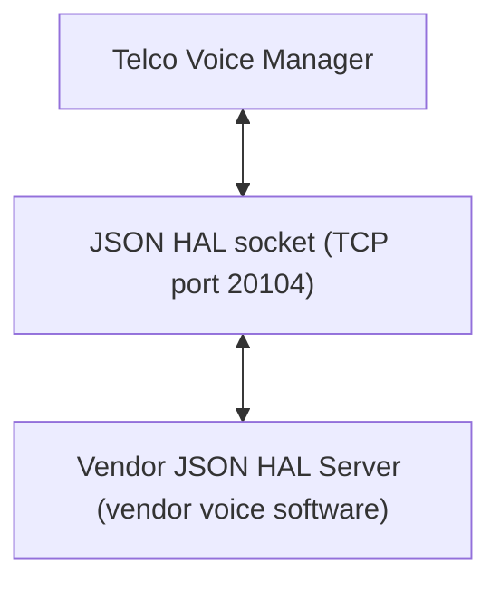
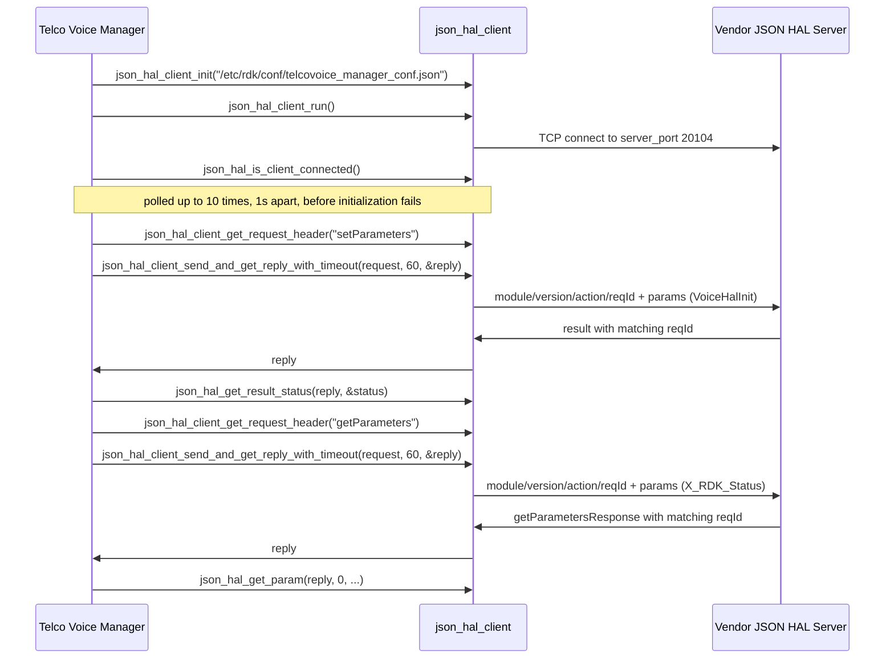

# Telco Voice HAL Documentation

## Version History

| Date | Comment | Version |
| --- | --- | --- |
| 2026-08-24 | Initial release. Specifies the Telco Voice `JSON` HAL contract carried by `hal_schema/telcovoice_hal_schema_v1.json` and `hal_schema/telcovoice_hal_schema_v2.json` | 1.0.0 |

## Repositories

xDSL Manager - https://github.com/rdkcentral/telco-voice-manager

JSON HAL Library - https://github.com/rdkcentral/json-hal-library

## Acronyms

- `DECT` \- Digital Enhanced Cordless Telecommunications
- `DML` \- Data Model Layer, the `TR-181` parameter surface the manager exposes to the rest of `RDK-B`
- `FXO` \- Foreign Exchange Office, the port that connects to an external analogue line
- `FXS` \- Foreign Exchange Subscriber, the port that a telephone handset plugs into
- `HAL` \- Hardware Abstraction Layer
- `IPC` \- Inter-Process Communication
- `ISDN` \- Integrated Services Digital Network
- `JSON` \- JavaScript Object Notation
- `JSON-RPC` \- The remote procedure call convention carried over `JSON`, used by this HAL's transport
- `MGCP` \- Media Gateway Control Protocol
- `POTS` \- Plain Old Telephone Service
- `RDK-B` \- Reference Design Kit for Broadband Devices
- `RTP` \- Real-time Transport Protocol
- `SIP` \- Session Initiation Protocol
- `TCP` \- Transmission Control Protocol
- `TR-104` \- Broadband Forum Technical Report 104, which defines the `VoiceService` service data model
- `TR-181` \- Broadband Forum Technical Report 181, which defines the `Device:2` root data model
- `VoIP` \- Voice over Internet Protocol
- `WAN` \- Wide Area Network, the upstream connection whose state the voice service can be tied to

## Description

The diagram below describes a high-level software architecture of the Telco Voice HAL module
stack.

The Telco Voice HAL is the interface between `RDK-B` middleware and a vendor's voice
implementation. It differs from most HALs in this bundle in one structural respect that governs
everything else in this document: **it is not a C header and no library is linked across the HAL
boundary.** The contract is a `JSON` Schema, the two participants are separate processes, and they
exchange messages over a `TCP` socket. Consequently there is no inline API reference to generate
from a header, and the per-parameter detail that inline documentation would carry for a C HAL is
carried instead by [halSpecDetailed.md](halSpecDetailed.md) in this folder.

Telco Voice Manager is the `RDK-B` middleware that orchestrates voice services, and it is the
**client** of this interface; the vendor supplies the **server**. The manager presents voice
configuration and status to the rest of `RDK-B` as a `TR-181` `DML` surface under
`Device.Services.VoiceService`, and translates reads and writes on that surface into `JSON` HAL
requests. 

The data model is a Broadband Forum model, and this document cites it in two parts because it is
assembled from two Technical Reports. Each citation names a **specific published model version**
rather than a documentation site, so that a reader checking a definition lands on the same text this
document was written against. The `Device.Services.` container comes from the root `Device:2` model
of `TR-181`, whose published definition of that container is
[`Device.Services.` in `Device:2.21`](https://cwmp-data-models.broadband-forum.org/tr-181-2-21-0-cwmp.html#D.Device:2.Device.Services.).
`VoiceService` is a *service* data model that plugs into that container, defined by
[`TR-104`](https://cwmp-data-models.broadband-forum.org/). Neither shipped schema declares the
revision it was authored against, so each was matched path by path against every published `TR-104`
revision rather than assumed. The `v2` schema is the `VoiceService:2` model published as
[tr-104-2-0-1-cwmp](https://cwmp-data-models.broadband-forum.org/tr-104-2-0-1-cwmp.html). The `v1`
schema is `TR-104` Issue 1, whose earliest compatible publication is
[tr-104-1-0-0](https://cwmp-data-models.broadband-forum.org/tr-104-1-0-0.html); the issue is
established but the minor revision within it is not.

Neither shipped schema declares a data-model version either, so the `TR-104` correspondence above
rests on matching object trees and datatypes rather than on a declared marker: `VoiceService:2.0` is
the revision that
introduced the `CallControl` and `Interwork` mapping objects, modelled each `VoIP` connection
through `Client`, `Network` and `VoIPProfile` tables, and added `FXO`, `DECT`, `ISDN` and
`SIP` proxy and registrar support — all of which are present in the `v2` schema and absent from
`v1`, whose tree is organised around `VoiceProfile` instead. 

**How to read the rest of this document.** It is arranged in two tiers. The overview tier is this
topic plus `Component Runtime Execution Requirements`,
which together answer what this interface is and how to call it — initialization order, threading,
memory, timeouts and error handling. The protocol tier is
`Non functional requirements` and
`Interface API Documentation`, which answer what the wire actually
looks like, what varies by build, and what happens when a call fails. Within that second tier
`API Surface` is the index: it names every action and marks the point past which the
detail continues into [halSpecDetailed.md](halSpecDetailed.md).

## Optional Components

Two data model variants are provided. The data model loaded by a deployment is determined by the preprocessor macro `FEATURE_RDKB_VOICE_DM_TR104_V2`.

The repository includes two schema files under `hal_schema/`:

| Schema file | Parameter definitions | Object definitions | Tree organised around |
| --- | --- | --- | --- |
| `telcovoice_hal_schema_v1.json` | 353 | 44 | `VoiceProfile` (280 of the 353 parameters) |
| `telcovoice_hal_schema_v2.json` | 776 | 115 | `SIP` (152), `CallControl` (148), and `CallLog` (95) |

If the preprocessor macro `FEATURE_RDKB_VOICE_DM_TR104_V2` is enabled, `telcovoice_hal_schema_v2.json` is used; otherwise, `telcovoice_hal_schema_v1.json` is used.

## Component Runtime Execution Requirements

The client side of this interface is a library linked into the calling process; the server side is a
separate process. What follows applies to a caller running the client, which for this repository is
Telco Voice Manager and for a test harness is whatever process links the same client library.

### Initialization and Startup

The client side of this interface is brought up in a fixed order by `TelcoVoiceMgrHal_Init()`
[`source/TR-181/middle_layer_src/telcovoicemgr_dml_hal.c`], which is invoked from
[`telcovoicemgr_dml_apis.c`]. No `JSON` HAL request may be issued before this sequence
completes successfully.

The calls, in the order they must occur:

- `json_hal_client_init(TELCOVOICEMGR_CONF_FILE)` \- reads the client configuration from
  `/etc/rdk/conf/telcovoice_manager_conf.json` [`telcovoicemgr_dml_hal.h`], which supplies the
  schema path and the server port. Failure here aborts initialization.
- `json_hal_client_run()`  \- starts the client socket thread and begins connecting to the
  vendor server. Failure here aborts initialization.
- `json_hal_is_client_connected()` \- polled, not waited on. The manager retries in a loop
  bounded by `HAL_CONNECTION_RETRY_MAX_COUNT`, which is `10`
  [`telcovoicemgr_dml_hal.h`], sleeping `1` second between attempts. If the client is
  still not connected after the tenth attempt, initialization fails.
- `TelcoVoiceMgrHal_InitData()` \- issues the first write, setting the HAL initialization
  flag to `true` or `false` as a boolean parameter. Failure here aborts initialization.

**Vendor obligation.** The vendor server must be accepting connections on the configured port
within that window, or the manager fails initialization and no voice service is brought up. The
server side of the transport listens with a backlog of `32` connections.

**A defect in the first write, which a strictly validating server will reject.** The parameter name
the manager sends for the initialization flag is built from a macro defined as
`"Devices.Services.VoiceHalInit"` \- plural `Devices`
[`source/TR-181/middle_layer_src/telcovoicemgr_dml_hal.c`]. Both shipped schemas define that
parameter as `Device.Services.VoiceHalInit` \- singular `Device` \- via the `name` pattern
`^Device\.Services\.VoiceHalInit$` on the `servicesVoiceHalInit` definition. The two do not match,
and `Devices.` appears nowhere else in this repository's source, configuration or schemas, so this
is an isolated discrepancy rather than an alternative convention. A vendor server that validates
incoming `setParameters` messages against the schema will reject this write; a server that matches
the name loosely, or that ignores an unrecognised initialization parameter, will not. Implementers
should be aware that the observable behaviour of initialization therefore depends on how strictly
their server validates. This specification records the discrepancy rather than resolving it: the
schema and the manager source are both outside the scope of this documentation change, and
correcting either is a functional change with device consequences.

### Threading Model

**Transport threading is owned by the client library, not by this interface.**
`json_hal_client_run()` is documented by its own header as starting the client socket thread, so
after initialization a dedicated thread inside `json_hal_client` owns the socket and performs the
receive loop. Asynchronous event callbacks registered through `json_hal_client_subscribe_event()`
are therefore delivered on that library-owned thread and not on the thread that registered them.

**Caller obligations for callbacks. These are normative for this interface, and two of them prevent
an unrecoverable hang rather than a race.**

- **Do the minimum in the callback, and return.** For as long as the callback runs, no reply to any
  outstanding request is delivered and no request timeout is counted, because the one thread that
  would do either is executing the callback. Long or blocking work in a callback is therefore not a
  latency cost to the callback alone — it stalls every concurrent HAL exchange in the process.
- **Copy anything needed after the callback returns.** The buffer the callback is handed is not the
  caller's to keep; see `Memory Model` for the lifetime and the reason.
- **Never make a synchronous HAL call from inside a callback.** A send-and-reply call blocks on a
  condition variable  that only two code paths ever signal — the reply
  dispatch  and the timeout ticker — and both run
  on the thread now sitting inside the callback. The wait is therefore never satisfied and never
  times out: the call does not fail slowly, it does not return at all. A callback that needs to read
  or write a parameter must hand the work to a thread of the caller's own and return.
- **Never register or re-register a subscription from inside a callback.**
 
- **Synchronize any state the callback touches.** Because the callback arrives on a thread the
  caller does not own, shared state it reads or writes needs the caller's own synchronization. The
  manager's own callback illustrates the pattern: it parses the event, resolves the affected voice
  service instance, and hands the result to the surrounding component rather than mutating shared
  state in place [`source/TR-181/middle_layer_src/telcovoicemgr_dml_hal.c`].

**Concurrent request submission is not specified by this interface.** Nothing in the schemas, the
client configuration or the manager source states whether two threads may issue requests
concurrently through the same client instance, and the manager itself does not exercise that case.
A caller must not assume either behaviour. Requests are correlated by `reqId` rather than by
submission order, which means the wire format does not itself prevent interleaving — but the
absence of a stated guarantee is not a guarantee, and treating it as one is the specific mistake
this paragraph exists to prevent.

**Vendor obligation.** The vendor server must tolerate a single long-lived client connection over
which requests arrive sequentially and events are published unsolicited. Whatever internal
threading a vendor uses to satisfy that, it must ensure a reply carries the `reqId` of the request
it answers, since that is the only field a client can correlate on.

### Process Model

**The manager and the vendor implementation are two processes communicating over a TCP socket.** This
is the single most consequential difference between this HAL and the C HALs in the RDK-B corpus, and
most of the rest of this document follows from it. There is no vendor `.so` in the manager's address
space, no shared memory and no direct function call: a vendor's allocations and pointers cannot
reach the manager's heap, and equally the manager cannot recover a crashed vendor server by any means
other than reconnecting. That is isolation of memory, not isolation from the peer. The peer's data
crosses the boundary and is copied into fixed manager buffers, in places without a bound;
`Contract Defects` in [halSpecDetailed.md](halSpecDetailed.md) records those copies with their locators, so a malformed or
hostile message can corrupt manager memory through the parsing path.

A single client instance per manager process is expected. On the server side the listen backlog is
32 (`tcp_server.c` in `json-hal-library`), so a vendor server accepts connections rather than
serving exactly one, but nothing in this contract assigns meaning to a second concurrent client and a
caller should not rely on one.

Because the two sides are separate processes, they are also separately restartable, and the interface
says nothing about what a vendor server does with subscriptions across its own restart. A caller that
has restarted, or that suspects the server has, should re-establish its subscriptions rather than
assume they survived.

### Memory Model

Because the vendor implementation is a separate process, no memory is shared across the HAL
boundary and no buffer lifetime spans it. What crosses the boundary is a serialized `JSON`
document. The memory model that matters to a caller is therefore entirely local: it concerns the
`json_object` handles the client library hands out and takes back, and it is reference-counted
rather than owned outright.

Two handles exist per request. The **request** object is created by the caller, conventionally from
`json_hal_client_get_request_header()`, which returns a `json_object` already populated with the
`module`, `version`, `action` and request-identifier fields. The **reply** object is produced by
the library and returned through an out-parameter of
`json_hal_client_send_and_get_reply_with_timeout()` or of the untimed
`json_hal_client_send_and_get_reply()`. Both are released with `json_object_put()`, which
decrements the reference count rather than freeing unconditionally.

#### Caller Responsibilities

- Release the request object obtained from `json_hal_client_get_request_header()` once the exchange
  completes, on both the success and the failure path. A request abandoned after a failed send leaks
  as surely as one abandoned after a successful one.
- Release the reply object returned through the out-parameter of
  `json_hal_client_send_and_get_reply()`. The caller owns that reference.
- Copy any value needed beyond the life of the exchange before releasing the reply. Values read out
  of a reply point into that object.
- Treat an event callback's message buffer as valid only for the duration of the callback. The
  callback receives a `const char *` and its length (`json_hal_client.h`); the caller must copy
  anything it intends to keep.
- Observe the transport's fixed buffer sizes when composing a request, since they bound what can be
  represented rather than merely what is efficient: a parameter name is capped at 256 bytes and a
  parameter value at 2048 bytes (`hal_param_t`, `json_hal_common.h`), and a schema file path
  returned by the server at 2048 bytes (`hal_schema_response_t`, `json_hal_server.h`).

#### Module Responsibilities

- The transport owns the receive buffer and its growth. Reads are made in units of
  `MAX_BUFFER_SIZE`, which is 16384 bytes (`json_rpc_common.h`), and a message larger than one
  read is reassembled by successive reallocation (`tcp_client.c`). A vendor server is
  therefore not required to fit a response into a single 16 KiB read, but it is required to emit
  well-formed JSON, because reassembly is driven by buffer occupancy rather than by JSON structure.
  **Reassembly exists on the reply path only.** The server side receives into one fixed buffer and
  hands exactly what a single `recv` returned to its handler (`tcp_server.c`), so a request
  that does not arrive complete in one read is parsed as a fragment and discarded without a reply. The
  accumulation on the reply path is also unbounded and grows by repeated reallocation, so neither
  direction offers a framed, bounded whole-message guarantee; `Contract Defects` in
  [halSpecDetailed.md](halSpecDetailed.md) states both limits.
- The transport owns the request-tracking list that correlates replies with waiting callers, and
  releases it on `json_hal_client_terminate()` (`json_hal_client.h`).
- Vendor servers must release whatever they allocate per request. Nothing in this contract gives the
  manager visibility of server-side allocation, so a leak there is invisible to the caller until the
  server fails.
- All strings crossing this interface are JSON strings and must be valid UTF-8 and zero-terminated
  once decoded.

### Power Management Requirements

**This interface does not participate in device power management.** No action in the protocol
signals a power-state transition, no result status reports one, and neither shipped schema defines
a parameter that enters, leaves or reports a device power state.

The statement is made by inspecting `hal_schema/telcovoice_hal_schema_v1.json` and
`hal_schema/telcovoice_hal_schema_v2.json` rather than by assertion, because a name search alone is
misleading here. Several parameters contain the word `Power`, and none of them is power management:
the `TonePattern` `Power` entries are audio signal levels for tone generation,
`DECT.Base.RFPowerControl` is a radio transmit-power control, and `ISDN.BRI.PowerSourceOne` reports
an `ISDN` line power source. These describe signal and line characteristics, not the device's power
state. The `v2`-only `ISDN.BRI.LifeLineHold` parameter is the closest thing to a power-related
behaviour in either schema, and it concerns lifeline call continuity rather than power management of
this component.

### Asynchronous Notification Model

Asynchronous delivery uses two actions. The client registers interest with `subscribeEvent`, which
requires a parameter `name` and a `notificationType` and is acknowledged by a `result` — an
acknowledgement the client library's subscribe call does not expose to the caller, for the reason
`Internal Error Handling` gives, so a successful subscribe call is not evidence
of an accepted subscription. The server subsequently sends `publishEvent` messages, unsolicited,
each carrying the parameter `name`, its `type` and its `value`.

**The four notification types, and the two that are specific to this HAL.** The schema's
`notificationType` enumeration is `interval`, `onChange`, `onChangeSync` and `onChangeSyncTimeout`,
with `onChange` as the default. 

**The subscribable surface is a single parameter, in both variants.** This is the most easily
over-estimated part of the interface. `subscribeEventSupportedList` binds exactly one parameter
definition in `v1` and in `v2`:
`Device.Services.VoiceService.{i}.X_RDK_Firewall_Rule_Data`. Every other parameter in either schema
must be polled with `getParameters`; none of them can be subscribed to. A caller that plans an
event-driven design around voice line status or registration state has no mechanism here to do it.

That single event carries a semicolon-terminated list of firewall rule tuples — per tuple an enable
flag, a protocol, a port and an address. The schema constrains the protocol to `sip` or `rtp` and the
address to an `IPv4` or `IPv6` literal, with the exact validating expression given in
[halSpecDetailed.md](halSpecDetailed.md) rather than reproduced here. The manager consumes the
event by matching the event name and applying the rules for the affected voice service instance
[`source/TR-181/middle_layer_src/telcovoicemgr_dml_hal.c`].

**Vendor obligation.** A server must accept a subscription for the supported parameter, acknowledge
it with a `result`, and thereafter publish on change. It must not publish an event for a parameter
that was never subscribed to, and it must not rely on a subscription surviving a client
reconnection — a manager that restarts re-subscribes as part of its own startup, so a server must
treat a repeat subscription for the same parameter as valid rather than as a duplicate to reject.

### Blocking calls

**The request path is synchronous and it blocks.** The C HALs in `RDK-B` require that none of their
calls block; this interface is the opposite, and a caller coming from a C HAL must adjust for it. A
send-and-reply call blocks the calling thread until the server answers or the wait expires, so HAL
requests must not be issued from a thread with latency obligations of its own.

**Connection establishment blocks for its own bounded window**, up to ten one-second attempts, as
`Initialization and Startup` sets out. The worst case for a cold start is that window followed by
the first request's wait.

**Synchronous and Responsive:** every parameter read and write is a round trip to another process.
A caller must treat each one as potentially slow and must not issue one from a context that cannot
tolerate waiting — in particular not from an event callback, which runs on the transport's own
receive thread.

**Timeout Handling: both variants are bounded, and they are bounded by the same mechanism.**
`json_hal_client_send_and_get_reply()` is not an unbounded wait. It passes
`SEND_MSG_TICKER_TIMEOUT`, which is `40` (`json_hal_client.c`), to the internal send-and-wait
routine, and the definition's own comment records the intent as
`Ticker timeout for aprox. 10s (40 x 250ms)`. A caller that supplies no deadline therefore
gets one of approximately ten seconds rather than none.

`json_hal_client_send_and_get_reply_with_timeout()` (`json_hal_client.h`) takes a deadline in
seconds, converts it to ticks as `(timeout * 1000000) / LOOP_TIMEOUT` with `LOOP_TIMEOUT` at
`250000` microseconds (`tcp_client.h`) — four ticks per second — and then **clamps the result at
both ends**, down to `40 (10s)` (`json_hal_client.c`) and up to `480 (120s)`, the upper bound. The deadline is approximate, and it is an upper bound rather than a guaranteed minimum wait.

**Nothing on this interface is asynchronous except event delivery.** There is no request handle to
poll, no completion callback for a request, and no way to cancel one in flight. A caller needing
concurrency gets it by not calling from a latency-sensitive thread, not by a non-blocking form of
these calls — and, as `Threading Model` records, whether two requests may be in flight at once is not
established by this interface, so extra threads are not a supported way to overlap them.

**Vendor obligation.** A server must answer every request it receives, including one it cannot
satisfy — an unanswered request costs the caller its full timeout and yields no information. Where
a request cannot be serviced, the correct behaviour is a prompt `result` carrying `Failed`,
`Invalid Argument` or `Not Supported`, not silence.

### Internal Error Handling

**Errors are reported in the reply, not out of band.** There is no error callback and no error
event. A failure is either a transport failure, visible as a failed send-and-reply call, or an
application failure, carried in the reply's `Result.Status` field. A caller must distinguish the
two: the first means the message may never have been processed, the second means it was processed
and refused.

`Result.Status` takes one of four values, from the schema's `resultStatusEnumList`, with `Success`
as the default. The value is retrieved with the client library's result-status accessor rather than
by reading the field directly. What a caller should do differs per value:

| Status | Meaning | What the caller should do |
| --- | --- | --- |
| `Success` | The request was accepted and applied. | Proceed. For a write, note that success means the vendor accepted the value, not that any dependent state has finished converging. |
| `Failed` | The request was understood but could not be applied. | Do not retry blindly; the same request will usually fail again. Log the parameter and the status, and surface the failure to the caller above. |
| `Invalid Argument` | A parameter name, type or value was not acceptable. | Treat as a defect in the request, not a transient condition. Check the name against the schema, the `type` against the parameter's declared datatype, and the value against its constraint. |
| `Not Supported` | The vendor does not implement this parameter or action. | Treat as a normal outcome rather than an error where the parameter is reachable only through an optional list, and stop requesting it. See `Optional Components`. |

**`Invalid Argument` and `Not Supported` are the two a caller most often mishandles**, because both
are permanent for a given request and neither should be retried. Retrying either produces load
without progress.

**The schema states what a well-formed message looks like; the pinned transport does not check
inbound messages against it.** This is the single most consequential difference between the contract
and its carrier, because a caller — or a test — that expects malformed input to come back as a clean
rejection is expecting something no code here performs. The server's internal request dispatcher
(`json_hal_server.c`) behaves as follows on a request:

| Inbound request | What the pinned server does | What the caller sees |
| --- | --- | --- |
| Not parseable as JSON | Logs the parse offset and returns from the dispatcher | **No reply at all** — the caller waits out the ticker deadline |
| Valid JSON with no `reqId` | Logs and discards the object  | **No reply at all** |
| Valid JSON with no `action` | Logs and discards the object  | **No reply at all** |
| Wrong `module` or wrong `version` | Neither field is ever read; the message is dispatched on its `action` alone | The handler's own answer, as though the envelope were correct |
| An `action` with no registered handler | Builds a generic `result`  | `Not Supported` |
| A handler that returns non-`RETURN_OK` | Builds a generic `result` | `Failed` |
| A parameter value outside its schema constraint, or a `params` entry missing a required property | Nothing inspects either; `params` is only counted, and the count is taken as an array length without checking that `params` is an array  | Whatever the vendor's handler decides |

**Internal Error Reporting:** a vendor server should report its own internal failures through
`Result.Status` rather than by closing the connection or omitting a reply, and should answer a
malformed or out-of-range request with a status rather than silently dropping it. Both are
obligations on the implementation, not services the transport provides: as the table above shows, the
dropped-input paths are exactly what the pinned dispatcher does by default. A missing reply is
indistinguishable to the caller from a hung server, and costs the caller the full blocking wait.

**Validation is the sender's job on both sides.** Because nothing validates a message on the way in,
a caller that wants a malformed request caught at all must validate its own outbound messages against
the schema variant selected for the build —
[`telcovoice_hal_schema_v1.json`](../../hal_schema/telcovoice_hal_schema_v1.json) or
[`telcovoice_hal_schema_v2.json`](../../hal_schema/telcovoice_hal_schema_v2.json) — before sending them, and a
vendor server must apply the parameter constraints in [halSpecDetailed.md](halSpecDetailed.md) in its handler. Neither
side is protected by the other.

**Focus on Logging for Errors:** for failures that cannot be expressed in a status value — a
malformed message, a connection lost mid-exchange — both sides should log with enough context to
identify the exchange, which in practice means the `reqId`.

### Persistence Model

**This interface makes no persistence guarantee.** Neither shipped schema states whether a value
written with `setParameters` survives a reboot, a vendor-process restart or a client reconnection.
No action requests persistence, no parameter reports whether a value is persisted, and no result
status distinguishes a value that was applied from one that was applied and stored. A caller must
therefore not infer durability from a `Success` result.

**Persistence is a manager-side concern, implemented above the HAL boundary.** It
happens in Telco Voice Manager's own local store rather than in the vendor implementation, and it is
gated by the preprocessor macro `TELCO_VOICE_FEATURE_ENABLE_PERSIST`. 

## Non functional requirements

### Logging and debugging requirements

**The debug surface is part of the interface, not a vendor convention.** Both shipped schemas define
an `X_RDK_Debug` object under each voice service instance, at
`Device.Services.VoiceService.{i}.X_RDK_Debug.`, carrying five read-write parameters. These are the
controls a caller uses to raise or lower diagnostic output from the vendor voice software, and they
are the only logging controls this interface defines:

| Parameter | Type | Purpose |
| --- | --- | --- |
| `X_RDK_Debug.ModuleLogLevels` | `string` | Per-module log levels, as a comma-separated list of `name=value` pairs where `name` is a voice module and `value` is its level. |
| `X_RDK_Debug.LogServer` | `string` | Destination for remote logging of protocol messages. |
| `X_RDK_Debug.LogServerPort` | `unsignedInt` | Port on that log server. |
| `X_RDK_Debug.CCTKTraceGroup` | `string` | Trace group bitmask for the vendor voice stack, bounded at 256 characters. |
| `X_RDK_Debug.CCTKTraceLevel` | `string` | Trace level for the same facility, bounded at 256 characters. |

**Log levels are the `printk` scale, 0 to 7 — not a syslog keyword set.** The schema states this
directly in the description of `ModuleLogLevels`: values run from 0 to 7, corresponding to `printk`
logging levels, where **0 is an emergency log and 7 is a debug log**. So the numbers ascend with
verbosity and descend with severity, which is the opposite of the convention used by several other
HALs in this bundle, and writing a keyword such as `ERROR` where a digit is expected will be
refused. The two endpoints are the schema's own; the intervening values follow the standard `printk`
ordering, which runs from emergency at 0 through alert, critical, error, warning, notice and
informational to debug at 7. This document does not claim the schema enumerates those intermediate
names — it does not — only that the scale it names has them.

**Per-module granularity is the point of the parameter.** Because the value is a list of
`name=value` pairs rather than a single global level, a caller can raise verbosity for one voice
module while leaving the rest quiet, which is the intended way to diagnose a specific area without
flooding the log. The set of valid module names is vendor-defined; neither schema enumerates it, and
this specification does not invent one.

**Where output goes is a vendor decision this interface does not constrain.** Neither schema names
a log file, a directory or a log format, and no parameter reports where the vendor writes. A caller
that needs logs collected off-box has `LogServer` and `LogServerPort` and nothing else. Any specific
log path a reader may have seen for another HAL in this bundle does not apply here, and none is
asserted.

**Manager-side logging is separate.** Telco Voice Manager's own diagnostics go through the `RDK-B`
trace facility, which it links against explicitly [`source/TelcoVoiceManager/Makefile.am`], and it
traces each `JSON` request and reply at informational level and each failure at error level — the
send-and-reply call sites in
[`source/TR-181/middle_layer_src/telcovoicemgr_dml_hal.c`] show the pattern. That output is the
manager's, not the vendor's, and the two are collected independently.

### Memory and performance requirements

**No memory footprint limit is specified for this interface.** Neither shipped schema, the client
configuration nor the manager source states a resident-size budget, a heap ceiling or an allocation
limit for either participant. 

**The performance envelope that *is* specified is a set of bounds on the transport**, and these are
the numbers a caller can design against. The message and tick bounds are properties of the pinned
transport revision cited in `Build Requirements` — its
`json-rpc-common/json_rpc_common.h`, `tcp_client.h` and `tcp_server.c` — and the connection window is
the retry loop in `source/TR-181/middle_layer_src/telcovoicemgr_dml_hal.c`. None of them is a budget
this document invents. Two of the five are exact and two are nominal, and the difference matters when
sizing a caller: the size and backlog bounds are fixed constants, whereas the reply-wait bounds are
counts of receive-loop passes. A pass ends either when its 250-millisecond `select` expires or as soon
as data is readable, and the pass that services the countdown is skipped while a multi-read reply is
being reassembled, so the same tick budget can be spent in appreciably less than its nominal seconds
on a busy connection and in appreciably more while a large reply arrives. A caller that needs a hard
latency bound must impose its own:

| Bound | Value | Consequence |
| --- | --- | --- |
| Request receive buffer | 16384 bytes, the fixed server receive buffer [`json_rpc_common.h`, `tcp_server.c`] | The server parses only the bytes returned by a single `recv()` and does not accumulate requests across reads. Therefore, even a request smaller than 16384 bytes must arrive completely in one read to be parsed successfully; TCP does not guarantee this. | 
| Reply size | No stated ceiling, and no framing. The client accumulates a multi-chunk reply on the heap and treats any short read as the end of it [`tcp_client.c`] | A reply larger than one buffer is delivered whole. A caller must not impose a 16384-byte expectation on a reply, and must not assume a bound the transport does not state. |
| Reply wait, shortest | 40 ticks, nominally about 10 seconds | The floor described in `Blocking calls`. It bounds receive-loop passes rather than elapsed time, so treat the seconds figure as nominal. |
| Reply wait, longest | 480 ticks, nominally about 120 seconds | The cap. A longer request timeout is reduced to it, and the same tick-versus-clock caveat applies. |
| Connection establishment | approximately 10 seconds | Ten one-second attempts before initialization fails. |
| Server connection backlog | 32 | The listen backlog on the vendor side of the socket. |

**Caller Responsibilities:**

- Size a `params` batch against the **request** bound rather than assuming the transport will
  reassemble an arbitrarily large request. Reassembly exists on the reply path only.
- Do not issue HAL requests from a latency-sensitive thread. A single request can occupy its thread
  for the full reply wait, and that wait is seconds rather than milliseconds.
- Poll rather than subscribe for anything other than the one subscribable parameter, and choose a
  poll interval accordingly — a tight poll loop over a socket round trip is the most likely way to
  make this interface a bottleneck.
- Release reply handles promptly, as `Memory Model` requires. A leaked `JSON`
  document is the only unbounded growth this interface makes easy.

**Vendor Implementation Responsibility:**

- Answer promptly. Because the reply wait has a floor of roughly ten seconds, a server that simply
  fails to answer imposes that cost on the caller for every such request; returning a status
  immediately is always better than silence.
- Keep steady-state resource use bounded across a long-lived connection, since the manager connects
  once at startup and does not reconnect on a timer.
- Publish events only for genuine changes on the one subscribable parameter. There is no rate limit
  in the protocol, so an implementation that publishes on every internal update rather than on
  change is unconstrained by anything but its own restraint.

### Quality Control

To ensure quality and reliability, third-party analysis tools such as `Coverity`, `Black Duck` and
`Valgrind` should be used to examine both a vendor's server implementation and the manager, so that
memory leaks, corruption and licence-compliance defects are found before deployment. A zero-warning
policy should apply to compilation, with all warnings enabled by default in the build files.

Because the two sides of this interface are separate processes, a vendor server should additionally
be exercised against malformed and unexpected input. Answering such a request with a status rather
than dropping it is an obligation on the handler and not something the transport does for it — as
`Internal Error Handling` records, the pinned dispatcher discards a request with a missing or
unparseable envelope without replying at all — so it is behaviour that has to be implemented
deliberately and is only demonstrable by testing it. A test written against this interface should
assert the transport's actual behaviour on malformed input, not a rejection status the transport
never constructs.

### Licensing

Telco Voice Manager, including the schemas that constitute this HAL contract, is released under the
**Apache License, Version 2.0**. The full text of every licence that applies within this component is
carried at the repository root as `LICENSE`, with `COPYING` — a symbolic link to that same text — and
`NOTICE` alongside it. 

### Build Requirements

**No HAL library is built from this repository, and none is linked across the HAL boundary.** This
follows from the contract being a schema rather than a header, and it is the first thing an
integrator coming from a C HAL needs to know. There is no `libhal_*` artefact to produce for the HAL
itself, no header to install for the contract, and no symbol a vendor must export. What a vendor
delivers is a **process** that speaks the protocol and validates against the shipped schema; what
this repository delivers on the HAL boundary is the schema file.

Telco voice manager links JSON HAL client library [`json_hal_client`] and uses the JSON HAL contract.

### Variability Management

Each interface is versioned using [Semantic Versioning 2.0.0](https://semver.org/spec/v2.0.0.html), and a vendor
implementation complies with a specific version of it. Adjusting the interface is an architecture
decision; vendors align their implementation with a designated version and move to a newer one as
demand requires.

**The version that governs a message on the wire is the HAL schema version, `1.0.0`**, carried by the
`schemaVersion` definition and required in the `version` field of every message. The schema states
its own rule for it:

> DO NOT modify the value of the version string. HAL operation cannot be performed without correct
> supported version.

A client and a vendor server that disagree on this value cannot interoperate, because `version` is
one of the four required envelope fields and is a `const` in the schema — a mismatch makes the
message invalid rather than merely unrecognised. This is the identity a caller negotiates against,
and it advances independently of the repository's release tag.
The parameter-tree variant is selected at build time using
`FEATURE_RDKB_VOICE_DM_TR104_V2`: when disabled the v1 schema is used, and when enabled the v2
schema is used.

### Platform or Product Customization

**What `FEATURE_RDKB_VOICE_DM_TR104_V2` changes for a caller is the shape of the entire parameter
tree, not a feature toggle within one tree.** A caller cannot write one set of parameter paths and
have it work under both settings. The two models address the same telephony concepts through
different objects, so the customization decision determines which paths exist at all.

The measured difference, from the two shipped schemas:

| | `v1` (`FEATURE_RDKB_VOICE_DM_TR104_V2` disabled) | `v2` (enabled) |
| --- | --- | --- |
| Parameters / objects | 353 / 44 | 776 / 115 |
| Organised around | `VoiceProfile`, holding 280 of the 353 parameters, with `Capabilities` and `PhyInterface` alongside | A flattened tree: `SIP` 152, `CallControl` 148, `CallLog` 95, `Capabilities` 46, `VoIPProfile` 42 |
| Telephony scope | `VoIP` with `SIP` and `MGCP` signalling, addressed per profile and line | Adds `POTS` with `FXS` and `FXO`, `DECT`, `ISDN`, `H323`, `Trunk`, `Interwork`, `Terminal`, `Tone`, `CodecProfile`, `ClockSynchronization` and `ReservedPorts` |
| Shared surface | 23 parameter definition keys and 6 object definition keys in common | The same 23 and 6 |

## Interface API Documentation

### Theory of operation and key concepts

**One envelope, one action field, one conditional payload.** Every message in either direction is a
single `JSON` object with the same four required fields — `module`, `version`, `action` and `reqId`.
The `action` value selects what else the message must carry: the schema attaches a conditional
payload requirement to each action that has one, so the envelope alone is a complete message for some
actions and invalid for others. There is no separate message type, no header-and-body split and no
framing beyond the `JSON` document itself.

**Correlation is by `reqId` and by nothing else.** `reqId` is a **string** constrained to digits by
the pattern `^[0-9]+$` — note that it is a string, not a number, so `"42"` is valid and `42` is not.
A server must echo the `reqId` of the request in the reply that answers it, because the client
matches replies on that field rather than on arrival order. Nothing else in the envelope identifies
an exchange.

**Module identity is a constant, not a routing field.** `module` is bound to a `const` of `voicehal`
in both schemas, so it does not select among several modules on one connection; it identifies the
contract, and a message bearing any other value is invalid. `version` is likewise a `const`, as
`Variability Management` sets out.

**The parameter surface is `TR-181` paths, carried as data.** Reads and writes do not name functions.
They name data model paths — `Device.Services.VoiceService.1.X_RDK_Status` and the like — inside a
`params` array, and the schema validates each entry against a definition that pins the path, its
datatype and its value domain. This is what replaces a C HAL's function signature, and it is why the
per-parameter reference in [halSpecDetailed.md](halSpecDetailed.md) is the analogue of inline API
documentation for this interface.

#### Object Lifecycles

- **Objects are addressed, not constructed.** Each schema defines a set of object definitions
  alongside its parameters — 44 in `v1` and 115 in `v2` — and an object definition carries only a
  `name`, expressed as an instance-path expression such as
  `^Device\.Services\.VoiceService\.\d+\.$`. An object is therefore something a caller *refers to*
  by path, with the numeric segment identifying the instance.
- **Lifetime of a handle is the lifetime of a message.** Because objects are addressed by path rather
  than by handle, there is nothing for a caller to open, close or keep alive between calls. The only
  object lifetimes a caller manages are the local `JSON` document handles described in
  `Memory Model`.

#### Method Sequencing

- **Initialization first, without exception.** The four-step client bring-up in
  `Initialization and Startup` must complete before any request is
  issued. In particular, connectivity must be confirmed by polling rather than assumed from a
  successful start.
- **After initialization, ordering is a caller concern rather than a protocol constraint.** The
  schema imposes no required order among `getParameters`, `setParameters`, `getSchema` and
  `subscribeEvent`. Any sequencing beyond initialization is a consequence of the data being
  addressed, not of the protocol — for example, a caller must learn an instance number before it can
  address a parameter within that instance.
- **Subscription is established once and then relied upon.** The manager subscribes as part of its
  own controller start-up rather than per read
  [`source/TelcoVoiceManager/telcovoicemgr_controller.c`], and re-subscribes after a restart.
- **Two actions carry essentially all traffic.** Although the enumeration has eleven members, the
  manager's source defines only two action constants — `getParameters` and `setParameters`
  [`source/TR-181/middle_layer_src/telcovoicemgr_dml_hal.h`]. A vendor server must still
  implement the remaining actions it is expected to answer, but an implementer sizing effort should
  know where the traffic actually is.

#### State-Dependent Behavior

- **Voice service state is observable, and one control drives it.** Behaviour that varies with state
  is keyed to `Device.Services.VoiceService.{i}.X_RDK_Status`, which is read-only, and driven by
  `Device.Services.VoiceService.{i}.X_RDK_Enable`, which is read-write.
  `State Diagram` gives both value sets with their data-model ordinals, and
  records that nothing in this repository establishes which value may follow which.
- **Transport state is a separate axis.** A request can fail because the socket is not connected
  regardless of what the voice service state is, which is why
  `Process Model` treats disconnection as a first-class state rather than an
  error condition.
- **A write's effect may not be immediate.** A `Success` result on `X_RDK_Enable` means the value was
  accepted, not that the service has finished reaching the corresponding status. A caller that needs
  to know the service is running must read `X_RDK_Status` rather than infer it from the write.
- **Optional parameters make `Not Supported` state-independent.** A parameter the vendor does not
  implement returns `Not Supported` in every state, and no sequence of calls will change that; see
  `Optional Components`.

### Data Structures and Defines

For a C HAL this topic lists the enumerations, structures and macros a caller must construct or
interpret. The equivalents here are schema definitions, and they fall into five groups. The complete
per-definition inventory is in [halSpecDetailed.md](halSpecDetailed.md); what follows are the
shapes a caller must be able to build and read.

**The envelope.** Four required fields, each bound to a definition rather than declared inline:

| Field | Bound to | Form |
| --- | --- | --- |
| `module` | `moduleName` | `string`, `const` `voicehal` |
| `version` | `schemaVersion` | `string`, `const` `1.0.0` |
| `action` | `action` | `string`, one of the eleven members listed in `API Surface` |
| `reqId` | inline | `string` matching `^[0-9]+$` |

**The payload objects.** Three distinct payload shapes exist, selected by action:

| Payload | Carried by | Shape |
| --- | --- | --- |
| `params` | `setParameters`, `getParameters`, `getParametersResponse`, `subscribeEvent`, `publishEvent`, `deleteObject` | An array, minimum one item, items unique. Each item is a parameter entry whose required fields vary by action. |
| `Result` | `result` | An object with a single `Status` field, `additionalProperties: false`, `Status` required. |
| `SchemaInfo` | `getSchemaResponse` | An object with a single `FilePath` field, `additionalProperties: false`, `FilePath` required, matching the path expression `^(.+)/([^/]+)$`. **Server-supplied and untrusted — see the note below.** |

**`SchemaInfo.FilePath` is the one field in this contract whose value comes from the vendor server
and looks like something a caller might act on. It must be compared, never dereferenced.** The
expression `^(.+)/([^/]+)$` requires only a slash with something on each side of it: it admits `..`
segments, an absolute path anywhere in the filesystem, a symbolic link, a device node and embedded
whitespace, so validating a `getSchemaResponse` says nothing about the safety of the string it
carries. The only supported check is **exact string equality against the configured
`hal_schema_path`**, `/etc/rdk/schemas/telcovoice_hal_schema.json`
[`hal_schema/telcovoice_manager_conf.json`](../../hal_schema/telcovoice_manager_conf.json) — which is also the only schema location the transport
library itself opens, doing so from the local configuration file during client initialization and
never from a server reply]. A caller must not open, stat, read,
resolve, canonicalise or shell out to the returned value, must not derive a new path from it, and
must not adopt it in place of its own configured path. On mismatch it fails closed and reports a
deployment disagreement, and it reports the configured path rather than echoing the received string,
which is server-controlled text. [halSpecDetailed.md](halSpecDetailed.md) states the rule with the
exchange it applies to.

**Required fields per `params` entry, which differ by action and are easy to get wrong:**

| Action | Required in each `params` entry |
| --- | --- |
| `getParameters` | `name` only |
| `setParameters`, `getParametersResponse`, `publishEvent` | `name`, `type` and `value` |
| `subscribeEvent` | `name` and `notificationType` |
| `deleteObject` | `name` — but the action is unusable, see `API Surface` |

**A leaf parameter definition**, which is the schema's analogue of a documented function parameter,
carries exactly three properties and forbids others: `name` — a `const` exact path for a singleton or
a regular expression for an indexed instance; `type` — a `const` giving the `TR-181` datatype; and
`value` — the constraint the value must satisfy. An **object definition** is the same shape reduced to
`name` alone. The datatypes in use are `string`, `boolean`, `unsignedInt`, `int`, `unsignedLong` and,
in `v2` only, `hexBinary`.

**The five enumerations.** These are the closest thing this interface has to a C HAL's `enum`
declarations, and a caller must treat each as closed:

| Enumeration | Members | Default |
| --- | --- | --- |
| `action` | The eleven members in `API Surface` | none |
| `resultStatusEnumList` | `Success`, `Failed`, `Invalid Argument`, `Not Supported` | `Success` |
| `notificationType` | `interval`, `onChange`, `onChangeSync`, `onChangeSyncTimeout` | `onChange` |
| `voiceStatusEnumList` | `Stopped`, `Starting`, `Started`, `Stopping`, `Error` | none |
| `voiceStateEnumList` | `Enable`, `Disable` | none |

**One `v2`-only type definition.** The `v2` schema defines a hexadecimal-string type, an even-length
sequence of hex digit pairs, and applies it to the five `DECT` identity and provisioning
parameters — the base station `PIN` and `RFPI`, and the portable part's `IPEI`, `IPUI` and `PARK`.
The `v1` schema defines no such type and has no `hexBinary` parameter.

**Two enumerations are each referenced by exactly one parameter.** `voiceStatusEnumList` is used only
by `X_RDK_Status` and `voiceStateEnumList` only by `X_RDK_Enable`. That is what makes
`State Diagram` tractable, and it also bounds how much of this interface is
state-bearing at all.

### API Surface

This topic is the boundary between the overview above and the protocol depth below. A reader who came
for an orientation can stop here; a reader with a protocol question starts here and continues into
[halSpecDetailed.md](halSpecDetailed.md), which carries every parameter definition, every object
path, the enumeration appendix and worked message exchanges.

**Where a C HAL has functions, this interface has eleven action values.** They are the complete
callable surface, and both schemas declare the same eleven in the same order:

| Action | Originated by | Payload it must carry |
| --- | --- | --- |
| `getSchema` | Client | none — bare envelope |
| `getParameters` | Client | `params` |
| `getParametersResponse` | Server | `params` |
| `setParameters` | Client | `params` |
| `subscribeEvent` | Client | `params` |
| `getActiveSubscriptions` | Client | none — bare envelope |
| `getActiveSubscriptionsResponse` | Server | none — bare envelope |
| `getSchemaResponse` | Server | `SchemaInfo` |
| `publishEvent` | Server | `params` |
| `deleteObject` | Client | `params` — **but see below; not usable** |
| `result` | Server | `Result` |

**Eight actions bind a payload; three travel as the bare envelope.** The schema attaches a
conditional payload requirement to `setParameters`, `getParameters`, `deleteObject`,
`subscribeEvent`, `publishEvent`, `result`, `getSchemaResponse` and `getParametersResponse`. The three
with no payload binding are **`getSchema`, `getActiveSubscriptions` and
`getActiveSubscriptionsResponse`** — for these the four envelope fields are the entire message, and
`getSchema`'s own definition states that the action has no parameter list.

**The bare envelope means something different for `getSchema` than for the two subscription
actions.** `getSchema` is a request whose *answer* is a bound payload, `getSchemaResponse` carrying
`SchemaInfo`, so the pair is complete. `getActiveSubscriptions` has no bound answer at all: its
response action binds nothing either, and neither schema defines a subscription list to put in one.
The row above therefore records what the enumeration contains, not a working enumeration facility —
**the content of `getActiveSubscriptionsResponse` is undefined by this contract and whatever a server
places there is vendor-specific**, and the transport library provides no call that issues the action
or parses a list from the reply. `Asynchronous Notification Model` states the
consequence for a caller.

**There is no `setParametersResponse`.** This is the single most commonly mis-stated fact about this
protocol, so it is stated plainly: a write is acknowledged by the generic **`result`** action
carrying `Result.Status`. A caller waiting for an action name symmetrical with `setParameters` will
wait for a message that the contract does not define. Three of the eleven actions are answered by
`result` rather than by a dedicated response: `setParameters`, `subscribeEvent` and — were it
usable — `deleteObject`. By contrast `getParameters`, `getSchema` and `getActiveSubscriptions` each
have a matching named response.

**`deleteObject` is not usable under either shipped schema.** Its payload definition carries an empty
`anyOf`, a construct no instance can satisfy, so no schema-valid delete message exists to send. It is
listed above for completeness because it is present in the enumeration a server must be able to
parse, but it must be treated as unsupported: a caller should not attempt object deletion through
this interface, and a vendor need not implement it. This is a defect in the shipped contract rather
than a design decision, and it is recorded rather than worked around — the schemas are the contract,
and editing them is outside the scope of this documentation.

**The object tree.** All voice parameters in both schemas live under
**`Device.Services.VoiceService`**, addressed per instance as
`Device.Services.VoiceService.{i}.` and below. Exactly one definition sits outside that tree, in both
variants: **`Device.Services.VoiceHalInit`**, the boolean initialization flag written during
client bring-up — and the discrepancy affecting the name the manager actually sends for it is
recorded in `Initialization and Startup`.

The tree's second level differs sharply between the two variants, and
`Platform or Product Customization` gives the measured
comparison. The parameters that exist in **both** variants, and which are therefore the portable part
of the surface, are the `X_RDK_*` extensions — chiefly `X_RDK_Enable`, `X_RDK_Status`,
`X_RDK_FactoryReset`, `X_RDK_Firewall_Rule_Data`, `X_RDK_BoundIfName`, `X_RDK_BoundIpAddr`,
`X_RDK_IpAddressFamily`, `X_RDK_DnsServers`, `X_RDK_DisableLoopCurrentUntilRegistered` and the five
`X_RDK_Debug` parameters.

**Per-parameter detail is not repeated here.** Every parameter's path, datatype, value constraint,
access and description — 353 parameter definitions in `v1` and 776 in `v2` — is in
[halSpecDetailed.md](halSpecDetailed.md), together with the object index, the enumeration appendix,
worked exchanges for each usable workflow, and the record of contract defects.

### Sequence Diagram

The exchange below shows a cold start followed by one read, using the actual client entry points and
the actual action names. Every function named in it is declared by `json_hal_client.h` or
`json_hal_common.h` at the pinned transport revision cited in
`Build Requirements`; every action name is a member of the `action`
enumeration in the shipped schemas; and the ordering follows
`source/TR-181/middle_layer_src/telcovoicemgr_dml_hal.c`. Nothing in it is illustrative.

Three details in that exchange are worth drawing out, because each is a place implementations
diverge. The first write is the initialization flag, so a server sees `setParameters` before anything
else. That write is answered by **`result`**, not by a response action named after the request. And
the read is answered by `getParametersResponse`, which is one of the actions that *does* have a
dedicated name — the asymmetry is in the contract, not in the diagram.

Event delivery runs on its own path rather than as part of this exchange: the client calls
`json_hal_client_subscribe_event()` once, and the server thereafter sends `publishEvent` messages
unsolicited, delivered on the library's socket thread. See
`Asynchronous Notification Model`.

### State Diagram

**The state-bearing part of this interface is two parameters wide, and this interface establishes
their value sets and nothing about their ordering.** One read-write control,
`Device.Services.VoiceService.{i}.X_RDK_Enable`, takes `Enable` or `Disable`
(`voiceStateEnumList`). One read-only observable,
`Device.Services.VoiceService.{i}.X_RDK_Status`, takes `Stopped`, `Starting`, `Started`, `Stopping`
or `Error` (`voiceStatusEnumList`). Each enumeration is referenced by exactly that one parameter and
by nothing else in either shipped schema, and the two enumerations are identical between the
variants. The values, with the ordinals the manager's own data model assigns them:

| Parameter | Access | Values, with the ordinal each maps to | Ordinals established by |
| --- | --- | --- | --- |
| `X_RDK_Status` | Read-only | `Stopped` 0, `Starting` 1, `Started` 2, `Stopping` 3, `Error` 4 | `config/RdkTelcoVoiceManager_v2.xml:189`, `config/RdkTelcoVoiceManager_v1.xml:182` |
| `X_RDK_Enable` | Read-write | `Disable` 0, `Enable` 1 | `config/RdkTelcoVoiceManager_v2.xml:183` |

**What a caller must not rely on is ordering within that closed set.** A caller must not rely on a
particular value being reachable only from a particular predecessor, and must not track state locally
in the expectation that the vendor will announce every intermediate value — the observable is polled,
not subscribable (`Asynchronous Notification Model`), so intermediate values may be missed between
reads. The reliable way to establish the current state is to read `X_RDK_Status`.

**`Error` has no specified exit.** Nothing in either schema, either data-model description or the
manager source states how a service leaves `Error`: there is no recovery action, no reset-to-running
transition and no parameter reporting a recovery in progress. A caller confronted with `Error` has
the ordinary controls available to it — writing `Disable` and then `Enable`, or the separate
`X_RDK_FactoryReset` parameter — but this interface does not state that either clears the condition,
and this specification does not claim it does.

