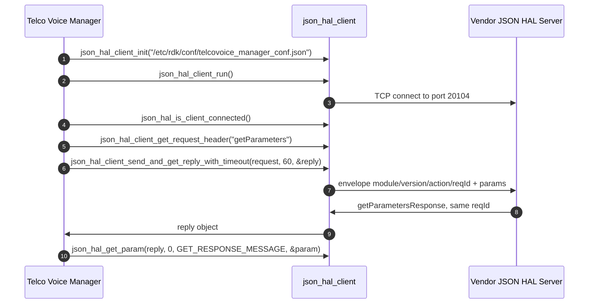
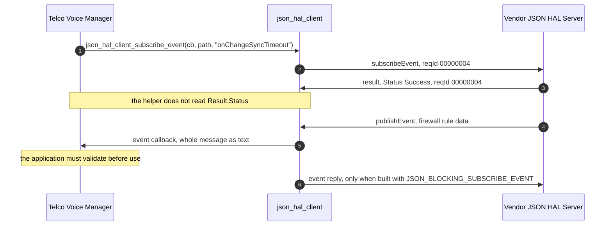

# Telco Voice HAL Detailed API Reference

This document is the per-parameter and per-action reference for the Telco Voice `JSON` HAL. For a
`C` HAL the equivalent detail is carried by inline Doxygen inside a header; this interface has no
header, so the detail is carried here. [halSpec.md](halSpec.md) in this folder is the
specification proper — architecture, runtime requirements, non-functional requirements and the
interface overview — and this document is the reference it points at.

## Purpose and how to read it

Everything below is derived from the two schema files this repository ships,
[`hal_schema/telcovoice_hal_schema_v1.json`](https://github.com/rdkcentral/telco-voice-manager/blob/b37587112cedffed65a56d3296fdb6b0e337441d/hal_schema/telcovoice_hal_schema_v1.json) and
[`hal_schema/telcovoice_hal_schema_v2.json`](https://github.com/rdkcentral/telco-voice-manager/blob/b37587112cedffed65a56d3296fdb6b0e337441d/hal_schema/telcovoice_hal_schema_v2.json).
Neither file is modified by this documentation, and every count, type, constraint, access marking
and description reproduced here is taken from them mechanically rather than transcribed.

**What derivation means for this HAL specifically.** All 353 parameter definitions in `v1` and all
776 in `v2` carry a `description` in the schema itself, so every Description cell below is the
schema's own text with its trailing `(Access = …)` marker moved into the Access column. Twenty of
those descriptions do not actually describe their parameter, and each is reproduced verbatim and then
corrected or marked underived — see `D13` under `Contract Defects`. Where a definition's meaning is
genuinely not established — the ten listed under
`Definitions the schema leaves unconstrained` — this document says so
instead of supplying one.

### The official data model these schemas were written against

Nothing in this repository records a model revision, so the revision was **identified by comparison
rather than assumed**, against the Broadband Forum's own machine-readable model index at
[cwmp-data-models.broadband-forum.org](https://cwmp-data-models.broadband-forum.org/), which
publishes `TR-104` Issue 1 and Issue 2. The two variants resolve differently, and the difference is
stated rather than smoothed over: `v2` resolves to **one** publication, while `v1` resolves to the
**earliest** publication compatible with it and cannot be narrowed further from the schema alone. The
corrected readings in `D13` and every standards semantic cited elsewhere in this document are taken
from these publications and no others:

| Schema file | Official model | Definitive reference |
|---|---|---|
| `telcovoice_hal_schema_v1.json` | `TR-104` Issue 1 — the **issue** is established, the minor revision within it is **not**, for the reason given below the table | [tr-104-1-0-0](https://cwmp-data-models.broadband-forum.org/tr-104-1-0-0.html); machine-readable file `tr-104-1-0-0-full.xml` on the same host |
| `telcovoice_hal_schema_v2.json` | `TR-104` Issue 2, the revision published as `tr-104-2-0-1` | [tr-104-2-0-1-cwmp](https://cwmp-data-models.broadband-forum.org/tr-104-2-0-1-cwmp.html), machine-readable [tr-104-2-0-1-cwmp-full.xml](https://cwmp-data-models.broadband-forum.org/tr-104-2-0-1-cwmp-full.xml) |

Stated as the model publications name themselves: the `v2` schema is <b>`VoiceService:2.0` as published
in `tr-104-2-0-1`</b>, and the `v1` schema is <b>`TR-104` Issue 1, whose earliest compatible publication
is `VoiceService:1.0` (`tr-104-1-0-0`) and for which `VoiceService:1.1` (`tr-104-1-1-0`) is equally
consistent</b>. The asymmetry is the point and it is not a hedge: one comparison narrows to a single
publication and the other narrows only to the issue, and the next paragraph gives the figures behind
each. The two machine-readable files are named differently because `TR-104` Issue 1 predates the
`CWMP`/`USP` split in the Broadband Forum's publication scheme: the Issue 1 model is served as
`tr-104-1-0-0-full.xml` with no protocol infix, while the Issue 2 model carries one and is served as
`tr-104-2-0-1-cwmp-full.xml`. Both are the same host as the pages linked above.

**How each was established, and how tightly.** Every non-vendor parameter path in each schema was
matched against every published `TR-104` revision, with the `Device.Services.` prefix removed to give
the service-object-relative form the model uses.

- `v1` — 325 of its 353 parameters are non-`X_RDK`, and **324 of the 325 exist verbatim in
  `VoiceService:1.0`**. `VoiceService:1.1` accounts for **exactly the same 324 and no more**, so the
  comparison identifies the *issue* and not the minor revision: `1.0` is named here because it is the
  **earliest compatible** publication, `1.1` is **equally consistent**, and **nothing in either
  shipped schema distinguishes them** — no parameter, no datatype and no constraint present in one
  and absent from the other. Any statement that this file is specifically `VoiceService:1.0` rather
  than `1.1` would therefore be an over-claim, and every `v1` semantic in this document is one the two
  revisions agree on. Issue 2 revisions match only 8 of the 325, so the Issue 1 identification itself
  is not marginal.
- `v2` — 734 of its 776 parameters are non-`X_RDK`, and **733 of the 734 exist verbatim in
  `tr-104-2-0-1`**. `tr-104-2-0-0` matches only 732, and **the discriminating parameter is
  `VoiceService.{i}.CallLog.{i}.Session.{i}.SIPSessionID`**, which `2-0-0` does not define and `2-0-1`
  does. `tr-104-2-0-2` accounts for the same set as `2-0-1`, so `2-0-1` is the earliest publication
  that explains the file. Issue 1 revisions match only 8 of the 734.
- **The single absentee in both files is the same one**: `Device.Services.VoiceHalInit`
  (`servicesVoiceHalInit`). It is not a `TR-104` path at all — it is this HAL's own initialization
  parameter, and it is the one parameter in either file that sits outside the `VoiceService` tree.

**Datatype agreement, and why the differences are renderings rather than mismatches.** Comparing each
matched parameter's `type.const` against the model's declared datatype leaves 5 differences in `v1`
and 54 in `v2`, and **every one falls into a category that is a representation choice, not a
disagreement about the parameter**:

| Difference | `v1` | `v2` | Why it is not a mismatch |
|---|---|---|---|
| Model declares a list, schema declares `string` | 3 | 19 | The wire carries a comma-separated list as one string; the model's `list` facet has no `type.const` equivalent. |
| Model declares a named datatype, schema declares `string` | 1 | 9 | `IPAddress`, `dateTime` and similar are string-derived named types in the model. |
| Model declares `StatsCounter64`, schema declares `unsignedLong` | 0 | 8 | `unsignedLong` is that counter's base type. |
| Model declares `StatsCounter32`, schema declares `unsignedInt` | 0 | 6 | `unsignedInt` is that counter's base type. |
| Model declares `DiagnosticsState`, schema declares `string` | 0 | 3 | A named string enumeration in the model. |
| Schema declares no `type.const` at all | 1 | 9 | Exactly the ten definitions under `Definitions the schema leaves unconstrained`. |

So no matched parameter's datatype contradicts the model. The last row is the only category where the
schema says less than the model, and it is already recorded as a defect class.

**The `X_RDK_*` rule.** 28 `v1` parameters and 42 `v2` parameters are vendor extensions with **no
counterpart in the identified revision**, so the model establishes nothing about them. Their type,
writability, character restrictions and shipped defaults come instead from
[`config/RdkTelcoVoiceManager_v1.xml`](https://github.com/rdkcentral/telco-voice-manager/blob/b37587112cedffed65a56d3296fdb6b0e337441d/config/RdkTelcoVoiceManager_v1.xml),
[`config/RdkTelcoVoiceManager_v2.xml`](https://github.com/rdkcentral/telco-voice-manager/blob/b37587112cedffed65a56d3296fdb6b0e337441d/config/RdkTelcoVoiceManager_v2.xml),
[`config/telcovoice_config_default_v2.json`](https://github.com/rdkcentral/telco-voice-manager/blob/b37587112cedffed65a56d3296fdb6b0e337441d/config/telcovoice_config_default_v2.json) and the
setters under `source/TR-181/`, and any entry whose derivation used one of those says so. Where none
of them establishes a meaning either, the entry says the semantic is underived rather than inferring
it from the parameter's name.

**The four columns.**

| Column | What it carries |
|---|---|
| `TR-181 Parameter` | The path from the definition's `name`. Where `name` is a `pattern` rather than a `const`, each `\d+` instance placeholder is rendered `{i}` and the rest of the regex is reproduced literally. Beneath the path is the schema definition key, so every row is traceable to the object it came from, and beneath that the variant or variants that define it. |
| `Type and Constraint` | The `type.const` wire type label, then the `value` constraint exactly as the schema states it — JSON type, enumerated members, numeric bounds, string length and pattern. Where the schema states no constraint the cell says so. |
| `Access` | Read-Only or Read-Write, derived from membership of `setParameterSupportedList` or `setParameterOptionalList`, which is what a conforming server enforces, followed by the lists the key appears in. Where the schema's own `(Access = …)` marker disagrees with that membership the cell says so, and every such row is also collected under `Access marker disagreements`. |
| `Description` | The schema's `description`, less the access marker. |

**A pipe inside a pattern is written `\|`, and the schema's own pattern carries a bare `|`.** A
Markdown table cell splits on an unescaped pipe, so every alternation in the tables below is escaped
to keep the row intact, and the documentation tool renders that backslash as part of the pattern.
The escape is a property of the table, not of the contract: when copying a pattern out of a cell,
delete the backslash before each `|` — leaving it in place turns an alternation into a literal pipe
character. Every other backslash in a pattern, including each `\.` and each `\d`, belongs to the
regular expression and is reproduced exactly as the schema states it.

**Counts, per file.** Each file is a distinct contract a deployment may load, so a definition
present in both is counted once per file.

| | `v1` | `v2` |
|---|---|---|
| Definitions in the file | 418 | 913 |
| Parameter definitions | 353 | 776 |
| Object definitions | 44 | 115 |
| Enumeration definitions | 5 | 5 |
| Envelope and action-payload definitions | 16 | 17 |
| Parameters carrying a `description` | 353 | 776 |
| Parameters carrying an `(Access = …)` marker | 351 | 769 |
| Keys in `setParameterSupportedList` | 58 | 215 |
| Keys in `setParameterOptionalList` | 179 | 315 |
| Keys in `getParameterSupportedList` | 148 | 489 (from 501 references — see `D14`) |
| Keys in `getParameterOptionalList` | 248 | 399 |

Every figure in the four list rows is a count of **distinct keys**, not of `anyOf` branches. The two
coincide in seven of the eight cells; in `v2`'s `getParameterSupportedList` they do not, because that
list carries 501 branches referencing only 489 keys. `D14` under `Contract Defects` names the twelve
duplicated references and what they do to a count derived from the list.

That is 1,129 parameter definitions counted per file, of which 1,106 are distinct definition keys:
23 keys are defined in both files, and 8 of those 23 differ in at least one of type, constraint,
set-list membership or description.

## Transport and Protocol

### The envelope

Every message in both directions is a single `JSON` object. The schema roots of both files declare
four properties and require all four [`hal_schema/telcovoice_hal_schema_v2.json`](https://github.com/rdkcentral/telco-voice-manager/blob/b37587112cedffed65a56d3296fdb6b0e337441d/hal_schema/telcovoice_hal_schema_v2.json):

| Field | Constraint | Notes |
|---|---|---|
| `module` | `const` `voicehal` | `moduleName` definition. A message naming any other module is rejected. |
| `version` | `const` `0.0.1` | `schemaVersion` definition, whose own description states that the value must not be modified and that HAL operation cannot be performed without the correct supported version. |
| `reqId` | `string`, pattern `^[0-9]+$` | A decimal digit string. **Not** a JSON number: an integer `reqId` is rejected by both schemas. |
| `action` | one of eleven members | The `action` enumeration, reproduced under `Enumeration Appendix`. |

Two properties of the root matter to anyone validating a message and are easy to assume the other
way round. The four required fields are the **required set, not the whole message**: neither root
declares `additionalProperties: false`, so a message carrying members beyond those four — including
members no schema defines — validates. And the payload members `params`, `Result` and `SchemaInfo`
are not root properties at all; they are attached conditionally by the `allOf` blocks below, which
is why an action with no such block accepts anything, or nothing, in their place.

<b>`reqId` has a 63-byte usable boundary at the server, and the schema does not bound it.</b> The
pattern `^[0-9]+$` constrains the character set and nothing else: no `maxLength`, so a digit string
of any length is a conforming `reqId`. The server side of the transport is narrower. Request
dispatch declares `char req_id[BUF_64]`
[`json_hal_server.c:328`](https://github.com/rdkcentral/json-hal-library/blob/86a0a300b976f8e3295064af8fb3fd1c793c9e64/json_hal_server.c#L328)
— `BUF_64` is 64
[`json-rpc-common/json_rpc_common.h:84`](https://github.com/rdkcentral/json-hal-library/blob/86a0a300b976f8e3295064af8fb3fd1c793c9e64/json-rpc-common/json_rpc_common.h#L84)
— and fills it with `strncpy(req_id, json_object_get_string(returnObj), sizeof(req_id))`
[`:383`](https://github.com/rdkcentral/json-hal-library/blob/86a0a300b976f8e3295064af8fb3fd1c793c9e64/json_hal_server.c#L383),
the same `strncpy(dest, src, sizeof(dest))` shape as elsewhere on this transport. The event
subscription record carries the field at the same width
[`:70`](https://github.com/rdkcentral/json-hal-library/blob/86a0a300b976f8e3295064af8fb3fd1c793c9e64/json_hal_server.c#L70),
copied the same way at
[`:777`](https://github.com/rdkcentral/json-hal-library/blob/86a0a300b976f8e3295064af8fb3fd1c793c9e64/json_hal_server.c#L777)
and
[`:1007`](https://github.com/rdkcentral/json-hal-library/blob/86a0a300b976f8e3295064af8fb3fd1c793c9e64/json_hal_server.c#L1007).
Two outcomes follow, and neither is reported:

| `reqId` length | What the server does | Consequence for the client |
|---|---|---|
| 1 to 63 digits | Copied and terminated | Correlation works |
| 64 or more digits | Copied to 64 bytes with **no terminating `NUL`**, then handed to `json_object_new_string()` when the reply header is built [`json_hal_server.c:844`, `:1098`] | That call reads past the array to find a terminator, so the `reqId` the reply carries is **undefined** — the request cannot be correlated, and the caller waits until its ticker expires rather than getting an error |

This manager cannot produce such a value itself: `json_hal_client_get_request_header` formats the
identifier with `"%8.8d"` from a signed `int` counter
[`json_hal_client.c:852`](https://github.com/rdkcentral/json-hal-library/blob/86a0a300b976f8e3295064af8fb3fd1c793c9e64/json_hal_client.c#L852),
which is eight to ten digits for every value that counter takes in defined arithmetic. The exposure is a client that is not this library, or a test harness
composing envelopes directly — both of which the schema permits. **Validating `reqId` length before
dispatch is the server's obligation**, because it is the side that owns the fixed-width buffer: a
`reqId` longer than 63 digits should be rejected with a `result` carrying `Invalid Argument` rather
than copied. A test author should treat a 64-digit `reqId` as an input the transport mishandles
rather than rejects. The `action` field is copied into a second `char[BUF_64]` immediately afterwards
[`json_hal_server.c:329`, `:393`] with the same shape, but there the schema does bound the value —
the longest enumeration member, `getActiveSubscriptionsResponse`, is 30 characters — so only a
non-conforming `action` can reach that limit.

### Action vocabulary and payload bindings

The `action` enumeration has eleven members. Eight of them are bound to a payload by an `allOf`
block; three travel as the bare envelope. The order below is the schema's own.

| # | Action | Direction | Payload the schema binds | Required members of each `params` entry |
|---|---|---|---|---|
| 1 | `getSchema` | client to server | none — bare envelope | not applicable |
| 2 | `getParameters` | client to server | `params`, array, `minItems` 1, `uniqueItems` | `name` |
| 3 | `getParametersResponse` | server to client | `params`, array, `minItems` 1, `uniqueItems` | `name`, `type`, `value` |
| 4 | `setParameters` | client to server | `params`, array, `minItems` 1, `uniqueItems` | `name`, `type`, `value` |
| 5 | `subscribeEvent` | client to server | `params`, array, `minItems` 1, `uniqueItems` | `name`, `notificationType` |
| 6 | `getActiveSubscriptions` | client to server | none — bare envelope | not applicable |
| 7 | `getActiveSubscriptionsResponse` | server to client | none — bare envelope | not applicable |
| 8 | `getSchemaResponse` | server to client | `SchemaInfo`, object | `FilePath`, a string matching `^(.+)/([^/]+)$` |
| 9 | `publishEvent` | server to client | `params`, array, `minItems` 1, `uniqueItems` | `name`, `type`, `value` |
| 10 | `deleteObject` | client to server | `params`, array, `minItems` 1, `uniqueItems` | `name` — but see `Contract Defects`: the payload branch list is empty, so no valid message exists |
| 11 | `result` | server to client | `Result`, object, `additionalProperties: false` | `Status`, from `resultStatusEnumList` |

**There is no `setParametersResponse`.** A write is acknowledged by the generic `result` action, and
so are a subscription and a delete attempt. `result` is therefore the reply in three different
workflows, which is the single most easily mis-stated fact about this protocol.

The three bare-envelope actions have no payload representation of any kind in either schema.
`getActiveSubscriptions` and `getActiveSubscriptionsResponse` in particular carry **no defined way
to express the list of subscriptions being asked for or returned**: the action names exist, the
direction is unambiguous, and the shape of any subscription list a server might attach is not
specified by this contract. This document states that rather than inventing a representation, and a
caller must not assume one; see `Contract Defects`.

### Correlation, blocking and timeouts

The manager is the client and reaches this interface through `json-hal-library`, cited throughout at
the revision this workspace records for it,
[`json-hal-library` at commit `86a0a300b976f8e3295064af8fb3fd1c793c9e64`](https://github.com/rdkcentral/json-hal-library/tree/86a0a300b976f8e3295064af8fb3fd1c793c9e64).

- **Correlation is by `reqId`.** Each outstanding request gets its own tracking record with its own
  mutex and condition variable, and the receive thread matches a reply to it by `reqId`
  [`json_hal_client.c:635-686`](https://github.com/rdkcentral/json-hal-library/blob/86a0a300b976f8e3295064af8fb3fd1c793c9e64/json_hal_client.c#L635-L686).
  Both sides convert the `reqId` string with `strtol(..., NULL, 16)` — the request side at
  [`:646`](https://github.com/rdkcentral/json-hal-library/blob/86a0a300b976f8e3295064af8fb3fd1c793c9e64/json_hal_client.c#L646)
  and the reply side at
  [`:485`](https://github.com/rdkcentral/json-hal-library/blob/86a0a300b976f8e3295064af8fb3fd1c793c9e64/json_hal_client.c#L485)
  — so correlation is consistent, and a server must echo the request's `reqId` verbatim.
- **Concurrent submission is unsafe; the caller must serialise it.** Each request has its own record
  and condition variable, which is what makes the *wait* per-request — but it is not what makes
  submission safe, and the two must not be conflated. A submission touches three pieces of
  process-wide state and none of the three is synchronised. The first is the identifier itself:
  `json_hal_client_get_request_header` obtains it from `get_req_id()`
  [`json_hal_client.c:851`](https://github.com/rdkcentral/json-hal-library/blob/86a0a300b976f8e3295064af8fb3fd1c793c9e64/json_hal_client.c#L851),
  whose whole body is `g_req_id++` on a file-scope `static int` seeded from
  `DEFAULT_SEQ_START_NUMBER` — 100 —
  [`json_hal_client.c:42`](https://github.com/rdkcentral/json-hal-library/blob/86a0a300b976f8e3295064af8fb3fd1c793c9e64/json_hal_client.c#L42),
  [`:959-966`](https://github.com/rdkcentral/json-hal-library/blob/86a0a300b976f8e3295064af8fb3fd1c793c9e64/json_hal_client.c#L959-L966),
  [`json-rpc-common/json_rpc_common.h:89`](https://github.com/rdkcentral/json-hal-library/blob/86a0a300b976f8e3295064af8fb3fd1c793c9e64/json-rpc-common/json_rpc_common.h#L89),
  with no mutex and no atomic, so two threads building headers concurrently can receive **the same
  identifier** — and the correlation this section opens with then delivers a reply to the wrong
  waiter. The same function's apparent wrap guard, `if (g_req_id > INT_MAX)`
  [`:962-963`](https://github.com/rdkcentral/json-hal-library/blob/86a0a300b976f8e3295064af8fb3fd1c793c9e64/json_hal_client.c#L962-L963),
  compares a signed `int` against its own maximum and can therefore never be true, so its reset to
  `DEFAULT_SEQ_START_NUMBER` is unreachable in defined arithmetic: **the counter has no wrap value at
  all**. The increment at [`:961`](https://github.com/rdkcentral/json-hal-library/blob/86a0a300b976f8e3295064af8fb3fd1c793c9e64/json_hal_client.c#L961) that would carry it past `INT_MAX` is signed
  overflow, which is **undefined behaviour** — not a roll-round — so nothing may be asserted about the
  identifier beyond that point, and a test must neither expect a wrap nor name a value it wraps to.
  The second is the pending list:
  `client_send_and_get_reply` appends its record with `LL_APPEND(g_request_msg_tracking, rpc)`
  **holding no lock**
  [`json_hal_client.c:665`](https://github.com/rdkcentral/json-hal-library/blob/86a0a300b976f8e3295064af8fb3fd1c793c9e64/json_hal_client.c#L665),
  then writes to the shared socket
  [`:667`](https://github.com/rdkcentral/json-hal-library/blob/86a0a300b976f8e3295064af8fb3fd1c793c9e64/json_hal_client.c#L667),
  while every other access to that list is taken under `gm_request_msg_tracking_lock` — the reply
  path
  [`:497-513`](https://github.com/rdkcentral/json-hal-library/blob/86a0a300b976f8e3295064af8fb3fd1c793c9e64/json_hal_client.c#L497-L513),
  the timeout sweep
  [`:538-554`](https://github.com/rdkcentral/json-hal-library/blob/86a0a300b976f8e3295064af8fb3fd1c793c9e64/json_hal_client.c#L538-L554),
  the deletion helper
  [`:562-572`](https://github.com/rdkcentral/json-hal-library/blob/86a0a300b976f8e3295064af8fb3fd1c793c9e64/json_hal_client.c#L562-L572)
  and teardown
  [`:779-794`](https://github.com/rdkcentral/json-hal-library/blob/86a0a300b976f8e3295064af8fb3fd1c793c9e64/json_hal_client.c#L779-L794)
  — and the receive thread traverses and deletes from it concurrently. The third is the socket write,
  which is unguarded as well: `grep -n "mutex\|lock"` over
  [`tcp_client.c`](https://github.com/rdkcentral/json-hal-library/blob/86a0a300b976f8e3295064af8fb3fd1c793c9e64/tcp_client.c)
  returns nothing, and the send loop does not reliably retry around partial sends - it compares a
  rising sent count against a falling remainder [`tcp_client.c:66-77`], so one partial `send` of at
  least half the remaining bytes ends the loop with the tail unsent and still reports success
  [`tcp_client.c:59-79`](https://github.com/rdkcentral/json-hal-library/blob/86a0a300b976f8e3295064af8fb3fd1c793c9e64/tcp_client.c#L59-L79),
  so two concurrent writers can interleave bytes on a stream that carries no framing to separate
  them. <b>`reqId` gives correlation, not thread safety — and it gives correlation only while the
  caller supplies the serialisation.</b> A caller must keep at most one thread inside the **complete
  submission** per client instance, covering identifier acquisition, list append and socket write in
  one critical section; guarding only the write leaves the counter and the list exposed.
  `Threading Model` in [halSpec.md](halSpec.md) records that this manager reaches the
  unsynchronised case from its voice reporting thread.
- **The reply wait is bounded and clamped.** The default wait is 40 ticks of 250 ms, approximately
  ten seconds, stated as such at
  [`json_hal_client.c:34-35`](https://github.com/rdkcentral/json-hal-library/blob/86a0a300b976f8e3295064af8fb3fd1c793c9e64/json_hal_client.c#L34-L35)
  and used by the plain send-and-reply entry point at
  [`:612-615`](https://github.com/rdkcentral/json-hal-library/blob/86a0a300b976f8e3295064af8fb3fd1c793c9e64/json_hal_client.c#L612-L615).
  The variant that takes a timeout clamps the request to a floor of the same 40 ticks and a ceiling
  of 480 ticks, 120 seconds, at
  [`:587-599`](https://github.com/rdkcentral/json-hal-library/blob/86a0a300b976f8e3295064af8fb3fd1c793c9e64/json_hal_client.c#L587-L599).
  So a caller asking for less than ten seconds still waits ten, and a caller asking for more than
  120 waits 120. This manager passes 60 seconds [`source/TR-181/middle_layer_src/telcovoicemgr_dml_hal.h:46`].

### Message framing: there is none, and the two read paths differ

**Neither direction carries a length prefix or a delimiter.** A message boundary is therefore not
recoverable from the byte stream, and nothing in the transport reconstructs one. The buffer size is
one constant, `MAX_BUFFER_SIZE` 16384
[`json-rpc-common/json_rpc_common.h:87`](https://github.com/rdkcentral/json-hal-library/blob/86a0a300b976f8e3295064af8fb3fd1c793c9e64/json-rpc-common/json_rpc_common.h#L87),
and the two directions treat a read of that buffer differently — but neither treatment amounts to
reassembly, and a reader who takes the client's accumulator for reassembly will size messages
unsafely.

- **Server to client — continuation is decided by buffer occupancy, never by `JSON` completeness.**
  The client issues one `recv` into a fixed 16384-byte buffer
  [`tcp_client.c:188`](https://github.com/rdkcentral/json-hal-library/blob/86a0a300b976f8e3295064af8fb3fd1c793c9e64/tcp_client.c#L188)
  and tests `rc >= MAX_BUFFER_SIZE`
  [`:191`](https://github.com/rdkcentral/json-hal-library/blob/86a0a300b976f8e3295064af8fb3fd1c793c9e64/tcp_client.c#L191).
  A read that **filled** the buffer is appended to a heap accumulator and the loop breaks to read
  again **without parsing**
  [`:201-202`](https://github.com/rdkcentral/json-hal-library/blob/86a0a300b976f8e3295064af8fb3fd1c793c9e64/tcp_client.c#L201-L202);
  any other read is parsed immediately as though it were a complete document
  [`:216`, `:234`](https://github.com/rdkcentral/json-hal-library/blob/86a0a300b976f8e3295064af8fb3fd1c793c9e64/tcp_client.c#L216-L234).
  Three consequences follow, and none of them is "delivered whole":
  - **A short read at any size is parsed as a whole message.** `TCP` may return a short read at any
    length, so a reply well below 16 KiB delivered as two segments is parsed on the first segment.
    The tokener is created fresh per call and freed on every exit
    [`json_hal_client.c:315-334`](https://github.com/rdkcentral/json-hal-library/blob/86a0a300b976f8e3295064af8fb3fd1c793c9e64/json_hal_client.c#L315-L334),
    so an incomplete document leaves it in its `continue` state, which the parse loop treats as
    neither an error nor a result — the error branch requires the state *not* to be `continue`
    [`:388`](https://github.com/rdkcentral/json-hal-library/blob/86a0a300b976f8e3295064af8fb3fd1c793c9e64/json_hal_client.c#L388)
    — so the fragment is consumed and the call returns success having produced nothing
    [`:519-525`](https://github.com/rdkcentral/json-hal-library/blob/86a0a300b976f8e3295064af8fb3fd1c793c9e64/json_hal_client.c#L519-L525).
    The pending request is never correlated and expires on its ticker; the trailing segment then
    fails to parse on the following read.
  - **A reply whose *last* read fills the buffer is never parsed at all — the trigger is read
    occupancy, not message length.** `recv` is called with `MAX_BUFFER_SIZE` as its length
    [`tcp_client.c:188`](https://github.com/rdkcentral/json-hal-library/blob/86a0a300b976f8e3295064af8fb3fd1c793c9e64/tcp_client.c#L188),
    so `rc` can never exceed it and `rc >= MAX_BUFFER_SIZE` means precisely *the buffer was filled*.
    A filling read accumulates and the loop breaks to read again; if nothing further arrives the
    accumulator is never parsed. While it is non-empty the idle callback is suppressed
    [`tcp_client.c:251`](https://github.com/rdkcentral/json-hal-library/blob/86a0a300b976f8e3295064af8fb3fd1c793c9e64/tcp_client.c#L251),
    and that callback is the only place request tickers are decremented and expired waiters
    signalled
    [`json_hal_client.c:229`, `:535-556`](https://github.com/rdkcentral/json-hal-library/blob/86a0a300b976f8e3295064af8fb3fd1c793c9e64/json_hal_client.c#L535-L556),
    so the blocked caller waits on a condition variable with no timeout of its own
    [`:683`](https://github.com/rdkcentral/json-hal-library/blob/86a0a300b976f8e3295064af8fb3fd1c793c9e64/json_hal_client.c#L683)
    and does not return. The condition is that **every** read in the sequence filled the buffer,
    including the last. A serialised length that is an exact multiple of 16384 is the case in which
    that can occur with no bytes left over, but length alone is neither necessary nor sufficient: the
    same reply delivered in short reads ends on a non-filling read and parses normally, and a reply
    of any length whose final read happens to fill the buffer with nothing following hangs the same
    way. A test cannot provoke or exclude this from message size; it depends on how the peer and the
    network segment the stream.
  - **Accumulation and parsing are `NUL`-delimited.** Each append copies a fixed `MAX_BUFFER_SIZE`
    bytes to a `strlen` offset
    [`:207`, `:212`](https://github.com/rdkcentral/json-hal-library/blob/86a0a300b976f8e3295064af8fb3fd1c793c9e64/tcp_client.c#L207-L212)
    and the parse is handed `strlen(pBuf)` rather than the byte count
    [`:234`](https://github.com/rdkcentral/json-hal-library/blob/86a0a300b976f8e3295064af8fb3fd1c793c9e64/tcp_client.c#L234),
    so an embedded `NUL` truncates everything after it.
- **Client to server — no accumulation at all.** The server performs exactly one
  `recv(i, buffer, sizeof(buffer), 0)` per readable descriptor
  [`tcp_server.c:219`](https://github.com/rdkcentral/json-hal-library/blob/86a0a300b976f8e3295064af8fb3fd1c793c9e64/tcp_server.c#L219),
  takes that read's return value as the whole message length
  [`:259`](https://github.com/rdkcentral/json-hal-library/blob/86a0a300b976f8e3295064af8fb3fd1c793c9e64/tcp_server.c#L259)
  and hands the single buffer straight to its processing callback
  [`:262`](https://github.com/rdkcentral/json-hal-library/blob/86a0a300b976f8e3295064af8fb3fd1c793c9e64/tcp_server.c#L262).
  A **request** is therefore truncated by a short read at **any** size, not only above 16 KiB, and
  the leading fragment fails to parse as `JSON` while the remainder is processed as a further
  unparseable fragment.

The practical consequence applies in both directions: **batch `params` arrays in a request so that
the serialised message stays under 16 KiB**, sizing the batch against the longest parameter path and
value in it rather than against a nominal count, and **size an expected reply the same way** — a
large `getParametersResponse` is a correctness and liveness risk rather than something the transport
will put back together. Several small reads are safer than one large one.

### The validation boundary

Where validation happens is not symmetric either, and the honest description is narrower than a
reader might expect.

- **The client loads the schema and validates nothing.** These are two facts and both are load
  bearing. `json_hal_client_init` delegates to `json_hal_load_config`
  [`json_hal_client.c:199`](https://github.com/rdkcentral/json-hal-library/blob/86a0a300b976f8e3295064af8fb3fd1c793c9e64/json_hal_client.c#L199),
  which parses the configuration file for `hal_schema_path` and `server_port` and then **opens,
  reads and parses the schema file itself**, taking `definitions.moduleName.const` and
  `definitions.schemaVersion.const` out of it to populate the `module` and `version` fields of every
  outgoing message
  [`json_hal_common.c:243-390`](https://github.com/rdkcentral/json-hal-library/blob/86a0a300b976f8e3295064af8fb3fd1c793c9e64/json_hal_common.c#L243-L390).
  A schema file that is absent, unreadable, unparseable or missing either `const` makes
  `json_hal_load_config` return an error, which `json_hal_client_init` returns unchanged: **client
  initialization fails rather than degrading**, and no socket thread is started. What initialization
  does **not** do is build a validator, and no message is validated against the schema in either
  direction at any later point. A malformed or non-conforming request is sent as composed, and a
  non-conforming reply is handed to the application as received.
  For this repository that has a specific deployment consequence, because the configured path
  `/etc/rdk/schemas/telcovoice_hal_schema.json` matches neither shipped filename and nothing here
  binds a variant to it (see `Deployment contract`): on a device where that exact path is absent the
  manager does not start voice service at all, and whichever file the packaging layer installs there
  is the source of the `module` and `version` values on the wire, so it must declare `voicehal` and
  `0.0.1`.
- **The server validates optionally, and validates its own reply.** Schema validation exists only
  under the compile guard `JSON_SCHEMA_VALIDATION_ENABLED`. When that guard is defined the validator
  is initialised from the configured schema path
  [`json_hal_server.c:281`](https://github.com/rdkcentral/json-hal-library/blob/86a0a300b976f8e3295064af8fb3fd1c793c9e64/json_hal_server.c#L281),
  and the single validate call runs against `jreply_msg` — the reply the server's own action callback
  has just produced — sending the client a `Not Supported` result if that reply does not conform
  [`json_hal_server.c:496-511`](https://github.com/rdkcentral/json-hal-library/blob/86a0a300b976f8e3295064af8fb3fd1c793c9e64/json_hal_server.c#L496-L511).
  **The inbound client request is not schema-validated anywhere in the transport.**

So the schema is a contract both ends are expected to honour and neither end is guaranteed to
enforce. Two obligations follow, and they belong to the application on each side rather than to the
library:

1. **A server must validate what it receives** before acting on it — the envelope, the action, and
   every `params` entry's `name`, `type` and `value` against the active schema — because nothing
   beneath it has done so.
2. **A client must validate what it receives** before consuming it, for the same reason. In this
   manager that obligation is currently unmet on the event path; the gap is documented under
   `Event Model` rather than described as if it were closed.

### Per-action validation behaviour

The table states, per action and direction, what the shipped schemas do with the four cases a caller
most often gets wrong. `Rejected` means a conforming validator reports the instance invalid;
`Accepted` means the schema states no constraint that would reject it, which is not the same as the
server tolerating it.

| Action | Direction | Any of the four envelope fields missing | `params` / payload member absent | `params: []` | `null` as a `value` | Member no schema defines |
|---|---|---|---|---|---|---|
| `getSchema` | client to server | Rejected | Accepted — no payload is bound | Accepted — `params` is unconstrained for this action | not applicable | Accepted at the root |
| `getParameters` | client to server | Rejected | Rejected — `params` is required | Rejected — `minItems` 1 | Rejected — a `params` entry permits only the members its definition declares, and `additionalProperties: false` forbids the rest | Rejected inside a `params` entry, accepted at the root |
| `getParametersResponse` | server to client | Rejected | Rejected — `params` is required | Rejected — `minItems` 1 | Rejected — every leaf that declares a `value` constrains its JSON type | Rejected inside a `params` entry, accepted at the root |
| `setParameters` | client to server | Rejected | Rejected — `params` is required | Rejected — `minItems` 1 | Rejected — same constraint as above | Rejected inside a `params` entry, accepted at the root |
| `subscribeEvent` | client to server | Rejected | Rejected — `params` is required | Rejected — `minItems` 1 | Rejected — `notificationType` is an enumeration and `name` is a pattern | Rejected inside a `params` entry, accepted at the root |
| `getActiveSubscriptions` | client to server | Rejected | Accepted — no payload is bound | Accepted — `params` is unconstrained for this action | not applicable | Accepted at the root |
| `getActiveSubscriptionsResponse` | server to client | Rejected | Accepted — no payload is bound | Accepted — `params` is unconstrained for this action | not applicable | Accepted at the root |
| `getSchemaResponse` | server to client | Rejected | Rejected — `SchemaInfo` is required | not applicable | Rejected — `FilePath` must be a string matching its pattern | Rejected inside `SchemaInfo`, accepted at the root |
| `publishEvent` | server to client | Rejected | Rejected — `params` is required | Rejected — `minItems` 1 | Rejected — the one subscribable event constrains `value` by pattern | Rejected inside a `params` entry, accepted at the root |
| `deleteObject` | client to server | Rejected | Rejected — `params` is required | Rejected — `minItems` 1 | Rejected — as is every other instance, because the branch list is empty | Rejected — every instance is |
| `result` | server to client | Rejected | Rejected — `Result` is required | not applicable | Rejected — `Status` must be an enumerated member | Rejected inside `Result`, accepted at the root |

Two rows deserve emphasis. `params: []` is rejected for all eight actions that bind a payload and
accepted for the three that do not — and the transport's request helper attaches an empty `params`
array to every action whose name does not begin with `getSchema`
[`json_hal_client.c:860-870`](https://github.com/rdkcentral/json-hal-library/blob/86a0a300b976f8e3295064af8fb3fd1c793c9e64/json_hal_client.c#L860-L870),
so a helper-composed `getActiveSubscriptions` is schema-valid only because nothing constrains
`params` for that action. And an unknown member is rejected inside a payload and accepted at the
root, so envelope-level extension is silently permitted while payload-level extension is not.

<b>`uniqueItems` does not make a parameter appear at most once.</b> Every action that binds `params` in
both variants declares `uniqueItems` alongside `minItems` 1, and the `Payload binding per action` table
records it. What the keyword actually constrains is easy to over-read: it is a whole-object comparison,
so it rejects only a byte-identical repeat and says nothing about the `name` member. Where an entry
carries content beyond `name`, one array may name the same parameter twice with different content and
validate. Measured per variant with a draft-07 validator:

| Case | `v1` | `v2` |
| --- | --- | --- |
| `setParameters`, one parameter named twice with two different values | **valid** | **valid** |
| `getParametersResponse`, one parameter named twice with two different values | **valid** | not measurable — the read path raises first, see `D2` |
| `subscribeEvent`, one parameter named twice with `onChange` and `onChangeSync` | **valid** | **valid** |
| `publishEvent`, one parameter named twice with two different values | **valid** | **valid** |
| `getParameters`, one parameter named twice | invalid — `uniqueItems` | not measurable — see `D2` |
| any of the above repeated byte-for-byte | invalid — `uniqueItems` | invalid — `uniqueItems` |

`v1` was exercised on `Device.Services.VoiceService.1.VoiceProfile.1.Enable`, `v2` on
`Device.Services.VoiceService.1.ISDN.BRI.1.Enable`, and both event rows on the single subscribable
parameter `Device.Services.VoiceService.1.X_RDK_Firewall_Rule_Data`. `getParameters` and `deleteObject`
are the only actions the keyword protects, and they are protected incidentally: their entry is `name`
alone, so two entries naming one parameter cannot differ and are caught as identical. On `v2`'s read
path the question cannot be put to a validator at all, because the dangling reference of `D2` raises
before a verdict is reached — so the ambiguity is present there too and simply unmeasurable by that
route.

**The contract does not resolve the collision, and neither does the reply.** `params` is unordered as
far as the schema is concerned, no keyword states that a later entry supersedes an earlier one, and
`result` carries a single `Status` for the whole message rather than one per entry — so a caller that
sends two values for one parameter cannot learn from the contract or from the acknowledgement which was
applied. A caller must de-duplicate by `name` before dispatch; a vendor must settle the behaviour
explicitly and record it outside this contract; and a test author must not read schema validity as
semantic well-formedness here, since a validating message can carry an undefined meaning.

### The transport helpers, and where they stop short

A reader implementing against this interface will reach it through `json-hal-library`, so the limits
of those helpers are part of the contract in practice.

| Helper | What it does | Limit a caller must plan for |
|---|---|---|
| `json_hal_client_init` | Loads the configuration file **and the schema file it names**, taking `moduleName` and `schemaVersion` from the schema [`json_hal_client.c:199`](https://github.com/rdkcentral/json-hal-library/blob/86a0a300b976f8e3295064af8fb3fd1c793c9e64/json_hal_client.c#L199), [`json_hal_common.c:243-390`](https://github.com/rdkcentral/json-hal-library/blob/86a0a300b976f8e3295064af8fb3fd1c793c9e64/json_hal_common.c#L243-L390) | Builds **no validator** and validates no message in either direction. The schema file is nevertheless mandatory: absent, unparseable or missing either `const` and initialization fails outright |
| `json_hal_client_get_request_header` | Builds the envelope: `module` and `version` from configuration, `reqId` as a decimal string zero-padded to **at least** eight digits, `action` as given [`json_hal_client.c:840-871`](https://github.com/rdkcentral/json-hal-library/blob/86a0a300b976f8e3295064af8fb3fd1c793c9e64/json_hal_client.c#L840-L871) | Attaches an empty `params` array to every action whose name does not begin with `getSchema`. The test is a prefix comparison, so `getSchemaResponse` matches it too and also receives no array |
| `json_hal_client_send_and_get_reply` | Sends and blocks for the correlated reply | Ten-second floor on the wait, as above. **Concurrent submission is unsafe** — the identifier counter, the pending-list append and the socket write are each unsynchronised, so the caller must serialise the whole submission. **The reply out-parameter is written on the success path only** [`json_hal_client.c:691-694`](https://github.com/rdkcentral/json-hal-library/blob/86a0a300b976f8e3295064af8fb3fd1c793c9e64/json_hal_client.c#L691-L694): every failure exit returns without touching it, so initialise it to `NULL` and never read it after a non-success return. Even on success the value is `json_tokener_parse()` of the received bytes and is `NULL` if they do not parse |
| `json_hal_get_param` | Unpacks one `params` entry into a caller-supplied `hal_param_t` — `char name[256]; char value[2048]; eParamType type` [`json_hal_common.h:84-89`](https://github.com/rdkcentral/json-hal-library/blob/86a0a300b976f8e3295064af8fb3fd1c793c9e64/json_hal_common.h#L84-L89) — by `strncpy` or `snprintf` [`json_hal_common.c:26-142`](https://github.com/rdkcentral/json-hal-library/blob/86a0a300b976f8e3295064af8fb3fd1c793c9e64/json_hal_common.c#L26-L142) | **Copies, so the result outlives the reply and must not be freed.** `strncpy` is called with `n == sizeof(dest)`, so the usable payloads are **255** and **2047** bytes and a source at or above the bound is truncated and left unterminated (`CWE-170`). The type test is a **prefix** `strncmp`, so `stringList` is read as `string`. A `type` matching none of the eight, and the `PUBLISHEVENT_RESPONSE_MESSAGE` action, both return **success with the struct still zeroed** |
| `json_hal_add_param` | Renders a `hal_param_t` back into a `params` entry, converting the text with `atoi`, `atol` or `atoll` and emitting through `json_object_new_int` or `json_object_new_int64` [`json_hal_common.c:144-216`](https://github.com/rdkcentral/json-hal-library/blob/86a0a300b976f8e3295064af8fb3fd1c793c9e64/json_hal_common.c#L144-L216) | **Emits unsigned values through signed constructors**, so what a large `unsignedInt` becomes is implementation-defined; where it becomes negative it fails its own `minimum: 0`, and `atoll` on a value not representable as `long long` is undefined behaviour outright. The `ato*` family has no error return and its behaviour on error is undefined, so non-numeric text cannot be distinguished from a genuine zero. A `boolean` is accepted only as the literals `true`, `TRUE`, `false` or `FALSE` — not as the `0`/`1` the read path produces. Qualified in the next section |
| `json_hal_client_subscribe_event` | The only public entry point that registers an event callback: sends `subscribeEvent`, releases the reply, then appends the callback to the `static` list `g_event_tracking` [`json_hal_client.c:707-746`](https://github.com/rdkcentral/json-hal-library/blob/86a0a300b976f8e3295064af8fb3fd1c793c9e64/json_hal_client.c#L707-L746) | **Never inspects `Result.Status`** — it puts the reply at [`:727`](https://github.com/rdkcentral/json-hal-library/blob/86a0a300b976f8e3295064af8fb3fd1c793c9e64/json_hal_client.c#L727) and returns `RETURN_OK` at [`:745`](https://github.com/rdkcentral/json-hal-library/blob/86a0a300b976f8e3295064af8fb3fd1c793c9e64/json_hal_client.c#L745), so a success return means the reply arrived, not that the server accepted the subscription. And because the sole `LL_APPEND` onto the list is at [`:742`](https://github.com/rdkcentral/json-hal-library/blob/86a0a300b976f8e3295064af8fb3fd1c793c9e64/json_hal_client.c#L742) inside this helper, **acceptance cannot be made observable by any caller**: see the dead end below the table |
| `json_hal_server_publish_event` | Publishes an event to subscribed clients [`json_hal_server.c:742-799`](https://github.com/rdkcentral/json-hal-library/blob/86a0a300b976f8e3295064af8fb3fd1c793c9e64/json_hal_server.c#L742-L799) | The message it composes is **not valid against either voice schema** — see `Contract Defects` |
| Event dispatch | Matches a delivered event to a registered callback [`json_hal_client.c:430`](https://github.com/rdkcentral/json-hal-library/blob/86a0a300b976f8e3295064af8fb3fd1c793c9e64/json_hal_client.c#L430) | Compares only the first `strlen(received_name)` bytes, so a delivered name that is a **prefix** of a subscribed path matches it. Identity is not exact |
| Result inspection | `json_hal_get_result_status` sets a `json_bool` from `Result.Status` [`json_hal_client.c:906-945`](https://github.com/rdkcentral/json-hal-library/blob/86a0a300b976f8e3295064af8fb3fd1c793c9e64/json_hal_client.c#L906-L945) | **Boolean only.** `TRUE` on a **prefix** match with `Success` [`:923`](https://github.com/rdkcentral/json-hal-library/blob/86a0a300b976f8e3295064af8fb3fd1c793c9e64/json_hal_client.c#L923), `FALSE` for `Failed`, `Invalid Argument` and `Not Supported` alike, and the out-parameter is left unwritten when `Result.Status` is absent [`:934-943`](https://github.com/rdkcentral/json-hal-library/blob/86a0a300b976f8e3295064af8fb3fd1c793c9e64/json_hal_client.c#L934-L943). A caller needing the distinction must read the field and compare exactly — see `Error Handling` |

There is **no helper for `getActiveSubscriptions`** in the pinned library. A caller that needs it
composes the envelope itself, and has no schema-defined response shape to parse.

**Subscription acceptance is unobservable, and it is a dead end rather than a gap a caller can work
around.** Four properties of the pinned revision close every route:

| Route a caller might take | What it achieves | What it does not |
|---|---|---|
| Calling `json_hal_client_subscribe_event` | Registers the callback — the `LL_APPEND` at [`:742`](https://github.com/rdkcentral/json-hal-library/blob/86a0a300b976f8e3295064af8fb3fd1c793c9e64/json_hal_client.c#L742) is the only one in the library, and `g_event_tracking` is `static` at [`:83`](https://github.com/rdkcentral/json-hal-library/blob/86a0a300b976f8e3295064af8fb3fd1c793c9e64/json_hal_client.c#L83), so nothing else can | Report acceptance. The reply is released unread at [`:727`](https://github.com/rdkcentral/json-hal-library/blob/86a0a300b976f8e3295064af8fb3fd1c793c9e64/json_hal_client.c#L727) and the function returns `RETURN_OK` at [`:745`](https://github.com/rdkcentral/json-hal-library/blob/86a0a300b976f8e3295064af8fb3fd1c793c9e64/json_hal_client.c#L745) |
| Composing `subscribeEvent` directly and sending it with `json_hal_client_send_and_get_reply` | Exposes the reply, so `Result.Status` is readable | Register anything. No callback is added, so a subsequent `publishEvent` for that parameter is dispatched against a list that does not contain it and is dropped |
| Doing the raw exchange first, then calling the helper | Both — but not for the same request | Cover the request that matters. The helper sends a **second** `subscribeEvent`, and it is that second request whose status is discarded; the caller is back in the state it was avoiding, having sent an extra request |
| Reading the list back with `getActiveSubscriptions` | Nothing usable | Anything at all: no payload is defined for the response and no helper exists — see `D7` |

The only positive evidence available over this interface is therefore the **arrival of a published
event**, which is unbounded in time and, for the single subscribable parameter here, absent for as
long as the firewall rule data does not change. Closing this requires an upstream change to
`json-hal-library` — either `json_hal_client_subscribe_event` reads `Result.Status` and fails when the
server refused, or callback registration is exposed separately from the subscription exchange so a
caller can send and inspect the request itself. Neither is in scope for this documentation, and
neither is reachable from a manager or from a vendor server.

### Numeric conversion through the helpers crosses signed boundaries the interface does not define

`hal_param_t` carries every value as text, so each numeric parameter crosses two conversions — JSON
number to text on the way in, text to JSON number on the way out — and both are performed through
signed types. **What each conversion produces for a value that does not fit is not fixed by this
interface, and no outcome is asserted here.** Two reasons, both sourced:

- The declared dependency is `json-c` **0.11 as the minimum**
  [`json-hal-library/README.md:56`](https://github.com/rdkcentral/json-hal-library/blob/86a0a300b976f8e3295064af8fb3fd1c793c9e64/README.md#L56),
  with `json-c-0.15-20200726` the revision the upstream native build exercises. An accessor's
  behaviour on a JSON number outside its return type is therefore a property of the revision a
  deployment links, not of the interface.
- The conversions the helper performs around those accessors are implementation-defined or undefined
  by the C language itself, as the table's `Defined by` column records.

| Direction and datatype | Code path | Boundary input | Defined by |
|---|---|---|---|
| Reading `unsignedInt` | Selected by a **prefix** `strncmp` on `type` [`:109`](https://github.com/rdkcentral/json-hal-library/blob/86a0a300b976f8e3295064af8fb3fd1c793c9e64/json_hal_common.c#L109), then `json_object_get_int()` — returns `int32_t` — into an `unsigned int` [`:111`](https://github.com/rdkcentral/json-hal-library/blob/86a0a300b976f8e3295064af8fb3fd1c793c9e64/json_hal_common.c#L111), formatted `"%d"` [`:112`](https://github.com/rdkcentral/json-hal-library/blob/86a0a300b976f8e3295064af8fb3fd1c793c9e64/json_hal_common.c#L112), with `param->type` set to `PARAM_UNSIGNED_INTEGER` [`:114`](https://github.com/rdkcentral/json-hal-library/blob/86a0a300b976f8e3295064af8fb3fd1c793c9e64/json_hal_common.c#L114) | JSON `4294967295` | The `json-c` revision, for the accessor; then a **mismatched conversion specification** (`"%d"` given an `unsigned int`), for which the C standard imposes no behaviour |
| Reading `unsignedLong` | `json_object_get_int64()` into an `unsigned long`, formatted `"%ld"` [`:123-128`](https://github.com/rdkcentral/json-hal-library/blob/86a0a300b976f8e3295064af8fb3fd1c793c9e64/json_hal_common.c#L123-L128) | JSON `18446744073709551615` | The same two: the `json-c` revision, then `"%ld"` given an `unsigned long` |
| Writing `unsignedInt` | `atoll()` then `json_object_new_int()` — takes `int32_t` [`:195-199`](https://github.com/rdkcentral/json-hal-library/blob/86a0a300b976f8e3295064af8fb3fd1c793c9e64/json_hal_common.c#L195-L199) | `"4294967295"` | **Implementation-defined** — an out-of-range conversion to a signed type. Where an implementation yields a negative number, the emitted message then **fails the definition's own `minimum: 0`** and a validating server rejects it |
| Writing `unsignedLong` | `atoll()` then `json_object_new_int64()` [`:205-209`](https://github.com/rdkcentral/json-hal-library/blob/86a0a300b976f8e3295064af8fb3fd1c793c9e64/json_hal_common.c#L205-L209) | `"18446744073709551615"` | **Undefined** — `atoll` on text whose value is not representable as `long long` is undefined behaviour. It is not `strtoll`: there is no `ERANGE`, and no saturation is guaranteed |

A local build against `json-c` 0.18 clamped both accessors to their return type's maximum. That is
recorded as one revision's observed behaviour, not as the contract, and a caller must not depend on
it.

Two further properties of the same code, and unlike the table these **are** fixed:

- **The `ato*` family has no error return, and the C standard leaves its behaviour on error
  undefined.** Non-numeric text cannot be distinguished from a genuine zero by any means available to
  the caller [`:192`, `:197`, `:202`, `:207`](https://github.com/rdkcentral/json-hal-library/blob/86a0a300b976f8e3295064af8fb3fd1c793c9e64/json_hal_common.c#L192-L207).
- **The format specifiers do not match their arguments.** `"%d"` is given an `unsigned int` and
  `"%ld"` an `unsigned long`. There is no value of the argument for which the standard defines the
  result, so the read path has no correct behaviour available to it for a large unsigned value —
  whatever the accessor beneath it did.
- **Booleans do not round-trip.** The read path formats a boolean with `"%d"`, producing `"0"` or
  `"1"` [`:95-100`](https://github.com/rdkcentral/json-hal-library/blob/86a0a300b976f8e3295064af8fb3fd1c793c9e64/json_hal_common.c#L95-L100),
  while the write path accepts only `true`, `TRUE`, `false` or `FALSE` and returns an error for
  anything else [`:178-188`](https://github.com/rdkcentral/json-hal-library/blob/86a0a300b976f8e3295064af8fb3fd1c793c9e64/json_hal_common.c#L178-L188).
  A value obtained from `json_hal_get_param` therefore cannot be handed straight back to
  `json_hal_add_param`. 74 `v1` and 148 `v2` parameters declare `boolean`.

**Where the loss is reachable in these schemas.** No definition in either file declares a `maximum`
above `INT32_MAX` — the largest declared maximum anywhere is 65535 — so the loss is not reachable
through a declared ceiling. It is reachable through the **absence** of one:

| Datatype | Definitions | With no `maximum` | Note |
|---|---|---|---|
| `unsignedInt`, `v1` | 139 | 95 | 60 are `minimum: 0`, 29 are `minimum: 1`, and 5 declare `{"type": "integer"}` with neither bound — on those five a **negative** value is schema-valid despite the `unsignedInt` label |
| `unsignedInt`, `v2` | 213 | 142 | 113 are `minimum: 0`, 23 are `minimum: 1`, 6 declare `{"type": "integer"}` only |
| `unsignedLong`, `v2` | 8 | 8 | All are `{"type": "integer", "minimum": 0}`: the `CallLog` session RTP packet and byte counters, source and destination |

On any of those, a value beyond the signed limit is fully conforming, so those are exactly the
parameters on which these boundaries are crossed at run time. **A caller must therefore not use these
helpers as its numeric boundary for a parameter whose definition has no `maximum`.** On the read side,
take the entry's `value` from the reply object directly and convert it with a full-string,
range-checked parse that rejects trailing characters. On the write side, **construct a checked,
schema-valid numeric value**: range-check it against the definition's own `minimum` and `maximum`
before the call and emit it through a constructor wide enough to hold it, rather than handing text to
`atoll` and `json_object_new_int` and depending on what they do with it. Do not quote the number to
sidestep the conversion — every numeric definition in both files binds `value` to
`{"type": "integer"}` (139 `unsignedInt` and 19 `int` in `v1`; 213, 53 and 8 `unsignedLong` in `v2`),
so a JSON string is schema-invalid on the wire. A test author should treat each boundary input in the
table above as a case whose outcome this interface does not specify, rather than one it is documented
to reject.

## Deployment contract

| Item | Value | Established by |
|---|---|---|
| Client configuration file | `/etc/rdk/conf/telcovoice_manager_conf.json` | [`source/TR-181/middle_layer_src/telcovoicemgr_dml_hal.h:98`](https://github.com/rdkcentral/telco-voice-manager/blob/b37587112cedffed65a56d3296fdb6b0e337441d/source/TR-181/middle_layer_src/telcovoicemgr_dml_hal.h#L98) |
| Schema path the client reads from that file | `/etc/rdk/schemas/telcovoice_hal_schema.json` | [`config/telcovoice_manager_conf.json`](https://github.com/rdkcentral/telco-voice-manager/blob/b37587112cedffed65a56d3296fdb6b0e337441d/config/telcovoice_manager_conf.json) |
| Server `TCP` port | 20104 | the same file |
| `module` value on the wire | `voicehal` | `moduleName` `const` in both schemas |
| `version` value on the wire | `0.0.1` | `schemaVersion` `const` in both schemas |
| Schema files shipped here | `telcovoice_hal_schema_v1.json`, `telcovoice_hal_schema_v2.json` | `hal_schema/` |

**The deployed schema name matches neither shipped file, and this repository does not resolve it.**
The configured path ends in `telcovoice_hal_schema.json`; the repository ships `…_v1.json` and
`…_v2.json`. Nothing here binds a variant to that unversioned name, produces it, or renames either
file into it, so the mapping is made by the build or packaging layer. The file at that path is a
runtime dependency and not a reference: the client library opens and parses it during
`json_hal_client_init` and takes the wire `module` and `version` values out of it, so a device where
the path is absent fails initialization outright rather than degrading — `The validation boundary`
under `Transport and Protocol` sets out what the loader requires of that file. Two consequences a reader
must carry: which contract is in force on a device is not discoverable from this repository, and the
data model a built manager drives — `TR104V1` or `TR104V2`, readable at runtime through
`Device.X_RDK_TelcoVoice.DatamodelVersion`
[`source/TR-181/middle_layer_src/telcovoicemgr_dml_telcovoice.c:113-119`](https://github.com/rdkcentral/telco-voice-manager/blob/b37587112cedffed65a56d3296fdb6b0e337441d/source/TR-181/middle_layer_src/telcovoicemgr_dml_telcovoice.c#L113-L119) —
is a statement about the manager's build, not proof of which schema file the vendor server loaded.
Where the two variants disagree, the file the server loaded governs, and every such disagreement is
listed below.

## Variant differences
23 parameter definition keys are present in both shipped schemas. 8 of those 23 carry a different value for at least one of type, constraint, set-list membership or description. Each is reproduced per variant here and again, per variant, in the Parameter Reference.

| Definition key | TR-181 path | v1 | v2 |
|---|---|---|---|
| `voiceServiceCapabilitiesH323FastStart` | `Device.Services.VoiceService.{i}.Capabilities.H323.FastStart` | **v1:** `boolean` - JSON boolean - Support for H323 fast start. | **v2:** `boolean` - JSON boolean - Support for H.323 fast start. |
| `voiceServiceCapabilitiesH323H235AuthenticationMethods` | `Device.Services.VoiceService.{i}.Capabilities.H323.H235AuthenticationMethods` | **v1:** `string` - JSON string; maxLength 256; pattern `^(dhExch\|pwdSymEnc\|pwdHash\|certSign\|ipsec\|tls)(,(dhExch\|pwdSymEnc\|pwdHash\|certSign\|ipsec\|tls))*$` - Comma-separated list (maximum list length 256) of strings. | **v2:** `string` - JSON string; maxLength 256; pattern `^(dhExch\|pwdSymEnc\|pwdHash\|certSign\|ipsec\|tls)(,(dhExch\|pwdSymEnc\|pwdHash\|certSign\|ipsec\|tls))*$` - Comma-separated list of strings. |
| `voiceServiceCapabilitiesMGCPExtensions` | `Device.Services.VoiceService.{i}.Capabilities.MGCP.Extensions` | **v1:** `string` - JSON string; maxLength 256 - Comma-separated list (maximum list length 256) of strings. | **v2:** `string` - JSON string; maxLength 256 - Comma-separated list of strings. |
| `voiceServiceCapabilitiesMaxLineCount` | `Device.Services.VoiceService.{i}.Capabilities.MaxLineCount` | **v1:** `unsignedInt` - JSON integer; minimum 0 - Maximum total number of lines supported across all profiles. | **v2:** `int` - JSON integer; minimum -1 - Maximum total number of CallControl.Line objects supported. |
| `voiceServiceCapabilitiesMaxSessionCount` | `Device.Services.VoiceService.{i}.Capabilities.MaxSessionCount` | **v1:** `unsignedInt` - JSON integer; minimum 0 - Maximum total number of voice sessions supported across all lines and profiles. | **v2:** `int` - JSON integer; minimum -1 - Maximum total number of voice sessions supported across all CallControl.Line objects. |
| `voiceServiceCapabilitiesMaxSessionsPerLine` | `Device.Services.VoiceService.{i}.Capabilities.MaxSessionsPerLine` | **v1:** `unsignedInt` - JSON integer; minimum 0 - Maximum number of voice sessions supported for any given line across all profiles. | **v2:** `int` - JSON integer; minimum -1 - Maximum number of voice sessions supported for any given CallControl.Line object. |
| `voiceServiceCapabilitiesRingFileFormats` | `Device.Services.VoiceService.{i}.Capabilities.RingFileFormats` | **v1:** `string` - JSON string; maxLength 256; pattern `^(MIDI\|SMAF\|RTTTL\|MP3\|WAV\|AMR)(,(MIDI\|SMAF\|RTTTL\|MP3\|WAV\|AMR))*$` - Comma-separated list (maximum list length 256) of strings. | **v2:** `string` - JSON string; maxLength 256; pattern `^(MIDI\|SMAF\|RTTTL\|MP3\|WAV\|AMR)(,(MIDI\|SMAF\|RTTTL\|MP3\|WAV\|AMR))*$` - Comma-separated list of strings. |
| `voiceServiceCapabilitiesToneFileFormats` | `Device.Services.VoiceService.{i}.Capabilities.ToneFileFormats` | **v1:** `string` - JSON string; maxLength 256; pattern `^(G.711MuLaw\|G.711ALaw\|MP3\|WAV\|AMR)(,(G.711MuLaw\|G.711ALaw\|MP3\|WAV\|AMR))*$` - Comma-separated list (maximum list length 256) of strings. | **v2:** `string` - JSON string; maxLength 256; pattern `^(G.711MuLaw\|G.711ALaw\|G.729\|MP3\|WAV\|AMR)(,(G.711MuLaw\|G.711ALaw\|G.729\|MP3\|WAV\|AMR))*$` - Comma-separated list of strings. |

### Access marker disagreements

The `Access` column above is populated from `setParameterSupportedList` and
`setParameterOptionalList` membership rather than from the `(Access = …)` text inside a description,
because membership of those lists is what a conforming server enforces on a `setParameters` request.
The marker is a useful cross-check and is not authoritative. It is present on 351 of the 353 `v1`
parameters and on 769 of the 776 `v2` parameters, and in three cases across the two files it
contradicts the lists.

| Variant | Definition key | TR-181 path | `(Access = ...)` marker says | Set-list membership |
|---|---|---|---|---|
| v1 | `voiceServiceX_RDK_BoundIpAddr` | `Device.Services.VoiceService.{i}.X_RDK_BoundIpAddr` | `Read-Write` | in neither set list |
| v2 | `voiceServiceSIPClientX_RDK_LastChange` | `Device.Services.VoiceService.{i}.SIP.Client.{i}.X_RDK_LastChange` | `Read` | `setParameterOptionalList` |
| v2 | `voiceServiceX_RDK_BoundIpAddr` | `Device.Services.VoiceService.{i}.X_RDK_BoundIpAddr` | `Read-Write` | in neither set list |

Read the three rows as follows. `voiceServiceX_RDK_BoundIpAddr` is marked Read-Write in both
variants but appears in neither set list, so a conforming server rejects a `setParameters` request
naming it; treat it as read-only over this interface. `voiceServiceSIPClientX_RDK_LastChange` is
marked Read in `v2` yet appears in `setParameterOptionalList`, so a write to it is schema-valid
despite the marker; whether the vendor server honours a write to a last-change timestamp is not
specified by this contract, and a caller should not depend on either outcome.

### Definitions the schema leaves unconstrained

Ten parameter definitions — one in `v1` and nine in `v2` — declare `properties` containing only
`name` and a `type` with **no `const`**, no `value` property at all, and
`additionalProperties: false`. Every one of the ten is a date or time value, which is plainly where
the omission originated.

| Variant | Definition key | TR-181 path | Value constraint | List membership |
|---|---|---|---|---|
| v1 | `voiceServiceVoiceProfileLineSessionSessionStartTime` | `Device.Services.VoiceService.{i}.VoiceProfile.{i}.Line.{i}.Session.{i}.SessionStartTime` | type label absent, constraint absent | `getParameterSupportedList` |
| v2 | `voiceServiceCallLogSessionStart` | `Device.Services.VoiceService.{i}.CallLog.{i}.Session.{i}.Start` | type label absent, constraint absent | `getParameterSupportedList` |
| v2 | `voiceServiceCallLogStart` | `Device.Services.VoiceService.{i}.CallLog.{i}.Start` | type label absent, constraint absent | `getParameterSupportedList` |
| v2 | `voiceServiceDECTPortableLastUpdateDateTime` | `Device.Services.VoiceService.{i}.DECT.Portable.{i}.LastUpdateDateTime` | type label absent, constraint absent | `getParameterOptionalList` |
| v2 | `voiceServiceDECTPortableSubscriptionTime` | `Device.Services.VoiceService.{i}.DECT.Portable.{i}.SubscriptionTime` | type label absent, constraint absent | `getParameterOptionalList` |
| v2 | `voiceServiceInterworkFirewallRuleSetTime` | `Device.Services.VoiceService.{i}.Interwork.{i}.FirewallRuleSetTime` | type label absent, constraint absent | `getParameterOptionalList` and `setParameterOptionalList` |
| v2 | `voiceServiceInterworkInterworkingRuleSetTime` | `Device.Services.VoiceService.{i}.Interwork.{i}.InterworkingRuleSetTime` | type label absent, constraint absent | `getParameterOptionalList` and `setParameterOptionalList` |
| v2 | `voiceServiceInterworkMapLastTime` | `Device.Services.VoiceService.{i}.Interwork.{i}.Map.{i}.LastTime` | type label absent, constraint absent | `getParameterOptionalList` |
| v2 | `voiceServiceSIPClientContactExpireTime` | `Device.Services.VoiceService.{i}.SIP.Client.{i}.Contact.{i}.ExpireTime` | type label absent, constraint absent | `getParameterOptionalList` |
| v2 | `voiceServiceSIPRegistrarAccountContactExpireTime` | `Device.Services.VoiceService.{i}.SIP.Registrar.{i}.Account.{i}.Contact.{i}.ExpireTime` | type label absent, constraint absent | `getParameterSupportedList` |

**What this means for a caller, and it is stronger than "the constraint is missing".** Because these
definitions declare no `value` member and forbid undeclared members, a `params` entry naming one of
them cannot carry a value at all. `getParametersResponse` and `setParameters` both require `name`,
`type` **and** `value`. So for each of these ten parameters:

- a `getParameters` request naming it is valid, because that action requires only `name`;
- a `getParametersResponse` carrying a value for it is **invalid**, because `value` is forbidden by
  `additionalProperties: false`;
- a `getParametersResponse` omitting the value is **invalid** too, because the action requires it;
- a `setParameters` request naming it is invalid for the same reason.

**Where the ten are advertised, taken from the lists themselves rather than from the markers.** All
ten appear in a read list, and which read list decides whether a caller may treat the read as
mandatory, so the split is stated exactly. **Four** are in `getParameterSupportedList`:
`voiceServiceVoiceProfileLineSessionSessionStartTime` in `v1`, and `voiceServiceCallLogSessionStart`,
`voiceServiceCallLogStart` and `voiceServiceSIPRegistrarAccountContactExpireTime` in `v2`. The other
**six**, all in `v2`, are in `getParameterOptionalList`:
`voiceServiceDECTPortableLastUpdateDateTime`, `voiceServiceDECTPortableSubscriptionTime`,
`voiceServiceInterworkFirewallRuleSetTime`, `voiceServiceInterworkInterworkingRuleSetTime`,
`voiceServiceInterworkMapLastTime` and `voiceServiceSIPClientContactExpireTime`. Not one of the ten
is in `setParameterSupportedList`. So the contract advertises every one of them as readable — four as
a required read and six as an optional one — while providing no schema-valid way to answer a read of
any of them. A caller must not promote one of the six optional reads to a required one, must not
build a test or a feature on a value returned for any of the ten, and a server implementer should
expect a validating peer to reject its answer.

**Two of the ten are also reachable writes that no instance can satisfy.**
`voiceServiceInterworkFirewallRuleSetTime` and `voiceServiceInterworkInterworkingRuleSetTime` appear
in `setParameterOptionalList` as well as in `getParameterOptionalList`, so a `setParameters` request
naming either one is admitted to the write path rather than rejected as a parameter the contract does
not accept for writing — and then fails, because that action requires the `value` these two
definitions forbid. The distinction has consequences for a test author: an unsupported write is one
the interface declines by name, whereas these two are writes the interface advertises and which no
conforming instance can express, so a suite expecting "this parameter is not writable" is handed a
schema violation instead. All ten are recorded under `Contract Defects` for these reasons.

### String values with no declared length bound, and the helper's 2047-byte ceiling

This is a different set from the ten above and it matters for a different reason. Nineteen
definitions across the two files — **9** in `v1` and **10** in `v2` — declare a `value` of type
`string` with **neither a `maxLength` nor an `enum`**, so the schema places no ceiling on the number
of bytes a server may return for them. Everything else is bounded: the largest declared `maxLength`
in either file is **389** (`voiceServiceVoiceProfileLineSIPURI` in `v1`;
`voiceServiceSIPClientRegisterURI` and `voiceServiceSIPRegistrarAccountURI` in `v2`), and the next
band down is 256.

The ceiling that does exist is in the transport. `json_hal_get_param` copies a value into
`hal_param_t.value`, a `char[2048]`
[`json_hal_common.h:84-89`](https://github.com/rdkcentral/json-hal-library/blob/86a0a300b976f8e3295064af8fb3fd1c793c9e64/json_hal_common.h#L84-L89),
with `strncpy(dest, src, sizeof(dest))`
[`json_hal_common.c:70`](https://github.com/rdkcentral/json-hal-library/blob/86a0a300b976f8e3295064af8fb3fd1c793c9e64/json_hal_common.c#L70),
which writes no terminating `NUL` when the source is that long or longer. So the usable payload is
**2047 bytes**, a value at or above 2048 bytes is **silently truncated and leaves an unterminated
array** (`CWE-170`), and anything above the bound is unrepresentable through that helper. Because no
schema-declared maximum exceeds 2047, **only the nineteen definitions below can reach it** — and a
caller reading one of them must treat the value it gets back as possibly incomplete.

| Variant | Definition key | TR-181 path | Access and value constraint |
|---|---|---|---|
| v1 | `voiceServicePhyInterfaceTestsX_RDK_TestResult` | `Device.Services.VoiceService.{i}.PhyInterface.{i}.Tests.X_RDK_TestResult` | Read - no constraint |
| v1 | `voiceServiceVoiceProfileLineX_RDK_OutboundProxyAddresses` | `Device.Services.VoiceService.{i}.VoiceProfile.{i}.Line.{i}.X_RDK_OutboundProxyAddresses` | Read - no constraint |
| v1 | `voiceServiceVoiceProfileSIPX_RDK-Central_COM_ConferencingURI` | `Device.Services.VoiceService.{i}.VoiceProfile.{i}.SIP.X_RDK-Central_COM_ConferencingURI` | Read-Write - no constraint |
| v1 | `voiceServiceVoiceProfileX_RDK-Central_COM_DigitMap` | `Device.Services.VoiceService.{i}.VoiceProfile.{i}.X_RDK-Central_COM_DigitMap` | Read-Write - no constraint |
| v1 | `voiceServiceVoiceProfileX_RDK-Central_COM_EmergencyDigitMap` | `Device.Services.VoiceService.{i}.VoiceProfile.{i}.X_RDK-Central_COM_EmergencyDigitMap` | Read-Write - no constraint |
| v1 | `voiceServiceX_RDK_DebugLogServer` | `Device.Services.VoiceService.{i}.X_RDK_Debug.LogServer` | Read-Write - no constraint |
| v1 | `voiceServiceX_RDK_DebugModuleLogLevels` | `Device.Services.VoiceService.{i}.X_RDK_Debug.ModuleLogLevels` | Read-Write - no constraint |
| v1 | `voiceServiceX_RDK_DnsServers` | `Device.Services.VoiceService.{i}.X_RDK_DnsServers` | Read-Write - no constraint |
| v1 | `voiceServiceX_RDK_Firewall_Rule_Data` | `Device.Services.VoiceService.{i}.X_RDK_Firewall_Rule_Data` | Read - `pattern` only, no `maxLength` |
| v2 | `voiceServiceCallControlGroupExtensions` | `Device.Services.VoiceService.{i}.CallControl.Group.{i}.Extensions` | Read-Write - no constraint |
| v2 | `voiceServiceSIPNetworkX_RDK_ConferencingOption` | `Device.Services.VoiceService.{i}.SIP.Network.{i}.X_RDK_ConferencingOption` | Read-Write - no constraint |
| v2 | `voiceServiceTerminalDiagTestsX_RDK_TestResult` | `Device.Services.VoiceService.{i}.Terminal.{i}.DiagTests.X_RDK_TestResult` | Read - no constraint |
| v2 | `voiceServiceVoIPProfileX_RDK-Central_COM_DigitMap` | `Device.Services.VoiceService.{i}.VoIPProfile.{i}.X_RDK-Central_COM_DigitMap` | Read-Write - no constraint |
| v2 | `voiceServiceVoIPProfileX_RDK-Central_COM_EmergencyDigitMap` | `Device.Services.VoiceService.{i}.VoIPProfile.{i}.X_RDK-Central_COM_EmergencyDigitMap` | Read-Write - no constraint |
| v2 | `voiceServiceX_RDK_DebugLogServer` | `Device.Services.VoiceService.{i}.X_RDK_Debug.LogServer` | Read-Write - no constraint |
| v2 | `voiceServiceX_RDK_DebugModuleLogLevels` | `Device.Services.VoiceService.{i}.X_RDK_Debug.ModuleLogLevels` | Read-Write - no constraint |
| v2 | `voiceServiceX_RDK_DnsServers` | `Device.Services.VoiceService.{i}.X_RDK_DnsServers` | Read-Write - no constraint |
| v2 | `voiceServiceX_RDK_Firewall_Rule_Data` | `Device.Services.VoiceService.{i}.X_RDK_Firewall_Rule_Data` | Read - `pattern` only, no `maxLength` |
| v2 | `voiceServiceX_RDK_LocalTimeZone` | `Device.Services.VoiceService.{i}.X_RDK_LocalTimeZone` | Read - no constraint |

**Names have no schema-imposed ceiling either, and the same truncation applies to them.**
`hal_param_t.name` is a `char[256]`
[`json_hal_common.h:86`](https://github.com/rdkcentral/json-hal-library/blob/86a0a300b976f8e3295064af8fb3fd1c793c9e64/json_hal_common.h#L86),
giving 255 usable bytes. What bounds a name is not the schema: **every** name matcher in both files
is a `pattern` — 397 in `v1`, 891 in `v2`, with no `const` form anywhere — and **not one of them uses
a bounded quantifier**. Every instance index is an unbounded `\d+`, so the set of schema-valid names
for a given parameter is infinite and a name of any length is conforming. 352 of `v1`'s 353
parameters and 775 of `v2`'s 776 carry at least one such index; the exception in both files is
`servicesVoiceHalInit`, whose name is fixed.

The commonly quoted 110 and 111 byte figures are **observations of one instantiation, not contract
maxima**. They are the longest paths obtained by substituting a *single* digit for each index —
`Device.Services.VoiceService.1.VoiceProfile.1.Line.1.CallingFeatures.X_RDK-Central_COM_ConferenceCallingEnable`
in `v1` and
`Device.Services.VoiceService.1.CallLog.1.Session.1.Destination.VoiceQuality.WorstVoIPQualityIndicatorTimestamps`
in `v2`, each with three index groups. Longer indices are equally valid, and the digit counts that
reach each bound are small enough that no implementation should rely on not seeing them:

| Path | Index groups | Digits per index to reach 256 bytes | Digits per index to reach 512 bytes |
|---|---|---|---|
| Deepest `v1` parameter, 110 bytes at one digit per index | 3 | 50 | 135 |
| Deepest `v2` parameter, 111 bytes at one digit per index | 3 | 49 | 135 |
| Shallowest indexed `v1` parameter, `Device.Services.VoiceService.{i}.X_RDK_Enable`, 43 bytes | 1 | 214 | 470 |
| Shallowest indexed `v2` parameter, `Device.Services.VoiceService.{i}.POTS.Region`, 42 bytes | 1 | 215 | 471 |

So a **conforming** server can emit a name that overruns both the 255-byte `hal_param_t.name` copy
and the 512-byte `event_name` copy below, and it does so without violating the schema at any point.
A caller must therefore **measure before it copies** on both paths: compare the name length returned
by the accessor against the destination capacity, and treat an over-long name as a rejected message —
logged with its `reqId` and discarded — rather than copying it and proceeding on the truncated
result. Nothing beneath the application does this check, and neither copy reports that it truncated.

**The event path carries a third bound, in the transport, ahead of both.** Before a delivered event
reaches any callback, the client's receive thread copies its parameter `name` into a 512-byte stack
array with `strncpy(event_name, json_object_get_string(...), sizeof(event_name))`
[`json_hal_client.c:423-424`](https://github.com/rdkcentral/json-hal-library/blob/86a0a300b976f8e3295064af8fb3fd1c793c9e64/json_hal_client.c#L423-L424)
— `BUF_512` is defined at
[`json_hal_client.h:42`](https://github.com/rdkcentral/json-hal-library/blob/86a0a300b976f8e3295064af8fb3fd1c793c9e64/json_hal_client.h#L42)
— and then matches it against the subscription list with `strlen`
[`:430`](https://github.com/rdkcentral/json-hal-library/blob/86a0a300b976f8e3295064af8fb3fd1c793c9e64/json_hal_client.c#L430).
This is the same `strncpy(dest, src, sizeof(dest))` shape as `json_hal_get_param`, with the same
defect: a delivered name of 512 bytes or more fills the array with no terminating `NUL`, and the very
next step takes `strlen` of it to size the comparison. A name at or above 512 bytes is therefore not
simply unmatchable — the length is read from beyond the array and the outcome is **undefined**. As
the digit-count table above shows, a **schema-conforming** name can reach 512 bytes, so this is not a
bound that only a non-conforming server can cross: it is reachable within the contract, the transport
performs no length check before copying, and a subscriber cannot intervene because the copy happens
before any callback runs. A test author should treat an over-long event name as an input the
transport mishandles rather than rejects, and a deployment that needs the case excluded must exclude
it at the server.

**One further bound is imposed by this manager rather than by the transport.** On the event path the
manager does not use `json_hal_get_param` at all: `get_event_param` copies the published event's
`name` and `value` straight out of the `JSON` document with `strncpy(..., 255)`
[`source/TR-181/middle_layer_src/telcovoicemgr_dml_hal.c:1083`, `:1094`] into the 256-byte,
zero-initialised arrays its caller declares [`:1276-1277`]. Those copies are terminated, but they
truncate at **255 bytes** — an eighth of what the transport would have carried. The single
subscribable parameter in either variant is `voiceServiceX_RDK_Firewall_Rule_Data`
(`subscribeEventSupportedList` has exactly one branch in both files), and it is one of the unbounded
definitions in the table above, so this is the narrowest limit anywhere on the event path and the
one a rule-data payload will hit first. The **name** is bounded twice on this path in sequence —
512 bytes in the transport, then 255 bytes here — and a conforming name can exceed both, so an
extended handler must check the length against each destination before either copy and reject rather
than truncate.

## Object Index
153 distinct object definition keys - 44 in `telcovoice_hal_schema_v1.json` and 115 in `telcovoice_hal_schema_v2.json`, 6 of them common to both. An object definition carries a `name` and no `type`, so it names an instance path rather than a readable or writable value. **A `v1 + v2` marking below means the key exists in both files, never that its values agree**: of the six shared keys, four differ in `description` and one differs in list membership, and `The six shared objects` after the table renders each variant separately rather than merging them.

| Object definition key | Instance path | Variants |
|---|---|---|
| `voiceService` | `Device.Services.VoiceService.{i}.` | v1 + v2 - **values differ, see below** |
| `voiceServiceCallControl` | `Device.Services.VoiceService.{i}.CallControl.` | v2 |
| `voiceServiceCallControlCallingFeatures` | `Device.Services.VoiceService.{i}.CallControl.CallingFeatures.` | v2 |
| `voiceServiceCallControlCallingFeaturesSet` | `Device.Services.VoiceService.{i}.CallControl.CallingFeatures.Set.{i}.` | v2 |
| `voiceServiceCallControlCallingFeaturesSetCFT` | `Device.Services.VoiceService.{i}.CallControl.CallingFeatures.Set.{i}.CFT.{i}.` | v2 |
| `voiceServiceCallControlCallingFeaturesSetFollowMe` | `Device.Services.VoiceService.{i}.CallControl.CallingFeatures.Set.{i}.FollowMe.{i}.` | v2 |
| `voiceServiceCallControlCallingFeaturesSetSCF` | `Device.Services.VoiceService.{i}.CallControl.CallingFeatures.Set.{i}.SCF.{i}.` | v2 |
| `voiceServiceCallControlCallingFeaturesSetSCREJ` | `Device.Services.VoiceService.{i}.CallControl.CallingFeatures.Set.{i}.SCREJ.{i}.` | v2 |
| `voiceServiceCallControlCallingFeaturesSetVoice2Mail` | `Device.Services.VoiceService.{i}.CallControl.CallingFeatures.Set.{i}.Voice2Mail.` | v2 |
| `voiceServiceCallControlExtension` | `Device.Services.VoiceService.{i}.CallControl.Extension.{i}.` | v2 |
| `voiceServiceCallControlExtensionStats` | `Device.Services.VoiceService.{i}.CallControl.Extension.{i}.Stats.` | v2 |
| `voiceServiceCallControlExtensionStatsDSP` | `Device.Services.VoiceService.{i}.CallControl.Extension.{i}.Stats.DSP.` | v2 |
| `voiceServiceCallControlExtensionStatsIncomingCalls` | `Device.Services.VoiceService.{i}.CallControl.Extension.{i}.Stats.IncomingCalls.` | v2 |
| `voiceServiceCallControlExtensionStatsOutgoingCalls` | `Device.Services.VoiceService.{i}.CallControl.Extension.{i}.Stats.OutgoingCalls.` | v2 |
| `voiceServiceCallControlExtensionStatsRTP` | `Device.Services.VoiceService.{i}.CallControl.Extension.{i}.Stats.RTP.` | v2 |
| `voiceServiceCallControlGroup` | `Device.Services.VoiceService.{i}.CallControl.Group.{i}.` | v2 |
| `voiceServiceCallControlIncomingMap` | `Device.Services.VoiceService.{i}.CallControl.IncomingMap.{i}.` | v2 |
| `voiceServiceCallControlLine` | `Device.Services.VoiceService.{i}.CallControl.Line.{i}.` | v2 |
| `voiceServiceCallControlLineStats` | `Device.Services.VoiceService.{i}.CallControl.Line.{i}.Stats.` | v2 |
| `voiceServiceCallControlLineStatsDSP` | `Device.Services.VoiceService.{i}.CallControl.Line.{i}.Stats.DSP.` | v2 |
| `voiceServiceCallControlLineStatsIncomingCalls` | `Device.Services.VoiceService.{i}.CallControl.Line.{i}.Stats.IncomingCalls.` | v2 |
| `voiceServiceCallControlLineStatsOutgoingCalls` | `Device.Services.VoiceService.{i}.CallControl.Line.{i}.Stats.OutgoingCalls.` | v2 |
| `voiceServiceCallControlLineStatsRTP` | `Device.Services.VoiceService.{i}.CallControl.Line.{i}.Stats.RTP.` | v2 |
| `voiceServiceCallControlMailbox` | `Device.Services.VoiceService.{i}.CallControl.Mailbox.{i}.` | v2 |
| `voiceServiceCallControlNumberingPlan` | `Device.Services.VoiceService.{i}.CallControl.NumberingPlan.{i}.` | v2 |
| `voiceServiceCallControlNumberingPlanPrefixInfo` | `Device.Services.VoiceService.{i}.CallControl.NumberingPlan.{i}.PrefixInfo.{i}.` | v2 |
| `voiceServiceCallControlOutgoingMap` | `Device.Services.VoiceService.{i}.CallControl.OutgoingMap.{i}.` | v2 |
| `voiceServiceCallLog` | `Device.Services.VoiceService.{i}.CallLog.{i}.` | v2 |
| `voiceServiceCallLogSession` | `Device.Services.VoiceService.{i}.CallLog.{i}.Session.{i}.` | v2 |
| `voiceServiceCallLogSessionDestination` | `Device.Services.VoiceService.{i}.CallLog.{i}.Session.{i}.Destination.` | v2 |
| `voiceServiceCallLogSessionDestinationDSP` | `Device.Services.VoiceService.{i}.CallLog.{i}.Session.{i}.Destination.DSP.` | v2 |
| `voiceServiceCallLogSessionDestinationDSPReceiveCodec` | `Device.Services.VoiceService.{i}.CallLog.{i}.Session.{i}.Destination.DSP.ReceiveCodec.` | v2 |
| `voiceServiceCallLogSessionDestinationDSPTransmitCodec` | `Device.Services.VoiceService.{i}.CallLog.{i}.Session.{i}.Destination.DSP.TransmitCodec.` | v2 |
| `voiceServiceCallLogSessionDestinationRTP` | `Device.Services.VoiceService.{i}.CallLog.{i}.Session.{i}.Destination.RTP.` | v2 |
| `voiceServiceCallLogSessionDestinationVoiceQuality` | `Device.Services.VoiceService.{i}.CallLog.{i}.Session.{i}.Destination.VoiceQuality.` | v2 |
| `voiceServiceCallLogSessionSource` | `Device.Services.VoiceService.{i}.CallLog.{i}.Session.{i}.Source.` | v2 |
| `voiceServiceCallLogSessionSourceDSP` | `Device.Services.VoiceService.{i}.CallLog.{i}.Session.{i}.Source.DSP.` | v2 |
| `voiceServiceCallLogSessionSourceDSPReceiveCodec` | `Device.Services.VoiceService.{i}.CallLog.{i}.Session.{i}.Source.DSP.ReceiveCodec.` | v2 |
| `voiceServiceCallLogSessionSourceDSPTransmitCodec` | `Device.Services.VoiceService.{i}.CallLog.{i}.Session.{i}.Source.DSP.TransmitCodec.` | v2 |
| `voiceServiceCallLogSessionSourceRTP` | `Device.Services.VoiceService.{i}.CallLog.{i}.Session.{i}.Source.RTP.` | v2 |
| `voiceServiceCallLogSessionSourceVoiceQuality` | `Device.Services.VoiceService.{i}.CallLog.{i}.Session.{i}.Source.VoiceQuality.` | v2 |
| `voiceServiceCallLogSessionX_RDKCENTRAL-COM_Stats` | `Device.Services.VoiceService.{i}.CallLog.{i}.Session.{i}.X_RDKCENTRAL-COM_Stats.` | v2 |
| `voiceServiceCallLogSignalingPerformance` | `Device.Services.VoiceService.{i}.CallLog.{i}.SignalingPerformance.{i}.` | v2 |
| `voiceServiceCapabilities` | `Device.Services.VoiceService.{i}.Capabilities.` | v1 + v2 - identical in both |
| `voiceServiceCapabilitiesCodec` | `Device.Services.VoiceService.{i}.Capabilities.Codec.{i}.` | v2 |
| `voiceServiceCapabilitiesCodecs` | `Device.Services.VoiceService.{i}.Capabilities.Codecs.{i}.` | v1 |
| `voiceServiceCapabilitiesH323` | `Device.Services.VoiceService.{i}.Capabilities.H323.` | v1 + v2 - **values differ, see below** |
| `voiceServiceCapabilitiesISDN` | `Device.Services.VoiceService.{i}.Capabilities.ISDN.` | v2 |
| `voiceServiceCapabilitiesMGCP` | `Device.Services.VoiceService.{i}.Capabilities.MGCP.` | v1 + v2 - **values differ, see below** |
| `voiceServiceCapabilitiesPOTS` | `Device.Services.VoiceService.{i}.Capabilities.POTS.` | v2 |
| `voiceServiceCapabilitiesQualityIndicator` | `Device.Services.VoiceService.{i}.Capabilities.QualityIndicator.` | v2 |
| `voiceServiceCapabilitiesSIP` | `Device.Services.VoiceService.{i}.Capabilities.SIP.` | v1 + v2 - **values differ, see below** |
| `voiceServiceCapabilitiesSIPClient` | `Device.Services.VoiceService.{i}.Capabilities.SIP.Client.` | v2 |
| `voiceServiceCapabilitiesSIPRegistrar` | `Device.Services.VoiceService.{i}.Capabilities.SIP.Registrar.` | v2 |
| `voiceServiceClockSynchronization` | `Device.Services.VoiceService.{i}.ClockSynchronization.` | v2 |
| `voiceServiceClockSynchronizationClockSource` | `Device.Services.VoiceService.{i}.ClockSynchronization.ClockSource.{i}.` | v2 |
| `voiceServiceCodecProfile` | `Device.Services.VoiceService.{i}.CodecProfile.{i}.` | v2 |
| `voiceServiceDECT` | `Device.Services.VoiceService.{i}.DECT.` | v2 |
| `voiceServiceDECTBase` | `Device.Services.VoiceService.{i}.DECT.Base.{i}.` | v2 |
| `voiceServiceDECTBaseStats` | `Device.Services.VoiceService.{i}.DECT.Base.{i}.Stats.` | v2 |
| `voiceServiceDECTPortable` | `Device.Services.VoiceService.{i}.DECT.Portable.{i}.` | v2 |
| `voiceServiceH323` | `Device.Services.VoiceService.{i}.H323.` | v2 |
| `voiceServiceH323Client` | `Device.Services.VoiceService.{i}.H323.Client.{i}.` | v2 |
| `voiceServiceH323Network` | `Device.Services.VoiceService.{i}.H323.Network.{i}.` | v2 |
| `voiceServiceISDN` | `Device.Services.VoiceService.{i}.ISDN.` | v2 |
| `voiceServiceISDNBRI` | `Device.Services.VoiceService.{i}.ISDN.BRI.{i}.` | v2 |
| `voiceServiceISDNPRI` | `Device.Services.VoiceService.{i}.ISDN.PRI.{i}.` | v2 |
| `voiceServiceInterwork` | `Device.Services.VoiceService.{i}.Interwork.{i}.` | v2 |
| `voiceServiceInterworkMap` | `Device.Services.VoiceService.{i}.Interwork.{i}.Map.{i}.` | v2 |
| `voiceServiceInterworkUserInterface` | `Device.Services.VoiceService.{i}.Interwork.{i}.UserInterface.{i}.` | v2 |
| `voiceServiceMGCP` | `Device.Services.VoiceService.{i}.MGCP.` | v2 |
| `voiceServiceMGCPClient` | `Device.Services.VoiceService.{i}.MGCP.Client.{i}.` | v2 |
| `voiceServiceMGCPNetwork` | `Device.Services.VoiceService.{i}.MGCP.Network.{i}.` | v2 |
| `voiceServicePOTS` | `Device.Services.VoiceService.{i}.POTS.` | v2 |
| `voiceServicePOTSFXO` | `Device.Services.VoiceService.{i}.POTS.FXO.{i}.` | v2 |
| `voiceServicePOTSFXODiagTests` | `Device.Services.VoiceService.{i}.POTS.FXO.{i}.DiagTests.` | v2 |
| `voiceServicePOTSFXS` | `Device.Services.VoiceService.{i}.POTS.FXS.{i}.` | v2 |
| `voiceServicePOTSFXSDiagTests` | `Device.Services.VoiceService.{i}.POTS.FXS.{i}.DiagTests.` | v2 |
| `voiceServicePOTSFXSVoiceProcessing` | `Device.Services.VoiceService.{i}.POTS.FXS.{i}.VoiceProcessing.` | v2 |
| `voiceServicePOTSRinger` | `Device.Services.VoiceService.{i}.POTS.Ringer.` | v2 |
| `voiceServicePOTSRingerEvent` | `Device.Services.VoiceService.{i}.POTS.Ringer.Event.{i}.` | v2 |
| `voiceServicePhyInterface` | `Device.Services.VoiceService.{i}.PhyInterface.{i}.` | v1 |
| `voiceServicePhyInterfaceTests` | `Device.Services.VoiceService.{i}.PhyInterface.{i}.Tests.` | v1 |
| `voiceServiceReservedPorts` | `Device.Services.VoiceService.{i}.ReservedPorts.` | v2 |
| `voiceServiceSIP` | `Device.Services.VoiceService.{i}.SIP.` | v2 |
| `voiceServiceSIPClient` | `Device.Services.VoiceService.{i}.SIP.Client.{i}.` | v2 |
| `voiceServiceSIPClientContact` | `Device.Services.VoiceService.{i}.SIP.Client.{i}.Contact.{i}.` | v2 |
| `voiceServiceSIPClientEventSubscribe` | `Device.Services.VoiceService.{i}.SIP.Client.{i}.EventSubscribe.{i}.` | v2 |
| `voiceServiceSIPNetwork` | `Device.Services.VoiceService.{i}.SIP.Network.{i}.` | v2 |
| `voiceServiceSIPNetworkEventSubscribe` | `Device.Services.VoiceService.{i}.SIP.Network.{i}.EventSubscribe.{i}.` | v2 |
| `voiceServiceSIPNetworkFQDNServer` | `Device.Services.VoiceService.{i}.SIP.Network.{i}.FQDNServer.{i}.` | v2 |
| `voiceServiceSIPNetworkResponseMap` | `Device.Services.VoiceService.{i}.SIP.Network.{i}.ResponseMap.{i}.` | v2 |
| `voiceServiceSIPProxy` | `Device.Services.VoiceService.{i}.SIP.Proxy.{i}.` | v2 |
| `voiceServiceSIPRegistrar` | `Device.Services.VoiceService.{i}.SIP.Registrar.{i}.` | v2 |
| `voiceServiceSIPRegistrarAccount` | `Device.Services.VoiceService.{i}.SIP.Registrar.{i}.Account.{i}.` | v2 |
| `voiceServiceSIPRegistrarAccountContact` | `Device.Services.VoiceService.{i}.SIP.Registrar.{i}.Account.{i}.Contact.{i}.` | v2 |
| `voiceServiceTerminal` | `Device.Services.VoiceService.{i}.Terminal.{i}.` | v2 |
| `voiceServiceTerminalAudio` | `Device.Services.VoiceService.{i}.Terminal.{i}.Audio.{i}.` | v2 |
| `voiceServiceTerminalAudioVoiceProcessing` | `Device.Services.VoiceService.{i}.Terminal.{i}.Audio.{i}.VoiceProcessing.` | v2 |
| `voiceServiceTerminalButtonMap` | `Device.Services.VoiceService.{i}.Terminal.{i}.ButtonMap.` | v2 |
| `voiceServiceTerminalButtonMapButton` | `Device.Services.VoiceService.{i}.Terminal.{i}.ButtonMap.Button.{i}.` | v2 |
| `voiceServiceTerminalDiagTests` | `Device.Services.VoiceService.{i}.Terminal.{i}.DiagTests.` | v2 |
| `voiceServiceTerminalRinger` | `Device.Services.VoiceService.{i}.Terminal.{i}.Ringer.` | v2 |
| `voiceServiceTerminalRingerDescription` | `Device.Services.VoiceService.{i}.Terminal.{i}.Ringer.Description.{i}.` | v2 |
| `voiceServiceTerminalRingerPattern` | `Device.Services.VoiceService.{i}.Terminal.{i}.Ringer.Pattern.{i}.` | v2 |
| `voiceServiceTone` | `Device.Services.VoiceService.{i}.Tone.` | v2 |
| `voiceServiceToneDescription` | `Device.Services.VoiceService.{i}.Tone.Description.{i}.` | v2 |
| `voiceServiceToneEventProfile` | `Device.Services.VoiceService.{i}.Tone.EventProfile.{i}.` | v2 |
| `voiceServiceToneEventProfileEvent` | `Device.Services.VoiceService.{i}.Tone.EventProfile.{i}.Event.{i}.` | v2 |
| `voiceServiceTonePattern` | `Device.Services.VoiceService.{i}.Tone.Pattern.{i}.` | v2 |
| `voiceServiceTrunk` | `Device.Services.VoiceService.{i}.Trunk.{i}.` | v2 |
| `voiceServiceVoIPProfile` | `Device.Services.VoiceService.{i}.VoIPProfile.{i}.` | v2 |
| `voiceServiceVoIPProfileFaxT38` | `Device.Services.VoiceService.{i}.VoIPProfile.{i}.FaxT38.` | v2 |
| `voiceServiceVoIPProfileRTP` | `Device.Services.VoiceService.{i}.VoIPProfile.{i}.RTP.` | v2 |
| `voiceServiceVoIPProfileRTPRTCP` | `Device.Services.VoiceService.{i}.VoIPProfile.{i}.RTP.RTCP.` | v2 |
| `voiceServiceVoIPProfileRTPRedundancy` | `Device.Services.VoiceService.{i}.VoIPProfile.{i}.RTP.Redundancy.` | v2 |
| `voiceServiceVoIPProfileRTPSRTP` | `Device.Services.VoiceService.{i}.VoIPProfile.{i}.RTP.SRTP.` | v2 |
| `voiceServiceVoiceProfile` | `Device.Services.VoiceService.{i}.VoiceProfile.{i}.` | v1 |
| `voiceServiceVoiceProfileButtonMap` | `Device.Services.VoiceService.{i}.VoiceProfile.{i}.ButtonMap.` | v1 |
| `voiceServiceVoiceProfileButtonMapButton` | `Device.Services.VoiceService.{i}.VoiceProfile.{i}.ButtonMap.Button.{i}.` | v1 |
| `voiceServiceVoiceProfileFaxT38` | `Device.Services.VoiceService.{i}.VoiceProfile.{i}.FaxT38.` | v1 |
| `voiceServiceVoiceProfileH323` | `Device.Services.VoiceService.{i}.VoiceProfile.{i}.H323.` | v1 |
| `voiceServiceVoiceProfileLine` | `Device.Services.VoiceService.{i}.VoiceProfile.{i}.Line.{i}.` | v1 |
| `voiceServiceVoiceProfileLineCallingFeatures` | `Device.Services.VoiceService.{i}.VoiceProfile.{i}.Line.{i}.CallingFeatures.` | v1 |
| `voiceServiceVoiceProfileLineCodec` | `Device.Services.VoiceService.{i}.VoiceProfile.{i}.Line.{i}.Codec.` | v1 |
| `voiceServiceVoiceProfileLineCodecList` | `Device.Services.VoiceService.{i}.VoiceProfile.{i}.Line.{i}.Codec.List.{i}.` | v1 |
| `voiceServiceVoiceProfileLineH323` | `Device.Services.VoiceService.{i}.VoiceProfile.{i}.Line.{i}.H323.` | v1 |
| `voiceServiceVoiceProfileLineMGCP` | `Device.Services.VoiceService.{i}.VoiceProfile.{i}.Line.{i}.MGCP.` | v1 |
| `voiceServiceVoiceProfileLineRinger` | `Device.Services.VoiceService.{i}.VoiceProfile.{i}.Line.{i}.Ringer.` | v1 |
| `voiceServiceVoiceProfileLineRingerDescription` | `Device.Services.VoiceService.{i}.VoiceProfile.{i}.Line.{i}.Ringer.Description.{i}.` | v1 |
| `voiceServiceVoiceProfileLineRingerEvent` | `Device.Services.VoiceService.{i}.VoiceProfile.{i}.Line.{i}.Ringer.Event.{i}.` | v1 |
| `voiceServiceVoiceProfileLineRingerPattern` | `Device.Services.VoiceService.{i}.VoiceProfile.{i}.Line.{i}.Ringer.Pattern.{i}.` | v1 |
| `voiceServiceVoiceProfileLineSIP` | `Device.Services.VoiceService.{i}.VoiceProfile.{i}.Line.{i}.SIP.` | v1 |
| `voiceServiceVoiceProfileLineSIPEventSubscribe` | `Device.Services.VoiceService.{i}.VoiceProfile.{i}.Line.{i}.SIP.EventSubscribe.{i}.` | v1 |
| `voiceServiceVoiceProfileLineSession` | `Device.Services.VoiceService.{i}.VoiceProfile.{i}.Line.{i}.Session.{i}.` | v1 |
| `voiceServiceVoiceProfileLineStats` | `Device.Services.VoiceService.{i}.VoiceProfile.{i}.Line.{i}.Stats.` | v1 |
| `voiceServiceVoiceProfileLineVoiceProcessing` | `Device.Services.VoiceService.{i}.VoiceProfile.{i}.Line.{i}.VoiceProcessing.` | v1 |
| `voiceServiceVoiceProfileMGCP` | `Device.Services.VoiceService.{i}.VoiceProfile.{i}.MGCP.` | v1 |
| `voiceServiceVoiceProfileNumberingPlan` | `Device.Services.VoiceService.{i}.VoiceProfile.{i}.NumberingPlan.` | v1 |
| `voiceServiceVoiceProfileNumberingPlanPrefixInfo` | `Device.Services.VoiceService.{i}.VoiceProfile.{i}.NumberingPlan.PrefixInfo.{i}.` | v1 |
| `voiceServiceVoiceProfileRTP` | `Device.Services.VoiceService.{i}.VoiceProfile.{i}.RTP.` | v1 |
| `voiceServiceVoiceProfileRTPRTCP` | `Device.Services.VoiceService.{i}.VoiceProfile.{i}.RTP.RTCP.` | v1 |
| `voiceServiceVoiceProfileRTPRedundancy` | `Device.Services.VoiceService.{i}.VoiceProfile.{i}.RTP.Redundancy.` | v1 |
| `voiceServiceVoiceProfileRTPSRTP` | `Device.Services.VoiceService.{i}.VoiceProfile.{i}.RTP.SRTP.` | v1 |
| `voiceServiceVoiceProfileSIP` | `Device.Services.VoiceService.{i}.VoiceProfile.{i}.SIP.` | v1 |
| `voiceServiceVoiceProfileSIPEventSubscribe` | `Device.Services.VoiceService.{i}.VoiceProfile.{i}.SIP.EventSubscribe.{i}.` | v1 |
| `voiceServiceVoiceProfileSIPResponseMap` | `Device.Services.VoiceService.{i}.VoiceProfile.{i}.SIP.ResponseMap.{i}.` | v1 |
| `voiceServiceVoiceProfileServiceProviderInfo` | `Device.Services.VoiceService.{i}.VoiceProfile.{i}.ServiceProviderInfo.` | v1 |
| `voiceServiceVoiceProfileTone` | `Device.Services.VoiceService.{i}.VoiceProfile.{i}.Tone.` | v1 |
| `voiceServiceVoiceProfileToneDescription` | `Device.Services.VoiceService.{i}.VoiceProfile.{i}.Tone.Description.{i}.` | v1 |
| `voiceServiceVoiceProfileToneEvent` | `Device.Services.VoiceService.{i}.VoiceProfile.{i}.Tone.Event.{i}.` | v1 |
| `voiceServiceVoiceProfileTonePattern` | `Device.Services.VoiceService.{i}.VoiceProfile.{i}.Tone.Pattern.{i}.` | v1 |
| `voiceServiceX_RDK_Debug` | `Device.Services.VoiceService.{i}.X_RDK_Debug.` | v1 + v2 - identical in both |

### The six shared objects

Six object definition keys exist in both files. Their instance paths are byte-identical in every
case, so a caller addresses the same path either way — but **four of the six carry a different
`description` per variant and one is in a different list**, so the values are rendered per variant
here on the same principle the `Parameter Reference` rows use. Access is derived from list membership,
which for an object determines whether it may be named in a `getParameters` request and whether a
vendor may decline it.

Each cell carries its own variant label, so no value in this table depends on the column it sits in
being read correctly.

| Object definition key | `v1` | `v2` |
|---|---|---|
| `voiceService` | <b>`v1`</b>: "The top-level object for VoIP CPE." - `getParameterSupportedList` | <b>`v2`</b>: "The top-level object for CPE with voice capabilities." - `getParameterSupportedList` |
| `voiceServiceCapabilities` | <b>`v1`</b>: "The overall capabilities of the VoIP CPE." - `getParameterSupportedList` | <b>`v2`</b>: identical text - `getParameterSupportedList` |
| `voiceServiceCapabilitiesH323` | <b>`v1`</b>: "H.323-specific capabilities." - `getParameterSupportedList` | <b>`v2`</b>: "H.323-specific capabilities (as defined in [H.323])." - `getParameterSupportedList` |
| `voiceServiceCapabilitiesMGCP` | <b>`v1`</b>: "MGCP-specific capabilities." - `getParameterSupportedList` | <b>`v2`</b>: "MGCP-specific capabilities (as defined in [RFC3435])." - `getParameterSupportedList` |
| `voiceServiceCapabilitiesSIP` | <b>`v1`</b>: "SIP-specific capabilities." - <b>`getParameterSupportedList`</b> | <b>`v2`</b>: "SIP-specific capabilities (as defined in [RFC3261])." - <b>`getParameterOptionalList`</b> |
| `voiceServiceX_RDK_Debug` | <b>`v1`</b>: "Object associated with voice debug parameters." - `getParameterOptionalList` and `setParameterOptionalList` | <b>`v2`</b>: identical text - same two lists |

Each quoted string is the schema's `description` with its trailing `(Access = …)` marker removed, as
everywhere else in this document. Every marker is `Read-Only` except `voiceServiceX_RDK_Debug`'s,
which is `Read-Write` and agrees with that key's presence in a set list.

**The one difference that changes caller behaviour is `voiceServiceCapabilitiesSIP`.** It moves from
`getParameterSupportedList` in `v1` to `getParameterOptionalList` in `v2`, so **the same object path is
a parameter a `v1` server is expected to serve and one a `v2` server may legitimately decline** with
`Not Supported`. Code that reads `Device.Services.VoiceService.{i}.Capabilities.SIP.` and treats a
refusal as an error is correct against `v1` and wrong against `v2`. Nothing else in the shared set
moves between lists, and the three remaining description differences are the standard's own wording
becoming more specific in Issue 2 — an added bracketed reference to `[H.323]`, `[RFC3435]` and
`[RFC3261]` respectively — rather than a change of subject.

## Parameter Reference

Every parameter definition in both shipped schemas appears below exactly once, grouped by the first
path segment beneath `Device.Services.VoiceService.{i}.`, with `Device.Services.VoiceHalInit` — the
only definition in either file outside the `voiceService` prefix — first. A key defined in both
variants is marked `v1 + v2`; a key defined in one is marked `v1 only` or `v2 only`; and where the
two variants disagree on type, constraint, access or description, the Type, Access and Description
cells carry both values, labelled per variant, rather than a single merged value.
### Service initialisation

1 definition key in this group - 1 defined in `telcovoice_hal_schema_v1.json`, 1 in `telcovoice_hal_schema_v2.json`.

| TR-181 Parameter | Type and Constraint | Access | Description |
|---|---|---|---|
| `Device.Services.VoiceHalInit`<br>`servicesVoiceHalInit`<br>*v1 + v2* | `boolean` - JSON boolean | Read-Write - no `(Access = ...)` marker (`setParameterOptionalList`) | The top-level object for VoIP CPE. |

### Capabilities

89 definition keys in this group - 51 defined in `telcovoice_hal_schema_v1.json`, 46 in `telcovoice_hal_schema_v2.json`.

**Capability reporting is an inventory, not an approval.** Every enumeration in the rows below is
reproduced exactly as the shipped schema declares it, because a capability parameter states what this
data model is able to express and what a vendor claims to support. It is neither a security approval
nor a recommended configuration, and this document endorses none of the members it reports. The
schema constrains the syntax of the reported list and nothing else, so a reader who takes this
section as negotiation guidance applies the constraints below to the reported set before configuring
anything.

- **Members that must not be selected for a new production configuration:** `Null`, `MD5`, `SHA-1`,
  `RC4`, `RC2`, `DES`, `3DES` and `Static` SRTP keying. `Null` provides no confidentiality and no
  integrity at all, so a reported `Null` member states only that the interface is able to express an
  unprotected channel, never that one is acceptable. The rest are broken or deprecated for new
  protection: `RC4` is prohibited in TLS by RFC 7465; `RC2` was never an approved algorithm and its
  64-bit block and legacy key sizes place it outside current use; `MD5` and HMAC-MD5 carry the
  collision and preimage weaknesses set out in RFC 6151; `SHA-1` is deprecated for TLS by RFC 9155
  and, in the initial public draft of NIST SP 800-131A Rev. 3, scheduled for retirement after
  2030-12-31; and `DES` and `3DES` are disallowed for new protection by NIST SP 800-131A
  Rev. 2, the current final revision, with `3DES` additionally carrying
  the birthday limit of a 64-bit block. `Static` SRTP keying pins one pre-provisioned master key
  with no per-session freshness and no forward secrecy, so a single disclosure exposes every session
  the device has protected and every session it will protect. These enumerations name algorithms
  rather than protocol versions; the TLS versions that carried the legacy members are themselves
  deprecated by RFC 8996, so a deployment negotiates TLS 1.2 or later irrespective of what any
  capability list is able to report.
- **What a deployment selects where `v2` offers it:** `AEAD`, or `SHA-2` where no `AEAD` suite is
  available, in
  `Device.Services.VoiceService.{i}.Capabilities.SIP.Client.TLSAuthenticationProtocols` and
  `Device.Services.VoiceService.{i}.Capabilities.SIP.Registrar.TLSAuthenticationProtocols`; `AES` or
  `Camellia` in `Device.Services.VoiceService.{i}.Capabilities.SIP.Client.TLSEncryptionProtocols` and
  `Device.Services.VoiceService.{i}.Capabilities.SIP.Registrar.TLSEncryptionProtocols`; and
  `ECDHE-RSA` or `ECDHE-ECDSA` in
  `Device.Services.VoiceService.{i}.Capabilities.SIP.Client.TLSKeyExchangeProtocols` and
  `Device.Services.VoiceService.{i}.Capabilities.SIP.Registrar.TLSKeyExchangeProtocols`. Of the
  remaining key-exchange members, `RSA` and `DSS` establish no forward secrecy at all, and `DHE-RSA`
  and `DHE-DSS` establish it only over finite-field groups whose commonly deployed parameter sizes
  are no longer adequate.
- <b>`v1` cannot express a compliant suite through this contract.</b> In
  `telcovoice_hal_schema_v1.json` all three TLS enumerations are legacy-only:
  `Device.Services.VoiceService.{i}.Capabilities.SIP.TLSEncryptionProtocols` admits `Null`, `RC4`,
  `RC2`, `DES` and `3DES` and no modern cipher;
  `Device.Services.VoiceService.{i}.Capabilities.SIP.TLSAuthenticationProtocols` admits `Null`, `MD5`
  and `SHA-1` and no modern digest; and
  `Device.Services.VoiceService.{i}.Capabilities.SIP.TLSKeyExchangeProtocols` admits `RSA` and `DSS`
  and no forward-secret exchange. Every value a `v1` server is permitted to report is therefore one
  of the members prohibited above, and **a `v1` deployment cannot express a compliant suite through
  this contract at all**. Securing such a deployment requires moving to the `v2` data model, or an
  implementation upgrade that serves the `v2` enumerations, or an external security policy that
  constrains what the vendor actually negotiates irrespective of what the capability list is able to
  report. `Device.Services.VoiceService.{i}.Capabilities.SRTPKeyingMethods` is bounded the same way:
  its members are `Null`, `Static`, `SDP` and `IKE`, of which `SDP` protects the media key only when
  the signalling path that carries it is itself protected, and `IKE` is the one member that
  establishes media keys in its own authenticated exchange.
- <b>`H.235` authentication methods.</b>
  `Device.Services.VoiceService.{i}.Capabilities.H323.H235AuthenticationMethods` reports the same six
  members in both variants. `dhExch` on its own is an unauthenticated Diffie-Hellman exchange and is
  defeated by an in-path attacker, and `pwdSymEnc` and `pwdHash` rest on a shared password and on the
  legacy digest the `H.235` baseline profile carries. A deployment relies on `certSign`, `tls` or
  `ipsec`, which bind the peer to a certificate or place the signalling inside a protected transport.

| TR-181 Parameter | Type and Constraint | Access | Description |
|---|---|---|---|
| `Device.Services.VoiceService.{i}.Capabilities.ButtonMap`<br>`voiceServiceCapabilitiesButtonMap`<br>*v1 only* | `boolean` - JSON boolean | Read-Only (`getParameterSupportedList`) | Support for a configurable button map. |
| `Device.Services.VoiceService.{i}.Capabilities.Codec.{i}.BitRate`<br>`voiceServiceCapabilitiesCodecBitRate`<br>*v2 only* | `unsignedInt` - JSON integer; minimum 0 | Read-Only (`getParameterSupportedList`) | Bit rate, specified in bits per second. |
| `Device.Services.VoiceService.{i}.Capabilities.Codec.{i}.Codec`<br>`voiceServiceCapabilitiesCodecCodec`<br>*v2 only* | `string` - JSON string; maxLength 256 | Read-Only (`getParameterSupportedList`) | Identifier of the type of codec. |
| `Device.Services.VoiceService.{i}.Capabilities.Codec.{i}.PacketizationPeriod`<br>`voiceServiceCapabilitiesCodecPacketizationPeriod`<br>*v2 only* | `string` - JSON string; maxLength 256 | Read-Only (`getParameterSupportedList`) | Comma-separated list of strings (maximum item length 64). |
| `Device.Services.VoiceService.{i}.Capabilities.Codec.{i}.SilenceSuppression`<br>`voiceServiceCapabilitiesCodecSilenceSuppression`<br>*v2 only* | `boolean` - JSON boolean | Read-Only (`getParameterSupportedList`) | If true indicates support for silence suppression for this codec. |
| `Device.Services.VoiceService.{i}.Capabilities.Codecs.{i}.BitRate`<br>`voiceServiceCapabilitiesCodecsBitRate`<br>*v1 only* | `unsignedInt` - JSON integer; minimum 0 | Read-Only (`getParameterSupportedList`) | Bit rate, specified in bits per second. |
| `Device.Services.VoiceService.{i}.Capabilities.Codecs.{i}.Codec`<br>`voiceServiceCapabilitiesCodecsCodec`<br>*v1 only* | `string` - JSON string; maxLength 64 | Read-Only (`getParameterSupportedList`) | Identifier of the type of codec. |
| `Device.Services.VoiceService.{i}.Capabilities.Codecs.{i}.EntryID`<br>`voiceServiceCapabilitiesCodecsEntryID`<br>*v1 only* | `unsignedInt` - JSON integer; minimum 1 | Read-Only (`getParameterSupportedList`) | Unique identifier for each entry in this table. |
| `Device.Services.VoiceService.{i}.Capabilities.Codecs.{i}.PacketizationPeriod`<br>`voiceServiceCapabilitiesCodecsPacketizationPeriod`<br>*v1 only* | `string` - JSON string; maxLength 256 | Read-Only (`getParameterSupportedList`) | Comma-separated list of strings (maximum item length 64). |
| `Device.Services.VoiceService.{i}.Capabilities.Codecs.{i}.SilenceSuppression`<br>`voiceServiceCapabilitiesCodecsSilenceSuppression`<br>*v1 only* | `boolean` - JSON boolean | Read-Only (`getParameterSupportedList`) | If true indicates support for silence suppression for this codec. |
| `Device.Services.VoiceService.{i}.Capabilities.DSCPCoupled`<br>`voiceServiceCapabilitiesDSCPCoupled`<br>*v1 only* | `boolean` - JSON boolean | Read-Only (`getParameterSupportedList`) | If true indicates that the CPE is constrained such that transmitted call control packets use the same DSCP marking as transmitted RTP packets. |
| `Device.Services.VoiceService.{i}.Capabilities.DigitMap`<br>`voiceServiceCapabilitiesDigitMap`<br>*v1 only* | `boolean` - JSON boolean | Read-Only (`getParameterOptionalList`) | Support for a configurable digit map string. |
| `Device.Services.VoiceService.{i}.Capabilities.EthernetTaggingCoupled`<br>`voiceServiceCapabilitiesEthernetTaggingCoupled`<br>*v1 only* | `boolean` - JSON boolean | Read-Only (`getParameterSupportedList`) | If true indicates that the CPE is constrained such that transmitted call control packets use the same Ethernet tagging (VLAN ID Ethernet Priority) as transmitted RTP packets. |
| `Device.Services.VoiceService.{i}.Capabilities.FacilityActions`<br>`voiceServiceCapabilitiesFacilityActions`<br>*v2 only* | `string` - JSON string; maxLength 256; `pattern` admitting a comma-separated sequence drawn from 56 upper-case facility-action labels, which `maxLength` caps at 36 items even at the shortest label - every label and the exact expression are under `Value patterns too long for a table cell` | Read-Only (`getParameterSupportedList`) | Comma-separated list of strings. |
| `Device.Services.VoiceService.{i}.Capabilities.FaxPassThrough`<br>`voiceServiceCapabilitiesFaxPassThrough`<br>*v1 only* | `boolean` - JSON boolean | Read-Only (`getParameterSupportedList`) | Support for fax pass-through. |
| `Device.Services.VoiceService.{i}.Capabilities.FaxT38`<br>`voiceServiceCapabilitiesFaxT38`<br>*v1 only* | `boolean` - JSON boolean | Read-Only (`getParameterSupportedList`) | Support for T.38 fax. |
| `Device.Services.VoiceService.{i}.Capabilities.FileBasedRingGeneration`<br>`voiceServiceCapabilitiesFileBasedRingGeneration`<br>*v1 only* | `boolean` - JSON boolean | Read-Only (`getParameterOptionalList`) | Support for ring generation by file playback. |
| `Device.Services.VoiceService.{i}.Capabilities.FileBasedToneGeneration`<br>`voiceServiceCapabilitiesFileBasedToneGeneration`<br>*v1 only* | `boolean` - JSON boolean | Read-Only (`getParameterOptionalList`) | Support for tone generation by file playback. |
| `Device.Services.VoiceService.{i}.Capabilities.H323.FastStart`<br>`voiceServiceCapabilitiesH323FastStart`<br>*v1 + v2* | **v1:** `boolean` - JSON boolean<br>**v2:** `boolean` - JSON boolean | **v1:** Read-Only (`getParameterSupportedList`)<br>**v2:** Read-Only (`getParameterSupportedList`) | **v1:** Support for H323 fast start.<br>**v2:** Support for H.323 fast start. |
| `Device.Services.VoiceService.{i}.Capabilities.H323.H235AuthenticationMethods`<br>`voiceServiceCapabilitiesH323H235AuthenticationMethods`<br>*v1 + v2* | **v1:** `string` - JSON string; maxLength 256; pattern `^(dhExch\|pwdSymEnc\|pwdHash\|certSign\|ipsec\|tls)(,(dhExch\|pwdSymEnc\|pwdHash\|certSign\|ipsec\|tls))*$`<br>**v2:** `string` - JSON string; maxLength 256; pattern `^(dhExch\|pwdSymEnc\|pwdHash\|certSign\|ipsec\|tls)(,(dhExch\|pwdSymEnc\|pwdHash\|certSign\|ipsec\|tls))*$` | **v1:** Read-Only (`getParameterSupportedList`)<br>**v2:** Read-Only (`getParameterSupportedList`) | **v1:** Comma-separated list (maximum list length 256) of strings.<br>**v2:** Comma-separated list of strings. |
| `Device.Services.VoiceService.{i}.Capabilities.ISDN.AoC`<br>`voiceServiceCapabilitiesISDNAoC`<br>*v2 only* | `boolean` - JSON boolean | Read-Only (`getParameterSupportedList`) | The external ISDN ports support one or more of the followings AOC-services: |
| `Device.Services.VoiceService.{i}.Capabilities.ISDN.DDI`<br>`voiceServiceCapabilitiesISDNDDI`<br>*v2 only* | `boolean` - JSON boolean | Read-Only (`getParameterSupportedList`) | The external ISDN ports support [I.251.1] Number identification supplementary services: Direct-dialling-In. |
| `Device.Services.VoiceService.{i}.Capabilities.ISDN.ECT`<br>`voiceServiceCapabilitiesISDNECT`<br>*v2 only* | `boolean` - JSON boolean | Read-Only (`getParameterSupportedList`) | The external ISDN ports support [I.252.7] Call offering supplementary services: |
| `Device.Services.VoiceService.{i}.Capabilities.ISDN.MCID`<br>`voiceServiceCapabilitiesISDNMCID`<br>*v2 only* | `boolean` - JSON boolean | Read-Only (`getParameterSupportedList`) | The external ISDN ports support [I.251.7] Number identification supplementary services: Malicious call Identification. |
| `Device.Services.VoiceService.{i}.Capabilities.ISDN.MSN`<br>`voiceServiceCapabilitiesISDNMSN`<br>*v2 only* | `boolean` - JSON boolean | Read-Only (`getParameterSupportedList`) | The external ISDN ports support [I.251.2] Number identification supplementary services: Multiple Subscriber Number. |
| `Device.Services.VoiceService.{i}.Capabilities.ISDN.MWI`<br>`voiceServiceCapabilitiesISDNMWI`<br>*v2 only* | `boolean` - JSON boolean | Read-Only (`getParameterSupportedList`) | The external ISDN ports support Message Waiting Indication (MWI). |
| `Device.Services.VoiceService.{i}.Capabilities.MGCP.Extensions`<br>`voiceServiceCapabilitiesMGCPExtensions`<br>*v1 + v2* | **v1:** `string` - JSON string; maxLength 256<br>**v2:** `string` - JSON string; maxLength 256 | **v1:** Read-Only (`getParameterSupportedList`)<br>**v2:** Read-Only (`getParameterSupportedList`) | **v1:** Comma-separated list (maximum list length 256) of strings.<br>**v2:** Comma-separated list of strings. |
| `Device.Services.VoiceService.{i}.Capabilities.MaxCallLogCount`<br>`voiceServiceCapabilitiesMaxCallLogCount`<br>*v2 only* | `int` - JSON integer; minimum -1 | Read-Only (`getParameterOptionalList`) | Maximum total number of CallLog objects supported. |
| `Device.Services.VoiceService.{i}.Capabilities.MaxExtensionCount`<br>`voiceServiceCapabilitiesMaxExtensionCount`<br>*v2 only* | `int` - JSON integer; minimum -1 | Read-Only (`getParameterOptionalList`) | Maximum total number of CallControl.Extension objects supported. |
| `Device.Services.VoiceService.{i}.Capabilities.MaxLineCount`<br>`voiceServiceCapabilitiesMaxLineCount`<br>*v1 + v2* | **v1:** `unsignedInt` - JSON integer; minimum 0<br>**v2:** `int` - JSON integer; minimum -1 | **v1:** Read-Only (`getParameterSupportedList`)<br>**v2:** Read-Only (`getParameterSupportedList`) | **v1:** Maximum total number of lines supported across all profiles.<br>**v2:** Maximum total number of CallControl.Line objects supported. |
| `Device.Services.VoiceService.{i}.Capabilities.MaxProfileCount`<br>`voiceServiceCapabilitiesMaxProfileCount`<br>*v1 only* | `unsignedInt` - JSON integer; minimum 0 | Read-Only (`getParameterSupportedList`) | Maximum total number of distinct voice profiles supported. |
| `Device.Services.VoiceService.{i}.Capabilities.MaxSessionCount`<br>`voiceServiceCapabilitiesMaxSessionCount`<br>*v1 + v2* | **v1:** `unsignedInt` - JSON integer; minimum 0<br>**v2:** `int` - JSON integer; minimum -1 | **v1:** Read-Only (`getParameterSupportedList`)<br>**v2:** Read-Only (`getParameterSupportedList`) | **v1:** Maximum total number of voice sessions supported across all lines and profiles.<br>**v2:** Maximum total number of voice sessions supported across all CallControl.Line objects. |
| `Device.Services.VoiceService.{i}.Capabilities.MaxSessionsPerExtension`<br>`voiceServiceCapabilitiesMaxSessionsPerExtension`<br>*v2 only* | `int` - JSON integer; minimum -1 | Read-Only (`getParameterSupportedList`) | Maximum number of voice sessions supported for any given CallControl.Extension object. |
| `Device.Services.VoiceService.{i}.Capabilities.MaxSessionsPerLine`<br>`voiceServiceCapabilitiesMaxSessionsPerLine`<br>*v1 + v2* | **v1:** `unsignedInt` - JSON integer; minimum 0<br>**v2:** `int` - JSON integer; minimum -1 | **v1:** Read-Only (`getParameterSupportedList`)<br>**v2:** Read-Only (`getParameterSupportedList`) | **v1:** Maximum number of voice sessions supported for any given line across all profiles.<br>**v2:** Maximum number of voice sessions supported for any given CallControl.Line object. |
| `Device.Services.VoiceService.{i}.Capabilities.ModemPassThrough`<br>`voiceServiceCapabilitiesModemPassThrough`<br>*v1 only* | `boolean` - JSON boolean | Read-Only (`getParameterSupportedList`) | Support for modem pass-through. |
| `Device.Services.VoiceService.{i}.Capabilities.NetworkConnectionModes`<br>`voiceServiceCapabilitiesNetworkConnectionModes`<br>*v2 only* | `string` - JSON string; maxLength 256 | Read-Only (`getParameterSupportedList`) | Comma-separated list of strings. |
| `Device.Services.VoiceService.{i}.Capabilities.NumberingPlan`<br>`voiceServiceCapabilitiesNumberingPlan`<br>*v1 only* | `boolean` - JSON boolean | Read-Only (`getParameterSupportedList`) | Support for a configurable numbering plan. |
| `Device.Services.VoiceService.{i}.Capabilities.POTS.ChargingPulse`<br>`voiceServiceCapabilitiesPOTSChargingPulse`<br>*v2 only* | `boolean` - JSON boolean | Read-Only (`getParameterOptionalList`) | The external POTS ports support transmittal of a charging pulse according to TR1 TR 110. |
| `Device.Services.VoiceService.{i}.Capabilities.POTS.ClipGeneration`<br>`voiceServiceCapabilitiesPOTSClipGeneration`<br>*v2 only* | `boolean` - JSON boolean | Read-Only (`getParameterOptionalList`) | The external POTS ports support Calling Line identification (CLIP). |
| `Device.Services.VoiceService.{i}.Capabilities.POTS.DialType`<br>`voiceServiceCapabilitiesPOTSDialType`<br>*v2 only* | `string` - JSON string; maxLength 256 | Read-Only (`getParameterOptionalList`) | The supported supported dial type. |
| `Device.Services.VoiceService.{i}.Capabilities.PSTNSoftSwitchOver`<br>`voiceServiceCapabilitiesPSTNSoftSwitchOver`<br>*v1 only* | `boolean` - JSON boolean | Read-Only (`getParameterSupportedList`) | If true indicates the CPE is capable of supporting the PSO_Activate Facility Action, which allows a call to be switched to a PSTN FXO (Foreign eXchange Office) line. |
| `Device.Services.VoiceService.{i}.Capabilities.PatternBasedRingGeneration`<br>`voiceServiceCapabilitiesPatternBasedRingGeneration`<br>*v1 only* | `boolean` - JSON boolean | Read-Only (`getParameterOptionalList`) | Support for ring generation by pattern specification. |
| `Device.Services.VoiceService.{i}.Capabilities.PatternBasedToneGeneration`<br>`voiceServiceCapabilitiesPatternBasedToneGeneration`<br>*v1 only* | `boolean` - JSON boolean | Read-Only (`getParameterOptionalList`) | Support for tone generation by pattern specification. |
| `Device.Services.VoiceService.{i}.Capabilities.QualityIndicator.MaxQIValues`<br>`voiceServiceCapabilitiesQualityIndicatorMaxQIValues`<br>*v2 only* | `unsignedInt` - JSON integer; minimum 0; maximum 127 | Read-Only (`getParameterSupportedList`) | Specifies the maximum number of QI values which can be reported for a session. |
| `Device.Services.VoiceService.{i}.Capabilities.QualityIndicator.MaxWorstQIValues`<br>`voiceServiceCapabilitiesQualityIndicatorMaxWorstQIValues`<br>*v2 only* | `unsignedInt` - JSON integer; minimum 0; maximum 127 | Read-Only (`getParameterSupportedList`) | Maximum number of worst QI values which the CPE is able to store and report. |
| `Device.Services.VoiceService.{i}.Capabilities.QualityIndicator.QIModelsSupported`<br>`voiceServiceCapabilitiesQualityIndicatorQIModelsSupported`<br>*v2 only* | `string` - JSON string; maxLength 256 | Read-Only (`getParameterOptionalList`) | Comma-separated list of supported models for evaluation of VoIP Quality Indicator. |
| `Device.Services.VoiceService.{i}.Capabilities.RTCP`<br>`voiceServiceCapabilitiesRTCP`<br>*v1 only* | `boolean` - JSON boolean | Read-Only (`getParameterSupportedList`) | Support for RTCP. |
| `Device.Services.VoiceService.{i}.Capabilities.RTPRedundancy`<br>`voiceServiceCapabilitiesRTPRedundancy`<br>*v1 only* | `boolean` - JSON boolean | Read-Only (`getParameterSupportedList`) | Support for RTP payload redundancy as defined in [RFC2198]. |
| `Device.Services.VoiceService.{i}.Capabilities.Regions`<br>`voiceServiceCapabilitiesRegions`<br>*v1 only* | `string` - JSON string; maxLength 256 | Read-Only (`getParameterSupportedList`) | Comma-separated list (maximum list length 256) of strings. |
| `Device.Services.VoiceService.{i}.Capabilities.RingDescriptionsEditable`<br>`voiceServiceCapabilitiesRingDescriptionsEditable`<br>*v1 only* | `boolean` - JSON boolean | Read-Only (`getParameterOptionalList`) | If true indicates that VoiceProfile.{i}.Line.{i}.Ringer.Description. - **D13 - shipped text truncated at the model's markup.** Per `VoiceService:1.0` the sentence continues "and ...Ringer.Pattern. are editable (if entries can be added, removed, or modified)", and applies only where `Capabilities.RingGeneration` is true. So the parameter reports whether ringer description and ringer pattern entries may be added, removed or modified. |
| `Device.Services.VoiceService.{i}.Capabilities.RingFileFormats`<br>`voiceServiceCapabilitiesRingFileFormats`<br>*v1 + v2* | **v1:** `string` - JSON string; maxLength 256; pattern `^(MIDI\|SMAF\|RTTTL\|MP3\|WAV\|AMR)(,(MIDI\|SMAF\|RTTTL\|MP3\|WAV\|AMR))*$`<br>**v2:** `string` - JSON string; maxLength 256; pattern `^(MIDI\|SMAF\|RTTTL\|MP3\|WAV\|AMR)(,(MIDI\|SMAF\|RTTTL\|MP3\|WAV\|AMR))*$` | **v1:** Read-Only (`getParameterOptionalList`)<br>**v2:** Read-Only (`getParameterSupportedList`) | **v1:** Comma-separated list (maximum list length 256) of strings.<br>**v2:** Comma-separated list of strings. |
| `Device.Services.VoiceService.{i}.Capabilities.RingGeneration`<br>`voiceServiceCapabilitiesRingGeneration`<br>*v1 only* | `boolean` - JSON boolean | Read-Only (`getParameterSupportedList`) | Support for ring generation. |
| `Device.Services.VoiceService.{i}.Capabilities.RingPatternEditable`<br>`voiceServiceCapabilitiesRingPatternEditable`<br>*v1 only* | `boolean` - JSON boolean | Read-Only (`getParameterOptionalList`) | If true indicates that VoiceProfile.{i}.Line.{i}.Ringer.Pattern. - **D13 - shipped text truncated at the model's markup.** Per `VoiceService:1.0` the sentence continues "is editable (if entries can be added, removed, or modified)", and applies only where `Capabilities.PatternBasedRingGeneration` is true. So the parameter reports whether ringer pattern entries may be added, removed or modified. |
| `Device.Services.VoiceService.{i}.Capabilities.SIP.Client.EventTypes`<br>`voiceServiceCapabilitiesSIPClientEventTypes`<br>*v2 only* | `string` - JSON string; maxLength 256 | Read-Only (`getParameterSupportedList`) | Comma-separated list of strings. |
| `Device.Services.VoiceService.{i}.Capabilities.SIP.Client.Extensions`<br>`voiceServiceCapabilitiesSIPClientExtensions`<br>*v2 only* | `string` - JSON string; maxLength 256 | Read-Only (`getParameterSupportedList`) | Comma-separated list of strings. |
| `Device.Services.VoiceService.{i}.Capabilities.SIP.Client.TLSAuthenticationKeySizes`<br>`voiceServiceCapabilitiesSIPClientTLSAuthenticationKeySizes`<br>*v2 only* | `string` - JSON string; maxLength 256 | Read-Only (`getParameterSupportedList`) | Comma-separated list of unsigned integers. |
| `Device.Services.VoiceService.{i}.Capabilities.SIP.Client.TLSAuthenticationProtocols`<br>`voiceServiceCapabilitiesSIPClientTLSAuthenticationProtocols`<br>*v2 only* | `string` - JSON string; maxLength 256; pattern `^(Null\|MD5\|SHA-1\|SHA-2\|AEAD)(,(Null\|MD5\|SHA-1\|SHA-2\|AEAD))*$` | Read-Only (`getParameterSupportedList`) | Comma-separated list of strings. |
| `Device.Services.VoiceService.{i}.Capabilities.SIP.Client.TLSEncryptionKeySizes`<br>`voiceServiceCapabilitiesSIPClientTLSEncryptionKeySizes`<br>*v2 only* | `string` - JSON string; maxLength 256 | Read-Only (`getParameterSupportedList`) | Comma-separated list of unsigned integers. |
| `Device.Services.VoiceService.{i}.Capabilities.SIP.Client.TLSEncryptionProtocols`<br>`voiceServiceCapabilitiesSIPClientTLSEncryptionProtocols`<br>*v2 only* | `string` - JSON string; maxLength 256; pattern `^(Null\|RC4\|RC2\|DES\|3DES\|AES\|Camellia)(,(Null\|RC4\|RC2\|DES\|3DES\|AES\|Camellia))*$` | Read-Only (`getParameterSupportedList`) | Comma-separated list of strings. |
| `Device.Services.VoiceService.{i}.Capabilities.SIP.Client.TLSKeyExchangeProtocols`<br>`voiceServiceCapabilitiesSIPClientTLSKeyExchangeProtocols`<br>*v2 only* | `string` - JSON string; maxLength 256; pattern `^(RSA\|DSS\|DHE-RSA\|DHE-DSS\|ECDHE-RSA\|ECDHE-ECDSA)(,(RSA\|DSS\|DHE-RSA\|DHE-DSS\|ECDHE-RSA\|ECDHE-ECDSA))*$` | Read-Only (`getParameterSupportedList`) | Comma-separated list of strings. |
| `Device.Services.VoiceService.{i}.Capabilities.SIP.Client.URISchemes`<br>`voiceServiceCapabilitiesSIPClientURISchemes`<br>*v2 only* | `string` - JSON string; maxLength 256 | Read-Only (`getParameterSupportedList`) | Comma-separated list of strings. |
| `Device.Services.VoiceService.{i}.Capabilities.SIP.EventSubscription`<br>`voiceServiceCapabilitiesSIPEventSubscription`<br>*v1 only* | `boolean` - JSON boolean | Read-Only (`getParameterSupportedList`) | Support for SIP event subscription. |
| `Device.Services.VoiceService.{i}.Capabilities.SIP.Extensions`<br>`voiceServiceCapabilitiesSIPExtensions`<br>*v1 only* | `string` - JSON string; maxLength 256 | Read-Only (`getParameterSupportedList`) | Comma-separated list (maximum list length 256) of strings. |
| `Device.Services.VoiceService.{i}.Capabilities.SIP.Registrar.EventTypes`<br>`voiceServiceCapabilitiesSIPRegistrarEventTypes`<br>*v2 only* | `string` - JSON string; maxLength 256 | Read-Only (`getParameterSupportedList`) | Comma-separated list of strings. |
| `Device.Services.VoiceService.{i}.Capabilities.SIP.Registrar.Extensions`<br>`voiceServiceCapabilitiesSIPRegistrarExtensions`<br>*v2 only* | `string` - JSON string; maxLength 256 | Read-Only (`getParameterSupportedList`) | Comma-separated list of strings. |
| `Device.Services.VoiceService.{i}.Capabilities.SIP.Registrar.TLSAuthenticationKeySizes`<br>`voiceServiceCapabilitiesSIPRegistrarTLSAuthenticationKeySizes`<br>*v2 only* | `string` - JSON string; maxLength 256 | Read-Only (`getParameterSupportedList`) | Comma-separated list of unsigned integers. |
| `Device.Services.VoiceService.{i}.Capabilities.SIP.Registrar.TLSAuthenticationProtocols`<br>`voiceServiceCapabilitiesSIPRegistrarTLSAuthenticationProtocols`<br>*v2 only* | `string` - JSON string; maxLength 256; pattern `^(Null\|MD5\|SHA-1\|SHA-2\|AEAD)(,(Null\|MD5\|SHA-1\|SHA-2\|AEAD))*$` | Read-Only (`getParameterSupportedList`) | Comma-separated list of strings. |
| `Device.Services.VoiceService.{i}.Capabilities.SIP.Registrar.TLSEncryptionKeySizes`<br>`voiceServiceCapabilitiesSIPRegistrarTLSEncryptionKeySizes`<br>*v2 only* | `string` - JSON string; maxLength 256 | Read-Only (`getParameterSupportedList`) | Comma-separated list of unsigned integers. |
| `Device.Services.VoiceService.{i}.Capabilities.SIP.Registrar.TLSEncryptionProtocols`<br>`voiceServiceCapabilitiesSIPRegistrarTLSEncryptionProtocols`<br>*v2 only* | `string` - JSON string; maxLength 256; pattern `^(Null\|RC4\|RC2\|DES\|3DES\|AES\|Camellia)(,(Null\|RC4\|RC2\|DES\|3DES\|AES\|Camellia))*$` | Read-Only (`getParameterSupportedList`) | Comma-separated list of strings. |
| `Device.Services.VoiceService.{i}.Capabilities.SIP.Registrar.TLSKeyExchangeProtocols`<br>`voiceServiceCapabilitiesSIPRegistrarTLSKeyExchangeProtocols`<br>*v2 only* | `string` - JSON string; maxLength 256; pattern `^(RSA\|DSS\|DHE-RSA\|DHE-DSS\|ECDHE-RSA\|ECDHE-ECDSA)(,(RSA\|DSS\|DHE-RSA\|DHE-DSS\|ECDHE-RSA\|ECDHE-ECDSA))*$` | Read-Only (`getParameterSupportedList`) | Comma-separated list of strings. |
| `Device.Services.VoiceService.{i}.Capabilities.SIP.Registrar.URISchemes`<br>`voiceServiceCapabilitiesSIPRegistrarURISchemes`<br>*v2 only* | `string` - JSON string; maxLength 256 | Read-Only (`getParameterSupportedList`) | Comma-separated list of strings. |
| `Device.Services.VoiceService.{i}.Capabilities.SIP.ResponseMap`<br>`voiceServiceCapabilitiesSIPResponseMap`<br>*v1 only* | `boolean` - JSON boolean | Read-Only (`getParameterSupportedList`) | Support for SIP response map. |
| `Device.Services.VoiceService.{i}.Capabilities.SIP.Role`<br>`voiceServiceCapabilitiesSIPRole`<br>*v1 only* | `string` - JSON string; maxLength 256 | Read-Only (`getParameterSupportedList`) | The role of this VoIP CPE. |
| `Device.Services.VoiceService.{i}.Capabilities.SIP.TLSAuthenticationKeySizes`<br>`voiceServiceCapabilitiesSIPTLSAuthenticationKeySizes`<br>*v1 only* | `string` - JSON string; maxLength 256 | Read-Only (`getParameterOptionalList`) | Comma-separated list (maximum list length 256) of unsigned integers. |
| `Device.Services.VoiceService.{i}.Capabilities.SIP.TLSAuthenticationProtocols`<br>`voiceServiceCapabilitiesSIPTLSAuthenticationProtocols`<br>*v1 only* | `string` - JSON string; maxLength 256; pattern `^(Null\|MD5\|SHA-1)(,(Null\|MD5\|SHA-1))*$` | Read-Only (`getParameterOptionalList`) | Comma-separated list (maximum list length 256) of strings. |
| `Device.Services.VoiceService.{i}.Capabilities.SIP.TLSEncryptionKeySizes`<br>`voiceServiceCapabilitiesSIPTLSEncryptionKeySizes`<br>*v1 only* | `string` - JSON string; maxLength 256 | Read-Only (`getParameterOptionalList`) | Comma-separated list (maximum list length 256) of unsigned integers. |
| `Device.Services.VoiceService.{i}.Capabilities.SIP.TLSEncryptionProtocols`<br>`voiceServiceCapabilitiesSIPTLSEncryptionProtocols`<br>*v1 only* | `string` - JSON string; maxLength 256; pattern `^(Null\|RC4\|RC2\|DES\|3DES)(,(Null\|RC4\|RC2\|DES\|3DES))*$` | Read-Only (`getParameterOptionalList`) | Comma-separated list (maximum list length 256) of strings. |
| `Device.Services.VoiceService.{i}.Capabilities.SIP.TLSKeyExchangeProtocols`<br>`voiceServiceCapabilitiesSIPTLSKeyExchangeProtocols`<br>*v1 only* | `string` - JSON string; maxLength 256; pattern `^(RSA\|DSS)(,(RSA\|DSS))*$` | Read-Only (`getParameterOptionalList`) | Comma-separated list (maximum list length 256) of strings. |
| `Device.Services.VoiceService.{i}.Capabilities.SIP.Transports`<br>`voiceServiceCapabilitiesSIPTransports`<br>*v1 only* | `string` - JSON string; maxLength 256; pattern `^(UDP\|TCP\|TLS\|SCTP)(,(UDP\|TCP\|TLS\|SCTP))*$` | Read-Only (`getParameterSupportedList`) | Comma-separated list (maximum list length 256) of strings. |
| `Device.Services.VoiceService.{i}.Capabilities.SIP.URISchemes`<br>`voiceServiceCapabilitiesSIPURISchemes`<br>*v1 only* | `string` - JSON string; maxLength 256 | Read-Only (`getParameterSupportedList`) | Comma-separated list (maximum list length 256) of strings. |
| `Device.Services.VoiceService.{i}.Capabilities.SRTP`<br>`voiceServiceCapabilitiesSRTP`<br>*v1 only* | `boolean` - JSON boolean | Read-Only (`getParameterSupportedList`) | Support for SRTP. |
| `Device.Services.VoiceService.{i}.Capabilities.SRTPEncryptionKeySizes`<br>`voiceServiceCapabilitiesSRTPEncryptionKeySizes`<br>*v1 only* | `string` - JSON string; maxLength 256 | Read-Only (`getParameterOptionalList`) | Comma-separated list (maximum list length 256) of unsigned integers. |
| `Device.Services.VoiceService.{i}.Capabilities.SRTPKeyingMethods`<br>`voiceServiceCapabilitiesSRTPKeyingMethods`<br>*v1 only* | `string` - JSON string; maxLength 256; pattern `^(Null\|Static\|SDP\|IKE)(,(Null\|Static\|SDP\|IKE))*$` | Read-Only (`getParameterOptionalList`) | Comma-separated list (maximum list length 256) of strings. |
| `Device.Services.VoiceService.{i}.Capabilities.SignalingProtocols`<br>`voiceServiceCapabilitiesSignalingProtocols`<br>*v1 only* | `string` - JSON string; maxLength 256 | Read-Only (`getParameterSupportedList`) | Comma-separated list (maximum list length 256) of strings. |
| `Device.Services.VoiceService.{i}.Capabilities.ToneDescriptionsEditable`<br>`voiceServiceCapabilitiesToneDescriptionsEditable`<br>*v1 only* | `boolean` - JSON boolean | Read-Only (`getParameterOptionalList`) | If true indicates that VoiceProfile.{i}.Tone.Description. - **D13 - shipped text truncated at the model's markup.** Per `VoiceService:1.0` the sentence continues "and ...Tone.Pattern. are editable (if entries can be added, removed, or modified)", and applies only where `Capabilities.ToneGeneration` is true. So the parameter reports whether tone description and tone pattern entries may be added, removed or modified. |
| `Device.Services.VoiceService.{i}.Capabilities.ToneFileFormats`<br>`voiceServiceCapabilitiesToneFileFormats`<br>*v1 + v2* | **v1:** `string` - JSON string; maxLength 256; pattern `^(G.711MuLaw\|G.711ALaw\|MP3\|WAV\|AMR)(,(G.711MuLaw\|G.711ALaw\|MP3\|WAV\|AMR))*$`<br>**v2:** `string` - JSON string; maxLength 256; pattern `^(G.711MuLaw\|G.711ALaw\|G.729\|MP3\|WAV\|AMR)(,(G.711MuLaw\|G.711ALaw\|G.729\|MP3\|WAV\|AMR))*$` | **v1:** Read-Only (`getParameterOptionalList`)<br>**v2:** Read-Only (`getParameterSupportedList`) | **v1:** Comma-separated list (maximum list length 256) of strings.<br>**v2:** Comma-separated list of strings. |
| `Device.Services.VoiceService.{i}.Capabilities.ToneGeneration`<br>`voiceServiceCapabilitiesToneGeneration`<br>*v1 only* | `boolean` - JSON boolean | Read-Only (`getParameterSupportedList`) | Support for tone generation. |
| `Device.Services.VoiceService.{i}.Capabilities.UserConnectionModes`<br>`voiceServiceCapabilitiesUserConnectionModes`<br>*v2 only* | `string` - JSON string; maxLength 256 | Read-Only (`getParameterSupportedList`) | Comma-separated list of strings. |
| `Device.Services.VoiceService.{i}.Capabilities.VoicePortTests`<br>`voiceServiceCapabilitiesVoicePortTests`<br>*v1 only* | `boolean` - JSON boolean | Read-Only (`getParameterSupportedList`) | Support for remotely accessible voice-port tests. |

### VoiceProfile

280 definition keys in this group - 280 defined in `telcovoice_hal_schema_v1.json`, 0 in `telcovoice_hal_schema_v2.json`.

| TR-181 Parameter | Type and Constraint | Access | Description |
|---|---|---|---|
| `Device.Services.VoiceService.{i}.VoiceProfile.{i}.ButtonMap.Button.{i}.ButtonMessage`<br>`voiceServiceVoiceProfileButtonMapButtonButtonMessage`<br>*v1 only* | `string` - JSON string; maxLength 64 | Read-Write (`setParameterOptionalList`, `getParameterOptionalList`) | This string represents the message to be displayed on the screen when the button or function key is pressed. |
| `Device.Services.VoiceService.{i}.VoiceProfile.{i}.ButtonMap.Button.{i}.ButtonName`<br>`voiceServiceVoiceProfileButtonMapButtonButtonName`<br>*v1 only* | `string` - JSON string; maxLength 16 | Read-Only (`getParameterOptionalList`) | Name of the Button. |
| `Device.Services.VoiceService.{i}.VoiceProfile.{i}.ButtonMap.Button.{i}.FacilityAction`<br>`voiceServiceVoiceProfileButtonMapButtonFacilityAction`<br>*v1 only* | `string` - JSON string; maxLength 64 | Read-Write (`setParameterOptionalList`, `getParameterOptionalList`) | This is an optional parameter that should only be specified for buttons related to a particular Facility Action (e.g., invocation of Call Return) implemented by the VoIP device. |
| `Device.Services.VoiceService.{i}.VoiceProfile.{i}.ButtonMap.Button.{i}.FacilityActionArgument`<br>`voiceServiceVoiceProfileButtonMapButtonFacilityActionArgument`<br>*v1 only* | `string` - JSON string; maxLength 256 | Read-Write (`setParameterOptionalList`, `getParameterOptionalList`) | Optional argument associated with the specified FacilityAction. |
| `Device.Services.VoiceService.{i}.VoiceProfile.{i}.ButtonMap.Button.{i}.QuickDialNumber`<br>`voiceServiceVoiceProfileButtonMapButtonQuickDialNumber`<br>*v1 only* | `string` - JSON string; maxLength 40 | Read-Write (`setParameterOptionalList`, `getParameterOptionalList`) | This is a string representing a quick dial destination number. |
| `Device.Services.VoiceService.{i}.VoiceProfile.{i}.ButtonMap.Button.{i}.UserAccess`<br>`voiceServiceVoiceProfileButtonMapButtonUserAccess`<br>*v1 only* | `boolean` - JSON boolean | Read-Write (`setParameterOptionalList`, `getParameterOptionalList`) | This parameter indicates whether the user has permission to program the button or function key. |
| `Device.Services.VoiceService.{i}.VoiceProfile.{i}.ButtonMap.NumberOfButtons`<br>`voiceServiceVoiceProfileButtonMapNumberOfButtons`<br>*v1 only* | `unsignedInt` - JSON integer; minimum 0 | Read-Only (`getParameterOptionalList`) | Indicates the number of Button objects. |
| `Device.Services.VoiceService.{i}.VoiceProfile.{i}.DTMFMethod`<br>`voiceServiceVoiceProfileDTMFMethod`<br>*v1 only* | `string` - JSON string; maxLength 64 | Read-Write (`setParameterSupportedList`, `getParameterSupportedList`) | Method by which DTMF digits MUST be passed. |
| `Device.Services.VoiceService.{i}.VoiceProfile.{i}.DTMFMethodG711`<br>`voiceServiceVoiceProfileDTMFMethodG711`<br>*v1 only* | `string` - JSON string; maxLength 64 | Read-Write (`setParameterSupportedList`, `getParameterSupportedList`) | Method by which DTMF digits MUST be passed if the current codec is G.711. |
| `Device.Services.VoiceService.{i}.VoiceProfile.{i}.DigitMap`<br>`voiceServiceVoiceProfileDigitMap`<br>*v1 only* | `string` - JSON string; maxLength 256 | Read-Write (`setParameterOptionalList`, `getParameterOptionalList`) | Digit map controlling the transmission of dialed digit information. |
| `Device.Services.VoiceService.{i}.VoiceProfile.{i}.DigitMapEnable`<br>`voiceServiceVoiceProfileDigitMapEnable`<br>*v1 only* | `boolean` - JSON boolean | Read-Write (`setParameterOptionalList`, `getParameterOptionalList`) | Enables use of DigitMap. |
| `Device.Services.VoiceService.{i}.VoiceProfile.{i}.Enable`<br>`voiceServiceVoiceProfileEnable`<br>*v1 only* | `string` - JSON string; maxLength 256 | Read-Write (`setParameterSupportedList`, `getParameterSupportedList`) | Enables or disables all lines in this profile, or places them into a quiescent state. |
| `Device.Services.VoiceService.{i}.VoiceProfile.{i}.FaxPassThrough`<br>`voiceServiceVoiceProfileFaxPassThrough`<br>*v1 only* | `string` - JSON string; maxLength 256 | Read-Write (`setParameterOptionalList`, `getParameterOptionalList`) | Specifies the behavior of the CPE for pass-through of fax data. |
| `Device.Services.VoiceService.{i}.VoiceProfile.{i}.FaxT38.BitRate`<br>`voiceServiceVoiceProfileFaxT38BitRate`<br>*v1 only* | `unsignedInt` - JSON integer; minimum 2400; maximum 33600 | Read-Write (`setParameterOptionalList`, `getParameterOptionalList`) | Maximum data rate for fax. |
| `Device.Services.VoiceService.{i}.VoiceProfile.{i}.FaxT38.Enable`<br>`voiceServiceVoiceProfileFaxT38Enable`<br>*v1 only* | `boolean` - JSON boolean | Read-Write (`setParameterOptionalList`, `getParameterOptionalList`) | Enable or disable the use of T.38. |
| `Device.Services.VoiceService.{i}.VoiceProfile.{i}.FaxT38.HighSpeedPacketRate`<br>`voiceServiceVoiceProfileFaxT38HighSpeedPacketRate`<br>*v1 only* | `unsignedInt` - JSON integer; minimum 10; maximum 40 | Read-Write (`setParameterOptionalList`, `getParameterOptionalList`) | The rate at which high speed data will be sent across the network, in milliseconds. |
| `Device.Services.VoiceService.{i}.VoiceProfile.{i}.FaxT38.HighSpeedRedundancy`<br>`voiceServiceVoiceProfileFaxT38HighSpeedRedundancy`<br>*v1 only* | `unsignedInt` - JSON integer; minimum 0; maximum 3 | Read-Write (`setParameterOptionalList`, `getParameterOptionalList`) | Specifies the packet-level redundancy for high-speed data transmissions (i.e., T.4 image data). |
| `Device.Services.VoiceService.{i}.VoiceProfile.{i}.FaxT38.LowSpeedRedundancy`<br>`voiceServiceVoiceProfileFaxT38LowSpeedRedundancy`<br>*v1 only* | `unsignedInt` - JSON integer; minimum 0; maximum 5 | Read-Write (`setParameterOptionalList`, `getParameterOptionalList`) | Specifies the packet-level redundancy for low-speed data transmissions (i.e., T.30 handshaking information). |
| `Device.Services.VoiceService.{i}.VoiceProfile.{i}.FaxT38.TCFMethod`<br>`voiceServiceVoiceProfileFaxT38TCFMethod`<br>*v1 only* | `string` - JSON string; maxLength 256 | Read-Write (`setParameterOptionalList`, `getParameterOptionalList`) | The method with which data is handled over the network. |
| `Device.Services.VoiceService.{i}.VoiceProfile.{i}.H323.AuthPassword`<br>`voiceServiceVoiceProfileH323AuthPassword`<br>*v1 only* | `string` - JSON string; maxLength 256 | Read-Write (`setParameterSupportedList`, `getParameterSupportedList`) | Password to be used when H.235 is enabled. |
| `Device.Services.VoiceService.{i}.VoiceProfile.{i}.H323.DSCPMark`<br>`voiceServiceVoiceProfileH323DSCPMark`<br>*v1 only* | `unsignedInt` - JSON integer; minimum 0; maximum 63 | Read-Write (`setParameterOptionalList`, `getParameterOptionalList`) | Diffserv code point to be used for outgoing H.323 signaling packets. |
| `Device.Services.VoiceService.{i}.VoiceProfile.{i}.H323.EthernetPriorityMark`<br>`voiceServiceVoiceProfileH323EthernetPriorityMark`<br>*v1 only* | `int` - JSON integer; minimum -1 | Read-Write (`setParameterOptionalList`, `getParameterOptionalList`) | Ethernet priority code (as defined in [802.1D-2004]) to be used for outgoing H.323 signaling packets for this profile. |
| `Device.Services.VoiceService.{i}.VoiceProfile.{i}.H323.Gatekeeper`<br>`voiceServiceVoiceProfileH323Gatekeeper`<br>*v1 only* | `string` - JSON string; maxLength 256 | Read-Write (`setParameterSupportedList`, `getParameterSupportedList`) | Host name or IP address of H.323 Gatekeeper. |
| `Device.Services.VoiceService.{i}.VoiceProfile.{i}.H323.GatekeeperID`<br>`voiceServiceVoiceProfileH323GatekeeperID`<br>*v1 only* | `string` - JSON string; maxLength 256 | Read-Write (`setParameterSupportedList`, `getParameterSupportedList`) | Gatekeeper ID. |
| `Device.Services.VoiceService.{i}.VoiceProfile.{i}.H323.GatekeeperPort`<br>`voiceServiceVoiceProfileH323GatekeeperPort`<br>*v1 only* | `unsignedInt` - JSON integer; minimum 0 | Read-Write (`setParameterSupportedList`, `getParameterSupportedList`) | Destination port to be used in connecting to the H.323 Gatekeeper. |
| `Device.Services.VoiceService.{i}.VoiceProfile.{i}.H323.H235Authentication`<br>`voiceServiceVoiceProfileH323H235Authentication`<br>*v1 only* | `boolean` - JSON boolean | Read-Write (`setParameterSupportedList`, `getParameterSupportedList`) | Enables or disables usage of H.235 security baseline security profile as defined in [ITU-H.235.1] baseline security profile. |
| `Device.Services.VoiceService.{i}.VoiceProfile.{i}.H323.SendersID`<br>`voiceServiceVoiceProfileH323SendersID`<br>*v1 only* | `string` - JSON string; maxLength 256 | Read-Write (`setParameterSupportedList`, `getParameterSupportedList`) | In ITU-T based H.235 authentication, the sendersID is the ID of the gateway as received from the Gatekeeper. |
| `Device.Services.VoiceService.{i}.VoiceProfile.{i}.H323.TimeToLive`<br>`voiceServiceVoiceProfileH323TimeToLive`<br>*v1 only* | `unsignedInt` - JSON integer; minimum 0 | Read-Write (`setParameterSupportedList`, `getParameterSupportedList`) | Defines the TimeToLive specification in the registration with the Gatekeeper in seconds. |
| `Device.Services.VoiceService.{i}.VoiceProfile.{i}.H323.VLANIDMark`<br>`voiceServiceVoiceProfileH323VLANIDMark`<br>*v1 only* | `int` - JSON integer; minimum -1 | Read-Write (`setParameterOptionalList`, `getParameterOptionalList`) | VLAN ID (as defined in [802.1Q-2005]) to be used for outgoing H.323 signaling packets for this profile. |
| `Device.Services.VoiceService.{i}.VoiceProfile.{i}.Line.{i}.CallState`<br>`voiceServiceVoiceProfileLineCallState`<br>*v1 only* | `string` - JSON string; maxLength 256 | Read-Only (`getParameterSupportedList`) | Indicates the call state for this line. |
| `Device.Services.VoiceService.{i}.VoiceProfile.{i}.Line.{i}.CallingFeatures.AnonymousCalEnable`<br>`voiceServiceVoiceProfileLineCallingFeaturesAnonymousCalEnable`<br>*v1 only* | `boolean` - JSON boolean | Read-Write (`setParameterOptionalList`, `getParameterOptionalList`) | Enable or disable Anonymous Call capability in the endpoint. |
| `Device.Services.VoiceService.{i}.VoiceProfile.{i}.Line.{i}.CallingFeatures.AnonymousCallBlockEnable`<br>`voiceServiceVoiceProfileLineCallingFeaturesAnonymousCallBlockEnable`<br>*v1 only* | `boolean` - JSON boolean | Read-Write (`setParameterOptionalList`, `getParameterOptionalList`) | Enable or disable Anonymous Call Block capability in the endpoint. |
| `Device.Services.VoiceService.{i}.VoiceProfile.{i}.Line.{i}.CallingFeatures.CallForwardOnBusyEnable`<br>`voiceServiceVoiceProfileLineCallingFeaturesCallForwardOnBusyEnable`<br>*v1 only* | `boolean` - JSON boolean | Read-Write (`setParameterOptionalList`, `getParameterOptionalList`) | Enable or disable call forwarding-on-busy by the endpoint. |
| `Device.Services.VoiceService.{i}.VoiceProfile.{i}.Line.{i}.CallingFeatures.CallForwardOnBusyNumber`<br>`voiceServiceVoiceProfileLineCallingFeaturesCallForwardOnBusyNumber`<br>*v1 only* | `string` - JSON string; maxLength 32 | Read-Write (`setParameterOptionalList`, `getParameterOptionalList`) | Directory number to which all incoming calls to this line should be forwarded if CallForwardOnBusyEnable is true and the line is busy. |
| `Device.Services.VoiceService.{i}.VoiceProfile.{i}.Line.{i}.CallingFeatures.CallForwardOnNoAnswerEnable`<br>`voiceServiceVoiceProfileLineCallingFeaturesCallForwardOnNoAnswerEnable`<br>*v1 only* | `boolean` - JSON boolean | Read-Write (`setParameterOptionalList`, `getParameterOptionalList`) | Enable or disable call forwarding-on-no-answer by the endpoint. |
| `Device.Services.VoiceService.{i}.VoiceProfile.{i}.Line.{i}.CallingFeatures.CallForwardOnNoAnswerNumber`<br>`voiceServiceVoiceProfileLineCallingFeaturesCallForwardOnNoAnswerNumber`<br>*v1 only* | `string` - JSON string; maxLength 32 | Read-Write (`setParameterOptionalList`, `getParameterOptionalList`) | Directory number to which all incoming calls to this line should be forwarded if CallForwardOnNoAnswerEnable is true and there is no local answer. |
| `Device.Services.VoiceService.{i}.VoiceProfile.{i}.Line.{i}.CallingFeatures.CallForwardOnNoAnswerRingCount`<br>`voiceServiceVoiceProfileLineCallingFeaturesCallForwardOnNoAnswerRingCount`<br>*v1 only* | `unsignedInt` - JSON integer; minimum 0 | Read-Write (`setParameterOptionalList`, `getParameterOptionalList`) | Number of rings before considering there to be no answer for call forwarding-on-no-answer. |
| `Device.Services.VoiceService.{i}.VoiceProfile.{i}.Line.{i}.CallingFeatures.CallForwardUnconditionalEnable`<br>`voiceServiceVoiceProfileLineCallingFeaturesCallForwardUnconditionalEnable`<br>*v1 only* | `boolean` - JSON boolean | Read-Write (`setParameterOptionalList`, `getParameterOptionalList`) | Enable or disable call forwarding by the endpoint. |
| `Device.Services.VoiceService.{i}.VoiceProfile.{i}.Line.{i}.CallingFeatures.CallForwardUnconditionalNumber`<br>`voiceServiceVoiceProfileLineCallingFeaturesCallForwardUnconditionalNumber`<br>*v1 only* | `string` - JSON string; maxLength 32 | Read-Write (`setParameterOptionalList`, `getParameterOptionalList`) | Directory number to which all incoming calls to this line should be forwarded if CallForwardUnconditionalEnable is true. |
| `Device.Services.VoiceService.{i}.VoiceProfile.{i}.Line.{i}.CallingFeatures.CallReturnEnable`<br>`voiceServiceVoiceProfileLineCallingFeaturesCallReturnEnable`<br>*v1 only* | `boolean` - JSON boolean | Read-Write (`setParameterOptionalList`, `getParameterOptionalList`) | Enable or disable Call Return capability in the endpoint. |
| `Device.Services.VoiceService.{i}.VoiceProfile.{i}.Line.{i}.CallingFeatures.CallTransferEnable`<br>`voiceServiceVoiceProfileLineCallingFeaturesCallTransferEnable`<br>*v1 only* | `boolean` - JSON boolean | Read-Write (`setParameterOptionalList`, `getParameterOptionalList`) | Enable or disable call transfer by the endpoint. |
| `Device.Services.VoiceService.{i}.VoiceProfile.{i}.Line.{i}.CallingFeatures.CallWaitingEnable`<br>`voiceServiceVoiceProfileLineCallingFeaturesCallWaitingEnable`<br>*v1 only* | `boolean` - JSON boolean | Read-Write (`setParameterOptionalList`, `getParameterOptionalList`) | Enable or disable call waiting in the endpoint. |
| `Device.Services.VoiceService.{i}.VoiceProfile.{i}.Line.{i}.CallingFeatures.CallWaitingStatus`<br>`voiceServiceVoiceProfileLineCallingFeaturesCallWaitingStatus`<br>*v1 only* | `string` - JSON string; maxLength 256 | Read-Only (`getParameterOptionalList`) | Status of endpoint managed call waiting, if supported. |
| `Device.Services.VoiceService.{i}.VoiceProfile.{i}.Line.{i}.CallingFeatures.CallerIDEnable`<br>`voiceServiceVoiceProfileLineCallingFeaturesCallerIDEnable`<br>*v1 only* | `boolean` - JSON boolean | Read-Write (`setParameterOptionalList`, `getParameterOptionalList`) | Enable or disable the transmission of caller ID information on outgoing calls. |
| `Device.Services.VoiceService.{i}.VoiceProfile.{i}.Line.{i}.CallingFeatures.CallerIDName`<br>`voiceServiceVoiceProfileLineCallingFeaturesCallerIDName`<br>*v1 only* | `string` - JSON string; maxLength 256 | Read-Write (`setParameterOptionalList`, `getParameterOptionalList`) | String used to identify the caller. |
| `Device.Services.VoiceService.{i}.VoiceProfile.{i}.Line.{i}.CallingFeatures.CallerIDNameEnable`<br>`voiceServiceVoiceProfileLineCallingFeaturesCallerIDNameEnable`<br>*v1 only* | `boolean` - JSON boolean | Read-Write (`setParameterOptionalList`, `getParameterOptionalList`) | Enable or disable the transmission of caller ID name information on outgoing calls. |
| `Device.Services.VoiceService.{i}.VoiceProfile.{i}.Line.{i}.CallingFeatures.ConferenceCallingSessionCount`<br>`voiceServiceVoiceProfileLineCallingFeaturesConferenceCallingSessionCount`<br>*v1 only* | `unsignedInt` - JSON integer; minimum 9 | Read-Only (`getParameterOptionalList`) | Number of active sessions on this line. |
| `Device.Services.VoiceService.{i}.VoiceProfile.{i}.Line.{i}.CallingFeatures.ConferenceCallingStatus`<br>`voiceServiceVoiceProfileLineCallingFeaturesConferenceCallingStatus`<br>*v1 only* | `string` - JSON string; maxLength 256 | Read-Only (`getParameterOptionalList`) | Status of endpoint managed conference calling, if supported. |
| `Device.Services.VoiceService.{i}.VoiceProfile.{i}.Line.{i}.CallingFeatures.DoNotDisturbEnable`<br>`voiceServiceVoiceProfileLineCallingFeaturesDoNotDisturbEnable`<br>*v1 only* | `boolean` - JSON boolean | Read-Write (`setParameterOptionalList`, `getParameterOptionalList`) | Enable or disable Do Not Disturb capability in the endpoint. |
| `Device.Services.VoiceService.{i}.VoiceProfile.{i}.Line.{i}.CallingFeatures.MWIEnable`<br>`voiceServiceVoiceProfileLineCallingFeaturesMWIEnable`<br>*v1 only* | `boolean` - JSON boolean | Read-Write (`setParameterOptionalList`, `getParameterOptionalList`) | Enable or disable Message Waiting Indication by the endpoint. |
| `Device.Services.VoiceService.{i}.VoiceProfile.{i}.Line.{i}.CallingFeatures.MaxSessions`<br>`voiceServiceVoiceProfileLineCallingFeaturesMaxSessions`<br>*v1 only* | `unsignedInt` - JSON integer; minimum 0 | Read-Write (`setParameterOptionalList`, `getParameterOptionalList`) | Indicates the maximum number of simultaneous sessions that may be conferenced together by the endpoint. |
| `Device.Services.VoiceService.{i}.VoiceProfile.{i}.Line.{i}.CallingFeatures.MessageWaiting`<br>`voiceServiceVoiceProfileLineCallingFeaturesMessageWaiting`<br>*v1 only* | `boolean` - JSON boolean | Read-Only (`getParameterOptionalList`) | Indicates whether or not a message is currently waiting on this line as known by the CPE. |
| `Device.Services.VoiceService.{i}.VoiceProfile.{i}.Line.{i}.CallingFeatures.RepeatDialEnable`<br>`voiceServiceVoiceProfileLineCallingFeaturesRepeatDialEnable`<br>*v1 only* | `boolean` - JSON boolean | Read-Write (`setParameterOptionalList`, `getParameterOptionalList`) | Enable or disable Repeat Dial capability in the endpoint. |
| `Device.Services.VoiceService.{i}.VoiceProfile.{i}.Line.{i}.CallingFeatures.X_RDK-Central_COM_ConferenceCallingEnable`<br>`voiceServiceVoiceProfileLineCallingFeaturesX_RDK-Central_COM_ConferenceCallingEnable`<br>*v1 only* | `boolean` - JSON boolean | Read-Write (`setParameterOptionalList`, `getParameterOptionalList`) | Conference calling enable. |
| `Device.Services.VoiceService.{i}.VoiceProfile.{i}.Line.{i}.CallingFeatures.X_RDK-Central_COM_HoldEnable`<br>`voiceServiceVoiceProfileLineCallingFeaturesX_RDK-Central_COM_HoldEnable`<br>*v1 only* | `boolean` - JSON boolean | Read-Write (`setParameterOptionalList`, `getParameterOptionalList`) | Hold enable. |
| `Device.Services.VoiceService.{i}.VoiceProfile.{i}.Line.{i}.CallingFeatures.X_RDK-Central_COM_PhoneCallerIDEnable`<br>`voiceServiceVoiceProfileLineCallingFeaturesX_RDK-Central_COM_PhoneCallerIDEnable`<br>*v1 only* | `boolean` - JSON boolean | Read-Write (`setParameterOptionalList`, `getParameterOptionalList`) | Phone caller id enable. |
| `Device.Services.VoiceService.{i}.VoiceProfile.{i}.Line.{i}.Codec.List.{i}.BitRate`<br>`voiceServiceVoiceProfileLineCodecListBitRate`<br>*v1 only* | `unsignedInt` - JSON integer; minimum 0 | Read-Only (`getParameterSupportedList`) | Bit rate, in bits per second. |
| `Device.Services.VoiceService.{i}.VoiceProfile.{i}.Line.{i}.Codec.List.{i}.Codec`<br>`voiceServiceVoiceProfileLineCodecListCodec`<br>*v1 only* | `string` - JSON string; maxLength 64 | Read-Only (`getParameterSupportedList`) | Identifier of the codec type. |
| `Device.Services.VoiceService.{i}.VoiceProfile.{i}.Line.{i}.Codec.List.{i}.Enable`<br>`voiceServiceVoiceProfileLineCodecListEnable`<br>*v1 only* | `boolean` - JSON boolean | Read-Write (`setParameterSupportedList`, `getParameterSupportedList`) | Enable or disable the use of this combination of codec parameters. |
| `Device.Services.VoiceService.{i}.VoiceProfile.{i}.Line.{i}.Codec.List.{i}.EntryID`<br>`voiceServiceVoiceProfileLineCodecListEntryID`<br>*v1 only* | `unsignedInt` - JSON integer; minimum 1 | Read-Only (`getParameterSupportedList`) | Unique identifier for each entry in this table. |
| `Device.Services.VoiceService.{i}.VoiceProfile.{i}.Line.{i}.Codec.List.{i}.PacketizationPeriod`<br>`voiceServiceVoiceProfileLineCodecListPacketizationPeriod`<br>*v1 only* | `string` - JSON string; maxLength 256 | Read-Write (`setParameterSupportedList`, `getParameterSupportedList`) | Comma-separated list of strings (maximum item length 64). |
| `Device.Services.VoiceService.{i}.VoiceProfile.{i}.Line.{i}.Codec.List.{i}.Priority`<br>`voiceServiceVoiceProfileLineCodecListPriority`<br>*v1 only* | `unsignedInt` - JSON integer; minimum 1 | Read-Write (`setParameterSupportedList`, `getParameterSupportedList`) | Indicates the priority for this combination of codec parameters, where 1 is the highest priority. |
| `Device.Services.VoiceService.{i}.VoiceProfile.{i}.Line.{i}.Codec.List.{i}.SilenceSuppression`<br>`voiceServiceVoiceProfileLineCodecListSilenceSuppression`<br>*v1 only* | `boolean` - JSON boolean | Read-Write (`setParameterSupportedList`, `getParameterSupportedList`) | Indicates support for silence suppression for this codec. |
| `Device.Services.VoiceService.{i}.VoiceProfile.{i}.Line.{i}.Codec.ReceiveBitRate`<br>`voiceServiceVoiceProfileLineCodecReceiveBitRate`<br>*v1 only* | `unsignedInt` - JSON integer; minimum 0 | Read-Only (`getParameterSupportedList`) | Codec bit rate in bits per second for the codec currently in use for the incoming voice stream. |
| `Device.Services.VoiceService.{i}.VoiceProfile.{i}.Line.{i}.Codec.ReceiveCodec`<br>`voiceServiceVoiceProfileLineCodecReceiveCodec`<br>*v1 only* | `string` - JSON string; maxLength 64 | Read-Only (`getParameterSupportedList`) | The codec currently in use for the incoming voice stream. |
| `Device.Services.VoiceService.{i}.VoiceProfile.{i}.Line.{i}.Codec.ReceiveSilenceSuppression`<br>`voiceServiceVoiceProfileLineCodecReceiveSilenceSuppression`<br>*v1 only* | `boolean` - JSON boolean | Read-Only (`getParameterSupportedList`) | Whether or not silence suppression is in use for the incoming voice stream. |
| `Device.Services.VoiceService.{i}.VoiceProfile.{i}.Line.{i}.Codec.TransmitBitRate`<br>`voiceServiceVoiceProfileLineCodecTransmitBitRate`<br>*v1 only* | `unsignedInt` - JSON integer; minimum 0 | Read-Only (`getParameterSupportedList`) | Codec bit rate in bits per second for the codec currently in use for the outgoing voice stream. |
| `Device.Services.VoiceService.{i}.VoiceProfile.{i}.Line.{i}.Codec.TransmitCodec`<br>`voiceServiceVoiceProfileLineCodecTransmitCodec`<br>*v1 only* | `string` - JSON string; maxLength 64 | Read-Only (`getParameterSupportedList`) | The codec currently in use for the outgoing voice stream. |
| `Device.Services.VoiceService.{i}.VoiceProfile.{i}.Line.{i}.Codec.TransmitPacketizationPeriod`<br>`voiceServiceVoiceProfileLineCodecTransmitPacketizationPeriod`<br>*v1 only* | `unsignedInt` - JSON integer; minimum 0 | Read-Only (`getParameterSupportedList`) | Current outgoing packetization period in milliseconds. |
| `Device.Services.VoiceService.{i}.VoiceProfile.{i}.Line.{i}.Codec.TransmitSilenceSuppression`<br>`voiceServiceVoiceProfileLineCodecTransmitSilenceSuppression`<br>*v1 only* | `boolean` - JSON boolean | Read-Only (`getParameterSupportedList`) | Whether or not silence suppression is in use for the outgoing voice stream. |
| `Device.Services.VoiceService.{i}.VoiceProfile.{i}.Line.{i}.DirectoryNumber`<br>`voiceServiceVoiceProfileLineDirectoryNumber`<br>*v1 only* | `string` - JSON string; maxLength 32 | Read-Write (`setParameterOptionalList`, `getParameterOptionalList`) | Directory number associated with this line. |
| `Device.Services.VoiceService.{i}.VoiceProfile.{i}.Line.{i}.Enable`<br>`voiceServiceVoiceProfileLineEnable`<br>*v1 only* | `string` - JSON string; maxLength 256 | Read-Write (`setParameterSupportedList`, `getParameterSupportedList`) | Enables or disables this line, or places it into a quiescent state. |
| `Device.Services.VoiceService.{i}.VoiceProfile.{i}.Line.{i}.H323.H323ID`<br>`voiceServiceVoiceProfileLineH323H323ID`<br>*v1 only* | `string` - JSON string; maxLength 32 | Read-Write (`setParameterSupportedList`, `getParameterSupportedList`) | The H.323 ID assigned to the line. |
| `Device.Services.VoiceService.{i}.VoiceProfile.{i}.Line.{i}.MGCP.LineName`<br>`voiceServiceVoiceProfileLineMGCPLineName`<br>*v1 only* | `string` - JSON string; maxLength 32 | Read-Write (`setParameterSupportedList`, `getParameterSupportedList`) | Used to identify the line when using MGCP signaling. |
| `Device.Services.VoiceService.{i}.VoiceProfile.{i}.Line.{i}.PhyReferenceList`<br>`voiceServiceVoiceProfileLinePhyReferenceList`<br>*v1 only* | `string` - JSON string; maxLength 32 | Read-Write (`setParameterSupportedList`, `getParameterSupportedList`) | Comma-separated list (maximum list length 32) of strings. |
| `Device.Services.VoiceService.{i}.VoiceProfile.{i}.Line.{i}.RingMuteStatus`<br>`voiceServiceVoiceProfileLineRingMuteStatus`<br>*v1 only* | `boolean` - JSON boolean | Read-Only (`getParameterOptionalList`) | Whether or not ringing has been locally muted. |
| `Device.Services.VoiceService.{i}.VoiceProfile.{i}.Line.{i}.RingVolumeStatus`<br>`voiceServiceVoiceProfileLineRingVolumeStatus`<br>*v1 only* | `unsignedInt` - JSON integer; minimum 0; maximum 100 | Read-Only (`getParameterOptionalList`) | Percent value of current ringer volume level. |
| `Device.Services.VoiceService.{i}.VoiceProfile.{i}.Line.{i}.Ringer.Description.{i}.EntryID`<br>`voiceServiceVoiceProfileLineRingerDescriptionEntryID`<br>*v1 only* | `unsignedInt` - JSON integer; minimum 1 | Read-Only (`getParameterOptionalList`) | Unique identifier of this ring description. |
| `Device.Services.VoiceService.{i}.VoiceProfile.{i}.Line.{i}.Ringer.Description.{i}.RingEnable`<br>`voiceServiceVoiceProfileLineRingerDescriptionRingEnable`<br>*v1 only* | `boolean` - JSON boolean | Read-Write (`setParameterOptionalList`, `getParameterOptionalList`) | Enables or disables the ring description entry. |
| `Device.Services.VoiceService.{i}.VoiceProfile.{i}.Line.{i}.Ringer.Description.{i}.RingFile`<br>`voiceServiceVoiceProfileLineRingerDescriptionRingFile`<br>*v1 only* | `string` - JSON string; maxLength 256 | Read-Write (`setParameterOptionalList`, `getParameterOptionalList`) | This is the file name of a ring file that has been downloaded to the CPE. |
| `Device.Services.VoiceService.{i}.VoiceProfile.{i}.Line.{i}.Ringer.Description.{i}.RingName`<br>`voiceServiceVoiceProfileLineRingerDescriptionRingName`<br>*v1 only* | `string` - JSON string; maxLength 64 | Read-Write (`setParameterOptionalList`, `getParameterOptionalList`) | Name of the ring description. |
| `Device.Services.VoiceService.{i}.VoiceProfile.{i}.Line.{i}.Ringer.Description.{i}.RingPattern`<br>`voiceServiceVoiceProfileLineRingerDescriptionRingPattern`<br>*v1 only* | `unsignedInt` - JSON integer; minimum 0 | Read-Write (`setParameterOptionalList`, `getParameterOptionalList`) | The instance of VoiceProfile.{i}.Line.{i}.Ringer.Pattern.{i}.EntryID that begins the ring pattern for this ring description. |
| `Device.Services.VoiceService.{i}.VoiceProfile.{i}.Line.{i}.Ringer.Event.{i}.Function`<br>`voiceServiceVoiceProfileLineRingerEventFunction`<br>*v1 only* | `string` - JSON string; maxLength 64 | Read-Only (`getParameterOptionalList`) | The event for which the ring pattern is to apply. |
| `Device.Services.VoiceService.{i}.VoiceProfile.{i}.Line.{i}.Ringer.Event.{i}.RingID`<br>`voiceServiceVoiceProfileLineRingerEventRingID`<br>*v1 only* | `unsignedInt` - JSON integer; minimum 0 | Read-Write (`setParameterOptionalList`, `getParameterOptionalList`) | The value of an instance of VoiceProfile.{i}.Line.{i}.Ringer.Description.{i}.EntryID for the ring to be associated with the given event. |
| `Device.Services.VoiceService.{i}.VoiceProfile.{i}.Line.{i}.Ringer.Pattern.{i}.Duration`<br>`voiceServiceVoiceProfileLineRingerPatternDuration`<br>*v1 only* | `unsignedInt` - JSON integer; minimum 0 | Read-Write (`setParameterOptionalList`, `getParameterOptionalList`) | The duration of this phase of the ring pattern, in milliseconds. |
| `Device.Services.VoiceService.{i}.VoiceProfile.{i}.Line.{i}.Ringer.Pattern.{i}.EntryID`<br>`voiceServiceVoiceProfileLineRingerPatternEntryID`<br>*v1 only* | `unsignedInt` - JSON integer; minimum 1 | Read-Write (`setParameterOptionalList`, `getParameterOptionalList`) | Identifier of a ring-pattern entry. |
| `Device.Services.VoiceService.{i}.VoiceProfile.{i}.Line.{i}.Ringer.Pattern.{i}.NextEntryID`<br>`voiceServiceVoiceProfileLineRingerPatternNextEntryID`<br>*v1 only* | `unsignedInt` - JSON integer; minimum 0 | Read-Write (`setParameterOptionalList`, `getParameterOptionalList`) | The value of EntryID for the next phase of the ring pattern, after the value specified by Duration of this phase has completed. |
| `Device.Services.VoiceService.{i}.VoiceProfile.{i}.Line.{i}.Ringer.Pattern.{i}.RingerOn`<br>`voiceServiceVoiceProfileLineRingerPatternRingerOn`<br>*v1 only* | `boolean` - JSON boolean | Read-Write (`setParameterOptionalList`, `getParameterOptionalList`) | If true, indicates the ringer is to be on for the specified period. |
| `Device.Services.VoiceService.{i}.VoiceProfile.{i}.Line.{i}.SIP.AuthPassword`<br>`voiceServiceVoiceProfileLineSIPAuthPassword`<br>*v1 only* | `string` - JSON string; maxLength 128 | Read-Write (`setParameterSupportedList`, `getParameterSupportedList`) | Password used to authenticate the connection to the server. |
| `Device.Services.VoiceService.{i}.VoiceProfile.{i}.Line.{i}.SIP.AuthUserName`<br>`voiceServiceVoiceProfileLineSIPAuthUserName`<br>*v1 only* | `string` - JSON string; maxLength 128 | Read-Write (`setParameterSupportedList`, `getParameterSupportedList`) | Username used to authenticate the connection to the server. |
| `Device.Services.VoiceService.{i}.VoiceProfile.{i}.Line.{i}.SIP.EventSubscribe.{i}.AuthPassword`<br>`voiceServiceVoiceProfileLineSIPEventSubscribeAuthPassword`<br>*v1 only* | `string` - JSON string; maxLength 128 | Read-Write (`setParameterOptionalList`, `getParameterOptionalList`) | Password used to authenticate the connection to the event notify server. |
| `Device.Services.VoiceService.{i}.VoiceProfile.{i}.Line.{i}.SIP.EventSubscribe.{i}.AuthUserName`<br>`voiceServiceVoiceProfileLineSIPEventSubscribeAuthUserName`<br>*v1 only* | `string` - JSON string; maxLength 128 | Read-Write (`setParameterOptionalList`, `getParameterOptionalList`) | Username used to authenticate the connection to the event notify server. |
| `Device.Services.VoiceService.{i}.VoiceProfile.{i}.Line.{i}.SIP.EventSubscribe.{i}.Event`<br>`voiceServiceVoiceProfileLineSIPEventSubscribeEvent`<br>*v1 only* | `string` - JSON string; maxLength 32 | Read-Only (`getParameterOptionalList`) | SIP event name corresponding to the value given in VoiceProfile.{i}.SIP.EventSubscribe.{i}.. |
| `Device.Services.VoiceService.{i}.VoiceProfile.{i}.Line.{i}.SIP.SIPEventSubscribeNumberOfElements`<br>`voiceServiceVoiceProfileLineSIPSIPEventSubscribeNumberOfElements`<br>*v1 only* | `unsignedInt` - JSON integer; minimum 0 | Read-Only (`getParameterOptionalList`) | Indicates the number of EventSubscribe objects. |
| `Device.Services.VoiceService.{i}.VoiceProfile.{i}.Line.{i}.SIP.URI`<br>`voiceServiceVoiceProfileLineSIPURI`<br>*v1 only* | `string` - JSON string; maxLength 389 | Read-Write (`setParameterSupportedList`, `getParameterSupportedList`) | URI by which the user agent will identify itself for this line. |
| `Device.Services.VoiceService.{i}.VoiceProfile.{i}.Line.{i}.Session.{i}.FarEndIPAddress`<br>`voiceServiceVoiceProfileLineSessionFarEndIPAddress`<br>*v1 only* | `string` - JSON string; maxLength 45 | Read-Only (`getParameterSupportedList`) | [IPAddress] The IP address of far end VoIP device. |
| `Device.Services.VoiceService.{i}.VoiceProfile.{i}.Line.{i}.Session.{i}.FarEndUDPPort`<br>`voiceServiceVoiceProfileLineSessionFarEndUDPPort`<br>*v1 only* | `unsignedInt` - JSON integer; minimum 0; maximum 65535 | Read-Only (`getParameterSupportedList`) | The UDP port used for current RTP session in the far end device. |
| `Device.Services.VoiceService.{i}.VoiceProfile.{i}.Line.{i}.Session.{i}.LocalUDPPort`<br>`voiceServiceVoiceProfileLineSessionLocalUDPPort`<br>*v1 only* | `unsignedInt` - JSON integer; minimum 0; maximum 65535 | Read-Only (`getParameterSupportedList`) | The local UDP port used for current RTP session. |
| `Device.Services.VoiceService.{i}.VoiceProfile.{i}.Line.{i}.Session.{i}.SessionDuration`<br>`voiceServiceVoiceProfileLineSessionSessionDuration`<br>*v1 only* | `unsignedInt` - JSON integer; minimum 0 | Read-Only (`getParameterSupportedList`) | Duration time of the current session, in seconds. |
| `Device.Services.VoiceService.{i}.VoiceProfile.{i}.Line.{i}.Session.{i}.SessionStartTime`<br>`voiceServiceVoiceProfileLineSessionSessionStartTime`<br>*v1 only* | *no `type.const`* - *no `value` constraint* | Read-Only (`getParameterSupportedList`) | The time that the session started, in UTC. |
| `Device.Services.VoiceService.{i}.VoiceProfile.{i}.Line.{i}.Stats.AverageFarEndInterarrivalJitter`<br>`voiceServiceVoiceProfileLineStatsAverageFarEndInterarrivalJitter`<br>*v1 only* | `unsignedInt` - JSON integer; minimum 0 | Read-Only (`getParameterOptionalList`) | Average far-end interarrival jitter in microseconds since the beginning of the current call. |
| `Device.Services.VoiceService.{i}.VoiceProfile.{i}.Line.{i}.Stats.AverageReceiveInterarrivalJitter`<br>`voiceServiceVoiceProfileLineStatsAverageReceiveInterarrivalJitter`<br>*v1 only* | `unsignedInt` - JSON integer; minimum 0 | Read-Only (`getParameterOptionalList`) | Average receive interarrival jitter in microseconds since the beginning of the current call. |
| `Device.Services.VoiceService.{i}.VoiceProfile.{i}.Line.{i}.Stats.AverageRoundTripDelay`<br>`voiceServiceVoiceProfileLineStatsAverageRoundTripDelay`<br>*v1 only* | `unsignedInt` - JSON integer; minimum 0 | Read-Only (`getParameterOptionalList`) | Average round trip delay in microseconds since the beginning of the current call. |
| `Device.Services.VoiceService.{i}.VoiceProfile.{i}.Line.{i}.Stats.BytesReceived`<br>`voiceServiceVoiceProfileLineStatsBytesReceived`<br>*v1 only* | `unsignedInt` - JSON integer; minimum 0 | Read-Only (`getParameterSupportedList`) | Total number of RTP payload bytes received for this line. |
| `Device.Services.VoiceService.{i}.VoiceProfile.{i}.Line.{i}.Stats.BytesSent`<br>`voiceServiceVoiceProfileLineStatsBytesSent`<br>*v1 only* | `unsignedInt` - JSON integer; minimum 0 | Read-Only (`getParameterSupportedList`) | Total number of RTP payload bytes sent for this line. |
| `Device.Services.VoiceService.{i}.VoiceProfile.{i}.Line.{i}.Stats.CallsDropped`<br>`voiceServiceVoiceProfileLineStatsCallsDropped`<br>*v1 only* | `unsignedInt` - JSON integer; minimum 0 | Read-Only (`getParameterSupportedList`) | Total calls that were successfully connected (incoming or outgoing), but dropped unexpectedly while in progress without explicit user termination. |
| `Device.Services.VoiceService.{i}.VoiceProfile.{i}.Line.{i}.Stats.FarEndInterarrivalJitter`<br>`voiceServiceVoiceProfileLineStatsFarEndInterarrivalJitter`<br>*v1 only* | `unsignedInt` - JSON integer; minimum 0 | Read-Only (`getParameterOptionalList`) | Current Interarrival jitter in microseconds as reported from the far-end device via RTCP. |
| `Device.Services.VoiceService.{i}.VoiceProfile.{i}.Line.{i}.Stats.FarEndPacketLossRate`<br>`voiceServiceVoiceProfileLineStatsFarEndPacketLossRate`<br>*v1 only* | `unsignedInt` - JSON integer; minimum 0; maximum 100 | Read-Only (`getParameterOptionalList`) | Current far end receive packet lost rate in percent, calculated as defined in [Section6.4/RFC3550]. |
| `Device.Services.VoiceService.{i}.VoiceProfile.{i}.Line.{i}.Stats.IncomingCallsAnswered`<br>`voiceServiceVoiceProfileLineStatsIncomingCallsAnswered`<br>*v1 only* | `unsignedInt` - JSON integer; minimum 0 | Read-Only (`getParameterSupportedList`) | Total incoming calls answered by the local user. |
| `Device.Services.VoiceService.{i}.VoiceProfile.{i}.Line.{i}.Stats.IncomingCallsConnected`<br>`voiceServiceVoiceProfileLineStatsIncomingCallsConnected`<br>*v1 only* | `unsignedInt` - JSON integer; minimum 0 | Read-Only (`getParameterSupportedList`) | Total incoming calls that successfully completed call setup signaling. |
| `Device.Services.VoiceService.{i}.VoiceProfile.{i}.Line.{i}.Stats.IncomingCallsFailed`<br>`voiceServiceVoiceProfileLineStatsIncomingCallsFailed`<br>*v1 only* | `unsignedInt` - JSON integer; minimum 0 | Read-Only (`getParameterSupportedList`) | Total incoming calls that failed to successfully complete call setup signaling. |
| `Device.Services.VoiceService.{i}.VoiceProfile.{i}.Line.{i}.Stats.IncomingCallsReceived`<br>`voiceServiceVoiceProfileLineStatsIncomingCallsReceived`<br>*v1 only* | `unsignedInt` - JSON integer; minimum 0 | Read-Only (`getParameterSupportedList`) | Total incoming calls received. |
| `Device.Services.VoiceService.{i}.VoiceProfile.{i}.Line.{i}.Stats.OutgoingCallsAnswered`<br>`voiceServiceVoiceProfileLineStatsOutgoingCallsAnswered`<br>*v1 only* | `unsignedInt` - JSON integer; minimum 0 | Read-Only (`getParameterSupportedList`) | Total outgoing calls answered by the called party. |
| `Device.Services.VoiceService.{i}.VoiceProfile.{i}.Line.{i}.Stats.OutgoingCallsAttempted`<br>`voiceServiceVoiceProfileLineStatsOutgoingCallsAttempted`<br>*v1 only* | `unsignedInt` - JSON integer; minimum 0 | Read-Only (`getParameterSupportedList`) | Total outgoing calls attempted. |
| `Device.Services.VoiceService.{i}.VoiceProfile.{i}.Line.{i}.Stats.OutgoingCallsConnected`<br>`voiceServiceVoiceProfileLineStatsOutgoingCallsConnected`<br>*v1 only* | `unsignedInt` - JSON integer; minimum 0 | Read-Only (`getParameterSupportedList`) | Total outgoing calls that successfully completed call setup signaling. |
| `Device.Services.VoiceService.{i}.VoiceProfile.{i}.Line.{i}.Stats.OutgoingCallsFailed`<br>`voiceServiceVoiceProfileLineStatsOutgoingCallsFailed`<br>*v1 only* | `unsignedInt` - JSON integer; minimum 0 | Read-Only (`getParameterSupportedList`) | Total outgoing calls that failed to successfully complete call setup signaling. |
| `Device.Services.VoiceService.{i}.VoiceProfile.{i}.Line.{i}.Stats.Overruns`<br>`voiceServiceVoiceProfileLineStatsOverruns`<br>*v1 only* | `unsignedInt` - JSON integer; minimum 0 | Read-Only (`getParameterSupportedList`) | Total number of times the receive jitter buffer has overrun for this line. |
| `Device.Services.VoiceService.{i}.VoiceProfile.{i}.Line.{i}.Stats.PacketsLost`<br>`voiceServiceVoiceProfileLineStatsPacketsLost`<br>*v1 only* | `unsignedInt` - JSON integer; minimum 0 | Read-Only (`getParameterSupportedList`) | Total number of RTP packets that have been lost for this line. |
| `Device.Services.VoiceService.{i}.VoiceProfile.{i}.Line.{i}.Stats.PacketsReceived`<br>`voiceServiceVoiceProfileLineStatsPacketsReceived`<br>*v1 only* | `unsignedInt` - JSON integer; minimum 0 | Read-Only (`getParameterSupportedList`) | Total number of RTP packets received for this line. |
| `Device.Services.VoiceService.{i}.VoiceProfile.{i}.Line.{i}.Stats.PacketsSent`<br>`voiceServiceVoiceProfileLineStatsPacketsSent`<br>*v1 only* | `unsignedInt` - JSON integer; minimum 0 | Read-Only (`getParameterSupportedList`) | Total number of RTP packets sent for this line. |
| `Device.Services.VoiceService.{i}.VoiceProfile.{i}.Line.{i}.Stats.ReceiveInterarrivalJitter`<br>`voiceServiceVoiceProfileLineStatsReceiveInterarrivalJitter`<br>*v1 only* | `unsignedInt` - JSON integer; minimum 0 | Read-Only (`getParameterOptionalList`) | Current receive interarrival jitter in microseconds. |
| `Device.Services.VoiceService.{i}.VoiceProfile.{i}.Line.{i}.Stats.ReceivePacketLossRate`<br>`voiceServiceVoiceProfileLineStatsReceivePacketLossRate`<br>*v1 only* | `unsignedInt` - JSON integer; minimum 0; maximum 100 | Read-Only (`getParameterOptionalList`) | Current receive packet loss rate in percent, calculated as defined in [Section6.4/RFC3550]. |
| `Device.Services.VoiceService.{i}.VoiceProfile.{i}.Line.{i}.Stats.ResetStatistics`<br>`voiceServiceVoiceProfileLineStatsResetStatistics`<br>*v1 only* | `boolean` - JSON boolean | Read-Write (`setParameterSupportedList`, `getParameterSupportedList`) | When set to one, resets the statistics for this voice line. |
| `Device.Services.VoiceService.{i}.VoiceProfile.{i}.Line.{i}.Stats.RoundTripDelay`<br>`voiceServiceVoiceProfileLineStatsRoundTripDelay`<br>*v1 only* | `unsignedInt` - JSON integer; minimum 0 | Read-Only (`getParameterOptionalList`) | Current round trip delay in microseconds calculated as defined in [Section6.4/RFC3550]. |
| `Device.Services.VoiceService.{i}.VoiceProfile.{i}.Line.{i}.Stats.ServerDownTime`<br>`voiceServiceVoiceProfileLineStatsServerDownTime`<br>*v1 only* | `unsignedInt` - JSON integer; minimum 0 | Read-Only (`getParameterOptionalList`) | The number of seconds the CPE is unable to maintain a connection to the server. |
| `Device.Services.VoiceService.{i}.VoiceProfile.{i}.Line.{i}.Stats.TotalCallTime`<br>`voiceServiceVoiceProfileLineStatsTotalCallTime`<br>*v1 only* | `unsignedInt` - JSON integer; minimum 0 | Read-Only (`getParameterSupportedList`) | Cumulative call duration in seconds. |
| `Device.Services.VoiceService.{i}.VoiceProfile.{i}.Line.{i}.Stats.Underruns`<br>`voiceServiceVoiceProfileLineStatsUnderruns`<br>*v1 only* | `unsignedInt` - JSON integer; minimum 0 | Read-Only (`getParameterSupportedList`) | Total number of times the receive jitter buffer has underrun for this line. |
| `Device.Services.VoiceService.{i}.VoiceProfile.{i}.Line.{i}.Status`<br>`voiceServiceVoiceProfileLineStatus`<br>*v1 only* | `string` - JSON string; maxLength 256 | Read-Only (`getParameterSupportedList`) | Indicates the status of this line. |
| `Device.Services.VoiceService.{i}.VoiceProfile.{i}.Line.{i}.VoiceProcessing.EchoCancellationEnable`<br>`voiceServiceVoiceProfileLineVoiceProcessingEchoCancellationEnable`<br>*v1 only* | `boolean` - JSON boolean | Read-Write (`setParameterOptionalList`, `getParameterOptionalList`) | Enable or disable echo cancellation for this line. |
| `Device.Services.VoiceService.{i}.VoiceProfile.{i}.Line.{i}.VoiceProcessing.EchoCancellationInUse`<br>`voiceServiceVoiceProfileLineVoiceProcessingEchoCancellationInUse`<br>*v1 only* | `boolean` - JSON boolean | Read-Only (`getParameterOptionalList`) | Indication of whether or not echo cancellation is currently in use for this line. |
| `Device.Services.VoiceService.{i}.VoiceProfile.{i}.Line.{i}.VoiceProcessing.EchoCancellationTail`<br>`voiceServiceVoiceProfileLineVoiceProcessingEchoCancellationTail`<br>*v1 only* | `unsignedInt` - JSON integer; minimum 0 | Read-Only (`getParameterOptionalList`) | Tail length in milliseconds of the echo canceller associated with this line (whether or not it is currently in use). |
| `Device.Services.VoiceService.{i}.VoiceProfile.{i}.Line.{i}.VoiceProcessing.ReceiveGain`<br>`voiceServiceVoiceProfileLineVoiceProcessingReceiveGain`<br>*v1 only* | `int` - JSON integer | Read-Write (`setParameterOptionalList`, `getParameterOptionalList`) | Gain in 0.1 dB to apply to the received voice signal after decoding. |
| `Device.Services.VoiceService.{i}.VoiceProfile.{i}.Line.{i}.VoiceProcessing.TransmitGain`<br>`voiceServiceVoiceProfileLineVoiceProcessingTransmitGain`<br>*v1 only* | `int` - JSON integer | Read-Write (`setParameterOptionalList`, `getParameterOptionalList`) | Gain in 01. - **D13 - shipped text truncated at the model's markup.** Per `VoiceService:1.0` the parameter is the gain applied to the transmitted voice signal before encoding, as a modifier of an unspecified default transmit gain. `01.` is the model's own units string truncated at its period - the official model declares the units literally as `01. dB`, itself an upstream typo for tenths of a decibel, so neither the unit nor the scale is reliably stated by either document. |
| `Device.Services.VoiceService.{i}.VoiceProfile.{i}.Line.{i}.X_RDK_OutboundProxyAddresses`<br>`voiceServiceVoiceProfileLineX_RDK_OutboundProxyAddresses`<br>*v1 only* | `string` - JSON string | Read-Only (`getParameterOptionalList`) | Ordered list of resolved IP Addresses from the configured FQDN. |
| `Device.Services.VoiceService.{i}.VoiceProfile.{i}.MGCP.AllowPiggybackEvents`<br>`voiceServiceVoiceProfileMGCPAllowPiggybackEvents`<br>*v1 only* | `boolean` - JSON boolean | Read-Write (`setParameterSupportedList`, `getParameterSupportedList`) | Indicates whether or not piggyback events are allowed to the MGCP call agent. |
| `Device.Services.VoiceService.{i}.VoiceProfile.{i}.MGCP.CallAgent1`<br>`voiceServiceVoiceProfileMGCPCallAgent1`<br>*v1 only* | `string` - JSON string; maxLength 256 | Read-Write (`setParameterSupportedList`, `getParameterSupportedList`) | Host name or IP address of the main MGCP call agent. |
| `Device.Services.VoiceService.{i}.VoiceProfile.{i}.MGCP.CallAgent2`<br>`voiceServiceVoiceProfileMGCPCallAgent2`<br>*v1 only* | `string` - JSON string; maxLength 256 | Read-Write (`setParameterSupportedList`, `getParameterSupportedList`) | Host name or IP address of the backup MGCP call agent. |
| `Device.Services.VoiceService.{i}.VoiceProfile.{i}.MGCP.CallAgentPort1`<br>`voiceServiceVoiceProfileMGCPCallAgentPort1`<br>*v1 only* | `unsignedInt` - JSON integer; minimum 0; maximum 65535 | Read-Write (`setParameterSupportedList`, `getParameterSupportedList`) | Destination port to be used in connecting with the main MGCP call agent. |
| `Device.Services.VoiceService.{i}.VoiceProfile.{i}.MGCP.CallAgentPort2`<br>`voiceServiceVoiceProfileMGCPCallAgentPort2`<br>*v1 only* | `unsignedInt` - JSON integer; minimum 0; maximum 65535 | Read-Write (`setParameterSupportedList`, `getParameterSupportedList`) | Destination port to be used in connecting with the backup MGCP call agent. |
| `Device.Services.VoiceService.{i}.VoiceProfile.{i}.MGCP.DSCPMark`<br>`voiceServiceVoiceProfileMGCPDSCPMark`<br>*v1 only* | `unsignedInt` - JSON integer; minimum 0; maximum 63 | Read-Write (`setParameterOptionalList`, `getParameterOptionalList`) | Diffserv code point to be used for outgoing MGCP signaling packets. |
| `Device.Services.VoiceService.{i}.VoiceProfile.{i}.MGCP.Domain`<br>`voiceServiceVoiceProfileMGCPDomain`<br>*v1 only* | `string` - JSON string; maxLength 256 | Read-Write (`setParameterSupportedList`, `getParameterSupportedList`) | CPE domain string. |
| `Device.Services.VoiceService.{i}.VoiceProfile.{i}.MGCP.EthernetPriorityMark`<br>`voiceServiceVoiceProfileMGCPEthernetPriorityMark`<br>*v1 only* | `int` - JSON integer; minimum -1 | Read-Write (`setParameterOptionalList`, `getParameterOptionalList`) | Ethernet priority code (as defined in [802.1D-2004]) to be used for outgoing MGCP signaling packets for this profile. |
| `Device.Services.VoiceService.{i}.VoiceProfile.{i}.MGCP.LocalPort`<br>`voiceServiceVoiceProfileMGCPLocalPort`<br>*v1 only* | `unsignedInt` - JSON integer; minimum 0; maximum 65535 | Read-Write (`setParameterSupportedList`, `getParameterSupportedList`) | Port listening for incoming call control signaling. |
| `Device.Services.VoiceService.{i}.VoiceProfile.{i}.MGCP.MaxRetranCount`<br>`voiceServiceVoiceProfileMGCPMaxRetranCount`<br>*v1 only* | `unsignedInt` - JSON integer; minimum 0; maximum 65535 | Read-Write (`setParameterSupportedList`, `getParameterSupportedList`) | Max number of message retransfers. |
| `Device.Services.VoiceService.{i}.VoiceProfile.{i}.MGCP.RegisterMode`<br>`voiceServiceVoiceProfileMGCPRegisterMode`<br>*v1 only* | `string` - JSON string; maxLength 256 | Read-Write (`setParameterSupportedList`, `getParameterSupportedList`) | Register mode. |
| `Device.Services.VoiceService.{i}.VoiceProfile.{i}.MGCP.RetranIntervalTimer`<br>`voiceServiceVoiceProfileMGCPRetranIntervalTimer`<br>*v1 only* | `unsignedInt` - JSON integer; minimum 0; maximum 65535 | Read-Write (`setParameterSupportedList`, `getParameterSupportedList`) | Message retransfer interval, in seconds. |
| `Device.Services.VoiceService.{i}.VoiceProfile.{i}.MGCP.SendRSIPImmediately`<br>`voiceServiceVoiceProfileMGCPSendRSIPImmediately`<br>*v1 only* | `boolean` - JSON boolean | Read-Write (`setParameterSupportedList`, `getParameterSupportedList`) | Indicates whether or not to send RSIP immediately on restart. |
| `Device.Services.VoiceService.{i}.VoiceProfile.{i}.MGCP.User`<br>`voiceServiceVoiceProfileMGCPUser`<br>*v1 only* | `string` - JSON string; maxLength 64 | Read-Write (`setParameterSupportedList`, `getParameterSupportedList`) | User string used in accessing the call agent. |
| `Device.Services.VoiceService.{i}.VoiceProfile.{i}.MGCP.VLANIDMark`<br>`voiceServiceVoiceProfileMGCPVLANIDMark`<br>*v1 only* | `int` - JSON integer; minimum -1 | Read-Write (`setParameterOptionalList`, `getParameterOptionalList`) | VLAN ID (as defined in [802.1Q-2005]) to be used for outgoing MGCP signaling packets for this profile. |
| `Device.Services.VoiceService.{i}.VoiceProfile.{i}.MaxSessions`<br>`voiceServiceVoiceProfileMaxSessions`<br>*v1 only* | `unsignedInt` - JSON integer; minimum 0 | Read-Write (`setParameterSupportedList`, `getParameterSupportedList`) | Limit on the number of simultaneous voice sessions across all lines in this VoiceProfile. |
| `Device.Services.VoiceService.{i}.VoiceProfile.{i}.ModemPassThrough`<br>`voiceServiceVoiceProfileModemPassThrough`<br>*v1 only* | `string` - JSON string; maxLength 256 | Read-Write (`setParameterOptionalList`, `getParameterOptionalList`) | Specifies the behavior of the CPE for pass-through of modem data. |
| `Device.Services.VoiceService.{i}.VoiceProfile.{i}.Name`<br>`voiceServiceVoiceProfileName`<br>*v1 only* | `string` - JSON string; maxLength 64 | Read-Write (`setParameterSupportedList`, `getParameterSupportedList`) | Human-readable string to identify the profile instance. |
| `Device.Services.VoiceService.{i}.VoiceProfile.{i}.NonVoiceBandwidthReservedDownstream`<br>`voiceServiceVoiceProfileNonVoiceBandwidthReservedDownstream`<br>*v1 only* | `unsignedInt` - JSON integer; minimum 0 | Read-Write (`setParameterOptionalList`, `getParameterOptionalList`) | For bandwidth-based admission control, indicates the amount of downstream bandwidth, in bits per second, that must be left available for non-voice traffic when determining whether a session can proceed. |
| `Device.Services.VoiceService.{i}.VoiceProfile.{i}.NonVoiceBandwidthReservedUpstream`<br>`voiceServiceVoiceProfileNonVoiceBandwidthReservedUpstream`<br>*v1 only* | `unsignedInt` - JSON integer; minimum 0 | Read-Write (`setParameterOptionalList`, `getParameterOptionalList`) | For bandwidth-based admission control, indicates the amount of upstream bandwidth, in bits per second, that must be left available for non-voice traffic when determining whether a session can proceed. |
| `Device.Services.VoiceService.{i}.VoiceProfile.{i}.NumberOfLines`<br>`voiceServiceVoiceProfileNumberOfLines`<br>*v1 only* | `unsignedInt` - JSON integer; minimum 0 | Read-Only (`getParameterSupportedList`) | Number of instances of VoiceProfile.{i}.Line.{i}. |
| `Device.Services.VoiceService.{i}.VoiceProfile.{i}.NumberingPlan.InterDigitTimerOpen`<br>`voiceServiceVoiceProfileNumberingPlanInterDigitTimerOpen`<br>*v1 only* | `unsignedInt` - JSON integer; minimum 1; maximum 50000 | Read-Write (`setParameterOptionalList`, `getParameterOptionalList`) | This timer is the maximum allowable time (expressed in milliseconds) between the dialing of digits once the minimum number of digits defined on a prefix based has been reached. |
| `Device.Services.VoiceService.{i}.VoiceProfile.{i}.NumberingPlan.InterDigitTimerStd`<br>`voiceServiceVoiceProfileNumberingPlanInterDigitTimerStd`<br>*v1 only* | `unsignedInt` - JSON integer; minimum 1; maximum 50000 | Read-Write (`setParameterOptionalList`, `getParameterOptionalList`) | This timer is the maximum allowable time (expressed in milliseconds) between the dialing of digits. |
| `Device.Services.VoiceService.{i}.VoiceProfile.{i}.NumberingPlan.InvalidNumberTone`<br>`voiceServiceVoiceProfileNumberingPlanInvalidNumberTone`<br>*v1 only* | `unsignedInt` - JSON integer; minimum 0 | Read-Write (`setParameterOptionalList`, `getParameterOptionalList`) | The tone that should be provided to the user when the number dialed is determined to be invalid. |
| `Device.Services.VoiceService.{i}.VoiceProfile.{i}.NumberingPlan.MaximumNumberOfDigits`<br>`voiceServiceVoiceProfileNumberingPlanMaximumNumberOfDigits`<br>*v1 only* | `unsignedInt` - JSON integer; minimum 1; maximum 40 | Read-Write (`setParameterOptionalList`, `getParameterOptionalList`) | This is the maximum number of digits that may be collected before an outgoing request (e.g., a SIP INVITE) must be initiated. |
| `Device.Services.VoiceService.{i}.VoiceProfile.{i}.NumberingPlan.MinimumNumberOfDigits`<br>`voiceServiceVoiceProfileNumberingPlanMinimumNumberOfDigits`<br>*v1 only* | `unsignedInt` - JSON integer; minimum 1; maximum 40 | Read-Write (`setParameterOptionalList`, `getParameterOptionalList`) | This is the minimum number of digits that must be collected before an outgoing request (e.g., a SIP INVITE) can be initiated. |
| `Device.Services.VoiceService.{i}.VoiceProfile.{i}.NumberingPlan.PrefixInfo.{i}.DialTone`<br>`voiceServiceVoiceProfileNumberingPlanPrefixInfoDialTone`<br>*v1 only* | `unsignedInt` - JSON integer; minimum 0 | Read-Write (`setParameterOptionalList`, `getParameterOptionalList`) | The tone to be played by the VoIP device when the user has dialed exactly the same digits as defined in the prefix. |
| `Device.Services.VoiceService.{i}.VoiceProfile.{i}.NumberingPlan.PrefixInfo.{i}.FacilityAction`<br>`voiceServiceVoiceProfileNumberingPlanPrefixInfoFacilityAction`<br>*v1 only* | `string` - JSON string; maxLength 64 | Read-Write (`setParameterOptionalList`, `getParameterOptionalList`) | This is a string representing a Facility Action implemented by the VoIP device. |
| `Device.Services.VoiceService.{i}.VoiceProfile.{i}.NumberingPlan.PrefixInfo.{i}.FacilityActionArgument`<br>`voiceServiceVoiceProfileNumberingPlanPrefixInfoFacilityActionArgument`<br>*v1 only* | `string` - JSON string; maxLength 256 | Read-Write (`setParameterOptionalList`, `getParameterOptionalList`) | Optional argument associated with FacilityAction. |
| `Device.Services.VoiceService.{i}.VoiceProfile.{i}.NumberingPlan.PrefixInfo.{i}.NumberOfDigitsToRemove`<br>`voiceServiceVoiceProfileNumberingPlanPrefixInfoNumberOfDigitsToRemove`<br>*v1 only* | `unsignedInt` - JSON integer; minimum 0; maximum 40 | Read-Write (`setParameterOptionalList`, `getParameterOptionalList`) | If this parameter has a non-zero value, the specified number of digits will be removed from the internal digit buffer (which contains the dialed digits) from the position specified by PosOfDigitsToRemove. |
| `Device.Services.VoiceService.{i}.VoiceProfile.{i}.NumberingPlan.PrefixInfo.{i}.PosOfDigitsToRemove`<br>`voiceServiceVoiceProfileNumberingPlanPrefixInfoPosOfDigitsToRemove`<br>*v1 only* | `unsignedInt` - JSON integer; minimum 0; maximum 40 | Read-Write (`setParameterOptionalList`, `getParameterOptionalList`) | This parameter is used in conjunction with NumberOfDigitsToRemove. |
| `Device.Services.VoiceService.{i}.VoiceProfile.{i}.NumberingPlan.PrefixInfo.{i}.PrefixMaxNumberOfDigits`<br>`voiceServiceVoiceProfileNumberingPlanPrefixInfoPrefixMaxNumberOfDigits`<br>*v1 only* | `unsignedInt` - JSON integer; minimum 1; maximum 40 | Read-Write (`setParameterOptionalList`, `getParameterOptionalList`) | This is the maximum number of allowable digits for the prefix range. |
| `Device.Services.VoiceService.{i}.VoiceProfile.{i}.NumberingPlan.PrefixInfo.{i}.PrefixMinNumberOfDigits`<br>`voiceServiceVoiceProfileNumberingPlanPrefixInfoPrefixMinNumberOfDigits`<br>*v1 only* | `unsignedInt` - JSON integer; minimum 1; maximum 40 | Read-Write (`setParameterOptionalList`, `getParameterOptionalList`) | This is the minimum number of allowable digits for the prefix range. |
| `Device.Services.VoiceService.{i}.VoiceProfile.{i}.NumberingPlan.PrefixInfo.{i}.PrefixRange`<br>`voiceServiceVoiceProfileNumberingPlanPrefixInfoPrefixRange`<br>*v1 only* | `string` - JSON string; maxLength 42 | Read-Write (`setParameterOptionalList`, `getParameterOptionalList`) | This is a string representation of a range of prefixes. |
| `Device.Services.VoiceService.{i}.VoiceProfile.{i}.NumberingPlan.PrefixInfoMaxEntries`<br>`voiceServiceVoiceProfileNumberingPlanPrefixInfoMaxEntries`<br>*v1 only* | `unsignedInt` - JSON integer; minimum 0 | Read-Only (`getParameterOptionalList`) | This is the maximum number of instances of VoiceProfile.{i}.NumberingPlan.PrefixInfo.{i}. |
| `Device.Services.VoiceService.{i}.VoiceProfile.{i}.PSTNFailOver`<br>`voiceServiceVoiceProfilePSTNFailOver`<br>*v1 only* | `boolean` - JSON boolean | Read-Write (`setParameterOptionalList`, `getParameterOptionalList`) | Specifies whether or not the CPE SHOULD fail over to PSTN service, if available, on loss of connectivity to the VoIP service. |
| `Device.Services.VoiceService.{i}.VoiceProfile.{i}.RTP.DSCPMark`<br>`voiceServiceVoiceProfileRTPDSCPMark`<br>*v1 only* | `unsignedInt` - JSON integer; minimum 0; maximum 63 | Read-Write (`setParameterSupportedList`, `getParameterSupportedList`) | Diffserv code point to be used for outgoing RTP packets for this profile. |
| `Device.Services.VoiceService.{i}.VoiceProfile.{i}.RTP.EthernetPriorityMark`<br>`voiceServiceVoiceProfileRTPEthernetPriorityMark`<br>*v1 only* | `int` - JSON integer; minimum -1 | Read-Write (`setParameterOptionalList`, `getParameterOptionalList`) | Ethernet priority code (as defined in [802.1D-2004]) to be used for outgoing RTP packets for this profile. |
| `Device.Services.VoiceService.{i}.VoiceProfile.{i}.RTP.LocalPortMax`<br>`voiceServiceVoiceProfileRTPLocalPortMax`<br>*v1 only* | `unsignedInt` - JSON integer; minimum 0; maximum 65535 | Read-Write (`setParameterSupportedList`, `getParameterSupportedList`) | Top of port range to be used for incoming RTP streams for this profile. |
| `Device.Services.VoiceService.{i}.VoiceProfile.{i}.RTP.LocalPortMin`<br>`voiceServiceVoiceProfileRTPLocalPortMin`<br>*v1 only* | `unsignedInt` - JSON integer; minimum 0; maximum 65535 | Read-Write (`setParameterSupportedList`, `getParameterSupportedList`) | Base of port range to be used for incoming RTP streams for this profile. |
| `Device.Services.VoiceService.{i}.VoiceProfile.{i}.RTP.RTCP.Enable`<br>`voiceServiceVoiceProfileRTPRTCPEnable`<br>*v1 only* | `boolean` - JSON boolean | Read-Write (`setParameterOptionalList`, `getParameterOptionalList`) | Enable or disable RTCP. |
| `Device.Services.VoiceService.{i}.VoiceProfile.{i}.RTP.RTCP.LocalCName`<br>`voiceServiceVoiceProfileRTPRTCPLocalCName`<br>*v1 only* | `string` - JSON string; maxLength 64 | Read-Write (`setParameterOptionalList`, `getParameterOptionalList`) | Local Cname (canonical name). |
| `Device.Services.VoiceService.{i}.VoiceProfile.{i}.RTP.RTCP.TxRepeatInterval`<br>`voiceServiceVoiceProfileRTPRTCPTxRepeatInterval`<br>*v1 only* | `unsignedInt` - JSON integer; minimum 1 | Read-Write (`setParameterOptionalList`, `getParameterOptionalList`) | Transmission repeat interval, in milliseconds. |
| `Device.Services.VoiceService.{i}.VoiceProfile.{i}.RTP.Redundancy.BlockPayloadType`<br>`voiceServiceVoiceProfileRTPRedundancyBlockPayloadType`<br>*v1 only* | `unsignedInt` - JSON integer; minimum 0; maximum 127 | Read-Only (`getParameterOptionalList`) | Block Payload Type of redundancy packet. |
| `Device.Services.VoiceService.{i}.VoiceProfile.{i}.RTP.Redundancy.DTMFRedundancy`<br>`voiceServiceVoiceProfileRTPRedundancyDTMFRedundancy`<br>*v1 only* | `int` - JSON integer; minimum -1; maximum 5 | Read-Write (`setParameterOptionalList`, `getParameterOptionalList`) | Specifies the redundancy number for DTMF transmissions. |
| `Device.Services.VoiceService.{i}.VoiceProfile.{i}.RTP.Redundancy.Enable`<br>`voiceServiceVoiceProfileRTPRedundancyEnable`<br>*v1 only* | `boolean` - JSON boolean | Read-Write (`setParameterOptionalList`, `getParameterOptionalList`) | Enable or disable the use of RTP payload redundancy as defined by [RFC2198]. |
| `Device.Services.VoiceService.{i}.VoiceProfile.{i}.RTP.Redundancy.FaxAndModemRedundancy`<br>`voiceServiceVoiceProfileRTPRedundancyFaxAndModemRedundancy`<br>*v1 only* | `int` - JSON integer; minimum -1; maximum 5 | Read-Write (`setParameterOptionalList`, `getParameterOptionalList`) | Specifies the redundancy number for fax and modem pass-through data transmissions. |
| `Device.Services.VoiceService.{i}.VoiceProfile.{i}.RTP.Redundancy.MaxSessionsUsingRedundancy`<br>`voiceServiceVoiceProfileRTPRedundancyMaxSessionsUsingRedundancy`<br>*v1 only* | `unsignedInt` - JSON integer; minimum 0 | Read-Write (`setParameterOptionalList`, `getParameterOptionalList`) | The maximum number of sessions using [RFC2198] payload redundancy simultaneously in this VoiceProfile. |
| `Device.Services.VoiceService.{i}.VoiceProfile.{i}.RTP.Redundancy.ModemRedundancy`<br>`voiceServiceVoiceProfileRTPRedundancyModemRedundancy`<br>*v1 only* | `int` - JSON integer; minimum -1; maximum 5 | Read-Write (`setParameterOptionalList`, `getParameterOptionalList`) | Specifies the redundancy number for modem pass-through data transmissions. |
| `Device.Services.VoiceService.{i}.VoiceProfile.{i}.RTP.Redundancy.PayloadType`<br>`voiceServiceVoiceProfileRTPRedundancyPayloadType`<br>*v1 only* | `unsignedInt` - JSON integer; minimum 0; maximum 127 | Read-Write (`setParameterOptionalList`, `getParameterOptionalList`) | The Payload Type of RTP packet as defined in [RFC2198]. |
| `Device.Services.VoiceService.{i}.VoiceProfile.{i}.RTP.Redundancy.VoiceRedundancy`<br>`voiceServiceVoiceProfileRTPRedundancyVoiceRedundancy`<br>*v1 only* | `int` - JSON integer; minimum -1; maximum 5 | Read-Write (`setParameterOptionalList`, `getParameterOptionalList`) | Specifies the redundancy number for general voice transmissions. |
| `Device.Services.VoiceService.{i}.VoiceProfile.{i}.RTP.SRTP.Enable`<br>`voiceServiceVoiceProfileRTPSRTPEnable`<br>*v1 only* | `boolean` - JSON boolean | Read-Write (`setParameterOptionalList`, `getParameterOptionalList`) | Enable or disable the use of SRTP. |
| `Device.Services.VoiceService.{i}.VoiceProfile.{i}.RTP.SRTP.EncryptionKeySizes`<br>`voiceServiceVoiceProfileRTPSRTPEncryptionKeySizes`<br>*v1 only* | `string` - JSON string; maxLength 256 | Read-Write (`setParameterOptionalList`, `getParameterOptionalList`) | Comma-separated list (maximum list length 256) of strings. |
| `Device.Services.VoiceService.{i}.VoiceProfile.{i}.RTP.SRTP.KeyingMethods`<br>`voiceServiceVoiceProfileRTPSRTPKeyingMethods`<br>*v1 only* | `string` - JSON string; maxLength 256 | Read-Write (`setParameterOptionalList`, `getParameterOptionalList`) | Comma-separated list (maximum list length 256) of strings. |
| `Device.Services.VoiceService.{i}.VoiceProfile.{i}.RTP.TelephoneEventPayloadType`<br>`voiceServiceVoiceProfileRTPTelephoneEventPayloadType`<br>*v1 only* | `unsignedInt` - JSON integer; minimum 0; maximum 128 | Read-Write (`setParameterSupportedList`, `getParameterSupportedList`) | Payload type to be used for RTP telephone events. |
| `Device.Services.VoiceService.{i}.VoiceProfile.{i}.RTP.VLANIDMark`<br>`voiceServiceVoiceProfileRTPVLANIDMark`<br>*v1 only* | `int` - JSON integer; minimum -1 | Read-Write (`setParameterOptionalList`, `getParameterOptionalList`) | VLAN ID (as defined in [802.1Q-2005]) to be used for outgoing RTP packets for this profile. |
| `Device.Services.VoiceService.{i}.VoiceProfile.{i}.RTP.X_RDK_SKBMark`<br>`voiceServiceVoiceProfileRTPX_RDK_SKBMark`<br>*v1 only* | `unsignedInt` - JSON integer | Read-Only (`getParameterOptionalList`) | *no description in the schema* - **D13 - the schema's `description` is the access marker alone.** Derived from the manager: the `SIP` or `RTP` socket-buffer mark that the manager reads from the `WAN` data model and applies when it installs the voice traffic rules; `unsignedInt`, and declared without `<writable>` in `RdkTelcoVoiceManager_v*.xml`, hence read-only. |
| `Device.Services.VoiceService.{i}.VoiceProfile.{i}.Region`<br>`voiceServiceVoiceProfileRegion`<br>*v1 only* | `string` - JSON string; maxLength 256 | Read-Write (`setParameterOptionalList`, `getParameterOptionalList`) | The value MUST be a member of the list reported by the Capabilities.Regions parameter, or else be an empty string. |
| `Device.Services.VoiceService.{i}.VoiceProfile.{i}.Reset`<br>`voiceServiceVoiceProfileReset`<br>*v1 only* | `boolean` - JSON boolean | Read-Write (`setParameterSupportedList`, `getParameterSupportedList`) | When written as true, forces the all lines in this profile to be reset, causing it to re-initialize and perform all start-up actions such as registration. |
| `Device.Services.VoiceService.{i}.VoiceProfile.{i}.SIP.DSCPMark`<br>`voiceServiceVoiceProfileSIPDSCPMark`<br>*v1 only* | `unsignedInt` - JSON integer; minimum 0; maximum 63 | Read-Write (`setParameterOptionalList`, `getParameterOptionalList`) | Diffserv code point to be used for outgoing SIP signaling packets. |
| `Device.Services.VoiceService.{i}.VoiceProfile.{i}.SIP.EthernetPriorityMark`<br>`voiceServiceVoiceProfileSIPEthernetPriorityMark`<br>*v1 only* | `int` - JSON integer; minimum -1 | Read-Write (`setParameterOptionalList`, `getParameterOptionalList`) | Ethernet priority code (as defined in [802.1Q-2005]) to be used for outgoing SIP signaling packets for this profile. |
| `Device.Services.VoiceService.{i}.VoiceProfile.{i}.SIP.EventSubscribe.{i}.Event`<br>`voiceServiceVoiceProfileSIPEventSubscribeEvent`<br>*v1 only* | `string` - JSON string; maxLength 32 | Read-Write (`setParameterOptionalList`, `getParameterOptionalList`) | SIP event name to appear in the EVENT header of the SIP SUBSCRIBE request. |
| `Device.Services.VoiceService.{i}.VoiceProfile.{i}.SIP.EventSubscribe.{i}.ExpireTime`<br>`voiceServiceVoiceProfileSIPEventSubscribeExpireTime`<br>*v1 only* | `unsignedInt` - JSON integer; minimum 0 | Read-Write (`setParameterOptionalList`, `getParameterOptionalList`) | Subscription refresh timer, in seconds. |
| `Device.Services.VoiceService.{i}.VoiceProfile.{i}.SIP.EventSubscribe.{i}.Notifier`<br>`voiceServiceVoiceProfileSIPEventSubscribeNotifier`<br>*v1 only* | `string` - JSON string; maxLength 256 | Read-Write (`setParameterOptionalList`, `getParameterOptionalList`) | Host name or IP address of the event notify server. |
| `Device.Services.VoiceService.{i}.VoiceProfile.{i}.SIP.EventSubscribe.{i}.NotifierPort`<br>`voiceServiceVoiceProfileSIPEventSubscribeNotifierPort`<br>*v1 only* | `unsignedInt` - JSON integer; minimum 0; maximum 65535 | Read-Write (`setParameterOptionalList`, `getParameterOptionalList`) | Destination port to be used in connecting to the event notifier. |
| `Device.Services.VoiceService.{i}.VoiceProfile.{i}.SIP.EventSubscribe.{i}.NotifierTransport`<br>`voiceServiceVoiceProfileSIPEventSubscribeNotifierTransport`<br>*v1 only* | `string` - JSON string; maxLength 256 | Read-Write (`setParameterOptionalList`, `getParameterOptionalList`) | The value MUST be a member of the list reported by the Capabilities.SIP.Transports parameter. |
| `Device.Services.VoiceService.{i}.VoiceProfile.{i}.SIP.InboundAuth`<br>`voiceServiceVoiceProfileSIPInboundAuth`<br>*v1 only* | `string` - JSON string; maxLength 256 | Read-Write (`setParameterOptionalList`, `getParameterOptionalList`) | Type of inbound authentication, if any, required. |
| `Device.Services.VoiceService.{i}.VoiceProfile.{i}.SIP.InboundAuthPassword`<br>`voiceServiceVoiceProfileSIPInboundAuthPassword`<br>*v1 only* | `string` - JSON string; maxLength 256 | Read-Write (`setParameterOptionalList`, `getParameterOptionalList`) | If inbound authentication is required, the password credentials. |
| `Device.Services.VoiceService.{i}.VoiceProfile.{i}.SIP.InboundAuthUsername`<br>`voiceServiceVoiceProfileSIPInboundAuthUsername`<br>*v1 only* | `string` - JSON string; maxLength 256 | Read-Write (`setParameterOptionalList`, `getParameterOptionalList`) | If inbound authentication is required, the username credentials. |
| `Device.Services.VoiceService.{i}.VoiceProfile.{i}.SIP.InviteExpires`<br>`voiceServiceVoiceProfileSIPInviteExpires`<br>*v1 only* | `unsignedInt` - JSON integer; minimum 1 | Read-Write (`setParameterOptionalList`, `getParameterOptionalList`) | Invite request Expires header value, in seconds. |
| `Device.Services.VoiceService.{i}.VoiceProfile.{i}.SIP.Organization`<br>`voiceServiceVoiceProfileSIPOrganization`<br>*v1 only* | `string` - JSON string; maxLength 256 | Read-Write (`setParameterSupportedList`, `getParameterSupportedList`) | Text string to be used in the Organization header. |
| `Device.Services.VoiceService.{i}.VoiceProfile.{i}.SIP.OutboundProxy`<br>`voiceServiceVoiceProfileSIPOutboundProxy`<br>*v1 only* | `string` - JSON string; maxLength 256 | Read-Write (`setParameterSupportedList`, `getParameterSupportedList`) | Host name or IP address of the outbound proxy. |
| `Device.Services.VoiceService.{i}.VoiceProfile.{i}.SIP.OutboundProxyPort`<br>`voiceServiceVoiceProfileSIPOutboundProxyPort`<br>*v1 only* | `unsignedInt` - JSON integer; minimum 0; maximum 65535 | Read-Write (`setParameterSupportedList`, `getParameterSupportedList`) | Destination port to be used in connecting to the outbound proxy. |
| `Device.Services.VoiceService.{i}.VoiceProfile.{i}.SIP.ProxyServer`<br>`voiceServiceVoiceProfileSIPProxyServer`<br>*v1 only* | `string` - JSON string; maxLength 256 | Read-Write (`setParameterSupportedList`, `getParameterSupportedList`) | Host name or IP address of the SIP proxy server. |
| `Device.Services.VoiceService.{i}.VoiceProfile.{i}.SIP.ProxyServerPort`<br>`voiceServiceVoiceProfileSIPProxyServerPort`<br>*v1 only* | `unsignedInt` - JSON integer; minimum 0; maximum 65535 | Read-Write (`setParameterSupportedList`, `getParameterSupportedList`) | Destination port to be used in connecting to the SIP server. |
| `Device.Services.VoiceService.{i}.VoiceProfile.{i}.SIP.ProxyServerTransport`<br>`voiceServiceVoiceProfileSIPProxyServerTransport`<br>*v1 only* | `string` - JSON string; maxLength 256 | Read-Write (`setParameterSupportedList`, `getParameterSupportedList`) | The value MUST be a member of the list reported by the Capabilities.SIP.Transports parameter. |
| `Device.Services.VoiceService.{i}.VoiceProfile.{i}.SIP.ReInviteExpires`<br>`voiceServiceVoiceProfileSIPReInviteExpires`<br>*v1 only* | `unsignedInt` - JSON integer; minimum 1 | Read-Write (`setParameterOptionalList`, `getParameterOptionalList`) | Re-invite request Expires header value, in seconds. |
| `Device.Services.VoiceService.{i}.VoiceProfile.{i}.SIP.RegisterExpires`<br>`voiceServiceVoiceProfileSIPRegisterExpires`<br>*v1 only* | `unsignedInt` - JSON integer; minimum 1 | Read-Write (`setParameterSupportedList`, `getParameterSupportedList`) | Register request Expires header value, in seconds. |
| `Device.Services.VoiceService.{i}.VoiceProfile.{i}.SIP.RegisterRetryInterval`<br>`voiceServiceVoiceProfileSIPRegisterRetryInterval`<br>*v1 only* | `unsignedInt` - JSON integer; minimum 1 | Read-Write (`setParameterOptionalList`, `getParameterOptionalList`) | Register retry interval, in seconds. |
| `Device.Services.VoiceService.{i}.VoiceProfile.{i}.SIP.RegistersMinExpires`<br>`voiceServiceVoiceProfileSIPRegistersMinExpires`<br>*v1 only* | `unsignedInt` - JSON integer; minimum 1 | Read-Write (`setParameterOptionalList`, `getParameterOptionalList`) | Register request Min-Expires header value, in seconds. |
| `Device.Services.VoiceService.{i}.VoiceProfile.{i}.SIP.RegistrarServer`<br>`voiceServiceVoiceProfileSIPRegistrarServer`<br>*v1 only* | `string` - JSON string; maxLength 256 | Read-Write (`setParameterSupportedList`, `getParameterSupportedList`) | Host name or IP address of the SIP registrar server. |
| `Device.Services.VoiceService.{i}.VoiceProfile.{i}.SIP.RegistrarServerPort`<br>`voiceServiceVoiceProfileSIPRegistrarServerPort`<br>*v1 only* | `unsignedInt` - JSON integer; minimum 0; maximum 65535 | Read-Write (`setParameterSupportedList`, `getParameterSupportedList`) | Destination port to be used in connecting to the SIP registrar server. |
| `Device.Services.VoiceService.{i}.VoiceProfile.{i}.SIP.RegistrarServerTransport`<br>`voiceServiceVoiceProfileSIPRegistrarServerTransport`<br>*v1 only* | `string` - JSON string; maxLength 256 | Read-Write (`setParameterSupportedList`, `getParameterSupportedList`) | The value MUST be a member of the list reported by the Capabilities.SIP.Transports parameter. |
| `Device.Services.VoiceService.{i}.VoiceProfile.{i}.SIP.RegistrationPeriod`<br>`voiceServiceVoiceProfileSIPRegistrationPeriod`<br>*v1 only* | `unsignedInt` - JSON integer; minimum 1 | Read-Write (`setParameterSupportedList`, `getParameterSupportedList`) | Period over which the user agent must periodically register, in seconds. |
| `Device.Services.VoiceService.{i}.VoiceProfile.{i}.SIP.ResponseMap.{i}.SIPResponseNumber`<br>`voiceServiceVoiceProfileSIPResponseMapSIPResponseNumber`<br>*v1 only* | `unsignedInt` - JSON integer; minimum 100; maximum 999 | Read-Write (`setParameterOptionalList`, `getParameterOptionalList`) | The SIP Response code number. |
| `Device.Services.VoiceService.{i}.VoiceProfile.{i}.SIP.ResponseMap.{i}.TextMessage`<br>`voiceServiceVoiceProfileSIPResponseMapTextMessage`<br>*v1 only* | `string` - JSON string; maxLength 64 | Read-Write (`setParameterOptionalList`, `getParameterOptionalList`) | The message to be provided on the screen or display of the VoIP device when the SIP response is received. |
| `Device.Services.VoiceService.{i}.VoiceProfile.{i}.SIP.ResponseMap.{i}.Tone`<br>`voiceServiceVoiceProfileSIPResponseMapTone`<br>*v1 only* | `unsignedInt` - JSON integer; minimum 0 | Read-Write (`setParameterOptionalList`, `getParameterOptionalList`) | The tone to be played to the user when the SIP response is received. |
| `Device.Services.VoiceService.{i}.VoiceProfile.{i}.SIP.SIPEventSubscribeNumberOfElements`<br>`voiceServiceVoiceProfileSIPSIPEventSubscribeNumberOfElements`<br>*v1 only* | `unsignedInt` - JSON integer; minimum 0 | Read-Only (`getParameterOptionalList`) | Indicates the number of EventSubscribe objects. |
| `Device.Services.VoiceService.{i}.VoiceProfile.{i}.SIP.SIPResponseMapNumberOfElements`<br>`voiceServiceVoiceProfileSIPSIPResponseMapNumberOfElements`<br>*v1 only* | `unsignedInt` - JSON integer; minimum 0; maximum 999 | Read-Only (`getParameterOptionalList`) | Indicates the number of SIPResponseMap objects. |
| `Device.Services.VoiceService.{i}.VoiceProfile.{i}.SIP.TimerA`<br>`voiceServiceVoiceProfileSIPTimerA`<br>*v1 only* | `unsignedInt` - JSON integer; minimum 1 | Read-Write (`setParameterOptionalList`, `getParameterOptionalList`) | Value of SIP timer A, in milliseconds, as defined in [RFC3261]. |
| `Device.Services.VoiceService.{i}.VoiceProfile.{i}.SIP.TimerB`<br>`voiceServiceVoiceProfileSIPTimerB`<br>*v1 only* | `unsignedInt` - JSON integer; minimum 1 | Read-Write (`setParameterOptionalList`, `getParameterOptionalList`) | Value of SIP timer B, in milliseconds, as defined in [RFC3261]. |
| `Device.Services.VoiceService.{i}.VoiceProfile.{i}.SIP.TimerC`<br>`voiceServiceVoiceProfileSIPTimerC`<br>*v1 only* | `unsignedInt` - JSON integer; minimum 1 | Read-Write (`setParameterOptionalList`, `getParameterOptionalList`) | Value of SIP timer C, in milliseconds, as defined in [RFC3261]. |
| `Device.Services.VoiceService.{i}.VoiceProfile.{i}.SIP.TimerD`<br>`voiceServiceVoiceProfileSIPTimerD`<br>*v1 only* | `unsignedInt` - JSON integer; minimum 1 | Read-Write (`setParameterOptionalList`, `getParameterOptionalList`) | Value of SIP timer D, in milliseconds, as defined in [RFC3261]. |
| `Device.Services.VoiceService.{i}.VoiceProfile.{i}.SIP.TimerE`<br>`voiceServiceVoiceProfileSIPTimerE`<br>*v1 only* | `unsignedInt` - JSON integer; minimum 1 | Read-Write (`setParameterOptionalList`, `getParameterOptionalList`) | Value of SIP timer E, in milliseconds, as defined in [RFC3261]. |
| `Device.Services.VoiceService.{i}.VoiceProfile.{i}.SIP.TimerF`<br>`voiceServiceVoiceProfileSIPTimerF`<br>*v1 only* | `unsignedInt` - JSON integer; minimum 1 | Read-Write (`setParameterOptionalList`, `getParameterOptionalList`) | Value of SIP timer F, in milliseconds, as defined in [RFC3261]. |
| `Device.Services.VoiceService.{i}.VoiceProfile.{i}.SIP.TimerG`<br>`voiceServiceVoiceProfileSIPTimerG`<br>*v1 only* | `unsignedInt` - JSON integer; minimum 1 | Read-Write (`setParameterOptionalList`, `getParameterOptionalList`) | Value of SIP timer G, in milliseconds, as defined in [RFC3261]. |
| `Device.Services.VoiceService.{i}.VoiceProfile.{i}.SIP.TimerH`<br>`voiceServiceVoiceProfileSIPTimerH`<br>*v1 only* | `unsignedInt` - JSON integer; minimum 1 | Read-Write (`setParameterOptionalList`, `getParameterOptionalList`) | Value of SIP timer H, in milliseconds, as defined in [RFC3261]. |
| `Device.Services.VoiceService.{i}.VoiceProfile.{i}.SIP.TimerI`<br>`voiceServiceVoiceProfileSIPTimerI`<br>*v1 only* | `unsignedInt` - JSON integer; minimum 1 | Read-Write (`setParameterOptionalList`, `getParameterOptionalList`) | Value of SIP timer I, in milliseconds, as defined in [RFC3261]. |
| `Device.Services.VoiceService.{i}.VoiceProfile.{i}.SIP.TimerJ`<br>`voiceServiceVoiceProfileSIPTimerJ`<br>*v1 only* | `unsignedInt` - JSON integer; minimum 1 | Read-Write (`setParameterOptionalList`, `getParameterOptionalList`) | Value of SIP timer J, in milliseconds, as defined in [RFC3261]. |
| `Device.Services.VoiceService.{i}.VoiceProfile.{i}.SIP.TimerK`<br>`voiceServiceVoiceProfileSIPTimerK`<br>*v1 only* | `unsignedInt` - JSON integer; minimum 1 | Read-Write (`setParameterOptionalList`, `getParameterOptionalList`) | Value of SIP timer K, in milliseconds, as defined in [RFC3261]. |
| `Device.Services.VoiceService.{i}.VoiceProfile.{i}.SIP.TimerT1`<br>`voiceServiceVoiceProfileSIPTimerT1`<br>*v1 only* | `unsignedInt` - JSON integer; minimum 1 | Read-Write (`setParameterOptionalList`, `getParameterOptionalList`) | Value of SIP timer T1, in milliseconds, as defined in [RFC3261]. |
| `Device.Services.VoiceService.{i}.VoiceProfile.{i}.SIP.TimerT2`<br>`voiceServiceVoiceProfileSIPTimerT2`<br>*v1 only* | `unsignedInt` - JSON integer; minimum 1 | Read-Write (`setParameterOptionalList`, `getParameterOptionalList`) | Value of SIP timer T2, in milliseconds, as defined in [RFC3261]. |
| `Device.Services.VoiceService.{i}.VoiceProfile.{i}.SIP.TimerT4`<br>`voiceServiceVoiceProfileSIPTimerT4`<br>*v1 only* | `unsignedInt` - JSON integer; minimum 1 | Read-Write (`setParameterOptionalList`, `getParameterOptionalList`) | Value of SIP timer T4, in milliseconds, as defined in [RFC3261]. |
| `Device.Services.VoiceService.{i}.VoiceProfile.{i}.SIP.UseCodecPriorityInSDPResponse`<br>`voiceServiceVoiceProfileSIPUseCodecPriorityInSDPResponse`<br>*v1 only* | `boolean` - JSON boolean | Read-Write (`setParameterSupportedList`, `getParameterSupportedList`) | When true, in the SDP included in an OK response to an Invite, the first listed codec MUST be the highest priority codec among those offered in the Invite, based on the priorities specified in VoiceProfile.{i}.Line.{i}.Codec.List.{i}. |
| `Device.Services.VoiceService.{i}.VoiceProfile.{i}.SIP.UserAgentDomain`<br>`voiceServiceVoiceProfileSIPUserAgentDomain`<br>*v1 only* | `string` - JSON string; maxLength 256 | Read-Write (`setParameterSupportedList`, `getParameterSupportedList`) | CPE domain string. |
| `Device.Services.VoiceService.{i}.VoiceProfile.{i}.SIP.UserAgentPort`<br>`voiceServiceVoiceProfileSIPUserAgentPort`<br>*v1 only* | `unsignedInt` - JSON integer; minimum 0; maximum 65535 | Read-Write (`setParameterSupportedList`, `getParameterSupportedList`) | Port used for incoming call control signaling. |
| `Device.Services.VoiceService.{i}.VoiceProfile.{i}.SIP.UserAgentTransport`<br>`voiceServiceVoiceProfileSIPUserAgentTransport`<br>*v1 only* | `string` - JSON string; maxLength 256 | Read-Write (`setParameterSupportedList`, `getParameterSupportedList`) | The value MUST be a member of the list reported by the Capabilities.SIP.Transports parameter. |
| `Device.Services.VoiceService.{i}.VoiceProfile.{i}.SIP.VLANIDMark`<br>`voiceServiceVoiceProfileSIPVLANIDMark`<br>*v1 only* | `int` - JSON integer; minimum -1 | Read-Write (`setParameterOptionalList`, `getParameterOptionalList`) | VLAN ID (as defined in [802.1Q-2005]) to be used for outgoing SIP signaling packets for this profile. |
| `Device.Services.VoiceService.{i}.VoiceProfile.{i}.SIP.X_RDK-Central_COM_ConferencingURI`<br>`voiceServiceVoiceProfileSIPX_RDK-Central_COM_ConferencingURI`<br>*v1 only* | `string` - JSON string | Read-Write - no `(Access = ...)` marker (`setParameterOptionalList`, `getParameterOptionalList`) | Conferencing server URI.Access = Read-Write - **D13 - access marker fused into the prose.** The subject is correct: the conferencing server URI for the profile's `SIP` settings. `string`, writable, default `defaultConfUri`, and the manager's data model excludes six characters from it - angle brackets, percent, backtick, vertical bar and apostrophe. |
| `Device.Services.VoiceService.{i}.VoiceProfile.{i}.SIP.X_RDK-Central_COM_NetworkDisconnect`<br>`voiceServiceVoiceProfileSIPX_RDK-Central_COM_NetworkDisconnect`<br>*v1 only* | `boolean` - JSON boolean | Read-Write (`setParameterOptionalList`, `getParameterOptionalList`) | Enable/Disable Network Disconnect. |
| `Device.Services.VoiceService.{i}.VoiceProfile.{i}.SIP.X_RDK_PRACKRequired`<br>`voiceServiceVoiceProfileSIPX_RDK_PRACKRequired`<br>*v1 only* | `boolean` - JSON boolean | Read-Write (`setParameterOptionalList`, `getParameterOptionalList`) | Enable/Disable PRACK Field. |
| `Device.Services.VoiceService.{i}.VoiceProfile.{i}.SIP.X_RDK_SKBMark`<br>`voiceServiceVoiceProfileSIPX_RDK_SKBMark`<br>*v1 only* | `unsignedInt` - JSON integer | Read-Only (`getParameterOptionalList`) | *no description in the schema* - **D13 - the schema's `description` is the access marker alone.** Derived from the manager: the `SIP` or `RTP` socket-buffer mark that the manager reads from the `WAN` data model and applies when it installs the voice traffic rules; `unsignedInt`, and declared without `<writable>` in `RdkTelcoVoiceManager_v*.xml`, hence read-only. |
| `Device.Services.VoiceService.{i}.VoiceProfile.{i}.STUNEnable`<br>`voiceServiceVoiceProfileSTUNEnable`<br>*v1 only* | `boolean` - JSON boolean | Read-Write (`setParameterOptionalList`, `getParameterOptionalList`) | Enable or disable use of STUN to allow operation through NAT. |
| `Device.Services.VoiceService.{i}.VoiceProfile.{i}.STUNServer`<br>`voiceServiceVoiceProfileSTUNServer`<br>*v1 only* | `string` - JSON string; maxLength 256 | Read-Write (`setParameterOptionalList`, `getParameterOptionalList`) | Domain name or IP address of the STUN server. |
| `Device.Services.VoiceService.{i}.VoiceProfile.{i}.ServiceProviderInfo.ContactPhoneNumber`<br>`voiceServiceVoiceProfileServiceProviderInfoContactPhoneNumber`<br>*v1 only* | `string` - JSON string; maxLength 32 | Read-Write (`setParameterOptionalList`, `getParameterOptionalList`) | Phone number to contact the service provider for this profile instance. |
| `Device.Services.VoiceService.{i}.VoiceProfile.{i}.ServiceProviderInfo.EmailAddress`<br>`voiceServiceVoiceProfileServiceProviderInfoEmailAddress`<br>*v1 only* | `string` - JSON string; maxLength 256 | Read-Write (`setParameterOptionalList`, `getParameterOptionalList`) | Email address to contact the service provider for this profile instance. |
| `Device.Services.VoiceService.{i}.VoiceProfile.{i}.ServiceProviderInfo.Name`<br>`voiceServiceVoiceProfileServiceProviderInfoName`<br>*v1 only* | `string` - JSON string; maxLength 256 | Read-Write (`setParameterOptionalList`, `getParameterOptionalList`) | Human-readable string identifying the service provider. |
| `Device.Services.VoiceService.{i}.VoiceProfile.{i}.ServiceProviderInfo.URL`<br>`voiceServiceVoiceProfileServiceProviderInfoURL`<br>*v1 only* | `string` - JSON string; maxLength 256 | Read-Write (`setParameterOptionalList`, `getParameterOptionalList`) | URL of the service provider for this profile instance. |
| `Device.Services.VoiceService.{i}.VoiceProfile.{i}.SignalingProtocol`<br>`voiceServiceVoiceProfileSignalingProtocol`<br>*v1 only* | `string` - JSON string; maxLength 256 | Read-Write (`setParameterSupportedList`, `getParameterSupportedList`) | The value MUST be a member of the list reported by the Capabilities.SignalingProtocols parameter. |
| `Device.Services.VoiceService.{i}.VoiceProfile.{i}.Tone.Description.{i}.EntryID`<br>`voiceServiceVoiceProfileToneDescriptionEntryID`<br>*v1 only* | `unsignedInt` - JSON integer; minimum 1 | Read-Only (`getParameterOptionalList`) | Unique identifier of this tone. |
| `Device.Services.VoiceService.{i}.VoiceProfile.{i}.Tone.Description.{i}.ToneEnable`<br>`voiceServiceVoiceProfileToneDescriptionToneEnable`<br>*v1 only* | `boolean` - JSON boolean | Read-Write (`setParameterOptionalList`, `getParameterOptionalList`) | Enables or disables the tone entry. |
| `Device.Services.VoiceService.{i}.VoiceProfile.{i}.Tone.Description.{i}.ToneFile`<br>`voiceServiceVoiceProfileToneDescriptionToneFile`<br>*v1 only* | `string` - JSON string; maxLength 256 | Read-Write (`setParameterOptionalList`, `getParameterOptionalList`) | This is the file name of a tone file that has been downloaded to the CPE. |
| `Device.Services.VoiceService.{i}.VoiceProfile.{i}.Tone.Description.{i}.ToneName`<br>`voiceServiceVoiceProfileToneDescriptionToneName`<br>*v1 only* | `string` - JSON string; maxLength 64 | Read-Write (`setParameterOptionalList`, `getParameterOptionalList`) | Name of the tone. |
| `Device.Services.VoiceService.{i}.VoiceProfile.{i}.Tone.Description.{i}.TonePattern`<br>`voiceServiceVoiceProfileToneDescriptionTonePattern`<br>*v1 only* | `unsignedInt` - JSON integer; minimum 0 | Read-Write (`setParameterOptionalList`, `getParameterOptionalList`) | EntryID of the entry in VoiceProfile.{i}.Tone.Pattern. |
| `Device.Services.VoiceService.{i}.VoiceProfile.{i}.Tone.Description.{i}.ToneRepetitions`<br>`voiceServiceVoiceProfileToneDescriptionToneRepetitions`<br>*v1 only* | `unsignedInt` - JSON integer; minimum 0; maximum 255 | Read-Write (`setParameterOptionalList`, `getParameterOptionalList`) | The default number of times the data in ToneFile should be repeated. |
| `Device.Services.VoiceService.{i}.VoiceProfile.{i}.Tone.Description.{i}.ToneText`<br>`voiceServiceVoiceProfileToneDescriptionToneText`<br>*v1 only* | `string` - JSON string; maxLength 64 | Read-Write (`setParameterOptionalList`, `getParameterOptionalList`) | The text to be displayed by on the screen of the VoIP device when the tone is played and no specific error message has been provided. |
| `Device.Services.VoiceService.{i}.VoiceProfile.{i}.Tone.Event.{i}.Function`<br>`voiceServiceVoiceProfileToneEventFunction`<br>*v1 only* | `string` - JSON string; maxLength 64 | Read-Only (`getParameterOptionalList`) | The event for which the tone is to apply. |
| `Device.Services.VoiceService.{i}.VoiceProfile.{i}.Tone.Event.{i}.ToneID`<br>`voiceServiceVoiceProfileToneEventToneID`<br>*v1 only* | `unsignedInt` - JSON integer; minimum 0 | Read-Write (`setParameterOptionalList`, `getParameterOptionalList`) | The EntryID of the entry in VoiceProfile.{i}.Tone.Description.{i}. |
| `Device.Services.VoiceService.{i}.VoiceProfile.{i}.Tone.Pattern.{i}.Duration`<br>`voiceServiceVoiceProfileTonePatternDuration`<br>*v1 only* | `unsignedInt` - JSON integer; minimum 0 | Read-Write (`setParameterOptionalList`, `getParameterOptionalList`) | The duration of this phase of the tone pattern, in milliseconds. |
| `Device.Services.VoiceService.{i}.VoiceProfile.{i}.Tone.Pattern.{i}.EntryID`<br>`voiceServiceVoiceProfileTonePatternEntryID`<br>*v1 only* | `unsignedInt` - JSON integer; minimum 1 | Read-Write (`setParameterOptionalList`, `getParameterOptionalList`) | Identifier of a tone-pattern entry. |
| `Device.Services.VoiceService.{i}.VoiceProfile.{i}.Tone.Pattern.{i}.Frequency1`<br>`voiceServiceVoiceProfileTonePatternFrequency1`<br>*v1 only* | `unsignedInt` - JSON integer; minimum 0; maximum 4095 | Read-Write (`setParameterOptionalList`, `getParameterOptionalList`) | First tone frequency in hertz. |
| `Device.Services.VoiceService.{i}.VoiceProfile.{i}.Tone.Pattern.{i}.Frequency2`<br>`voiceServiceVoiceProfileTonePatternFrequency2`<br>*v1 only* | `unsignedInt` - JSON integer; minimum 0; maximum 4095 | Read-Write (`setParameterOptionalList`, `getParameterOptionalList`) | Second tone frequency in hertz. |
| `Device.Services.VoiceService.{i}.VoiceProfile.{i}.Tone.Pattern.{i}.Frequency3`<br>`voiceServiceVoiceProfileTonePatternFrequency3`<br>*v1 only* | `unsignedInt` - JSON integer; minimum 0; maximum 4095 | Read-Write (`setParameterOptionalList`, `getParameterOptionalList`) | Third tone frequency in hertz. |
| `Device.Services.VoiceService.{i}.VoiceProfile.{i}.Tone.Pattern.{i}.Frequency4`<br>`voiceServiceVoiceProfileTonePatternFrequency4`<br>*v1 only* | `unsignedInt` - JSON integer; minimum 0; maximum 4095 | Read-Write (`setParameterOptionalList`, `getParameterOptionalList`) | Fourth tone frequency in herts. |
| `Device.Services.VoiceService.{i}.VoiceProfile.{i}.Tone.Pattern.{i}.ModulationFrequency`<br>`voiceServiceVoiceProfileTonePatternModulationFrequency`<br>*v1 only* | `unsignedInt` - JSON integer; minimum 0; maximum 4095 | Read-Write (`setParameterOptionalList`, `getParameterOptionalList`) | Modulation frequency in hertz. |
| `Device.Services.VoiceService.{i}.VoiceProfile.{i}.Tone.Pattern.{i}.ModulationPower`<br>`voiceServiceVoiceProfileTonePatternModulationPower`<br>*v1 only* | `int` - JSON integer | Read-Write (`setParameterOptionalList`, `getParameterOptionalList`) | Modulation power level in units of 0.1 dBm0. |
| `Device.Services.VoiceService.{i}.VoiceProfile.{i}.Tone.Pattern.{i}.NextEntryID`<br>`voiceServiceVoiceProfileTonePatternNextEntryID`<br>*v1 only* | `unsignedInt` - JSON integer; minimum 0 | Read-Write (`setParameterOptionalList`, `getParameterOptionalList`) | The EntryID for the next phase of the tone pattern, after the specified Duration of this phase has completed. |
| `Device.Services.VoiceService.{i}.VoiceProfile.{i}.Tone.Pattern.{i}.Power1`<br>`voiceServiceVoiceProfileTonePatternPower1`<br>*v1 only* | `int` - JSON integer | Read-Write (`setParameterOptionalList`, `getParameterOptionalList`) | First tone power level in units of 0.1 dBm0. |
| `Device.Services.VoiceService.{i}.VoiceProfile.{i}.Tone.Pattern.{i}.Power2`<br>`voiceServiceVoiceProfileTonePatternPower2`<br>*v1 only* | `int` - JSON integer | Read-Write (`setParameterOptionalList`, `getParameterOptionalList`) | Second tone power level in units of 0.1 dBm0. |
| `Device.Services.VoiceService.{i}.VoiceProfile.{i}.Tone.Pattern.{i}.Power3`<br>`voiceServiceVoiceProfileTonePatternPower3`<br>*v1 only* | `int` - JSON integer | Read-Write (`setParameterOptionalList`, `getParameterOptionalList`) | Third tone power level in units of 0.1 dBm0. |
| `Device.Services.VoiceService.{i}.VoiceProfile.{i}.Tone.Pattern.{i}.Power4`<br>`voiceServiceVoiceProfileTonePatternPower4`<br>*v1 only* | `int` - JSON integer | Read-Write (`setParameterOptionalList`, `getParameterOptionalList`) | Fourth tone power level in units of 0.1 dBm0. |
| `Device.Services.VoiceService.{i}.VoiceProfile.{i}.Tone.Pattern.{i}.ToneOn`<br>`voiceServiceVoiceProfileTonePatternToneOn`<br>*v1 only* | `boolean` - JSON boolean | Read-Write (`setParameterOptionalList`, `getParameterOptionalList`) | Whether or not a tone is on during this phase of the pattern. |
| `Device.Services.VoiceService.{i}.VoiceProfile.{i}.X_RDK-Central_COM_DigitMap`<br>`voiceServiceVoiceProfileX_RDK-Central_COM_DigitMap`<br>*v1 only* | `string` - JSON string | Read-Write (`setParameterOptionalList`, `getParameterOptionalList`) | Custom digitmap |
| `Device.Services.VoiceService.{i}.VoiceProfile.{i}.X_RDK-Central_COM_EmergencyDigitMap`<br>`voiceServiceVoiceProfileX_RDK-Central_COM_EmergencyDigitMap`<br>*v1 only* | `string` - JSON string | Read-Write (`setParameterOptionalList`, `getParameterOptionalList`) | Emergency digitmap |
| `Device.Services.VoiceService.{i}.VoiceProfile.{i}.X_RDK-Central_COM_SDigitTimer`<br>`voiceServiceVoiceProfileX_RDK-Central_COM_SDigitTimer`<br>*v1 only* | `unsignedInt` - JSON integer | Read-Write (`setParameterOptionalList`, `getParameterOptionalList`) | S Digit Timer. |
| `Device.Services.VoiceService.{i}.VoiceProfile.{i}.X_RDK-Central_COM_ZDigitTimer`<br>`voiceServiceVoiceProfileX_RDK-Central_COM_ZDigitTimer`<br>*v1 only* | `unsignedInt` - JSON integer | Read-Write (`setParameterOptionalList`, `getParameterOptionalList`) | Z Digit Timer. |

### VoIPProfile

42 definition keys in this group - 0 defined in `telcovoice_hal_schema_v1.json`, 42 in `telcovoice_hal_schema_v2.json`.

| TR-181 Parameter | Type and Constraint | Access | Description |
|---|---|---|---|
| `Device.Services.VoiceService.{i}.VoIPProfile.{i}.DTMFMethod`<br>`voiceServiceVoIPProfileDTMFMethod`<br>*v2 only* | `string` - JSON string; maxLength 256; pattern `^(InBand\|RFC4733\|SIPInfo)(,(InBand\|RFC4733\|SIPInfo))*$` | Read-Write (`setParameterSupportedList`, `getParameterSupportedList`) | Comma-separated list of strings. |
| `Device.Services.VoiceService.{i}.VoIPProfile.{i}.DTMFMethodG711`<br>`voiceServiceVoIPProfileDTMFMethodG711`<br>*v2 only* | `string` - JSON string; maxLength 256 | Read-Write (`setParameterSupportedList`, `getParameterSupportedList`) | Method by which DTMF digits MUST be passed if the current codec is G.711. |
| `Device.Services.VoiceService.{i}.VoIPProfile.{i}.Enable`<br>`voiceServiceVoIPProfileEnable`<br>*v2 only* | `boolean` - JSON boolean | Read-Write (`setParameterSupportedList`, `getParameterSupportedList`) | Enables or disables this VoIP profile. |
| `Device.Services.VoiceService.{i}.VoIPProfile.{i}.FaxT38.HighSpeedRedundancy`<br>`voiceServiceVoIPProfileFaxT38HighSpeedRedundancy`<br>*v2 only* | `unsignedInt` - JSON integer; minimum 0; maximum 3 | Read-Write (`setParameterOptionalList`, `getParameterOptionalList`) | Specifies the packet-level redundancy for high-speed data transmissions (i.e., T.4 image data). |
| `Device.Services.VoiceService.{i}.VoIPProfile.{i}.FaxT38.LowSpeedRedundancy`<br>`voiceServiceVoIPProfileFaxT38LowSpeedRedundancy`<br>*v2 only* | `unsignedInt` - JSON integer; minimum 0; maximum 5 | Read-Write (`setParameterOptionalList`, `getParameterOptionalList`) | Specifies the packet-level redundancy for low-speed data transmissions (i.e., T.30 handshaking information). |
| `Device.Services.VoiceService.{i}.VoIPProfile.{i}.FaxT38.MaxBitRate`<br>`voiceServiceVoIPProfileFaxT38MaxBitRate`<br>*v2 only* | `unsignedInt` - JSON integer; minimum 0; maximum 65535 | Read-Write (`setParameterOptionalList`, `getParameterOptionalList`) | Maximum data rate in bits per second for fax as defined in [T.38]. |
| `Device.Services.VoiceService.{i}.VoIPProfile.{i}.FaxT38.TCFMethod`<br>`voiceServiceVoIPProfileFaxT38TCFMethod`<br>*v2 only* | `string` - JSON string; maxLength 256 | Read-Write (`setParameterOptionalList`, `getParameterOptionalList`) | The method with which data is handled over the network. |
| `Device.Services.VoiceService.{i}.VoIPProfile.{i}.Name`<br>`voiceServiceVoIPProfileName`<br>*v2 only* | `string` - JSON string; maxLength 64 | Read-Write (`setParameterSupportedList`, `getParameterSupportedList`) | Human-readable string to identify the profile instance. |
| `Device.Services.VoiceService.{i}.VoIPProfile.{i}.NumberOfWorstQIValues`<br>`voiceServiceVoIPProfileNumberOfWorstQIValues`<br>*v2 only* | `unsignedInt` - JSON integer; minimum 0 | Read-Write (`setParameterOptionalList`, `getParameterOptionalList`) | The maximum number of worst quality indicators to store for each call. |
| `Device.Services.VoiceService.{i}.VoIPProfile.{i}.QICalculationInterval`<br>`voiceServiceVoIPProfileQICalculationInterval`<br>*v2 only* | `unsignedInt` - JSON integer; minimum 0 | Read-Write (`setParameterOptionalList`, `getParameterOptionalList`) | The interval between successive calculations of CallLog.{i}.Session.{i}.Source.VoiceQuality.VoIPQualityIndicator and CallLog.{i}.Session.{i}.Destination.VoiceQuality.VoIPQualityIndicator values (in seconds). |
| `Device.Services.VoiceService.{i}.VoIPProfile.{i}.QIModelUsed`<br>`voiceServiceVoIPProfileQIModelUsed`<br>*v2 only* | `string` - JSON string; maxLength 128 | Read-Write (`setParameterOptionalList`, `getParameterOptionalList`) | Quality model which the CPE shall use to calculate the parameters CallLog.{i}.Session.{i}.Source.VoiceQuality.VoIPQualityIndicator and CallLog.{i}.Session.{i}.Destination.VoiceQuality.VoIPQualityIndicator. |
| `Device.Services.VoiceService.{i}.VoIPProfile.{i}.QuiescentMode`<br>`voiceServiceVoIPProfileQuiescentMode`<br>*v2 only* | `boolean` - JSON boolean | Read-Write (`setParameterOptionalList`, `getParameterOptionalList`) | If true, when Enable is set to false in-progress sessions remain intact, but no new sessions are allowed. |
| `Device.Services.VoiceService.{i}.VoIPProfile.{i}.RTP.DSCPMark`<br>`voiceServiceVoIPProfileRTPDSCPMark`<br>*v2 only* | `unsignedInt` - JSON integer; minimum 0; maximum 63 | Read-Write (`setParameterSupportedList`, `getParameterSupportedList`) | Diffserv code point to be used for outgoing RTP and RTCP packets for this profile. |
| `Device.Services.VoiceService.{i}.VoIPProfile.{i}.RTP.EthernetPriorityMark`<br>`voiceServiceVoIPProfileRTPEthernetPriorityMark`<br>*v2 only* | `int` - JSON integer; minimum -1 | Read-Write (`setParameterSupportedList`, `getParameterSupportedList`) | Ethernet priority code (as defined in [802.1D-2004]) to be used for outgoing RTP packets for this profile. |
| `Device.Services.VoiceService.{i}.VoIPProfile.{i}.RTP.Gmin`<br>`voiceServiceVoIPProfileRTPGmin`<br>*v2 only* | `unsignedInt` - JSON integer; minimum 1; maximum 255 | Read-Write (`setParameterOptionalList`, `getParameterOptionalList`) | Minimum number of consecutive received packets after the end of an RTP Loss Event. |
| `Device.Services.VoiceService.{i}.VoIPProfile.{i}.RTP.JitterBufferActualSize`<br>`voiceServiceVoIPProfileRTPJitterBufferActualSize`<br>*v2 only* | `unsignedInt` - JSON integer; minimum 0 | Read-Write (`setParameterSupportedList`, `getParameterSupportedList`) | Actual jitter buffer size in milliseconds, if static buffer ist used equal to JitterBufferMaxSize. |
| `Device.Services.VoiceService.{i}.VoIPProfile.{i}.RTP.JitterBufferMaxSize`<br>`voiceServiceVoIPProfileRTPJitterBufferMaxSize`<br>*v2 only* | `unsignedInt` - JSON integer; minimum 0 | Read-Write (`setParameterSupportedList`, `getParameterSupportedList`) | Maximal (or static) jitter buffer size in milliseconds. |
| `Device.Services.VoiceService.{i}.VoIPProfile.{i}.RTP.JitterBufferMinSize`<br>`voiceServiceVoIPProfileRTPJitterBufferMinSize`<br>*v2 only* | `unsignedInt` - JSON integer; minimum 0 | Read-Write (`setParameterSupportedList`, `getParameterSupportedList`) | Minimal jitter buffer size in milliseconds, not used if static buffer is used. |
| `Device.Services.VoiceService.{i}.VoIPProfile.{i}.RTP.JitterBufferType`<br>`voiceServiceVoIPProfileRTPJitterBufferType`<br>*v2 only* | `string` - JSON string; maxLength 256 | Read-Write (`setParameterSupportedList`, `getParameterSupportedList`) | The indicates if the jitte buffer is static or dynamic. |
| `Device.Services.VoiceService.{i}.VoIPProfile.{i}.RTP.LocalPortMax`<br>`voiceServiceVoIPProfileRTPLocalPortMax`<br>*v2 only* | `unsignedInt` - JSON integer; minimum 1; maximum 65535 | Read-Write (`setParameterSupportedList`, `getParameterSupportedList`) | Top of port range to be used for incoming RTP streams for this profile. |
| `Device.Services.VoiceService.{i}.VoIPProfile.{i}.RTP.LocalPortMin`<br>`voiceServiceVoIPProfileRTPLocalPortMin`<br>*v2 only* | `unsignedInt` - JSON integer; minimum 1; maximum 65535 | Read-Write (`setParameterSupportedList`, `getParameterSupportedList`) | Base of port range to be used for incoming RTP streams for this profile. |
| `Device.Services.VoiceService.{i}.VoIPProfile.{i}.RTP.RTCP.Enable`<br>`voiceServiceVoIPProfileRTPRTCPEnable`<br>*v2 only* | `boolean` - JSON boolean | Read-Write (`setParameterOptionalList`, `getParameterOptionalList`) | Enable or disable RTCP. |
| `Device.Services.VoiceService.{i}.VoIPProfile.{i}.RTP.RTCP.LocalCName`<br>`voiceServiceVoIPProfileRTPRTCPLocalCName`<br>*v2 only* | `string` - JSON string; maxLength 64 | Read-Write (`setParameterOptionalList`, `getParameterOptionalList`) | Local Cname (canonical name). |
| `Device.Services.VoiceService.{i}.VoIPProfile.{i}.RTP.RTCP.TxRepeatInterval`<br>`voiceServiceVoIPProfileRTPRTCPTxRepeatInterval`<br>*v2 only* | `unsignedInt` - JSON integer; minimum 1 | Read-Write (`setParameterOptionalList`, `getParameterOptionalList`) | Transmission repeat interval, in milliseconds. |
| `Device.Services.VoiceService.{i}.VoIPProfile.{i}.RTP.Redundancy.BlockPayloadType`<br>`voiceServiceVoIPProfileRTPRedundancyBlockPayloadType`<br>*v2 only* | `unsignedInt` - JSON integer; minimum 0; maximum 127 | Read-Only (`getParameterOptionalList`) | Block Payload Type of redundancy packet. |
| `Device.Services.VoiceService.{i}.VoIPProfile.{i}.RTP.Redundancy.DTMFRedundancy`<br>`voiceServiceVoIPProfileRTPRedundancyDTMFRedundancy`<br>*v2 only* | `int` - JSON integer; minimum -1; maximum 5 | Read-Write (`setParameterOptionalList`, `getParameterOptionalList`) | Specifies the redundancy number for DTMF transmissions. |
| `Device.Services.VoiceService.{i}.VoIPProfile.{i}.RTP.Redundancy.Enable`<br>`voiceServiceVoIPProfileRTPRedundancyEnable`<br>*v2 only* | `boolean` - JSON boolean | Read-Write (`setParameterOptionalList`, `getParameterOptionalList`) | Enable or disable the use of RTP payload redundancy as defined by [RFC2198]. |
| `Device.Services.VoiceService.{i}.VoIPProfile.{i}.RTP.Redundancy.FaxAndModemRedundancy`<br>`voiceServiceVoIPProfileRTPRedundancyFaxAndModemRedundancy`<br>*v2 only* | `int` - JSON integer; minimum -1; maximum 5 | Read-Write (`setParameterOptionalList`, `getParameterOptionalList`) | Specifies the redundancy number for fax and modem pass-through data transmissions. |
| `Device.Services.VoiceService.{i}.VoIPProfile.{i}.RTP.Redundancy.MaxSessionsUsingRedundancy`<br>`voiceServiceVoIPProfileRTPRedundancyMaxSessionsUsingRedundancy`<br>*v2 only* | `unsignedInt` - JSON integer; minimum 0 | Read-Write (`setParameterOptionalList`, `getParameterOptionalList`) | The maximum number of sessions using [RFC2198] payload redundancy simultaneously in this profile. |
| `Device.Services.VoiceService.{i}.VoIPProfile.{i}.RTP.Redundancy.ModemRedundancy`<br>`voiceServiceVoIPProfileRTPRedundancyModemRedundancy`<br>*v2 only* | `int` - JSON integer; minimum -1; maximum 5 | Read-Write (`setParameterOptionalList`, `getParameterOptionalList`) | Specifies the redundancy number for modem pass-through data transmissions. |
| `Device.Services.VoiceService.{i}.VoIPProfile.{i}.RTP.Redundancy.PayloadType`<br>`voiceServiceVoIPProfileRTPRedundancyPayloadType`<br>*v2 only* | `unsignedInt` - JSON integer; minimum 0; maximum 127 | Read-Write (`setParameterOptionalList`, `getParameterOptionalList`) | The Payload Type of RTP packet as defined in [RFC2198]. |
| `Device.Services.VoiceService.{i}.VoIPProfile.{i}.RTP.Redundancy.VoiceRedundancy`<br>`voiceServiceVoIPProfileRTPRedundancyVoiceRedundancy`<br>*v2 only* | `int` - JSON integer; minimum -1; maximum 5 | Read-Write (`setParameterOptionalList`, `getParameterOptionalList`) | Specifies the redundancy number for general voice transmissions. |
| `Device.Services.VoiceService.{i}.VoIPProfile.{i}.RTP.SRTP.Enable`<br>`voiceServiceVoIPProfileRTPSRTPEnable`<br>*v2 only* | `boolean` - JSON boolean | Read-Write (`setParameterOptionalList`, `getParameterOptionalList`) | Enable or disable the use of SRTP. |
| `Device.Services.VoiceService.{i}.VoIPProfile.{i}.RTP.SRTP.EncryptionKeySizes`<br>`voiceServiceVoIPProfileRTPSRTPEncryptionKeySizes`<br>*v2 only* | `string` - JSON string; maxLength 256 | Read-Write (`setParameterOptionalList`, `getParameterOptionalList`) | Comma-separated list of unsigned integers, available encryption key sizes. |
| `Device.Services.VoiceService.{i}.VoIPProfile.{i}.RTP.SRTP.KeyingMethods`<br>`voiceServiceVoIPProfileRTPSRTPKeyingMethods`<br>*v2 only* | `string` - JSON string; maxLength 256; pattern `^(Null\|Static\|SDP\|IKE)(,(Null\|Static\|SDP\|IKE))*$` | Read-Write (`setParameterOptionalList`, `getParameterOptionalList`) | Comma-separated list of strings, available keying methods. |
| `Device.Services.VoiceService.{i}.VoIPProfile.{i}.RTP.TelephoneEventPayloadType`<br>`voiceServiceVoIPProfileRTPTelephoneEventPayloadType`<br>*v2 only* | `unsignedInt` - JSON integer; minimum 0; maximum 128 | Read-Write (`setParameterSupportedList`, `getParameterSupportedList`) | Payload type to be used for RTP telephone events. |
| `Device.Services.VoiceService.{i}.VoIPProfile.{i}.RTP.VLANIDMark`<br>`voiceServiceVoIPProfileRTPVLANIDMark`<br>*v2 only* | `int` - JSON integer; minimum -1 | Read-Write (`setParameterSupportedList`, `getParameterSupportedList`) | VLAN ID (as defined in [802.1Q-2005]) to be used for outgoing RTP packets for this profile. |
| `Device.Services.VoiceService.{i}.VoIPProfile.{i}.RTP.X_RDK_SKBMark`<br>`voiceServiceVoIPProfileRTPX_RDK_SKBMark`<br>*v2 only* | `unsignedInt` - JSON integer | Read-Only (`getParameterOptionalList`) | *no description in the schema* - **D13 - the schema's `description` is the access marker alone.** Derived from the manager: the `SIP` or `RTP` socket-buffer mark that the manager reads from the `WAN` data model and applies when it installs the voice traffic rules; `unsignedInt`, and declared without `<writable>` in `RdkTelcoVoiceManager_v*.xml`, hence read-only. |
| `Device.Services.VoiceService.{i}.VoIPProfile.{i}.X_RDK-Central_COM_DigitMap`<br>`voiceServiceVoIPProfileX_RDK-Central_COM_DigitMap`<br>*v2 only* | `string` - JSON string | Read-Write (`setParameterOptionalList`, `getParameterOptionalList`) | Custom Digitmap |
| `Device.Services.VoiceService.{i}.VoIPProfile.{i}.X_RDK-Central_COM_EmergencyDigitMap`<br>`voiceServiceVoIPProfileX_RDK-Central_COM_EmergencyDigitMap`<br>*v2 only* | `string` - JSON string | Read-Write (`setParameterOptionalList`, `getParameterOptionalList`) | Emergency digitmap |
| `Device.Services.VoiceService.{i}.VoIPProfile.{i}.X_RDK-Central_COM_SDigitTimer`<br>`voiceServiceVoIPProfileX_RDK-Central_COM_SDigitTimer`<br>*v2 only* | `unsignedInt` - JSON integer | Read-Write (`setParameterOptionalList`, `getParameterOptionalList`) | S Digit Timer. |
| `Device.Services.VoiceService.{i}.VoIPProfile.{i}.X_RDK-Central_COM_ZDigitTimer`<br>`voiceServiceVoIPProfileX_RDK-Central_COM_ZDigitTimer`<br>*v2 only* | `unsignedInt` - JSON integer | Read-Write (`setParameterOptionalList`, `getParameterOptionalList`) | Z Digit Timer. |

### CodecProfile

4 definition keys in this group - 0 defined in `telcovoice_hal_schema_v1.json`, 4 in `telcovoice_hal_schema_v2.json`.

| TR-181 Parameter | Type and Constraint | Access | Description |
|---|---|---|---|
| `Device.Services.VoiceService.{i}.CodecProfile.{i}.Codec`<br>`voiceServiceCodecProfileCodec`<br>*v2 only* | `string` - JSON string; maxLength 256 | Read-Only (`getParameterSupportedList`) | The value MUST be the Path Name of a row in the Capabilities.Codec table. |
| `Device.Services.VoiceService.{i}.CodecProfile.{i}.Enable`<br>`voiceServiceCodecProfileEnable`<br>*v2 only* | `boolean` - JSON boolean | Read-Write (`setParameterOptionalList`, `getParameterSupportedList`) | Enable or disable the use of this combination of codec parameters. |
| `Device.Services.VoiceService.{i}.CodecProfile.{i}.PacketizationPeriod`<br>`voiceServiceCodecProfilePacketizationPeriod`<br>*v2 only* | `string` - JSON string; maxLength 256 | Read-Write (`setParameterOptionalList`, `getParameterSupportedList`) | Comma-separated list of strings (maximum item length 64). |
| `Device.Services.VoiceService.{i}.CodecProfile.{i}.SilenceSuppression`<br>`voiceServiceCodecProfileSilenceSuppression`<br>*v2 only* | `boolean` - JSON boolean | Read-Write (`setParameterOptionalList`, `getParameterSupportedList`) | Indicates support for silence suppression for this codec. |

### SIP

152 definition keys in this group - 0 defined in `telcovoice_hal_schema_v1.json`, 152 in `telcovoice_hal_schema_v2.json`.

| TR-181 Parameter | Type and Constraint | Access | Description |
|---|---|---|---|
| `Device.Services.VoiceService.{i}.SIP.Client.{i}.AuthPassword`<br>`voiceServiceSIPClientAuthPassword`<br>*v2 only* | `string` - JSON string; maxLength 128 | Read-Write (`setParameterSupportedList`, `getParameterSupportedList`) | Password used to authenticate the connection to the server. |
| `Device.Services.VoiceService.{i}.SIP.Client.{i}.AuthUserName`<br>`voiceServiceSIPClientAuthUserName`<br>*v2 only* | `string` - JSON string; maxLength 128 | Read-Write (`setParameterSupportedList`, `getParameterSupportedList`) | Username used to authenticate the connection to the server. |
| `Device.Services.VoiceService.{i}.SIP.Client.{i}.Contact.{i}.ContactURI`<br>`voiceServiceSIPClientContactContactURI`<br>*v2 only* | `string` - JSON string; maxLength 256 | Read-Write (`setParameterOptionalList`, `getParameterOptionalList`) | The current Contact URI of the Client. |
| `Device.Services.VoiceService.{i}.SIP.Client.{i}.Contact.{i}.Enable`<br>`voiceServiceSIPClientContactEnable`<br>*v2 only* | `boolean` - JSON boolean | Read-Write (`setParameterOptionalList`, `getParameterOptionalList`) | Enable or disable this Contact. |
| `Device.Services.VoiceService.{i}.SIP.Client.{i}.Contact.{i}.ExpireTime`<br>`voiceServiceSIPClientContactExpireTime`<br>*v2 only* | *no `type.const`* - *no `value` constraint* | Read-Only (`getParameterOptionalList`) | Time when this registration will expire. |
| `Device.Services.VoiceService.{i}.SIP.Client.{i}.Contact.{i}.IPAddress`<br>`voiceServiceSIPClientContactIPAddress`<br>*v2 only* | `string` - JSON string; maxLength 45 | Read-Write (`setParameterOptionalList`, `getParameterOptionalList`) | [IPAddress] This is the IP address where the Client is listening for SIP requests from the service provider network. |
| `Device.Services.VoiceService.{i}.SIP.Client.{i}.Contact.{i}.Origin`<br>`voiceServiceSIPClientContactOrigin`<br>*v2 only* | `string` - JSON string; maxLength 256 | Read-Only (`getParameterOptionalList`) | Mechanism via which this Contact was assigned. |
| `Device.Services.VoiceService.{i}.SIP.Client.{i}.Contact.{i}.PingInterval`<br>`voiceServiceSIPClientContactPingInterval`<br>*v2 only* | `unsignedInt` - JSON integer; minimum 0; maximum 65535 | Read-Write (`setParameterOptionalList`, `getParameterOptionalList`) | The interval in seconds between sending a periodic ping request toward the network (i.e. - **D13 - shipped text truncated at the model's markup.** Per `VoiceService:2.0` the sentence continues "a SIP OPTIONS ping)", the ping verifies connectivity when SIP registration is not used - that is, when the client's `RegisterMode` is `STATIC` - and a value of `0` means the CPE should not send it. Units are seconds and the model's range 0-65535 matches the schema's. |
| `Device.Services.VoiceService.{i}.SIP.Client.{i}.Contact.{i}.Port`<br>`voiceServiceSIPClientContactPort`<br>*v2 only* | `unsignedInt` - JSON integer; minimum 0; maximum 65535 | Read-Write (`setParameterOptionalList`, `getParameterOptionalList`) | This is the port where the Client is listening for SIP requests from the service provider network. |
| `Device.Services.VoiceService.{i}.SIP.Client.{i}.Contact.{i}.Status`<br>`voiceServiceSIPClientContactStatus`<br>*v2 only* | `string` - JSON string; maxLength 256 | Read-Only (`getParameterOptionalList`) | Indicates the status of this Contact. |
| `Device.Services.VoiceService.{i}.SIP.Client.{i}.Contact.{i}.UserAgent`<br>`voiceServiceSIPClientContactUserAgent`<br>*v2 only* | `string` - JSON string; maxLength 256 | Read-Only (`getParameterOptionalList`) | This is the User-Agent field reported in the SIP header of the REGISTER message. |
| `Device.Services.VoiceService.{i}.SIP.Client.{i}.E164Format`<br>`voiceServiceSIPClientE164Format`<br>*v2 only* | `boolean` - JSON boolean | Read-Write (`setParameterOptionalList`, `getParameterOptionalList`) | When true and using a Trunk, the SIP URIs built from the directory numbers in Trunk.{i}.DDIRange SHOULD use E.164 format, using the user=phone URI parameter, according to [Section 19.1.6/RFC3261]. |
| `Device.Services.VoiceService.{i}.SIP.Client.{i}.Enable`<br>`voiceServiceSIPClientEnable`<br>*v2 only* | `boolean` - JSON boolean | Read-Write (`setParameterSupportedList`, `getParameterSupportedList`) | Enable or disable this client. |
| `Device.Services.VoiceService.{i}.SIP.Client.{i}.EventSubscribe.{i}.AuthPassword`<br>`voiceServiceSIPClientEventSubscribeAuthPassword`<br>*v2 only* | `string` - JSON string; maxLength 128 | Read-Write (`setParameterOptionalList`, `getParameterOptionalList`) | Password used to authenticate the connection to the event notify server. |
| `Device.Services.VoiceService.{i}.SIP.Client.{i}.EventSubscribe.{i}.AuthUserName`<br>`voiceServiceSIPClientEventSubscribeAuthUserName`<br>*v2 only* | `string` - JSON string; maxLength 128 | Read-Write (`setParameterOptionalList`, `getParameterOptionalList`) | Username used to authenticate the connection to the event notify server. |
| `Device.Services.VoiceService.{i}.SIP.Client.{i}.EventSubscribe.{i}.Enable`<br>`voiceServiceSIPClientEventSubscribeEnable`<br>*v2 only* | `boolean` - JSON boolean | Read-Write (`setParameterOptionalList`, `getParameterOptionalList`) | Enables or disables this entry. |
| `Device.Services.VoiceService.{i}.SIP.Client.{i}.EventSubscribe.{i}.Event`<br>`voiceServiceSIPClientEventSubscribeEvent`<br>*v2 only* | `string` - JSON string; maxLength 32 | Read-Only (`getParameterOptionalList`) | SIP event name corresponding to the value given in SIP.Network.{i}.EventSubscribe.{i}.. |
| `Device.Services.VoiceService.{i}.SIP.Client.{i}.MaxSessions`<br>`voiceServiceSIPClientMaxSessions`<br>*v2 only* | `unsignedInt` - JSON integer; minimum 0 | Read-Write (`setParameterOptionalList`, `getParameterOptionalList`) | Limit on the number of simultaneous voice sessions across this client. |
| `Device.Services.VoiceService.{i}.SIP.Client.{i}.Network`<br>`voiceServiceSIPClientNetwork`<br>*v2 only* | `string` - JSON string; maxLength 256 | Read-Write (`setParameterSupportedList`, `getParameterSupportedList`) | SIP network with which this SIP client is associated. |
| `Device.Services.VoiceService.{i}.SIP.Client.{i}.Origin`<br>`voiceServiceSIPClientOrigin`<br>*v2 only* | `string` - JSON string; maxLength 256 | Read-Only (`getParameterOptionalList`) | Mechanism via which this instance was assigned. |
| `Device.Services.VoiceService.{i}.SIP.Client.{i}.QuiescentMode`<br>`voiceServiceSIPClientQuiescentMode`<br>*v2 only* | `boolean` - JSON boolean | Read-Write (`setParameterOptionalList`, `getParameterOptionalList`) | If true, when Enable is set to false in-progress sessions remain intact, but no new sessions are allowed. |
| `Device.Services.VoiceService.{i}.SIP.Client.{i}.RegisterMode`<br>`voiceServiceSIPClientRegisterMode`<br>*v2 only* | `string` - JSON string; maxLength 256 | Read-Write (`setParameterSupportedList`, `getParameterSupportedList`) | The registration procedures to apply. |
| `Device.Services.VoiceService.{i}.SIP.Client.{i}.RegisterURI`<br>`voiceServiceSIPClientRegisterURI`<br>*v2 only* | `string` - JSON string; maxLength 389 | Read-Write (`setParameterSupportedList`, `getParameterSupportedList`) | The SIP URI that represents the identity of this SIP client. |
| `Device.Services.VoiceService.{i}.SIP.Client.{i}.Status`<br>`voiceServiceSIPClientStatus`<br>*v2 only* | `string` - JSON string; maxLength 256 | Read-Only (`getParameterSupportedList`) | Indicates the status of this client. |
| `Device.Services.VoiceService.{i}.SIP.Client.{i}.T38Enable`<br>`voiceServiceSIPClientT38Enable`<br>*v2 only* | `boolean` - JSON boolean | Read-Write (`setParameterOptionalList`, `getParameterOptionalList`) | Enable or disable the use of T.38. |
| `Device.Services.VoiceService.{i}.SIP.Client.{i}.X_RDK_LastChange`<br>`voiceServiceSIPClientX_RDK_LastChange`<br>*v2 only* | `unsignedInt` - JSON integer; minimum 0 | Read-Write - **marker disagrees**, it says `Read` (`setParameterOptionalList`) | The accumulated time in seconds since the last successful SIP registration, the value is only valid if the status is up. |
| `Device.Services.VoiceService.{i}.SIP.Network.{i}.ChosenDomain`<br>`voiceServiceSIPNetworkChosenDomain`<br>*v2 only* | `string` - JSON string; maxLength 256 | Read-Only (`getParameterOptionalList`) | Domain used by Client objects that reference this Network instance. |
| `Device.Services.VoiceService.{i}.SIP.Network.{i}.ChosenIPAddress`<br>`voiceServiceSIPNetworkChosenIPAddress`<br>*v2 only* | `string` - JSON string; maxLength 45 | Read-Only (`getParameterOptionalList`) | [IPAddress] IP address used to reach the ChosenDomain. |
| `Device.Services.VoiceService.{i}.SIP.Network.{i}.ChosenPort`<br>`voiceServiceSIPNetworkChosenPort`<br>*v2 only* | `unsignedInt` - JSON integer; minimum 0; maximum 65535 | Read-Only (`getParameterOptionalList`) | Port used to reach the ChosenDomain. |
| `Device.Services.VoiceService.{i}.SIP.Network.{i}.CodecList`<br>`voiceServiceSIPNetworkCodecList`<br>*v2 only* | `string` - JSON string; maxLength 256 | Read-Write (`setParameterSupportedList`, `getParameterSupportedList`) | Comma-separated list of strings. |
| `Device.Services.VoiceService.{i}.SIP.Network.{i}.ConferenceCallDomainURI`<br>`voiceServiceSIPNetworkConferenceCallDomainURI`<br>*v2 only* | `string` - JSON string; maxLength 256 | Read-Write (`setParameterSupportedList`, `getParameterSupportedList`) | URI of the network conference bridge for the multiway conference call service. |
| `Device.Services.VoiceService.{i}.SIP.Network.{i}.DSCPMark`<br>`voiceServiceSIPNetworkDSCPMark`<br>*v2 only* | `unsignedInt` - JSON integer; minimum 0; maximum 63 | Read-Write (`setParameterSupportedList`, `getParameterSupportedList`) | Diffserv code point to be used for outgoing SIP signaling packets. |
| `Device.Services.VoiceService.{i}.SIP.Network.{i}.Enable`<br>`voiceServiceSIPNetworkEnable`<br>*v2 only* | `boolean` - JSON boolean | Read-Write (`setParameterOptionalList`, `getParameterOptionalList`) | Enable or disable this Network. |
| `Device.Services.VoiceService.{i}.SIP.Network.{i}.EthernetPriorityMark`<br>`voiceServiceSIPNetworkEthernetPriorityMark`<br>*v2 only* | `int` - JSON integer; minimum -1 | Read-Write (`setParameterSupportedList`, `getParameterSupportedList`) | Ethernet priority code (as defined in [802.1Q-2005]) to be used for outgoing SIP signaling packets for this network. |
| `Device.Services.VoiceService.{i}.SIP.Network.{i}.EventSubscribe.{i}.Enable`<br>`voiceServiceSIPNetworkEventSubscribeEnable`<br>*v2 only* | `boolean` - JSON boolean | Read-Write (`setParameterOptionalList`, `getParameterOptionalList`) | Enables or disables this entry. |
| `Device.Services.VoiceService.{i}.SIP.Network.{i}.EventSubscribe.{i}.Event`<br>`voiceServiceSIPNetworkEventSubscribeEvent`<br>*v2 only* | `string` - JSON string; maxLength 32 | Read-Write (`setParameterOptionalList`, `getParameterOptionalList`) | SIP event name to appear in the EVENT header of the SIP SUBSCRIBE request. |
| `Device.Services.VoiceService.{i}.SIP.Network.{i}.EventSubscribe.{i}.ExpireTime`<br>`voiceServiceSIPNetworkEventSubscribeExpireTime`<br>*v2 only* | `unsignedInt` - JSON integer; minimum 0 | Read-Write (`setParameterOptionalList`, `getParameterOptionalList`) | Subscription refresh timer, in seconds. |
| `Device.Services.VoiceService.{i}.SIP.Network.{i}.EventSubscribe.{i}.Notifier`<br>`voiceServiceSIPNetworkEventSubscribeNotifier`<br>*v2 only* | `string` - JSON string; maxLength 256 | Read-Write (`setParameterOptionalList`, `getParameterOptionalList`) | Host name or IP address of the event notify server. |
| `Device.Services.VoiceService.{i}.SIP.Network.{i}.EventSubscribe.{i}.NotifierPort`<br>`voiceServiceSIPNetworkEventSubscribeNotifierPort`<br>*v2 only* | `unsignedInt` - JSON integer; minimum 0; maximum 65535 | Read-Write (`setParameterOptionalList`, `getParameterOptionalList`) | Destination port to be used in connecting to the event notifier. |
| `Device.Services.VoiceService.{i}.SIP.Network.{i}.EventSubscribe.{i}.NotifierTransport`<br>`voiceServiceSIPNetworkEventSubscribeNotifierTransport`<br>*v2 only* | `string` - JSON string; maxLength 256 | Read-Write (`setParameterOptionalList`, `getParameterOptionalList`) | Transport protocol to be used in connecting to the event notifier. |
| `Device.Services.VoiceService.{i}.SIP.Network.{i}.FQDNServer.{i}.Domain`<br>`voiceServiceSIPNetworkFQDNServerDomain`<br>*v2 only* | `string` - JSON string; maxLength 256 | Read-Write (`setParameterOptionalList`, `getParameterOptionalList`) | The domain name of the target host. |
| `Device.Services.VoiceService.{i}.SIP.Network.{i}.FQDNServer.{i}.Enable`<br>`voiceServiceSIPNetworkFQDNServerEnable`<br>*v2 only* | `boolean` - JSON boolean | Read-Write (`setParameterOptionalList`, `getParameterOptionalList`) | Enables or disables this FQDN server. |
| `Device.Services.VoiceService.{i}.SIP.Network.{i}.FQDNServer.{i}.IPAddresses`<br>`voiceServiceSIPNetworkFQDNServerIPAddresses`<br>*v2 only* | `string` - JSON string; maxLength 256 | Read-Write (`setParameterOptionalList`, `getParameterOptionalList`) | [IPAddress] Comma-separated list of IPAddresses, the IP Addresses that the FQDN resolves to. |
| `Device.Services.VoiceService.{i}.SIP.Network.{i}.FQDNServer.{i}.Origin`<br>`voiceServiceSIPNetworkFQDNServerOrigin`<br>*v2 only* | `string` - JSON string; maxLength 256 | Read-Only (`getParameterOptionalList`) | Mechanism via which the FQDN server was assigned. |
| `Device.Services.VoiceService.{i}.SIP.Network.{i}.FQDNServer.{i}.Port`<br>`voiceServiceSIPNetworkFQDNServerPort`<br>*v2 only* | `unsignedInt` - JSON integer; minimum 0; maximum 65535 | Read-Write (`setParameterOptionalList`, `getParameterOptionalList`) | The port on this target host of this service. |
| `Device.Services.VoiceService.{i}.SIP.Network.{i}.FQDNServer.{i}.Priority`<br>`voiceServiceSIPNetworkFQDNServerPriority`<br>*v2 only* | `unsignedInt` - JSON integer; minimum 0; maximum 65535 | Read-Write (`setParameterOptionalList`, `getParameterOptionalList`) | The priority of this target host. |
| `Device.Services.VoiceService.{i}.SIP.Network.{i}.FQDNServer.{i}.Weight`<br>`voiceServiceSIPNetworkFQDNServerWeight`<br>*v2 only* | `unsignedInt` - JSON integer; minimum 0; maximum 65535 | Read-Write (`setParameterOptionalList`, `getParameterOptionalList`) | A server selection mechanism. |
| `Device.Services.VoiceService.{i}.SIP.Network.{i}.InboundAuth`<br>`voiceServiceSIPNetworkInboundAuth`<br>*v2 only* | `string` - JSON string; maxLength 256 | Read-Write (`setParameterSupportedList`, `getParameterSupportedList`) | Applicable inbound authentication method, if any. |
| `Device.Services.VoiceService.{i}.SIP.Network.{i}.InboundAuthPassword`<br>`voiceServiceSIPNetworkInboundAuthPassword`<br>*v2 only* | `string` - JSON string; maxLength 256 | Read-Write (`setParameterSupportedList`, `getParameterSupportedList`) | If inbound authentication is used, the password credentials. |
| `Device.Services.VoiceService.{i}.SIP.Network.{i}.InboundAuthUsername`<br>`voiceServiceSIPNetworkInboundAuthUsername`<br>*v2 only* | `string` - JSON string; maxLength 256 | Read-Write (`setParameterSupportedList`, `getParameterSupportedList`) | If inbound authentication is used, the username credentials. |
| `Device.Services.VoiceService.{i}.SIP.Network.{i}.InviteExpires`<br>`voiceServiceSIPNetworkInviteExpires`<br>*v2 only* | `unsignedInt` - JSON integer; minimum 1 | Read-Write (`setParameterSupportedList`, `getParameterSupportedList`) | Invite request Expires header value, in seconds. |
| `Device.Services.VoiceService.{i}.SIP.Network.{i}.MaxSessions`<br>`voiceServiceSIPNetworkMaxSessions`<br>*v2 only* | `unsignedInt` - JSON integer; minimum 0 | Read-Write (`setParameterOptionalList`, `getParameterOptionalList`) | Limit on the number of simultaneous voice sessions across all SIP.Client referencing this Network. |
| `Device.Services.VoiceService.{i}.SIP.Network.{i}.NoLoginRetry`<br>`voiceServiceSIPNetworkNoLoginRetry`<br>*v2 only* | `boolean` - JSON boolean | Read-Write (`setParameterSupportedList`, `getParameterSupportedList`) | If true, no retry after a 401 (Unauthorized) or a 407 (Proxy Authentication Required) response to a REGISTER until power cycle or credentials have been changed. |
| `Device.Services.VoiceService.{i}.SIP.Network.{i}.NonVoiceBandwidthReservedDownstream`<br>`voiceServiceSIPNetworkNonVoiceBandwidthReservedDownstream`<br>*v2 only* | `unsignedInt` - JSON integer; minimum 0 | Read-Write (`setParameterSupportedList`, `getParameterSupportedList`) | For bandwidth-based admission control, a session can proceed only if there is NonVoiceBandwidthReservedDownstream bits per second of downstream bandwidth left available for non-voice traffic. |
| `Device.Services.VoiceService.{i}.SIP.Network.{i}.NonVoiceBandwidthReservedUpstream`<br>`voiceServiceSIPNetworkNonVoiceBandwidthReservedUpstream`<br>*v2 only* | `unsignedInt` - JSON integer; minimum 0 | Read-Write (`setParameterSupportedList`, `getParameterSupportedList`) | For bandwidth-based admission control, a session can proceed only if there is NonVoiceBandwidthReservedUpstream bits per second of upstream bandwidth left available for non-voice traffic. |
| `Device.Services.VoiceService.{i}.SIP.Network.{i}.Organization`<br>`voiceServiceSIPNetworkOrganization`<br>*v2 only* | `string` - JSON string; maxLength 256 | Read-Write (`setParameterSupportedList`, `getParameterSupportedList`) | Text string to be used in the Organization header. |
| `Device.Services.VoiceService.{i}.SIP.Network.{i}.OutboundProxy`<br>`voiceServiceSIPNetworkOutboundProxy`<br>*v2 only* | `string` - JSON string; maxLength 256 | Read-Write (`setParameterSupportedList`, `getParameterSupportedList`) | The Fully Qualified Domain Name (FQDN) or IP Address of the outbound proxy. |
| `Device.Services.VoiceService.{i}.SIP.Network.{i}.OutboundProxyPort`<br>`voiceServiceSIPNetworkOutboundProxyPort`<br>*v2 only* | `unsignedInt` - JSON integer; minimum 0; maximum 65535 | Read-Write (`setParameterSupportedList`, `getParameterSupportedList`) | Destination port to be used in connecting to the outbound proxy. |
| `Device.Services.VoiceService.{i}.SIP.Network.{i}.OutboundProxyPrecedence`<br>`voiceServiceSIPNetworkOutboundProxyPrecedence`<br>*v2 only* | `string` - JSON string; maxLength 256 | Read-Only (`getParameterOptionalList`) | Indicates whether it is the static configuration or the DHCP configuration that is actually used for OutboundProxyResolvedAddress. |
| `Device.Services.VoiceService.{i}.SIP.Network.{i}.OutboundProxyResolvedAddress`<br>`voiceServiceSIPNetworkOutboundProxyResolvedAddress`<br>*v2 only* | `string` - JSON string; maxLength 45 | Read-Only (`getParameterSupportedList`) | [IPAddress] The IP address of the outbound proxy. |
| `Device.Services.VoiceService.{i}.SIP.Network.{i}.ProxyServer`<br>`voiceServiceSIPNetworkProxyServer`<br>*v2 only* | `string` - JSON string; maxLength 256 | Read-Write (`setParameterSupportedList`, `getParameterSupportedList`) | Host name or IP address of the SIP proxy server. |
| `Device.Services.VoiceService.{i}.SIP.Network.{i}.ProxyServerPort`<br>`voiceServiceSIPNetworkProxyServerPort`<br>*v2 only* | `unsignedInt` - JSON integer; minimum 0; maximum 65535 | Read-Write (`setParameterSupportedList`, `getParameterSupportedList`) | Destination port to be used in connecting to the SIP proxy server. |
| `Device.Services.VoiceService.{i}.SIP.Network.{i}.ProxyServerTransport`<br>`voiceServiceSIPNetworkProxyServerTransport`<br>*v2 only* | `string` - JSON string; maxLength 256 | Read-Write (`setParameterSupportedList`, `getParameterSupportedList`) | Transport protocol to be used in connecting to the SIP proxy server. |
| `Device.Services.VoiceService.{i}.SIP.Network.{i}.QuiescentMode`<br>`voiceServiceSIPNetworkQuiescentMode`<br>*v2 only* | `boolean` - JSON boolean | Read-Write (`setParameterOptionalList`, `getParameterOptionalList`) | If true, when Enable is set to false in-progress sessions remain intact, but no new sessions are allowed. |
| `Device.Services.VoiceService.{i}.SIP.Network.{i}.ReInviteExpires`<br>`voiceServiceSIPNetworkReInviteExpires`<br>*v2 only* | `unsignedInt` - JSON integer; minimum 1 | Read-Write (`setParameterSupportedList`, `getParameterSupportedList`) | Re-invite request Expires header value, in seconds. |
| `Device.Services.VoiceService.{i}.SIP.Network.{i}.Realm`<br>`voiceServiceSIPNetworkRealm`<br>*v2 only* | `string` - JSON string; maxLength 256 | Read-Write (`setParameterSupportedList`, `getParameterSupportedList`) | Realm for authentication with the specified values of Client.{i}.AuthUserName and Client.{i}.AuthPassword. |
| `Device.Services.VoiceService.{i}.SIP.Network.{i}.RegisterExpires`<br>`voiceServiceSIPNetworkRegisterExpires`<br>*v2 only* | `unsignedInt` - JSON integer; minimum 1 | Read-Write (`setParameterSupportedList`, `getParameterSupportedList`) | Register request Expires header value, in seconds. |
| `Device.Services.VoiceService.{i}.SIP.Network.{i}.RegisterRetryInterval`<br>`voiceServiceSIPNetworkRegisterRetryInterval`<br>*v2 only* | `unsignedInt` - JSON integer; minimum 1 | Read-Write (`setParameterSupportedList`, `getParameterSupportedList`) | Register retry interval, in seconds. |
| `Device.Services.VoiceService.{i}.SIP.Network.{i}.RegistrarServer`<br>`voiceServiceSIPNetworkRegistrarServer`<br>*v2 only* | `string` - JSON string; maxLength 256 | Read-Write (`setParameterSupportedList`, `getParameterSupportedList`) | Host name or IP address of the SIP registrar server. |
| `Device.Services.VoiceService.{i}.SIP.Network.{i}.RegistrarServerPort`<br>`voiceServiceSIPNetworkRegistrarServerPort`<br>*v2 only* | `unsignedInt` - JSON integer; minimum 0; maximum 65535 | Read-Write (`setParameterSupportedList`, `getParameterSupportedList`) | Destination port to be used in connecting to the SIP registrar server. |
| `Device.Services.VoiceService.{i}.SIP.Network.{i}.RegistrarServerTransport`<br>`voiceServiceSIPNetworkRegistrarServerTransport`<br>*v2 only* | `string` - JSON string; maxLength 256 | Read-Write (`setParameterSupportedList`, `getParameterSupportedList`) | Transport protocol to be used in connecting to the registrar server. |
| `Device.Services.VoiceService.{i}.SIP.Network.{i}.RegistrationPeriod`<br>`voiceServiceSIPNetworkRegistrationPeriod`<br>*v2 only* | `unsignedInt` - JSON integer; minimum 1 | Read-Write (`setParameterSupportedList`, `getParameterSupportedList`) | Duration, in seconds, after which the user agent needs to register again. |
| `Device.Services.VoiceService.{i}.SIP.Network.{i}.ResponseMap.{i}.Enable`<br>`voiceServiceSIPNetworkResponseMapEnable`<br>*v2 only* | `boolean` - JSON boolean | Read-Write (`setParameterSupportedList`, `getParameterSupportedList`) | Enables or disables this entry. |
| `Device.Services.VoiceService.{i}.SIP.Network.{i}.ResponseMap.{i}.SIPResponseNumber`<br>`voiceServiceSIPNetworkResponseMapSIPResponseNumber`<br>*v2 only* | `unsignedInt` - JSON integer; minimum 101; maximum 999 | Read-Write (`setParameterSupportedList`, `getParameterSupportedList`) | The SIP response code number. |
| `Device.Services.VoiceService.{i}.SIP.Network.{i}.ResponseMap.{i}.TextMessage`<br>`voiceServiceSIPNetworkResponseMapTextMessage`<br>*v2 only* | `string` - JSON string; maxLength 64 | Read-Write (`setParameterSupportedList`, `getParameterSupportedList`) | The message to be provided on the screen or display of the VoIP device when the SIP response is received. |
| `Device.Services.VoiceService.{i}.SIP.Network.{i}.ResponseMap.{i}.Tone`<br>`voiceServiceSIPNetworkResponseMapTone`<br>*v2 only* | `string` - JSON string; maxLength 256 | Read-Write (`setParameterSupportedList`, `getParameterSupportedList`) | The tone to be played to the user when the SIP response is received. |
| `Device.Services.VoiceService.{i}.SIP.Network.{i}.STUNEnable`<br>`voiceServiceSIPNetworkSTUNEnable`<br>*v2 only* | `boolean` - JSON boolean | Read-Write (`setParameterSupportedList`, `getParameterSupportedList`) | Enable or disable use of STUN to allow operation through NAT. |
| `Device.Services.VoiceService.{i}.SIP.Network.{i}.STUNServer`<br>`voiceServiceSIPNetworkSTUNServer`<br>*v2 only* | `string` - JSON string; maxLength 256 | Read-Write (`setParameterSupportedList`, `getParameterSupportedList`) | Domain name or IP address of the STUN server. |
| `Device.Services.VoiceService.{i}.SIP.Network.{i}.ServerDomain`<br>`voiceServiceSIPNetworkServerDomain`<br>*v2 only* | `string` - JSON string; maxLength 256 | Read-Write (`setParameterOptionalList`, `getParameterOptionalList`) | If non-empty this ServerDomain is used by the devices in a DNS SRV request to provide FQDNs FQDNServer.{i}. |
| `Device.Services.VoiceService.{i}.SIP.Network.{i}.Status`<br>`voiceServiceSIPNetworkStatus`<br>*v2 only* | `string` - JSON string; maxLength 256 | Read-Only (`getParameterOptionalList`) | Indicates the status of this network. |
| `Device.Services.VoiceService.{i}.SIP.Network.{i}.TimerA`<br>`voiceServiceSIPNetworkTimerA`<br>*v2 only* | `unsignedInt` - JSON integer; minimum 1 | Read-Write (`setParameterSupportedList`, `getParameterSupportedList`) | Value of SIP timer A, in milliseconds, as defined in [RFC3261]. |
| `Device.Services.VoiceService.{i}.SIP.Network.{i}.TimerB`<br>`voiceServiceSIPNetworkTimerB`<br>*v2 only* | `unsignedInt` - JSON integer; minimum 1 | Read-Write (`setParameterSupportedList`, `getParameterSupportedList`) | Value of SIP timer B, in milliseconds, as defined in [RFC3261]. |
| `Device.Services.VoiceService.{i}.SIP.Network.{i}.TimerC`<br>`voiceServiceSIPNetworkTimerC`<br>*v2 only* | `unsignedInt` - JSON integer; minimum 1 | Read-Write (`setParameterSupportedList`, `getParameterSupportedList`) | Value of SIP timer C, in milliseconds, as defined in [RFC3261]. |
| `Device.Services.VoiceService.{i}.SIP.Network.{i}.TimerD`<br>`voiceServiceSIPNetworkTimerD`<br>*v2 only* | `unsignedInt` - JSON integer; minimum 1 | Read-Write (`setParameterSupportedList`, `getParameterSupportedList`) | Value of SIP timer D, in milliseconds, as defined in [RFC3261]. |
| `Device.Services.VoiceService.{i}.SIP.Network.{i}.TimerE`<br>`voiceServiceSIPNetworkTimerE`<br>*v2 only* | `unsignedInt` - JSON integer; minimum 1 | Read-Write (`setParameterSupportedList`, `getParameterSupportedList`) | Value of SIP timer E, in milliseconds, as defined in [RFC3261]. |
| `Device.Services.VoiceService.{i}.SIP.Network.{i}.TimerF`<br>`voiceServiceSIPNetworkTimerF`<br>*v2 only* | `unsignedInt` - JSON integer; minimum 1 | Read-Write (`setParameterSupportedList`, `getParameterSupportedList`) | Value of SIP timer F, in milliseconds, as defined in [RFC3261]. |
| `Device.Services.VoiceService.{i}.SIP.Network.{i}.TimerG`<br>`voiceServiceSIPNetworkTimerG`<br>*v2 only* | `unsignedInt` - JSON integer; minimum 1 | Read-Write (`setParameterSupportedList`, `getParameterSupportedList`) | Value of SIP timer G, in milliseconds, as defined in [RFC3261]. |
| `Device.Services.VoiceService.{i}.SIP.Network.{i}.TimerH`<br>`voiceServiceSIPNetworkTimerH`<br>*v2 only* | `unsignedInt` - JSON integer; minimum 1 | Read-Write (`setParameterSupportedList`, `getParameterSupportedList`) | Value of SIP timer H, in milliseconds, as defined in [RFC3261]. |
| `Device.Services.VoiceService.{i}.SIP.Network.{i}.TimerI`<br>`voiceServiceSIPNetworkTimerI`<br>*v2 only* | `unsignedInt` - JSON integer; minimum 1 | Read-Write (`setParameterSupportedList`, `getParameterSupportedList`) | Value of SIP timer I, in milliseconds, as defined in [RFC3261]. |
| `Device.Services.VoiceService.{i}.SIP.Network.{i}.TimerJ`<br>`voiceServiceSIPNetworkTimerJ`<br>*v2 only* | `unsignedInt` - JSON integer; minimum 1 | Read-Write (`setParameterSupportedList`, `getParameterSupportedList`) | Value of SIP timer J, in milliseconds, as defined in [RFC3261]. |
| `Device.Services.VoiceService.{i}.SIP.Network.{i}.TimerK`<br>`voiceServiceSIPNetworkTimerK`<br>*v2 only* | `unsignedInt` - JSON integer; minimum 1 | Read-Write (`setParameterSupportedList`, `getParameterSupportedList`) | Value of SIP timer K, in milliseconds, as defined in [RFC3261]. |
| `Device.Services.VoiceService.{i}.SIP.Network.{i}.TimerLoginRejected`<br>`voiceServiceSIPNetworkTimerLoginRejected`<br>*v2 only* | `unsignedInt` - JSON integer; minimum 0 | Read-Write (`setParameterSupportedList`, `getParameterSupportedList`) | In case of a 401 (Unauthorized) or a 407 (Proxy Authentication Required) response to a REGISTER request, the CPE shall send REGISTER using credentials. |
| `Device.Services.VoiceService.{i}.SIP.Network.{i}.TimerRegistrationFailed`<br>`voiceServiceSIPNetworkTimerRegistrationFailed`<br>*v2 only* | `unsignedInt` - JSON integer; minimum 0 | Read-Write (`setParameterSupportedList`, `getParameterSupportedList`) | In case of no response to a REGISTER request, the CPE shall retry according to retransmission algorithm defined in [RFC3261], then wait for expiration of this timer (in seconds). |
| `Device.Services.VoiceService.{i}.SIP.Network.{i}.TimerSubscriptionFailed`<br>`voiceServiceSIPNetworkTimerSubscriptionFailed`<br>*v2 only* | `unsignedInt` - JSON integer; minimum 0 | Read-Write (`setParameterSupportedList`, `getParameterSupportedList`) | When starting a MWI subscription, on response of a SUBSCRIBE request : in case of no response or other response than 200 or 423, the CPE shall retry according to retransmission algorithm defined in [RFC3261], then wait for expiration of this timer (in seconds) before sending a new SUBSCRIBE request. |
| `Device.Services.VoiceService.{i}.SIP.Network.{i}.TimerT1`<br>`voiceServiceSIPNetworkTimerT1`<br>*v2 only* | `unsignedInt` - JSON integer; minimum 1 | Read-Write (`setParameterSupportedList`, `getParameterSupportedList`) | Value of SIP timer T1, in milliseconds, as defined in [RFC3261]. |
| `Device.Services.VoiceService.{i}.SIP.Network.{i}.TimerT2`<br>`voiceServiceSIPNetworkTimerT2`<br>*v2 only* | `unsignedInt` - JSON integer; minimum 1 | Read-Write (`setParameterSupportedList`, `getParameterSupportedList`) | Value of SIP timer T2, in milliseconds, as defined in [RFC3261]. |
| `Device.Services.VoiceService.{i}.SIP.Network.{i}.TimerT4`<br>`voiceServiceSIPNetworkTimerT4`<br>*v2 only* | `unsignedInt` - JSON integer; minimum 1 | Read-Write (`setParameterSupportedList`, `getParameterSupportedList`) | Value of SIP timer T4, in milliseconds, as defined in [RFC3261]. |
| `Device.Services.VoiceService.{i}.SIP.Network.{i}.UnansweredRegistrationAttempts`<br>`voiceServiceSIPNetworkUnansweredRegistrationAttempts`<br>*v2 only* | `unsignedInt` - JSON integer; minimum 0 | Read-Only (`getParameterSupportedList`) | The number of registration timeouts when trying to register the server. |
| `Device.Services.VoiceService.{i}.SIP.Network.{i}.UseCodecPriorityInSDPResponse`<br>`voiceServiceSIPNetworkUseCodecPriorityInSDPResponse`<br>*v2 only* | `boolean` - JSON boolean | Read-Write (`setParameterSupportedList`, `getParameterSupportedList`) | When true, in the SDP included in an OK response to an Invite, the first listed codec MUST be the highest priority codec among those offered in the Invite, based on the priorities specified in CodecList. |
| `Device.Services.VoiceService.{i}.SIP.Network.{i}.UserAgentDomain`<br>`voiceServiceSIPNetworkUserAgentDomain`<br>*v2 only* | `string` - JSON string; maxLength 256 | Read-Write (`setParameterSupportedList`, `getParameterSupportedList`) | CPE domain string. |
| `Device.Services.VoiceService.{i}.SIP.Network.{i}.UserAgentPort`<br>`voiceServiceSIPNetworkUserAgentPort`<br>*v2 only* | `unsignedInt` - JSON integer; minimum 0; maximum 65535 | Read-Write (`setParameterSupportedList`, `getParameterSupportedList`) | Port used for incoming call control signaling. |
| `Device.Services.VoiceService.{i}.SIP.Network.{i}.UserAgentTransport`<br>`voiceServiceSIPNetworkUserAgentTransport`<br>*v2 only* | `string` - JSON string; maxLength 256 | Read-Write (`setParameterSupportedList`, `getParameterSupportedList`) | Transport protocol to be used for incoming call control signaling. |
| `Device.Services.VoiceService.{i}.SIP.Network.{i}.VLANIDMark`<br>`voiceServiceSIPNetworkVLANIDMark`<br>*v2 only* | `int` - JSON integer; minimum -1 | Read-Write (`setParameterSupportedList`, `getParameterSupportedList`) | VLAN ID (as defined in [802.1Q-2005]) to be used for outgoing SIP signaling packets for this network. |
| `Device.Services.VoiceService.{i}.SIP.Network.{i}.VoIPProfile`<br>`voiceServiceSIPNetworkVoIPProfile`<br>*v2 only* | `string` - JSON string; maxLength 256 | Read-Write (`setParameterOptionalList`, `getParameterOptionalList`) | VoIP profile to use with this Network. |
| `Device.Services.VoiceService.{i}.SIP.Network.{i}.X_RDK-Central_COM_NetworkDisconnect`<br>`voiceServiceSIPNetworkX_RDK-Central_COM_NetworkDisconnect`<br>*v2 only* | `boolean` - JSON boolean | Read-Write (`setParameterOptionalList`, `getParameterOptionalList`) | Enable/Disable Network Disconnect. |
| `Device.Services.VoiceService.{i}.SIP.Network.{i}.X_RDK_ConferencingOption`<br>`voiceServiceSIPNetworkX_RDK_ConferencingOption`<br>*v2 only* | `string` - JSON string | Read-Write - no `(Access = ...)` marker (`setParameterOptionalList`, `getParameterOptionalList`) | Conferencing server URI.Access = Read-Write - **D13 - access marker fused into the prose.** The subject is correct: the conferencing option for this `SIP` network. `string`, writable, default `ReferServer`. |
| `Device.Services.VoiceService.{i}.SIP.Network.{i}.X_RDK_MinSessionExpires`<br>`voiceServiceSIPNetworkX_RDK_MinSessionExpires`<br>*v2 only* | `unsignedInt` - JSON integer; minimum 0 | Read-Write - no `(Access = ...)` marker (`setParameterOptionalList`, `getParameterOptionalList`) | Minimum Session Expires Timeout.Access = Read-Write - **D13 - access marker fused into the prose.** The subject is correct: the minimum `Session-Expires` timeout this network will accept. `unsignedInt`, writable, default 600. It has no counterpart in `VoiceService:2.0`. |
| `Device.Services.VoiceService.{i}.SIP.Network.{i}.X_RDK_PRACKRequired`<br>`voiceServiceSIPNetworkX_RDK_PRACKRequired`<br>*v2 only* | `boolean` - JSON boolean | Read-Write (`setParameterOptionalList`, `getParameterOptionalList`) | Enable/Disable PRACK Field. |
| `Device.Services.VoiceService.{i}.SIP.Network.{i}.X_RDK_SKBMark`<br>`voiceServiceSIPNetworkX_RDK_SKBMark`<br>*v2 only* | `unsignedInt` - JSON integer | Read-Only (`getParameterOptionalList`) | *no description in the schema* - **D13 - the schema's `description` is the access marker alone.** Derived from the manager: the `SIP` or `RTP` socket-buffer mark that the manager reads from the `WAN` data model and applies when it installs the voice traffic rules; `unsignedInt`, and declared without `<writable>` in `RdkTelcoVoiceManager_v*.xml`, hence read-only. |
| `Device.Services.VoiceService.{i}.SIP.Network.{i}.X_RDK_SessionExpires`<br>`voiceServiceSIPNetworkX_RDK_SessionExpires`<br>*v2 only* | `unsignedInt` - JSON integer | Read-Write - no `(Access = ...)` marker (`setParameterOptionalList`, `getParameterOptionalList`) | Session Expires timeout.Access = Read-Write - **D13 - access marker fused into the prose.** The subject is correct: the `Session-Expires` timeout this network requests. `unsignedInt`, writable, default 1800. It has no counterpart in `VoiceService:2.0`. |
| `Device.Services.VoiceService.{i}.SIP.Network.{i}.X_RDK_SessionRefreshForceSelectedMethod`<br>`voiceServiceSIPNetworkX_RDK_SessionRefreshForceSelectedMethod`<br>*v2 only* | `boolean` - JSON boolean | Read-Write - no `(Access = ...)` marker (`setParameterOptionalList`, `getParameterOptionalList`) | Conferencing server URI.Access = Read-Write - **D13 - another parameter's description, with the access marker fused into it.** The text belongs to `X_RDK_ConferencingOption` and says nothing about this parameter. Derived from the manager: a `boolean`, writable, default true, that forces the selected session-refresh method rather than negotiating it. The refresh semantics themselves are underived - no source here states which method is selected or what forcing it changes on the wire. |
| `Device.Services.VoiceService.{i}.SIP.Network.{i}.X_RDK_SessionRefreshRequestUseUpdate`<br>`voiceServiceSIPNetworkX_RDK_SessionRefreshRequestUseUpdate`<br>*v2 only* | `boolean` - JSON boolean | Read-Write - no `(Access = ...)` marker (`setParameterOptionalList`, `getParameterOptionalList`) | Conferencing server URI.Access = Read-Write - **D13 - another parameter's description, with the access marker fused into it.** The text belongs to `X_RDK_ConferencingOption` and says nothing about this parameter. Derived from the manager: a `boolean`, writable, default true, selecting `UPDATE` rather than re-`INVITE` for a session-refresh request. The precise fallback behaviour is underived - no source here states what happens when a peer rejects `UPDATE`. |
| `Device.Services.VoiceService.{i}.SIP.Network.{i}.X_RDK_SipSubscribeEnable`<br>`voiceServiceSIPNetworkX_RDK_SipSubscribeEnable`<br>*v2 only* | `boolean` - JSON boolean | Read-Write - no `(Access = ...)` marker (`setParameterOptionalList`, `getParameterOptionalList`) | Conferencing server URI.Access = Read-Write - **D13 - another parameter's description, with the access marker fused into it.** The text belongs to `X_RDK_ConferencingOption` and says nothing about this parameter. Derived from the manager: a `boolean`, writable, default false, enabling the client's SIP `SUBSCRIBE` behaviour. Which event packages are subscribed to is underived - no source here states them. |
| `Device.Services.VoiceService.{i}.SIP.Proxy.{i}.ContactURI`<br>`voiceServiceSIPProxyContactURI`<br>*v2 only* | `string` - JSON string; maxLength 256 | Read-Only (`getParameterSupportedList`) | Built by the CPE using ProxyIPAddress and ProxyPort. |
| `Device.Services.VoiceService.{i}.SIP.Proxy.{i}.Enable`<br>`voiceServiceSIPProxyEnable`<br>*v2 only* | `boolean` - JSON boolean | Read-Write (`setParameterSupportedList`, `getParameterSupportedList`) | Enable or disable the proxy. |
| `Device.Services.VoiceService.{i}.SIP.Proxy.{i}.Origin`<br>`voiceServiceSIPProxyOrigin`<br>*v2 only* | `string` - JSON string; maxLength 256 | Read-Only (`getParameterSupportedList`) | Mechanism via which the IP address was assigned. |
| `Device.Services.VoiceService.{i}.SIP.Proxy.{i}.ProxyIPAddress`<br>`voiceServiceSIPProxyProxyIPAddress`<br>*v2 only* | `string` - JSON string; maxLength 45 | Read-Write (`setParameterSupportedList`, `getParameterSupportedList`) | [IPAddress] The IP address the proxy listens on. |
| `Device.Services.VoiceService.{i}.SIP.Proxy.{i}.ProxyPort`<br>`voiceServiceSIPProxyProxyPort`<br>*v2 only* | `unsignedInt` - JSON integer; minimum 0; maximum 65535 | Read-Write (`setParameterSupportedList`, `getParameterSupportedList`) | The port the proxy listens on. |
| `Device.Services.VoiceService.{i}.SIP.Proxy.{i}.Status`<br>`voiceServiceSIPProxyStatus`<br>*v2 only* | `string` - JSON string; maxLength 256 | Read-Only (`getParameterSupportedList`) | Indicates the status of this proxy. |
| `Device.Services.VoiceService.{i}.SIP.Proxy.{i}.VoIPProfile`<br>`voiceServiceSIPProxyVoIPProfile`<br>*v2 only* | `string` - JSON string; maxLength 256 | Read-Write (`setParameterSupportedList`, `getParameterSupportedList`) | VoIP profile to use with this proxy. |
| `Device.Services.VoiceService.{i}.SIP.Registrar.{i}.Account.{i}.AuthPassword`<br>`voiceServiceSIPRegistrarAccountAuthPassword`<br>*v2 only* | `string` - JSON string; maxLength 128 | Read-Write (`setParameterSupportedList`, `getParameterSupportedList`) | Password used to authenticate the connection to the registrar server. |
| `Device.Services.VoiceService.{i}.SIP.Registrar.{i}.Account.{i}.AuthUserName`<br>`voiceServiceSIPRegistrarAccountAuthUserName`<br>*v2 only* | `string` - JSON string; maxLength 128 | Read-Write (`setParameterSupportedList`, `getParameterSupportedList`) | Username used to authenticate the connection to the registrar server. |
| `Device.Services.VoiceService.{i}.SIP.Registrar.{i}.Account.{i}.CallStatus`<br>`voiceServiceSIPRegistrarAccountCallStatus`<br>*v2 only* | `string` - JSON string; maxLength 256 | Read-Only (`getParameterOptionalList`) | Indicates the call status for this account. |
| `Device.Services.VoiceService.{i}.SIP.Registrar.{i}.Account.{i}.CodecList`<br>`voiceServiceSIPRegistrarAccountCodecList`<br>*v2 only* | `string` - JSON string; maxLength 256 | Read-Write (`setParameterSupportedList`, `getParameterSupportedList`) | Comma-separated list of strings. |
| `Device.Services.VoiceService.{i}.SIP.Registrar.{i}.Account.{i}.Contact.{i}.ContactURI`<br>`voiceServiceSIPRegistrarAccountContactContactURI`<br>*v2 only* | `string` - JSON string; maxLength 256 | Read-Write (`setParameterSupportedList`, `getParameterSupportedList`) | This is the SIP signaling address of the externally connected SIP user agent. |
| `Device.Services.VoiceService.{i}.SIP.Registrar.{i}.Account.{i}.Contact.{i}.Enable`<br>`voiceServiceSIPRegistrarAccountContactEnable`<br>*v2 only* | `boolean` - JSON boolean | Read-Write (`setParameterSupportedList`, `getParameterSupportedList`) | Enable or disable this entry. |
| `Device.Services.VoiceService.{i}.SIP.Registrar.{i}.Account.{i}.Contact.{i}.ExpireTime`<br>`voiceServiceSIPRegistrarAccountContactExpireTime`<br>*v2 only* | *no `type.const`* - *no `value` constraint* | Read-Only (`getParameterSupportedList`) | Time when this registration will expire. |
| `Device.Services.VoiceService.{i}.SIP.Registrar.{i}.Account.{i}.Contact.{i}.IPAddress`<br>`voiceServiceSIPRegistrarAccountContactIPAddress`<br>*v2 only* | `string` - JSON string; maxLength 45 | Read-Write (`setParameterSupportedList`, `getParameterSupportedList`) | [IPAddress] IP Address of the externally connected SIP user agent. |
| `Device.Services.VoiceService.{i}.SIP.Registrar.{i}.Account.{i}.Contact.{i}.Origin`<br>`voiceServiceSIPRegistrarAccountContactOrigin`<br>*v2 only* | `string` - JSON string; maxLength 256 | Read-Only (`getParameterSupportedList`) | Mechanism via which the Contact was assigned. |
| `Device.Services.VoiceService.{i}.SIP.Registrar.{i}.Account.{i}.Contact.{i}.Port`<br>`voiceServiceSIPRegistrarAccountContactPort`<br>*v2 only* | `unsignedInt` - JSON integer; minimum 0; maximum 65535 | Read-Write (`setParameterSupportedList`, `getParameterSupportedList`) | The port of the externally connected SIP user agent. |
| `Device.Services.VoiceService.{i}.SIP.Registrar.{i}.Account.{i}.Contact.{i}.Status`<br>`voiceServiceSIPRegistrarAccountContactStatus`<br>*v2 only* | `string` - JSON string; maxLength 256 | Read-Only (`getParameterSupportedList`) | Indicates the status of this entry. |
| `Device.Services.VoiceService.{i}.SIP.Registrar.{i}.Account.{i}.Contact.{i}.UserAgent`<br>`voiceServiceSIPRegistrarAccountContactUserAgent`<br>*v2 only* | `string` - JSON string; maxLength 64 | Read-Write (`setParameterSupportedList`, `getParameterSupportedList`) | This parameter defines the User-Agent header that will be used by the SIP messages send by this user agent. |
| `Device.Services.VoiceService.{i}.SIP.Registrar.{i}.Account.{i}.Domain`<br>`voiceServiceSIPRegistrarAccountDomain`<br>*v2 only* | `string` - JSON string; maxLength 256 | Read-Write (`setParameterSupportedList`, `getParameterSupportedList`) | The domain name used when the SIP user agent has registered itself. |
| `Device.Services.VoiceService.{i}.SIP.Registrar.{i}.Account.{i}.Enable`<br>`voiceServiceSIPRegistrarAccountEnable`<br>*v2 only* | `string` - JSON string; maxLength 256 | Read-Write (`setParameterSupportedList`, `getParameterSupportedList`) | Enables or disables this account, or places it into a quiescent state. |
| `Device.Services.VoiceService.{i}.SIP.Registrar.{i}.Account.{i}.Origin`<br>`voiceServiceSIPRegistrarAccountOrigin`<br>*v2 only* | `string` - JSON string; maxLength 256 | Read-Only (`getParameterSupportedList`) | Mechanism via which the Account was created. |
| `Device.Services.VoiceService.{i}.SIP.Registrar.{i}.Account.{i}.QuiescentMode`<br>`voiceServiceSIPRegistrarAccountQuiescentMode`<br>*v2 only* | `boolean` - JSON boolean | Read-Write (`setParameterOptionalList`, `getParameterOptionalList`) | If true, when Enable is set to false in-progress sessions remain intact, but no new sessions are allowed. |
| `Device.Services.VoiceService.{i}.SIP.Registrar.{i}.Account.{i}.RegistrationStatus`<br>`voiceServiceSIPRegistrarAccountRegistrationStatus`<br>*v2 only* | `string` - JSON string; maxLength 256 | Read-Only (`getParameterSupportedList`) | The current registration status of the externally connected SIP user agent. |
| `Device.Services.VoiceService.{i}.SIP.Registrar.{i}.Account.{i}.Status`<br>`voiceServiceSIPRegistrarAccountStatus`<br>*v2 only* | `string` - JSON string; maxLength 256 | Read-Only (`getParameterSupportedList`) | Indicates the status of this account. |
| `Device.Services.VoiceService.{i}.SIP.Registrar.{i}.Account.{i}.URI`<br>`voiceServiceSIPRegistrarAccountURI`<br>*v2 only* | `string` - JSON string; maxLength 389 | Read-Write (`setParameterSupportedList`, `getParameterSupportedList`) | The URI (AoR) of the externally connected SIP user agent. |
| `Device.Services.VoiceService.{i}.SIP.Registrar.{i}.Account.{i}.VoIPProfile`<br>`voiceServiceSIPRegistrarAccountVoIPProfile`<br>*v2 only* | `string` - JSON string; maxLength 256 | Read-Write (`setParameterSupportedList`, `getParameterSupportedList`) | Voice profile to use with this Account. |
| `Device.Services.VoiceService.{i}.SIP.Registrar.{i}.ContactURI`<br>`voiceServiceSIPRegistrarContactURI`<br>*v2 only* | `string` - JSON string; maxLength 256 | Read-Only (`getParameterSupportedList`) | Built by the CPE using RegistrarIPAddress and RegistrarPort. |
| `Device.Services.VoiceService.{i}.SIP.Registrar.{i}.Enable`<br>`voiceServiceSIPRegistrarEnable`<br>*v2 only* | `boolean` - JSON boolean | Read-Write (`setParameterSupportedList`, `getParameterSupportedList`) | Enable or disable the registrar. |
| `Device.Services.VoiceService.{i}.SIP.Registrar.{i}.Organization`<br>`voiceServiceSIPRegistrarOrganization`<br>*v2 only* | `string` - JSON string; maxLength 256 | Read-Write (`setParameterSupportedList`, `getParameterSupportedList`) | Text string to be used in the Organization header. |
| `Device.Services.VoiceService.{i}.SIP.Registrar.{i}.Origin`<br>`voiceServiceSIPRegistrarOrigin`<br>*v2 only* | `string` - JSON string; maxLength 256 | Read-Only (`getParameterSupportedList`) | Mechanism via which the IP address was assigned. |
| `Device.Services.VoiceService.{i}.SIP.Registrar.{i}.PingInterval`<br>`voiceServiceSIPRegistrarPingInterval`<br>*v2 only* | `unsignedInt` - JSON integer; minimum 0; maximum 65535 | Read-Write (`setParameterOptionalList`, `getParameterOptionalList`) | The interval in seconds between sending a periodic ping request (e.g., a SIP OPTIONS ping) to externally connected SIP user agents. |
| `Device.Services.VoiceService.{i}.SIP.Registrar.{i}.QuiescentMode`<br>`voiceServiceSIPRegistrarQuiescentMode`<br>*v2 only* | `boolean` - JSON boolean | Read-Write (`setParameterOptionalList`, `getParameterOptionalList`) | If true, when Enable is set to false in-progress sessions remain intact, but no new sessions are allowed. |
| `Device.Services.VoiceService.{i}.SIP.Registrar.{i}.Realm`<br>`voiceServiceSIPRegistrarRealm`<br>*v2 only* | `string` - JSON string; maxLength 256 | Read-Write (`setParameterSupportedList`, `getParameterSupportedList`) | Realm for authentication with the specified values of Account.{i}.AuthUserName and Account.{i}.AuthPassword. |
| `Device.Services.VoiceService.{i}.SIP.Registrar.{i}.RegisterExpires`<br>`voiceServiceSIPRegistrarRegisterExpires`<br>*v2 only* | `unsignedInt` - JSON integer; minimum 0 | Read-Write (`setParameterSupportedList`, `getParameterSupportedList`) | The minimum register expire time in seconds. |
| `Device.Services.VoiceService.{i}.SIP.Registrar.{i}.RegistrarIPAddress`<br>`voiceServiceSIPRegistrarRegistrarIPAddress`<br>*v2 only* | `string` - JSON string; maxLength 45 | Read-Write (`setParameterSupportedList`, `getParameterSupportedList`) | [IPAddress] The IP address the registrar listens on for incoming SIP requests from an externally connected SIP user agent. |
| `Device.Services.VoiceService.{i}.SIP.Registrar.{i}.RegistrarPort`<br>`voiceServiceSIPRegistrarRegistrarPort`<br>*v2 only* | `unsignedInt` - JSON integer; minimum 0; maximum 65535 | Read-Write (`setParameterSupportedList`, `getParameterSupportedList`) | The port the registrar listens on. |
| `Device.Services.VoiceService.{i}.SIP.Registrar.{i}.Status`<br>`voiceServiceSIPRegistrarStatus`<br>*v2 only* | `string` - JSON string; maxLength 256 | Read-Only (`getParameterSupportedList`) | Indicates the status of this registrar. |
| `Device.Services.VoiceService.{i}.SIP.Registrar.{i}.VoIPProfile`<br>`voiceServiceSIPRegistrarVoIPProfile`<br>*v2 only* | `string` - JSON string; maxLength 256 | Read-Write (`setParameterSupportedList`, `getParameterSupportedList`) | VoIP profile to use with this registrar. |

### H323

26 definition keys in this group - 0 defined in `telcovoice_hal_schema_v1.json`, 26 in `telcovoice_hal_schema_v2.json`.

| TR-181 Parameter | Type and Constraint | Access | Description |
|---|---|---|---|
| `Device.Services.VoiceService.{i}.H323.Client.{i}.AuthPassword`<br>`voiceServiceH323ClientAuthPassword`<br>*v2 only* | `string` - JSON string; maxLength 256 | Read-Write (`setParameterSupportedList`, `getParameterSupportedList`) | Password to be used when H.235 is enabled. |
| `Device.Services.VoiceService.{i}.H323.Client.{i}.Enable`<br>`voiceServiceH323ClientEnable`<br>*v2 only* | `boolean` - JSON boolean | Read-Write (`setParameterSupportedList`, `getParameterSupportedList`) | Enable or disable this client. |
| `Device.Services.VoiceService.{i}.H323.Client.{i}.H235Authentication`<br>`voiceServiceH323ClientH235Authentication`<br>*v2 only* | `boolean` - JSON boolean | Read-Write (`setParameterSupportedList`, `getParameterSupportedList`) | Enables or disables usage of H.235 security baseline security profile as defined in [H.235.1]. |
| `Device.Services.VoiceService.{i}.H323.Client.{i}.H323ID`<br>`voiceServiceH323ClientH323ID`<br>*v2 only* | `string` - JSON string; maxLength 32 | Read-Write (`setParameterOptionalList`, `getParameterOptionalList`) | The H.323 ID assigned to the client. |
| `Device.Services.VoiceService.{i}.H323.Client.{i}.MaxSessions`<br>`voiceServiceH323ClientMaxSessions`<br>*v2 only* | `unsignedInt` - JSON integer; minimum 0 | Read-Write (`setParameterOptionalList`, `getParameterOptionalList`) | Limit on the number of simultaneous voice sessions across this Client. |
| `Device.Services.VoiceService.{i}.H323.Client.{i}.Network`<br>`voiceServiceH323ClientNetwork`<br>*v2 only* | `string` - JSON string; maxLength 256 | Read-Write (`setParameterSupportedList`, `getParameterSupportedList`) | H.323 network with which this H.323 client is associated. |
| `Device.Services.VoiceService.{i}.H323.Client.{i}.QuiescentMode`<br>`voiceServiceH323ClientQuiescentMode`<br>*v2 only* | `boolean` - JSON boolean | Read-Write (`setParameterOptionalList`, `getParameterOptionalList`) | If true, when Enable is set to false in-progress sessions remain intact, but no new sessions are allowed. |
| `Device.Services.VoiceService.{i}.H323.Client.{i}.SendersID`<br>`voiceServiceH323ClientSendersID`<br>*v2 only* | `string` - JSON string; maxLength 256 | Read-Write (`setParameterSupportedList`, `getParameterSupportedList`) | In ITU-T based H.235 authentication, the sendersID is the ID of the gateway as received from the Gatekeeper. |
| `Device.Services.VoiceService.{i}.H323.Client.{i}.Status`<br>`voiceServiceH323ClientStatus`<br>*v2 only* | `string` - JSON string; maxLength 256 | Read-Only (`getParameterSupportedList`) | Indicates the status of this client. |
| `Device.Services.VoiceService.{i}.H323.Network.{i}.CodecList`<br>`voiceServiceH323NetworkCodecList`<br>*v2 only* | `string` - JSON string; maxLength 256 | Read-Write (`setParameterSupportedList`, `getParameterSupportedList`) | Comma-separated list of strings. |
| `Device.Services.VoiceService.{i}.H323.Network.{i}.DSCPMark`<br>`voiceServiceH323NetworkDSCPMark`<br>*v2 only* | `unsignedInt` - JSON integer; minimum 0; maximum 63 | Read-Write (`setParameterSupportedList`, `getParameterSupportedList`) | Diffserv code point to be used for outgoing H.323 signaling packets. |
| `Device.Services.VoiceService.{i}.H323.Network.{i}.Enable`<br>`voiceServiceH323NetworkEnable`<br>*v2 only* | `boolean` - JSON boolean | Read-Write (`setParameterOptionalList`, `getParameterOptionalList`) | Enable or disable this Network. |
| `Device.Services.VoiceService.{i}.H323.Network.{i}.EthernetPriorityMark`<br>`voiceServiceH323NetworkEthernetPriorityMark`<br>*v2 only* | `int` - JSON integer; minimum -1 | Read-Write (`setParameterSupportedList`, `getParameterSupportedList`) | Ethernet priority code (as defined in [802.1D-2004]) to be used for outgoing H.323 signaling packets for this network. |
| `Device.Services.VoiceService.{i}.H323.Network.{i}.Gatekeeper`<br>`voiceServiceH323NetworkGatekeeper`<br>*v2 only* | `string` - JSON string; maxLength 256 | Read-Write (`setParameterSupportedList`, `getParameterSupportedList`) | Host name or IP address of H.323 Gatekeeper. |
| `Device.Services.VoiceService.{i}.H323.Network.{i}.GatekeeperID`<br>`voiceServiceH323NetworkGatekeeperID`<br>*v2 only* | `string` - JSON string; maxLength 256 | Read-Write (`setParameterSupportedList`, `getParameterSupportedList`) | Gatekeeper ID. |
| `Device.Services.VoiceService.{i}.H323.Network.{i}.GatekeeperPort`<br>`voiceServiceH323NetworkGatekeeperPort`<br>*v2 only* | `unsignedInt` - JSON integer; minimum 0 | Read-Write (`setParameterSupportedList`, `getParameterSupportedList`) | Destination port to be used in connecting to the H.323 Gatekeeper. |
| `Device.Services.VoiceService.{i}.H323.Network.{i}.MaxSessions`<br>`voiceServiceH323NetworkMaxSessions`<br>*v2 only* | `unsignedInt` - JSON integer; minimum 0 | Read-Write (`setParameterOptionalList`, `getParameterOptionalList`) | Limit on the number of simultaneous voice sessions across all H323.Client. |
| `Device.Services.VoiceService.{i}.H323.Network.{i}.NonVoiceBandwidthReservedDownstream`<br>`voiceServiceH323NetworkNonVoiceBandwidthReservedDownstream`<br>*v2 only* | `unsignedInt` - JSON integer; minimum 0 | Read-Write (`setParameterSupportedList`, `getParameterSupportedList`) | For bandwidth-based admission control, a session can proceed only if there is NonVoiceBandwidthReservedDownstream bits per second of downstream bandwidth left available for non-voice traffic. |
| `Device.Services.VoiceService.{i}.H323.Network.{i}.NonVoiceBandwidthReservedUpstream`<br>`voiceServiceH323NetworkNonVoiceBandwidthReservedUpstream`<br>*v2 only* | `unsignedInt` - JSON integer; minimum 0 | Read-Write (`setParameterSupportedList`, `getParameterSupportedList`) | For bandwidth-based admission control, a session can proceed only if there is NonVoiceBandwidthReservedUpstream bits per second of upstream bandwidth left available for non-voice traffic. |
| `Device.Services.VoiceService.{i}.H323.Network.{i}.QuiescentMode`<br>`voiceServiceH323NetworkQuiescentMode`<br>*v2 only* | `boolean` - JSON boolean | Read-Write (`setParameterOptionalList`, `getParameterOptionalList`) | If true, when Enable is set to false in-progress sessions remain intact, but no new sessions are allowed. |
| `Device.Services.VoiceService.{i}.H323.Network.{i}.STUNEnable`<br>`voiceServiceH323NetworkSTUNEnable`<br>*v2 only* | `boolean` - JSON boolean | Read-Write (`setParameterSupportedList`, `getParameterSupportedList`) | Enable or disable use of STUN to allow operation through NAT. |
| `Device.Services.VoiceService.{i}.H323.Network.{i}.STUNServer`<br>`voiceServiceH323NetworkSTUNServer`<br>*v2 only* | `string` - JSON string; maxLength 256 | Read-Write (`setParameterSupportedList`, `getParameterSupportedList`) | Domain name or IP address of the STUN server. |
| `Device.Services.VoiceService.{i}.H323.Network.{i}.Status`<br>`voiceServiceH323NetworkStatus`<br>*v2 only* | `string` - JSON string; maxLength 256 | Read-Only (`getParameterOptionalList`) | Indicates the status of this network. |
| `Device.Services.VoiceService.{i}.H323.Network.{i}.TimeToLive`<br>`voiceServiceH323NetworkTimeToLive`<br>*v2 only* | `unsignedInt` - JSON integer; minimum 0 | Read-Write (`setParameterSupportedList`, `getParameterSupportedList`) | Defines the TimeToLive specification in the registration with the Gatekeeper in seconds. |
| `Device.Services.VoiceService.{i}.H323.Network.{i}.VLANIDMark`<br>`voiceServiceH323NetworkVLANIDMark`<br>*v2 only* | `int` - JSON integer; minimum -1 | Read-Write (`setParameterSupportedList`, `getParameterSupportedList`) | VLAN ID (as defined in [802.1Q-2005]) to be used for outgoing H.323 signaling packets for this network. |
| `Device.Services.VoiceService.{i}.H323.Network.{i}.VoIPProfile`<br>`voiceServiceH323NetworkVoIPProfile`<br>*v2 only* | `string` - JSON string; maxLength 256 | Read-Write (`setParameterOptionalList`, `getParameterOptionalList`) | VoIP profile to use with this network. |

### MGCP

30 definition keys in this group - 0 defined in `telcovoice_hal_schema_v1.json`, 30 in `telcovoice_hal_schema_v2.json`.

| TR-181 Parameter | Type and Constraint | Access | Description |
|---|---|---|---|
| `Device.Services.VoiceService.{i}.MGCP.Client.{i}.Domain`<br>`voiceServiceMGCPClientDomain`<br>*v2 only* | `string` - JSON string; maxLength 256 | Read-Write (`setParameterSupportedList`, `getParameterSupportedList`) | CPE domain string. |
| `Device.Services.VoiceService.{i}.MGCP.Client.{i}.Enable`<br>`voiceServiceMGCPClientEnable`<br>*v2 only* | `boolean` - JSON boolean | Read-Write (`setParameterSupportedList`, `getParameterSupportedList`) | Enable or disable this client. |
| `Device.Services.VoiceService.{i}.MGCP.Client.{i}.LocalPort`<br>`voiceServiceMGCPClientLocalPort`<br>*v2 only* | `unsignedInt` - JSON integer; minimum 0; maximum 65535 | Read-Write (`setParameterSupportedList`, `getParameterSupportedList`) | Port listening for incoming call control signaling. |
| `Device.Services.VoiceService.{i}.MGCP.Client.{i}.MaxSessions`<br>`voiceServiceMGCPClientMaxSessions`<br>*v2 only* | `unsignedInt` - JSON integer; minimum 0 | Read-Write (`setParameterOptionalList`, `getParameterOptionalList`) | Limit on the number of simultaneous voice sessions across this Client. |
| `Device.Services.VoiceService.{i}.MGCP.Client.{i}.Network`<br>`voiceServiceMGCPClientNetwork`<br>*v2 only* | `string` - JSON string; maxLength 256 | Read-Write (`setParameterSupportedList`, `getParameterSupportedList`) | MGCP network with which this MGCP client is associated. |
| `Device.Services.VoiceService.{i}.MGCP.Client.{i}.QuiescentMode`<br>`voiceServiceMGCPClientQuiescentMode`<br>*v2 only* | `boolean` - JSON boolean | Read-Write (`setParameterOptionalList`, `getParameterOptionalList`) | If true, when Enable is set to false in-progress sessions remain intact, but no new sessions are allowed. |
| `Device.Services.VoiceService.{i}.MGCP.Client.{i}.RegisterMode`<br>`voiceServiceMGCPClientRegisterMode`<br>*v2 only* | `string` - JSON string; maxLength 256 | Read-Write (`setParameterSupportedList`, `getParameterSupportedList`) | Register mode. |
| `Device.Services.VoiceService.{i}.MGCP.Client.{i}.Status`<br>`voiceServiceMGCPClientStatus`<br>*v2 only* | `string` - JSON string; maxLength 256 | Read-Only (`getParameterSupportedList`) | Indicates the status of this client. |
| `Device.Services.VoiceService.{i}.MGCP.Client.{i}.User`<br>`voiceServiceMGCPClientUser`<br>*v2 only* | `string` - JSON string; maxLength 64 | Read-Write (`setParameterSupportedList`, `getParameterSupportedList`) | User string used in accessing the call agent. |
| `Device.Services.VoiceService.{i}.MGCP.Network.{i}.AllowPiggybackEvents`<br>`voiceServiceMGCPNetworkAllowPiggybackEvents`<br>*v2 only* | `boolean` - JSON boolean | Read-Write (`setParameterSupportedList`, `getParameterSupportedList`) | Indicates whether or not piggyback events are allowed to the MGCP call agent. |
| `Device.Services.VoiceService.{i}.MGCP.Network.{i}.CallAgent1`<br>`voiceServiceMGCPNetworkCallAgent1`<br>*v2 only* | `string` - JSON string; maxLength 256 | Read-Write (`setParameterSupportedList`, `getParameterSupportedList`) | Host name or IP address of the main MGCP call agent. |
| `Device.Services.VoiceService.{i}.MGCP.Network.{i}.CallAgent2`<br>`voiceServiceMGCPNetworkCallAgent2`<br>*v2 only* | `string` - JSON string; maxLength 256 | Read-Write (`setParameterSupportedList`, `getParameterSupportedList`) | Host name or IP address of the backup MGCP call agent. |
| `Device.Services.VoiceService.{i}.MGCP.Network.{i}.CallAgentPort1`<br>`voiceServiceMGCPNetworkCallAgentPort1`<br>*v2 only* | `unsignedInt` - JSON integer; minimum 0; maximum 65535 | Read-Write (`setParameterSupportedList`, `getParameterSupportedList`) | Destination port to be used in connecting with the main MGCP call agent. |
| `Device.Services.VoiceService.{i}.MGCP.Network.{i}.CallAgentPort2`<br>`voiceServiceMGCPNetworkCallAgentPort2`<br>*v2 only* | `unsignedInt` - JSON integer; minimum 0; maximum 65535 | Read-Write (`setParameterSupportedList`, `getParameterSupportedList`) | Destination port to be used in connecting with the backup MGCP call agent. |
| `Device.Services.VoiceService.{i}.MGCP.Network.{i}.CodecList`<br>`voiceServiceMGCPNetworkCodecList`<br>*v2 only* | `string` - JSON string; maxLength 256 | Read-Write (`setParameterSupportedList`, `getParameterSupportedList`) | Comma-separated list of strings. |
| `Device.Services.VoiceService.{i}.MGCP.Network.{i}.DSCPMark`<br>`voiceServiceMGCPNetworkDSCPMark`<br>*v2 only* | `unsignedInt` - JSON integer; minimum 0; maximum 63 | Read-Write (`setParameterSupportedList`, `getParameterSupportedList`) | Diffserv code point to be used for outgoing MGCP signaling packets. |
| `Device.Services.VoiceService.{i}.MGCP.Network.{i}.Enable`<br>`voiceServiceMGCPNetworkEnable`<br>*v2 only* | `boolean` - JSON boolean | Read-Write (`setParameterOptionalList`, `getParameterOptionalList`) | Enable or disable the Network. |
| `Device.Services.VoiceService.{i}.MGCP.Network.{i}.EthernetPriorityMark`<br>`voiceServiceMGCPNetworkEthernetPriorityMark`<br>*v2 only* | `int` - JSON integer; minimum -1 | Read-Write (`setParameterSupportedList`, `getParameterSupportedList`) | Ethernet priority code (as defined in [802.1D-2004]) to be used for outgoing MGCP signaling packets for this network. |
| `Device.Services.VoiceService.{i}.MGCP.Network.{i}.MaxRetranCount`<br>`voiceServiceMGCPNetworkMaxRetranCount`<br>*v2 only* | `unsignedInt` - JSON integer; minimum 0; maximum 65535 | Read-Write (`setParameterSupportedList`, `getParameterSupportedList`) | Max number of message retransfers. |
| `Device.Services.VoiceService.{i}.MGCP.Network.{i}.MaxSessions`<br>`voiceServiceMGCPNetworkMaxSessions`<br>*v2 only* | `unsignedInt` - JSON integer; minimum 0 | Read-Write (`setParameterOptionalList`, `getParameterOptionalList`) | Limit on the number of simultaneous voice sessions across all MGCP.Client. |
| `Device.Services.VoiceService.{i}.MGCP.Network.{i}.NonVoiceBandwidthReservedDownstream`<br>`voiceServiceMGCPNetworkNonVoiceBandwidthReservedDownstream`<br>*v2 only* | `unsignedInt` - JSON integer; minimum 0 | Read-Write (`setParameterSupportedList`, `getParameterSupportedList`) | For bandwidth-based admission control, a session can proceed only if there is NonVoiceBandwidthReservedDownstream bits per second of downstream bandwidth left available for non-voice traffic. |
| `Device.Services.VoiceService.{i}.MGCP.Network.{i}.NonVoiceBandwidthReservedUpstream`<br>`voiceServiceMGCPNetworkNonVoiceBandwidthReservedUpstream`<br>*v2 only* | `unsignedInt` - JSON integer; minimum 0 | Read-Write (`setParameterSupportedList`, `getParameterSupportedList`) | For bandwidth-based admission control, a session can proceed only if there is NonVoiceBandwidthReservedUpstream bits per second of upstream bandwidth left available for non-voice traffic. |
| `Device.Services.VoiceService.{i}.MGCP.Network.{i}.QuiescentMode`<br>`voiceServiceMGCPNetworkQuiescentMode`<br>*v2 only* | `boolean` - JSON boolean | Read-Write (`setParameterOptionalList`, `getParameterOptionalList`) | If true, when Enable is set to false in-progress sessions remain intact, but no new sessions are allowed. |
| `Device.Services.VoiceService.{i}.MGCP.Network.{i}.RetranIntervalTimer`<br>`voiceServiceMGCPNetworkRetranIntervalTimer`<br>*v2 only* | `unsignedInt` - JSON integer; minimum 0; maximum 65535 | Read-Write (`setParameterSupportedList`, `getParameterSupportedList`) | Message retransfer interval, in seconds. |
| `Device.Services.VoiceService.{i}.MGCP.Network.{i}.STUNEnable`<br>`voiceServiceMGCPNetworkSTUNEnable`<br>*v2 only* | `boolean` - JSON boolean | Read-Write (`setParameterSupportedList`, `getParameterSupportedList`) | Enable or disable use of STUN to allow operation through NAT. |
| `Device.Services.VoiceService.{i}.MGCP.Network.{i}.STUNServer`<br>`voiceServiceMGCPNetworkSTUNServer`<br>*v2 only* | `string` - JSON string; maxLength 256 | Read-Write (`setParameterSupportedList`, `getParameterSupportedList`) | Domain name or IP address of the STUN server. |
| `Device.Services.VoiceService.{i}.MGCP.Network.{i}.SendRSIPImmediately`<br>`voiceServiceMGCPNetworkSendRSIPImmediately`<br>*v2 only* | `boolean` - JSON boolean | Read-Write (`setParameterSupportedList`, `getParameterSupportedList`) | Indicates whether or not to send RSIP immediately on restart. |
| `Device.Services.VoiceService.{i}.MGCP.Network.{i}.Status`<br>`voiceServiceMGCPNetworkStatus`<br>*v2 only* | `string` - JSON string; maxLength 256 | Read-Only (`getParameterOptionalList`) | Indicates the status of this Network. |
| `Device.Services.VoiceService.{i}.MGCP.Network.{i}.VLANIDMark`<br>`voiceServiceMGCPNetworkVLANIDMark`<br>*v2 only* | `int` - JSON integer; minimum -1 | Read-Write (`setParameterSupportedList`, `getParameterSupportedList`) | VLAN ID (as defined in [802.1Q-2005]) to be used for outgoing MGCP signaling packets for this network. |
| `Device.Services.VoiceService.{i}.MGCP.Network.{i}.VoIPProfile`<br>`voiceServiceMGCPNetworkVoIPProfile`<br>*v2 only* | `string` - JSON string; maxLength 256 | Read-Write (`setParameterOptionalList`, `getParameterOptionalList`) | VoIP profile to use with this network. |

### ISDN

34 definition keys in this group - 0 defined in `telcovoice_hal_schema_v1.json`, 34 in `telcovoice_hal_schema_v2.json`.

| TR-181 Parameter | Type and Constraint | Access | Description |
|---|---|---|---|
| `Device.Services.VoiceService.{i}.ISDN.BRI.{i}.ApplicationInterface`<br>`voiceServiceISDNBRIApplicationInterface`<br>*v2 only* | `string` - JSON string; maxLength 256 | Read-Write (`setParameterOptionalList`, `getParameterSupportedList`) | Specify the type of application that uses the interface. |
| `Device.Services.VoiceService.{i}.ISDN.BRI.{i}.BidirectionalBChannels`<br>`voiceServiceISDNBRIBidirectionalBChannels`<br>*v2 only* | `string` - JSON string; maxLength 256 | Read-Write (`setParameterSupportedList`, `getParameterSupportedList`) | Comma-separated list of unsigned integers (value 1 to 2), reserved B-channels which can be used bidirectional. |
| `Device.Services.VoiceService.{i}.ISDN.BRI.{i}.Enable`<br>`voiceServiceISDNBRIEnable`<br>*v2 only* | `boolean` - JSON boolean | Read-Write (`setParameterSupportedList`, `getParameterSupportedList`) | Enables or disables this ISDN BRI interface. |
| `Device.Services.VoiceService.{i}.ISDN.BRI.{i}.InboundOnlyBChannels`<br>`voiceServiceISDNBRIInboundOnlyBChannels`<br>*v2 only* | `string` - JSON string; maxLength 256 | Read-Write (`setParameterSupportedList`, `getParameterSupportedList`) | Comma-separated list of unsigned integers (value 1 to 2), reserved B-channels which can be used only for inbound calls. |
| `Device.Services.VoiceService.{i}.ISDN.BRI.{i}.LapdDisconnectionTimeout`<br>`voiceServiceISDNBRILapdDisconnectionTimeout`<br>*v2 only* | `boolean` - JSON boolean | Read-Write (`setParameterOptionalList`, `getParameterSupportedList`) | Avoid the disconnection of the ISDN layer 1 or 2 up when there is no call in progress in dynamic TEI mode. |
| `Device.Services.VoiceService.{i}.ISDN.BRI.{i}.LifeLineHold`<br>`voiceServiceISDNBRILifeLineHold`<br>*v2 only* | `boolean` - JSON boolean | Read-Write (`setParameterSupportedList`, `getParameterSupportedList`) | Enable or disable the lifeline bypass on the BRI S0 voice module. |
| `Device.Services.VoiceService.{i}.ISDN.BRI.{i}.MaxNumBChannels`<br>`voiceServiceISDNBRIMaxNumBChannels`<br>*v2 only* | `unsignedInt` - JSON integer; maximum 2 | Read-Write (`setParameterOptionalList`, `getParameterSupportedList`) | Maximum number of simultaneous B channels. |
| `Device.Services.VoiceService.{i}.ISDN.BRI.{i}.Name`<br>`voiceServiceISDNBRIName`<br>*v2 only* | `string` - JSON string; maxLength 64 | Read-Only (`getParameterSupportedList`) | The textual name of the interface as assigned by the CPE. |
| `Device.Services.VoiceService.{i}.ISDN.BRI.{i}.OutboundOnlyBChannels`<br>`voiceServiceISDNBRIOutboundOnlyBChannels`<br>*v2 only* | `string` - JSON string; maxLength 256 | Read-Write (`setParameterSupportedList`, `getParameterSupportedList`) | Comma-separated list of unsigned integers (value 1 to 2), reserved B-channels which can be used only for outbound calls. |
| `Device.Services.VoiceService.{i}.ISDN.BRI.{i}.PermanentLayer1`<br>`voiceServiceISDNBRIPermanentLayer1`<br>*v2 only* | `boolean` - JSON boolean | Read-Write (`setParameterOptionalList`, `getParameterSupportedList`) | Maintain the ISDN layer 1 up; it is useful for clocking and management. |
| `Device.Services.VoiceService.{i}.ISDN.BRI.{i}.PermanentLayer2`<br>`voiceServiceISDNBRIPermanentLayer2`<br>*v2 only* | `boolean` - JSON boolean | Read-Write (`setParameterOptionalList`, `getParameterSupportedList`) | If true, avoid the disconnection of the ISDN layer 2 when the ISDN terminal or the ISDN network disconnects the layer 2 (in static TEI mode); it will be maintained established. |
| `Device.Services.VoiceService.{i}.ISDN.BRI.{i}.PowerSourceOne`<br>`voiceServiceISDNBRIPowerSourceOne`<br>*v2 only* | `boolean` - JSON boolean | Read-Write (`setParameterOptionalList`, `getParameterSupportedList`) | To enable (disable) the power source one (PS1) on the BRI interfaces. |
| `Device.Services.VoiceService.{i}.ISDN.BRI.{i}.Protocol`<br>`voiceServiceISDNBRIProtocol`<br>*v2 only* | `string` - JSON string; maxLength 256 | Read-Write (`setParameterOptionalList`, `getParameterSupportedList`) | Specifies the protocol variant used for the interface. |
| `Device.Services.VoiceService.{i}.ISDN.BRI.{i}.ProtocolEmulation`<br>`voiceServiceISDNBRIProtocolEmulation`<br>*v2 only* | `string` - JSON string; maxLength 256 | Read-Write (`setParameterOptionalList`, `getParameterSupportedList`) | Protocol emulation for the interface. |
| `Device.Services.VoiceService.{i}.ISDN.BRI.{i}.StaticTEI`<br>`voiceServiceISDNBRIStaticTEI`<br>*v2 only* | `unsignedInt` - JSON integer; maximum 63 | Read-Write (`setParameterOptionalList`, `getParameterSupportedList`) | TEI value in static mode. |
| `Device.Services.VoiceService.{i}.ISDN.BRI.{i}.Status`<br>`voiceServiceISDNBRIStatus`<br>*v2 only* | `string` - JSON string; maxLength 256 | Read-Only (`getParameterSupportedList`) | Indicates the status of this physical interface. |
| `Device.Services.VoiceService.{i}.ISDN.BRI.{i}.TEINegotiation`<br>`voiceServiceISDNBRITEINegotiation`<br>*v2 only* | `string` - JSON string; maxLength 256 | Read-Write (`setParameterOptionalList`, `getParameterSupportedList`) | TEI management mode. |
| `Device.Services.VoiceService.{i}.ISDN.BRI.{i}.ToneEventProfile`<br>`voiceServiceISDNBRIToneEventProfile`<br>*v2 only* | `string` - JSON string; maxLength 256 | Read-Write (`setParameterOptionalList`, `getParameterOptionalList`) | The value MUST be the Path Name of a row in the Tone.EventProfile table. |
| `Device.Services.VoiceService.{i}.ISDN.PRI.{i}.ApplicationInterface`<br>`voiceServiceISDNPRIApplicationInterface`<br>*v2 only* | `string` - JSON string; maxLength 256 | Read-Write (`setParameterOptionalList`, `getParameterSupportedList`) | Specify the type of application that uses the interface. |
| `Device.Services.VoiceService.{i}.ISDN.PRI.{i}.BidirectionalBChannels`<br>`voiceServiceISDNPRIBidirectionalBChannels`<br>*v2 only* | `string` - JSON string; maxLength 256 | Read-Write (`setParameterSupportedList`, `getParameterSupportedList`) | Comma-separated list of unsigned integers (value 0 to 31), reserved B-channels which can be used bidirectional. |
| `Device.Services.VoiceService.{i}.ISDN.PRI.{i}.ClockMode`<br>`voiceServiceISDNPRIClockMode`<br>*v2 only* | `string` - JSON string; maxLength 256 | Read-Write (`setParameterOptionalList`, `getParameterOptionalList`) | Determines the role of the CPE for the purpose of clock synchronisation on this interface. |
| `Device.Services.VoiceService.{i}.ISDN.PRI.{i}.ESF`<br>`voiceServiceISDNPRIESF`<br>*v2 only* | `string` - JSON string; maxLength 256 | Read-Write (`setParameterOptionalList`, `getParameterSupportedList`) | Specify the framing type. |
| `Device.Services.VoiceService.{i}.ISDN.PRI.{i}.Enable`<br>`voiceServiceISDNPRIEnable`<br>*v2 only* | `boolean` - JSON boolean | Read-Write (`setParameterSupportedList`, `getParameterSupportedList`) | Enables or disables this ISDN PRI interface. |
| `Device.Services.VoiceService.{i}.ISDN.PRI.{i}.InboundOnlyBChannels`<br>`voiceServiceISDNPRIInboundOnlyBChannels`<br>*v2 only* | `string` - JSON string; maxLength 256 | Read-Write (`setParameterSupportedList`, `getParameterSupportedList`) | Comma-separated list of unsigned integers (value 0 to 31), reserved B-channels which can be used only for inbound calls. |
| `Device.Services.VoiceService.{i}.ISDN.PRI.{i}.Linecode`<br>`voiceServiceISDNPRILinecode`<br>*v2 only* | `string` - JSON string; maxLength 256 | Read-Write (`setParameterOptionalList`, `getParameterSupportedList`) | Specify the physical line coding to be used. |
| `Device.Services.VoiceService.{i}.ISDN.PRI.{i}.MaxNumBChannels`<br>`voiceServiceISDNPRIMaxNumBChannels`<br>*v2 only* | `unsignedInt` - JSON integer; maximum 30 | Read-Write (`setParameterOptionalList`, `getParameterSupportedList`) | Maximum number of simultaneous B channels. |
| `Device.Services.VoiceService.{i}.ISDN.PRI.{i}.Name`<br>`voiceServiceISDNPRIName`<br>*v2 only* | `string` - JSON string; maxLength 64 | Read-Only (`getParameterSupportedList`) | The textual name of the interface as assigned by the CPE. |
| `Device.Services.VoiceService.{i}.ISDN.PRI.{i}.OutboundOnlyBChannels`<br>`voiceServiceISDNPRIOutboundOnlyBChannels`<br>*v2 only* | `string` - JSON string; maxLength 256 | Read-Write (`setParameterSupportedList`, `getParameterSupportedList`) | Comma-separated list of unsigned integers (value 0 to 31), reserved B-channels which can be used only for outbound calls. |
| `Device.Services.VoiceService.{i}.ISDN.PRI.{i}.PermanentLayer2`<br>`voiceServiceISDNPRIPermanentLayer2`<br>*v2 only* | `boolean` - JSON boolean | Read-Write (`setParameterOptionalList`, `getParameterSupportedList`) | If true, avoid the disconnection of the ISDN layer 2 when the ISDN terminal or the ISDN network disconnects the layer 2 (in static TEI mode); it will be maintained established. |
| `Device.Services.VoiceService.{i}.ISDN.PRI.{i}.PhysicalInterfaceType`<br>`voiceServiceISDNPRIPhysicalInterfaceType`<br>*v2 only* | `string` - JSON string; maxLength 256 | Read-Write (`setParameterOptionalList`, `getParameterSupportedList`) | Enumeration of: - **D13 - shipped text truncated at the model's markup.** The official description in `VoiceService:2.0` is the bare markup token that expands to the enumeration, whose members are `T1` and `E1`. **The schema does not carry that enumeration**: its value is an unconstrained `string` with `maxLength` 256, so a conforming message may legally carry any other string and only the vendor can reject it. |
| `Device.Services.VoiceService.{i}.ISDN.PRI.{i}.Protocol`<br>`voiceServiceISDNPRIProtocol`<br>*v2 only* | `string` - JSON string; maxLength 256 | Read-Write (`setParameterOptionalList`, `getParameterSupportedList`) | Specifies the protocol variant used for the interface. |
| `Device.Services.VoiceService.{i}.ISDN.PRI.{i}.ProtocolEmulation`<br>`voiceServiceISDNPRIProtocolEmulation`<br>*v2 only* | `string` - JSON string; maxLength 256 | Read-Write (`setParameterOptionalList`, `getParameterSupportedList`) | Specify the protocol emulation for this interface. |
| `Device.Services.VoiceService.{i}.ISDN.PRI.{i}.Status`<br>`voiceServiceISDNPRIStatus`<br>*v2 only* | `string` - JSON string; maxLength 256 | Read-Only (`getParameterSupportedList`) | Indicates the status of this physical interface. |
| `Device.Services.VoiceService.{i}.ISDN.PRI.{i}.ToneEventProfile`<br>`voiceServiceISDNPRIToneEventProfile`<br>*v2 only* | `string` - JSON string; maxLength 256 | Read-Write (`setParameterOptionalList`, `getParameterOptionalList`) | The value MUST be the Path Name of a row in the Tone.EventProfile table. |

### POTS and FXS

38 definition keys in this group - 0 defined in `telcovoice_hal_schema_v1.json`, 38 in `telcovoice_hal_schema_v2.json`.

| TR-181 Parameter | Type and Constraint | Access | Description |
|---|---|---|---|
| `Device.Services.VoiceService.{i}.POTS.FXO.{i}.Active`<br>`voiceServicePOTSFXOActive`<br>*v2 only* | `boolean` - JSON boolean | Read-Only (`getParameterOptionalList`) | Determines if this physical interface is plugged. |
| `Device.Services.VoiceService.{i}.POTS.FXO.{i}.CallerIdDetectionEnable`<br>`voiceServicePOTSFXOCallerIdDetectionEnable`<br>*v2 only* | `boolean` - JSON boolean | Read-Write (`setParameterOptionalList`, `getParameterOptionalList`) | Enables the detection of CallerId for incoming calls. |
| `Device.Services.VoiceService.{i}.POTS.FXO.{i}.DTMFDialoutInterval`<br>`voiceServicePOTSFXODTMFDialoutInterval`<br>*v2 only* | `unsignedInt` - JSON integer; minimum 20; maximum 10000 | Read-Write (`setParameterOptionalList`, `getParameterOptionalList`) | The time interval in milliseconds between dialing DTMF digits to PSTN. |
| `Device.Services.VoiceService.{i}.POTS.FXO.{i}.DiagTests.DiagnosticsState`<br>`voiceServicePOTSFXODiagTestsDiagnosticsState`<br>*v2 only* | `string` - JSON string; maxLength 256 | Read-Write (`setParameterOptionalList`, `getParameterOptionalList`) | [DiagnosticsState] Indicates the availability of diagnostics data. |
| `Device.Services.VoiceService.{i}.POTS.FXO.{i}.DiagTests.TestResult`<br>`voiceServicePOTSFXODiagTestsTestResult`<br>*v2 only* | `string` - JSON string; maxLength 256 | Read-Only (`getParameterOptionalList`) | Result of the selected test. |
| `Device.Services.VoiceService.{i}.POTS.FXO.{i}.DiagTests.TestSelector`<br>`voiceServicePOTSFXODiagTestsTestSelector`<br>*v2 only* | `string` - JSON string; maxLength 256 | Read-Write (`setParameterOptionalList`, `getParameterOptionalList`) | Indicates which test to perform. |
| `Device.Services.VoiceService.{i}.POTS.FXO.{i}.Enable`<br>`voiceServicePOTSFXOEnable`<br>*v2 only* | `boolean` - JSON boolean | Read-Write (`setParameterSupportedList`, `getParameterSupportedList`) | Enables or disables this FXO interface. |
| `Device.Services.VoiceService.{i}.POTS.FXO.{i}.Name`<br>`voiceServicePOTSFXOName`<br>*v2 only* | `string` - JSON string; maxLength 64 | Read-Only (`getParameterSupportedList`) | The textual name of the interface as assigned by the CPE. |
| `Device.Services.VoiceService.{i}.POTS.FXO.{i}.OnHookMinDuration`<br>`voiceServicePOTSFXOOnHookMinDuration`<br>*v2 only* | `unsignedInt` - JSON integer; minimum 20; maximum 10000 | Read-Write (`setParameterOptionalList`, `getParameterSupportedList`) | Specify the minimum duration in milliseconds of the on-hook state between two successive calls. |
| `Device.Services.VoiceService.{i}.POTS.FXO.{i}.RingNumber`<br>`voiceServicePOTSFXORingNumber`<br>*v2 only* | `unsignedInt` - JSON integer; minimum 1; maximum 40 | Read-Write (`setParameterOptionalList`, `getParameterSupportedList`) | Defines the number of pulses for ringing signal detection on FXO port. |
| `Device.Services.VoiceService.{i}.POTS.FXO.{i}.RingingTimeout`<br>`voiceServicePOTSFXORingingTimeout`<br>*v2 only* | `unsignedInt` - JSON integer; minimum 1; maximum 30 | Read-Write (`setParameterOptionalList`, `getParameterSupportedList`) | Defines the timeout in seconds for incoming call on this FXO port: after receiving a ringing signal, the call is disconnected if no ringing signal is received anymore during this time. |
| `Device.Services.VoiceService.{i}.POTS.FXO.{i}.SecondStepDialing`<br>`voiceServicePOTSFXOSecondStepDialing`<br>*v2 only* | `boolean` - JSON boolean | Read-Write (`setParameterOptionalList`, `getParameterSupportedList`) | Enables the second step dialing mode. |
| `Device.Services.VoiceService.{i}.POTS.FXO.{i}.SignalingMode`<br>`voiceServicePOTSFXOSignalingMode`<br>*v2 only* | `string` - JSON string; maxLength 256 | Read-Write (`setParameterOptionalList`, `getParameterOptionalList`) | Signaling mode used for line seizure by the CPE. |
| `Device.Services.VoiceService.{i}.POTS.FXO.{i}.Status`<br>`voiceServicePOTSFXOStatus`<br>*v2 only* | `string` - JSON string; maxLength 256 | Read-Only (`getParameterSupportedList`) | Indicates the status of this physical interface. |
| `Device.Services.VoiceService.{i}.POTS.FXO.{i}.TimeoutBeforeDialing`<br>`voiceServicePOTSFXOTimeoutBeforeDialing`<br>*v2 only* | `unsignedInt` - JSON integer; minimum 1; maximum 60 | Read-Write (`setParameterOptionalList`, `getParameterSupportedList`) | Specifies the time in seconds between off-hook and the transmission of the first digit for FXO interface. |
| `Device.Services.VoiceService.{i}.POTS.FXO.{i}.ToneEventProfile`<br>`voiceServicePOTSFXOToneEventProfile`<br>*v2 only* | `string` - JSON string; maxLength 256 | Read-Write (`setParameterOptionalList`, `getParameterOptionalList`) | The value MUST be the Path Name of a row in the Tone.EventProfile table. |
| `Device.Services.VoiceService.{i}.POTS.FXS.{i}.Active`<br>`voiceServicePOTSFXSActive`<br>*v2 only* | `boolean` - JSON boolean | Read-Only (`getParameterSupportedList`) | Indicates whether a terminal is plugged on this physical interface. |
| `Device.Services.VoiceService.{i}.POTS.FXS.{i}.ChargingPulse`<br>`voiceServicePOTSFXSChargingPulse`<br>*v2 only* | `boolean` - JSON boolean | Read-Write (`setParameterOptionalList`, `getParameterOptionalList`) | Whether a charging pulse is transmitted on the line. |
| `Device.Services.VoiceService.{i}.POTS.FXS.{i}.ClipGeneration`<br>`voiceServicePOTSFXSClipGeneration`<br>*v2 only* | `boolean` - JSON boolean | Read-Write (`setParameterOptionalList`, `getParameterOptionalList`) | Whether the Calling Line identification (CLIP) is enabled. |
| `Device.Services.VoiceService.{i}.POTS.FXS.{i}.DiagTests.DiagnosticsState`<br>`voiceServicePOTSFXSDiagTestsDiagnosticsState`<br>*v2 only* | `string` - JSON string; maxLength 256 | Read-Write (`setParameterOptionalList`, `getParameterOptionalList`) | [DiagnosticsState] Indicates the availability of diagnostics data. |
| `Device.Services.VoiceService.{i}.POTS.FXS.{i}.DiagTests.TestResult`<br>`voiceServicePOTSFXSDiagTestsTestResult`<br>*v2 only* | `string` - JSON string; maxLength 256 | Read-Only (`getParameterOptionalList`) | Result of the selected test. |
| `Device.Services.VoiceService.{i}.POTS.FXS.{i}.DiagTests.TestSelector`<br>`voiceServicePOTSFXSDiagTestsTestSelector`<br>*v2 only* | `string` - JSON string; maxLength 256 | Read-Write (`setParameterOptionalList`, `getParameterOptionalList`) | Indicates which GR-909 test to perform. |
| `Device.Services.VoiceService.{i}.POTS.FXS.{i}.DialType`<br>`voiceServicePOTSFXSDialType`<br>*v2 only* | `string` - JSON string; maxLength 256 | Read-Write (`setParameterOptionalList`, `getParameterOptionalList`) | Dial type used on the line. |
| `Device.Services.VoiceService.{i}.POTS.FXS.{i}.Enable`<br>`voiceServicePOTSFXSEnable`<br>*v2 only* | `boolean` - JSON boolean | Read-Write (`setParameterSupportedList`, `getParameterSupportedList`) | Enables or disables this FXS interface. |
| `Device.Services.VoiceService.{i}.POTS.FXS.{i}.FaxPassThrough`<br>`voiceServicePOTSFXSFaxPassThrough`<br>*v2 only* | `string` - JSON string; maxLength 256 | Read-Write (`setParameterOptionalList`, `getParameterOptionalList`) | Indicates the support for pass-through of fax data of this interface. |
| `Device.Services.VoiceService.{i}.POTS.FXS.{i}.ModemPassThrough`<br>`voiceServicePOTSFXSModemPassThrough`<br>*v2 only* | `string` - JSON string; maxLength 256 | Read-Write (`setParameterOptionalList`, `getParameterOptionalList`) | Indicates the support for pass-through of modem data of this interface. |
| `Device.Services.VoiceService.{i}.POTS.FXS.{i}.Name`<br>`voiceServicePOTSFXSName`<br>*v2 only* | `string` - JSON string; maxLength 64 | Read-Only (`getParameterSupportedList`) | The textual name of the interface as assigned by the CPE. |
| `Device.Services.VoiceService.{i}.POTS.FXS.{i}.Status`<br>`voiceServicePOTSFXSStatus`<br>*v2 only* | `string` - JSON string; maxLength 256 | Read-Only (`getParameterSupportedList`) | Indicates the status of this physical interface. |
| `Device.Services.VoiceService.{i}.POTS.FXS.{i}.TerminalType`<br>`voiceServicePOTSFXSTerminalType`<br>*v2 only* | `string` - JSON string; maxLength 256 | Read-Write (`setParameterOptionalList`, `getParameterOptionalList`) | Defines the terminal type plugged on this interface to determine the correct signaling to be used to contact the terminal. |
| `Device.Services.VoiceService.{i}.POTS.FXS.{i}.ToneEventProfile`<br>`voiceServicePOTSFXSToneEventProfile`<br>*v2 only* | `string` - JSON string; maxLength 256 | Read-Write (`setParameterOptionalList`, `getParameterOptionalList`) | The value MUST be the Path Name of a row in the Tone.EventProfile table. |
| `Device.Services.VoiceService.{i}.POTS.FXS.{i}.VoiceProcessing.EchoCancellationEnable`<br>`voiceServicePOTSFXSVoiceProcessingEchoCancellationEnable`<br>*v2 only* | `boolean` - JSON boolean | Read-Write (`setParameterOptionalList`, `getParameterOptionalList`) | Enable or disable echo cancellation for this line. |
| `Device.Services.VoiceService.{i}.POTS.FXS.{i}.VoiceProcessing.EchoCancellationInUse`<br>`voiceServicePOTSFXSVoiceProcessingEchoCancellationInUse`<br>*v2 only* | `boolean` - JSON boolean | Read-Only (`getParameterOptionalList`) | Indication of whether or not echo cancellation is currently in use for this line. |
| `Device.Services.VoiceService.{i}.POTS.FXS.{i}.VoiceProcessing.EchoCancellationTail`<br>`voiceServicePOTSFXSVoiceProcessingEchoCancellationTail`<br>*v2 only* | `unsignedInt` - JSON integer; minimum 0 | Read-Only (`getParameterOptionalList`) | Tail length in milliseconds of the echo canceller associated with this line (whether or not it is currently in use). |
| `Device.Services.VoiceService.{i}.POTS.FXS.{i}.VoiceProcessing.ReceiveGain`<br>`voiceServicePOTSFXSVoiceProcessingReceiveGain`<br>*v2 only* | `int` - JSON integer | Read-Write (`setParameterOptionalList`, `getParameterOptionalList`) | Gain in 0.1 dB to apply to the received voice signal after decoding. |
| `Device.Services.VoiceService.{i}.POTS.FXS.{i}.VoiceProcessing.TransmitGain`<br>`voiceServicePOTSFXSVoiceProcessingTransmitGain`<br>*v2 only* | `int` - JSON integer | Read-Write (`setParameterOptionalList`, `getParameterOptionalList`) | Gain in 0.1 dB to apply to the transmitted voice signal prior to encoding. |
| `Device.Services.VoiceService.{i}.POTS.Region`<br>`voiceServicePOTSRegion`<br>*v2 only* | `string` - JSON string; maxLength 2 | Read-Write (`setParameterOptionalList`, `getParameterOptionalList`) | The geographic region associated to POTS (MUST be an alpha-2 (two-character alphabetic) country code as specified by [ISO3166-1]). |
| `Device.Services.VoiceService.{i}.POTS.Ringer.Event.{i}.Cadence`<br>`voiceServicePOTSRingerEventCadence`<br>*v2 only* | `string` - JSON string; maxLength 256 | Read-Write (`setParameterOptionalList`, `getParameterOptionalList`) | Comma-separated list (0 to 10 items) of unsigned integers. |
| `Device.Services.VoiceService.{i}.POTS.Ringer.Event.{i}.Function`<br>`voiceServicePOTSRingerEventFunction`<br>*v2 only* | `string` - JSON string; maxLength 256 | Read-Only (`getParameterOptionalList`) | The event for which the ring pattern is to apply. |

### DECT

39 definition keys in this group - 0 defined in `telcovoice_hal_schema_v1.json`, 39 in `telcovoice_hal_schema_v2.json`.

| TR-181 Parameter | Type and Constraint | Access | Description |
|---|---|---|---|
| `Device.Services.VoiceService.{i}.DECT.Base.{i}.CipheringEnable`<br>`voiceServiceDECTBaseCipheringEnable`<br>*v2 only* | `boolean` - JSON boolean | Read-Write (`setParameterOptionalList`, `getParameterOptionalList`) | Enable or disable ciphering for the calls on the DECT domain. |
| `Device.Services.VoiceService.{i}.DECT.Base.{i}.EepromVersion`<br>`voiceServiceDECTBaseEepromVersion`<br>*v2 only* | `string` - JSON string; maxLength 20 | Read-Only (`getParameterOptionalList`) | EEPROM version of the base as defined in [ETSI_TS_102_527-3]. |
| `Device.Services.VoiceService.{i}.DECT.Base.{i}.Enable`<br>`voiceServiceDECTBaseEnable`<br>*v2 only* | `boolean` - JSON boolean | Read-Write (`setParameterSupportedList`, `getParameterSupportedList`) | Enables or disables this base. |
| `Device.Services.VoiceService.{i}.DECT.Base.{i}.EncryptionType`<br>`voiceServiceDECTBaseEncryptionType`<br>*v2 only* | `string` - JSON string; maxLength 256 | Read-Only (`getParameterOptionalList`) | Algorithm used in the encryption process defined in [ETSI_EN_300_175-7]. |
| `Device.Services.VoiceService.{i}.DECT.Base.{i}.FirmwareVersion`<br>`voiceServiceDECTBaseFirmwareVersion`<br>*v2 only* | `string` - JSON string; maxLength 20 | Read-Only (`getParameterOptionalList`) | Firmware version of the base as defined in [ETSI_TS_102_527-3]. |
| `Device.Services.VoiceService.{i}.DECT.Base.{i}.HardwareVersion`<br>`voiceServiceDECTBaseHardwareVersion`<br>*v2 only* | `string` - JSON string; maxLength 20 | Read-Only (`getParameterOptionalList`) | Hardware version of the base as defined in [ETSI_TS_102_527-3]. |
| `Device.Services.VoiceService.{i}.DECT.Base.{i}.MaxSupportedPP`<br>`voiceServiceDECTBaseMaxSupportedPP`<br>*v2 only* | `unsignedInt` - JSON integer; minimum 0 | Read-Write (`setParameterOptionalList`, `getParameterOptionalList`) | The maximum number of Portable Parts (PP) supported by the DECT base of the CPE. |
| `Device.Services.VoiceService.{i}.DECT.Base.{i}.NEMOEnable`<br>`voiceServiceDECTBaseNEMOEnable`<br>*v2 only* | `boolean` - JSON boolean | Read-Write (`setParameterOptionalList`, `getParameterOptionalList`) | Enable or disable NEMO (No Emission Mode as defined in [ETSI_TS_102_527-3]) operation of the base. |
| `Device.Services.VoiceService.{i}.DECT.Base.{i}.Name`<br>`voiceServiceDECTBaseName`<br>*v2 only* | `string` - JSON string; maxLength 64 | Read-Only (`getParameterSupportedList`) | The textual name of the interface as assigned by the CPE. |
| `Device.Services.VoiceService.{i}.DECT.Base.{i}.PIN`<br>`voiceServiceDECTBasePIN`<br>*v2 only* | `hexBinary` - values from `typeHex`; maximum 4 | Read-Write (`setParameterOptionalList`, `getParameterOptionalList`) | The PIN is an hexbinary string of 32 bits, as defined in [ETSI_TS_102_527-3]. |
| `Device.Services.VoiceService.{i}.DECT.Base.{i}.RFPI`<br>`voiceServiceDECTBaseRFPI`<br>*v2 only* | `hexBinary` - values from `typeHex`; maximum 5 | Read-Only (`getParameterSupportedList`) | The Radio Fixed Part Identity which uniquely identifies the Base. |
| `Device.Services.VoiceService.{i}.DECT.Base.{i}.RFPowerControl`<br>`voiceServiceDECTBaseRFPowerControl`<br>*v2 only* | `string` - JSON string; maxLength 256 | Read-Write (`setParameterOptionalList`, `getParameterOptionalList`) | This parameter is used to control the sending RF power as per the required range within the customer premises. |
| `Device.Services.VoiceService.{i}.DECT.Base.{i}.RepeaterSupportEnabled`<br>`voiceServiceDECTBaseRepeaterSupportEnabled`<br>*v2 only* | `boolean` - JSON boolean | Read-Only (`getParameterOptionalList`) | If true, the DECT system supports the REP feature, as defined in [ETSI_EN_300_175-8]. |
| `Device.Services.VoiceService.{i}.DECT.Base.{i}.Standard`<br>`voiceServiceDECTBaseStandard`<br>*v2 only* | `string` - JSON string; maxLength 256 | Read-Only (`getParameterSupportedList`) | The highest DECT protocol version supported by the base. |
| `Device.Services.VoiceService.{i}.DECT.Base.{i}.Stats.ControlFieldErrors`<br>`voiceServiceDECTBaseStatsControlFieldErrors`<br>*v2 only* | `unsignedInt` - JSON integer; minimum 0 | Read-Only (`getParameterOptionalList`) | The count of all bad A-field packets. |
| `Device.Services.VoiceService.{i}.DECT.Base.{i}.Stats.HandoverFailures`<br>`voiceServiceDECTBaseStatsHandoverFailures`<br>*v2 only* | `unsignedInt` - JSON integer; minimum 0 | Read-Only (`getParameterOptionalList`) | The count of all failed handovers. |
| `Device.Services.VoiceService.{i}.DECT.Base.{i}.Stats.Handovers`<br>`voiceServiceDECTBaseStatsHandovers`<br>*v2 only* | `unsignedInt` - JSON integer; minimum 0 | Read-Only (`getParameterOptionalList`) | The count of all successful handovers. |
| `Device.Services.VoiceService.{i}.DECT.Base.{i}.Stats.PayloadFieldErrors`<br>`voiceServiceDECTBaseStatsPayloadFieldErrors`<br>*v2 only* | `unsignedInt` - JSON integer; minimum 0 | Read-Only (`getParameterOptionalList`) | The count of all bad B-field packets. |
| `Device.Services.VoiceService.{i}.DECT.Base.{i}.Stats.SyncFailures`<br>`voiceServiceDECTBaseStatsSyncFailures`<br>*v2 only* | `unsignedInt` - JSON integer; minimum 0 | Read-Only (`getParameterOptionalList`) | The count of all synchronization failures during all calls. |
| `Device.Services.VoiceService.{i}.DECT.Base.{i}.Status`<br>`voiceServiceDECTBaseStatus`<br>*v2 only* | `string` - JSON string; maxLength 256 | Read-Only (`getParameterSupportedList`) | Indicates the status of this base. |
| `Device.Services.VoiceService.{i}.DECT.Base.{i}.SubscriptionEnable`<br>`voiceServiceDECTBaseSubscriptionEnable`<br>*v2 only* | `boolean` - JSON boolean | Read-Write (`setParameterOptionalList`, `getParameterOptionalList`) | Enables the subscription mode of the DECT base. |
| `Device.Services.VoiceService.{i}.DECT.Base.{i}.ToneEventProfile`<br>`voiceServiceDECTBaseToneEventProfile`<br>*v2 only* | `string` - JSON string; maxLength 256 | Read-Write (`setParameterOptionalList`, `getParameterOptionalList`) | The value MUST be the Path Name of a row in the Tone.EventProfile table. |
| `Device.Services.VoiceService.{i}.DECT.Portable.{i}.BaseAttachedTo`<br>`voiceServiceDECTPortableBaseAttachedTo`<br>*v2 only* | `string` - JSON string; maxLength 256 | Read-Only (`getParameterOptionalList`) | The value MUST be the Path Name of a row in the DECT.Base table. |
| `Device.Services.VoiceService.{i}.DECT.Portable.{i}.CodecList`<br>`voiceServiceDECTPortableCodecList`<br>*v2 only* | `string` - JSON string; maxLength 256 | Read-Write (`setParameterSupportedList`, `getParameterSupportedList`) | Comma-separated list of strings. |
| `Device.Services.VoiceService.{i}.DECT.Portable.{i}.Control`<br>`voiceServiceDECTPortableControl`<br>*v2 only* | `string` - JSON string; maxLength 256 | Read-Write (`setParameterOptionalList`, `getParameterOptionalList`) | This parameter MAY be used by the ACS to control the registration status of the portable. |
| `Device.Services.VoiceService.{i}.DECT.Portable.{i}.Enable`<br>`voiceServiceDECTPortableEnable`<br>*v2 only* | `boolean` - JSON boolean | Read-Write (`setParameterSupportedList`, `getParameterSupportedList`) | Enables or disables this DECT portable. |
| `Device.Services.VoiceService.{i}.DECT.Portable.{i}.HardwareVersion`<br>`voiceServiceDECTPortableHardwareVersion`<br>*v2 only* | `string` - JSON string; maxLength 20 | Read-Only (`getParameterOptionalList`) | Indicates the Hardware Version of a DECT portable. |
| `Device.Services.VoiceService.{i}.DECT.Portable.{i}.IPEI`<br>`voiceServiceDECTPortableIPEI`<br>*v2 only* | `hexBinary` - values from `typeHex`; maximum 5 | Read-Only (`getParameterOptionalList`) | The International Portable Equipment Identity which is globally unique and identifies the portable. |
| `Device.Services.VoiceService.{i}.DECT.Portable.{i}.IPUI`<br>`voiceServiceDECTPortableIPUI`<br>*v2 only* | `hexBinary` - values from `typeHex`; maximum 13 | Read-Only (`getParameterOptionalList`) | The International Portable User Identity which uniquely identifies the current user of the portable. |
| `Device.Services.VoiceService.{i}.DECT.Portable.{i}.IPUILength`<br>`voiceServiceDECTPortableIPUILength`<br>*v2 only* | `unsignedInt` - JSON integer; minimum 0 | Read-Only (`getParameterOptionalList`) | The length of IPUI, in bits. |
| `Device.Services.VoiceService.{i}.DECT.Portable.{i}.LastUpdateDateTime`<br>`voiceServiceDECTPortableLastUpdateDateTime`<br>*v2 only* | *no `type.const`* - *no `value` constraint* | Read-Only (`getParameterOptionalList`) | Indicates the last successful SW update of the DECT portable. |
| `Device.Services.VoiceService.{i}.DECT.Portable.{i}.OperatorName`<br>`voiceServiceDECTPortableOperatorName`<br>*v2 only* | `string` - JSON string; maxLength 32 | Read-Write (`setParameterOptionalList`, `getParameterOptionalList`) | The name of the operator that will be displayed on the portable, if it supports this feature. |
| `Device.Services.VoiceService.{i}.DECT.Portable.{i}.PARK`<br>`voiceServiceDECTPortablePARK`<br>*v2 only* | `hexBinary` - values from `typeHex`; maximum 5 | Read-Only (`getParameterOptionalList`) | The Portable Access Rights Key of this portable. |
| `Device.Services.VoiceService.{i}.DECT.Portable.{i}.PortableType`<br>`voiceServiceDECTPortablePortableType`<br>*v2 only* | `string` - JSON string; maxLength 256; pattern `^(GAP\|CAT-iq 1.0\|CAT-iq 2.0\|CAT-iq 2.1\|CAT-iq 3.0\|CAT-iq 4.0)(,(GAP\|CAT-iq 1.0\|CAT-iq 2.0\|CAT-iq 2.1\|CAT-iq 3.0\|CAT-iq 4.0))*$` | Read-Only (`getParameterOptionalList`) | Comma-separated list of strings. |
| `Device.Services.VoiceService.{i}.DECT.Portable.{i}.RegistrationStatus`<br>`voiceServiceDECTPortableRegistrationStatus`<br>*v2 only* | `string` - JSON string; maxLength 256 | Read-Only (`getParameterOptionalList`) | The current registration status of the DECT portable. |
| `Device.Services.VoiceService.{i}.DECT.Portable.{i}.SoftwareUpgrade`<br>`voiceServiceDECTPortableSoftwareUpgrade`<br>*v2 only* | `boolean` - JSON boolean | Read-Only (`getParameterOptionalList`) | This parameter indicates support for SUOTA (Software Update Over The Air). |
| `Device.Services.VoiceService.{i}.DECT.Portable.{i}.SoftwareVersion`<br>`voiceServiceDECTPortableSoftwareVersion`<br>*v2 only* | `string` - JSON string; maxLength 20 | Read-Only (`getParameterOptionalList`) | Indicates the Software Version used by a DECT portable. |
| `Device.Services.VoiceService.{i}.DECT.Portable.{i}.Status`<br>`voiceServiceDECTPortableStatus`<br>*v2 only* | `string` - JSON string; maxLength 256 | Read-Only (`getParameterSupportedList`) | Indicates the status of this DECT portable. |
| `Device.Services.VoiceService.{i}.DECT.Portable.{i}.SubscriptionTime`<br>`voiceServiceDECTPortableSubscriptionTime`<br>*v2 only* | *no `type.const`* - *no `value` constraint* | Read-Only (`getParameterOptionalList`) | The date and time in which the DECT portable has been subscribed with the base. |

### Terminal

28 definition keys in this group - 0 defined in `telcovoice_hal_schema_v1.json`, 28 in `telcovoice_hal_schema_v2.json`.

| TR-181 Parameter | Type and Constraint | Access | Description |
|---|---|---|---|
| `Device.Services.VoiceService.{i}.Terminal.{i}.Audio.{i}.Name`<br>`voiceServiceTerminalAudioName`<br>*v2 only* | `string` - JSON string; maxLength 256 | Read-Write (`setParameterOptionalList`, `getParameterOptionalList`) | The internal name of this audio. |
| `Device.Services.VoiceService.{i}.Terminal.{i}.Audio.{i}.VoiceProcessing.EchoCancellationEnable`<br>`voiceServiceTerminalAudioVoiceProcessingEchoCancellationEnable`<br>*v2 only* | `boolean` - JSON boolean | Read-Write (`setParameterOptionalList`, `getParameterOptionalList`) | Enable or disable echo cancellation for this line. |
| `Device.Services.VoiceService.{i}.Terminal.{i}.Audio.{i}.VoiceProcessing.EchoCancellationInUse`<br>`voiceServiceTerminalAudioVoiceProcessingEchoCancellationInUse`<br>*v2 only* | `boolean` - JSON boolean | Read-Only (`getParameterOptionalList`) | Indication of whether or not echo cancellation is currently in use for this line. |
| `Device.Services.VoiceService.{i}.Terminal.{i}.Audio.{i}.VoiceProcessing.EchoCancellationTail`<br>`voiceServiceTerminalAudioVoiceProcessingEchoCancellationTail`<br>*v2 only* | `unsignedInt` - JSON integer; minimum 0 | Read-Only (`getParameterOptionalList`) | Tail length in milliseconds of the echo canceller associated with this line (whether or not it is currently in use). |
| `Device.Services.VoiceService.{i}.Terminal.{i}.Audio.{i}.VoiceProcessing.ReceiveGain`<br>`voiceServiceTerminalAudioVoiceProcessingReceiveGain`<br>*v2 only* | `int` - JSON integer | Read-Write (`setParameterOptionalList`, `getParameterOptionalList`) | Gain in 0.1 dB to apply to the received voice signal after decoding. |
| `Device.Services.VoiceService.{i}.Terminal.{i}.Audio.{i}.VoiceProcessing.TransmitGain`<br>`voiceServiceTerminalAudioVoiceProcessingTransmitGain`<br>*v2 only* | `int` - JSON integer | Read-Write (`setParameterOptionalList`, `getParameterOptionalList`) | Gain in 0.1 dB to apply to the transmitted voice signal prior to encoding. |
| `Device.Services.VoiceService.{i}.Terminal.{i}.ButtonMap.Button.{i}.ButtonMessage`<br>`voiceServiceTerminalButtonMapButtonButtonMessage`<br>*v2 only* | `string` - JSON string; maxLength 64 | Read-Write (`setParameterSupportedList`, `getParameterSupportedList`) | This string represents the message to be displayed on the screen when the button or function key is pressed. |
| `Device.Services.VoiceService.{i}.Terminal.{i}.ButtonMap.Button.{i}.ButtonName`<br>`voiceServiceTerminalButtonMapButtonButtonName`<br>*v2 only* | `string` - JSON string; maxLength 16 | Read-Only (`getParameterSupportedList`) | Name of the button. |
| `Device.Services.VoiceService.{i}.Terminal.{i}.ButtonMap.Button.{i}.FacilityAction`<br>`voiceServiceTerminalButtonMapButtonFacilityAction`<br>*v2 only* | `string` - JSON string; maxLength 64 | Read-Write (`setParameterSupportedList`, `getParameterSupportedList`) | The value MUST be a member of the list reported by the Capabilities.FacilityActions parameter, or else be an empty string. |
| `Device.Services.VoiceService.{i}.Terminal.{i}.ButtonMap.Button.{i}.FacilityActionArgument`<br>`voiceServiceTerminalButtonMapButtonFacilityActionArgument`<br>*v2 only* | `string` - JSON string; maxLength 256 | Read-Write (`setParameterSupportedList`, `getParameterSupportedList`) | Optional argument associated with the specified FacilityAction. |
| `Device.Services.VoiceService.{i}.Terminal.{i}.ButtonMap.Button.{i}.QuickDialNumber`<br>`voiceServiceTerminalButtonMapButtonQuickDialNumber`<br>*v2 only* | `string` - JSON string; maxLength 40 | Read-Write (`setParameterSupportedList`, `getParameterSupportedList`) | This is a string representing a quick dial destination number. |
| `Device.Services.VoiceService.{i}.Terminal.{i}.ButtonMap.Button.{i}.UserAccess`<br>`voiceServiceTerminalButtonMapButtonUserAccess`<br>*v2 only* | `boolean` - JSON boolean | Read-Write (`setParameterSupportedList`, `getParameterSupportedList`) | This parameter indicates whether the user has permission to program the button or function key. |
| `Device.Services.VoiceService.{i}.Terminal.{i}.DiagTests.DiagnosticsState`<br>`voiceServiceTerminalDiagTestsDiagnosticsState`<br>*v2 only* | `string` - JSON string; maxLength 256 | Read-Write (`setParameterOptionalList`, `getParameterOptionalList`) | [DiagnosticsState] Indicates the availability of diagnostics data. |
| `Device.Services.VoiceService.{i}.Terminal.{i}.DiagTests.PhoneRinging`<br>`voiceServiceTerminalDiagTestsPhoneRinging`<br>*v2 only* | `boolean` - JSON boolean | Read-Only (`getParameterOptionalList`) | Indicates whether or not the phone associated with this port is ringing. |
| `Device.Services.VoiceService.{i}.Terminal.{i}.DiagTests.TestSelector`<br>`voiceServiceTerminalDiagTestsTestSelector`<br>*v2 only* | `string` - JSON string; maxLength 256 | Read-Write (`setParameterOptionalList`, `getParameterOptionalList`) | Indicates which test to perform. |
| `Device.Services.VoiceService.{i}.Terminal.{i}.DiagTests.X_RDK_TestResult`<br>`voiceServiceTerminalDiagTestsX_RDK_TestResult`<br>*v2 only* | `string` - JSON string | Read-Only (`getParameterOptionalList`) | Result of the test. |
| `Device.Services.VoiceService.{i}.Terminal.{i}.Enable`<br>`voiceServiceTerminalEnable`<br>*v2 only* | `boolean` - JSON boolean | Read-Write (`setParameterSupportedList`, `getParameterSupportedList`) | Enables or disables this terminal. |
| `Device.Services.VoiceService.{i}.Terminal.{i}.QuiescentMode`<br>`voiceServiceTerminalQuiescentMode`<br>*v2 only* | `boolean` - JSON boolean | Read-Write (`setParameterOptionalList`, `getParameterOptionalList`) | If true, when Enable is set to false in-progress sessions remain intact, but no new sessions are allowed. |
| `Device.Services.VoiceService.{i}.Terminal.{i}.Ringer.Description.{i}.RingEnable`<br>`voiceServiceTerminalRingerDescriptionRingEnable`<br>*v2 only* | `boolean` - JSON boolean | Read-Write (`setParameterOptionalList`, `getParameterOptionalList`) | Enables or disables the ring description entry. |
| `Device.Services.VoiceService.{i}.Terminal.{i}.Ringer.Description.{i}.RingFile`<br>`voiceServiceTerminalRingerDescriptionRingFile`<br>*v2 only* | `string` - JSON string; maxLength 256 | Read-Write (`setParameterOptionalList`, `getParameterOptionalList`) | The file name of a ring file file locally present on the CPE. |
| `Device.Services.VoiceService.{i}.Terminal.{i}.Ringer.Description.{i}.RingName`<br>`voiceServiceTerminalRingerDescriptionRingName`<br>*v2 only* | `string` - JSON string; maxLength 64 | Read-Write (`setParameterOptionalList`, `getParameterOptionalList`) | Name of the ring. |
| `Device.Services.VoiceService.{i}.Terminal.{i}.Ringer.Description.{i}.RingPattern`<br>`voiceServiceTerminalRingerDescriptionRingPattern`<br>*v2 only* | `string` - JSON string; maxLength 256 | Read-Write (`setParameterOptionalList`, `getParameterOptionalList`) | This is the Pattern.{i}. |
| `Device.Services.VoiceService.{i}.Terminal.{i}.Ringer.Pattern.{i}.Duration`<br>`voiceServiceTerminalRingerPatternDuration`<br>*v2 only* | `unsignedInt` - JSON integer; minimum 0 | Read-Write (`setParameterOptionalList`, `getParameterOptionalList`) | The duration of this phase of the ring pattern, in milliseconds. |
| `Device.Services.VoiceService.{i}.Terminal.{i}.Ringer.Pattern.{i}.Enable`<br>`voiceServiceTerminalRingerPatternEnable`<br>*v2 only* | `boolean` - JSON boolean | Read-Write (`setParameterOptionalList`, `getParameterOptionalList`) | Enables or disables this entry. |
| `Device.Services.VoiceService.{i}.Terminal.{i}.Ringer.Pattern.{i}.NextPattern`<br>`voiceServiceTerminalRingerPatternNextPattern`<br>*v2 only* | `string` - JSON string; maxLength 256 | Read-Write (`setParameterOptionalList`, `getParameterOptionalList`) | The Pattern for the next phase of the ring pattern, after the specified Duration of this phase has completed. |
| `Device.Services.VoiceService.{i}.Terminal.{i}.Ringer.Pattern.{i}.RingerOn`<br>`voiceServiceTerminalRingerPatternRingerOn`<br>*v2 only* | `boolean` - JSON boolean | Read-Write (`setParameterOptionalList`, `getParameterOptionalList`) | Whether or not a ringer is on during this phase of the pattern. |
| `Device.Services.VoiceService.{i}.Terminal.{i}.Status`<br>`voiceServiceTerminalStatus`<br>*v2 only* | `string` - JSON string; maxLength 256 | Read-Only (`getParameterSupportedList`) | Indicates the status of this terminal. |
| `Device.Services.VoiceService.{i}.Terminal.{i}.ToneEventProfile`<br>`voiceServiceTerminalToneEventProfile`<br>*v2 only* | `string` - JSON string; maxLength 256 | Read-Write (`setParameterOptionalList`, `getParameterOptionalList`) | The value MUST be the Path Name of a row in the Tone.EventProfile table. |

### Trunk

12 definition keys in this group - 0 defined in `telcovoice_hal_schema_v1.json`, 12 in `telcovoice_hal_schema_v2.json`.

| TR-181 Parameter | Type and Constraint | Access | Description |
|---|---|---|---|
| `Device.Services.VoiceService.{i}.Trunk.{i}.CodecPriority`<br>`voiceServiceTrunkCodecPriority`<br>*v2 only* | `string` - JSON string; maxLength 256 | Read-Write (`setParameterSupportedList`, `getParameterSupportedList`) | The CodecPriority option controls which end of an inbound call leg will have priority over the negotiation of codecs. |
| `Device.Services.VoiceService.{i}.Trunk.{i}.DDIRange`<br>`voiceServiceTrunkDDIRange`<br>*v2 only* | `string` - JSON string; maxLength 256 | Read-Write (`setParameterSupportedList`, `getParameterSupportedList`) | Comma-separated list of strings. |
| `Device.Services.VoiceService.{i}.Trunk.{i}.Enable`<br>`voiceServiceTrunkEnable`<br>*v2 only* | `boolean` - JSON boolean | Read-Write (`setParameterSupportedList`, `getParameterSupportedList`) | Enables or disables this trunk. |
| `Device.Services.VoiceService.{i}.Trunk.{i}.LineObjectCreation`<br>`voiceServiceTrunkLineObjectCreation`<br>*v2 only* | `boolean` - JSON boolean | Read-Write (`setParameterSupportedList`, `getParameterSupportedList`) | When true, a CallControl.Line.{i}. - **D13 - shipped text truncated at the model's markup.** Per `VoiceService:2.0` the sentence continues "instance SHOULD be created automatically for each identity within the ranges specified by DDIRange". So the parameter asks for one call-control line per identity in that range. |
| `Device.Services.VoiceService.{i}.Trunk.{i}.MaxChannels`<br>`voiceServiceTrunkMaxChannels`<br>*v2 only* | `unsignedInt` - JSON integer; minimum 0 | Read-Write (`setParameterSupportedList`, `getParameterSupportedList`) | Defines the maximum number of simultaneous communication channels handled by this trunk. |
| `Device.Services.VoiceService.{i}.Trunk.{i}.MaxInboundChannelCount`<br>`voiceServiceTrunkMaxInboundChannelCount`<br>*v2 only* | `int` - JSON integer; minimum -1 | Read-Write (`setParameterOptionalList`, `getParameterSupportedList`) | Maximal number of simultaneous communication channels in inbound direction supported across this trunk. |
| `Device.Services.VoiceService.{i}.Trunk.{i}.MaxOutboundChannelCount`<br>`voiceServiceTrunkMaxOutboundChannelCount`<br>*v2 only* | `int` - JSON integer; minimum -1 | Read-Write (`setParameterOptionalList`, `getParameterSupportedList`) | Maximal number of simultaneous communication channels in outbound direction supported across this trunk. |
| `Device.Services.VoiceService.{i}.Trunk.{i}.Name`<br>`voiceServiceTrunkName`<br>*v2 only* | `string` - JSON string; maxLength 16 | Read-Write (`setParameterSupportedList`, `getParameterSupportedList`) | Name of the trunk. |
| `Device.Services.VoiceService.{i}.Trunk.{i}.Origin`<br>`voiceServiceTrunkOrigin`<br>*v2 only* | `string` - JSON string; maxLength 256 | Read-Only (`getParameterOptionalList`) | Mechanism via which the Trunk was assigned. |
| `Device.Services.VoiceService.{i}.Trunk.{i}.Provider`<br>`voiceServiceTrunkProvider`<br>*v2 only* | `string` - JSON string; maxLength 256 | Read-Write (`setParameterSupportedList`, `getParameterSupportedList`) | SIP client or ISDN interface associated with the identities represented by this trunk. |
| `Device.Services.VoiceService.{i}.Trunk.{i}.QuiescentMode`<br>`voiceServiceTrunkQuiescentMode`<br>*v2 only* | `boolean` - JSON boolean | Read-Write (`setParameterOptionalList`, `getParameterOptionalList`) | If true, when Enable is set to false in-progress sessions remain intact, but no new sessions are allowed. |
| `Device.Services.VoiceService.{i}.Trunk.{i}.Status`<br>`voiceServiceTrunkStatus`<br>*v2 only* | `string` - JSON string; maxLength 256 | Read-Only (`getParameterSupportedList`) | Indicates the status of this trunk. |

### CallControl

148 definition keys in this group - 0 defined in `telcovoice_hal_schema_v1.json`, 148 in `telcovoice_hal_schema_v2.json`.

| TR-181 Parameter | Type and Constraint | Access | Description |
|---|---|---|---|
| `Device.Services.VoiceService.{i}.CallControl.CallingFeatures.Set.{i}.AnonymousCallEnable`<br>`voiceServiceCallControlCallingFeaturesSetAnonymousCallEnable`<br>*v2 only* | `boolean` - JSON boolean | Read-Write (`setParameterSupportedList`, `getParameterSupportedList`) | Enable or disable Anonymous Call capability in the endpoint (CLIR). |
| `Device.Services.VoiceService.{i}.CallControl.CallingFeatures.Set.{i}.AnonymousCallRejectionEnable`<br>`voiceServiceCallControlCallingFeaturesSetAnonymousCallRejectionEnable`<br>*v2 only* | `boolean` - JSON boolean | Read-Write (`setParameterSupportedList`, `getParameterSupportedList`) | Enable or disable Anonymous Call Block capability in the endpoint (ACR). |
| `Device.Services.VoiceService.{i}.CallControl.CallingFeatures.Set.{i}.BlockForwardEnable`<br>`voiceServiceCallControlCallingFeaturesSetBlockForwardEnable`<br>*v2 only* | `boolean` - JSON boolean | Read-Write (`setParameterOptionalList`, `getParameterOptionalList`) | Allow or block any internal forward to the Endpoint. |
| `Device.Services.VoiceService.{i}.CallControl.CallingFeatures.Set.{i}.CCBSEnable`<br>`voiceServiceCallControlCallingFeaturesSetCCBSEnable`<br>*v2 only* | `boolean` - JSON boolean | Read-Write (`setParameterOptionalList`, `getParameterOptionalList`) | Enable or disable automatic recall on busy (Completion of Calls to Busy Subscriber) capability in the Endpoint. |
| `Device.Services.VoiceService.{i}.CallControl.CallingFeatures.Set.{i}.CFT.{i}.Day`<br>`voiceServiceCallControlCallingFeaturesSetCFTDay`<br>*v2 only* | `string` - JSON string; maxLength 256 | Read-Write (`setParameterOptionalList`, `getParameterOptionalList`) | Day where the schedule active. |
| `Device.Services.VoiceService.{i}.CallControl.CallingFeatures.Set.{i}.CFT.{i}.Enable`<br>`voiceServiceCallControlCallingFeaturesSetCFTEnable`<br>*v2 only* | `boolean` - JSON boolean | Read-Write (`setParameterOptionalList`, `getParameterOptionalList`) | Whether this schedule is currently enabled. |
| `Device.Services.VoiceService.{i}.CallControl.CallingFeatures.Set.{i}.CFT.{i}.EndTime`<br>`voiceServiceCallControlCallingFeaturesSetCFTEndTime`<br>*v2 only* | `string` - JSON string; maxLength 5 | Read-Write (`setParameterOptionalList`, `getParameterOptionalList`) | End time of the schedule in the form : hh:mm. |
| `Device.Services.VoiceService.{i}.CallControl.CallingFeatures.Set.{i}.CFT.{i}.ForwardedToNumber`<br>`voiceServiceCallControlCallingFeaturesSetCFTForwardedToNumber`<br>*v2 only* | `string` - JSON string; maxLength 32 | Read-Write (`setParameterOptionalList`, `getParameterOptionalList`) | Number to forward the call to. |
| `Device.Services.VoiceService.{i}.CallControl.CallingFeatures.Set.{i}.CFT.{i}.StartTime`<br>`voiceServiceCallControlCallingFeaturesSetCFTStartTime`<br>*v2 only* | `string` - JSON string; maxLength 5 | Read-Write (`setParameterOptionalList`, `getParameterOptionalList`) | Start time of the schedule in the form : hh:mm. |
| `Device.Services.VoiceService.{i}.CallControl.CallingFeatures.Set.{i}.CallForwardOnBusyEnable`<br>`voiceServiceCallControlCallingFeaturesSetCallForwardOnBusyEnable`<br>*v2 only* | `boolean` - JSON boolean | Read-Write (`setParameterSupportedList`, `getParameterSupportedList`) | Enables or disables call forwarding-on-busy by the Endpoint. |
| `Device.Services.VoiceService.{i}.CallControl.CallingFeatures.Set.{i}.CallForwardOnBusyNumber`<br>`voiceServiceCallControlCallingFeaturesSetCallForwardOnBusyNumber`<br>*v2 only* | `string` - JSON string; maxLength 32 | Read-Write (`setParameterSupportedList`, `getParameterSupportedList`) | Directory number to which all incoming calls to this line are forwarded when CallForwardOnBusyEnable is true and the line is busy. |
| `Device.Services.VoiceService.{i}.CallControl.CallingFeatures.Set.{i}.CallForwardOnBusyRingTimeout`<br>`voiceServiceCallControlCallingFeaturesSetCallForwardOnBusyRingTimeout`<br>*v2 only* | `unsignedInt` - JSON integer; minimum 0 | Read-Write (`setParameterSupportedList`, `getParameterSupportedList`) | Delay in seconds before considering there is no answer for call forwarding-on-busy. |
| `Device.Services.VoiceService.{i}.CallControl.CallingFeatures.Set.{i}.CallForwardOnNoAnswerEnable`<br>`voiceServiceCallControlCallingFeaturesSetCallForwardOnNoAnswerEnable`<br>*v2 only* | `boolean` - JSON boolean | Read-Write (`setParameterSupportedList`, `getParameterSupportedList`) | Enables or disables call forwarding-on-no-answer by the Endpoint. |
| `Device.Services.VoiceService.{i}.CallControl.CallingFeatures.Set.{i}.CallForwardOnNoAnswerNumber`<br>`voiceServiceCallControlCallingFeaturesSetCallForwardOnNoAnswerNumber`<br>*v2 only* | `string` - JSON string; maxLength 32 | Read-Write (`setParameterSupportedList`, `getParameterSupportedList`) | Directory number to which all incoming calls to this line are forwarded when CallForwardOnNoAnswerEnable is true and there is no local answer. |
| `Device.Services.VoiceService.{i}.CallControl.CallingFeatures.Set.{i}.CallForwardOnNoAnswerRingTimeout`<br>`voiceServiceCallControlCallingFeaturesSetCallForwardOnNoAnswerRingTimeout`<br>*v2 only* | `unsignedInt` - JSON integer; minimum 0 | Read-Write (`setParameterSupportedList`, `getParameterSupportedList`) | Delay in seconds before considering there is no answer for call forwarding-on-no-answer. |
| `Device.Services.VoiceService.{i}.CallControl.CallingFeatures.Set.{i}.CallForwardUnconditionalEnable`<br>`voiceServiceCallControlCallingFeaturesSetCallForwardUnconditionalEnable`<br>*v2 only* | `boolean` - JSON boolean | Read-Write (`setParameterSupportedList`, `getParameterSupportedList`) | Enables or disables unconditional call forwarding by the endpoint. |
| `Device.Services.VoiceService.{i}.CallControl.CallingFeatures.Set.{i}.CallForwardUnconditionalNumber`<br>`voiceServiceCallControlCallingFeaturesSetCallForwardUnconditionalNumber`<br>*v2 only* | `string` - JSON string; maxLength 32 | Read-Write (`setParameterSupportedList`, `getParameterSupportedList`) | Directory number to which all incoming calls to this line are forwarded when CallForwardUnconditionalEnable is true. |
| `Device.Services.VoiceService.{i}.CallControl.CallingFeatures.Set.{i}.CallPickUpEnable`<br>`voiceServiceCallControlCallingFeaturesSetCallPickUpEnable`<br>*v2 only* | `boolean` - JSON boolean | Read-Write (`setParameterOptionalList`, `getParameterOptionalList`) | Enable or disable Call Interception capability in the Endpoint. |
| `Device.Services.VoiceService.{i}.CallControl.CallingFeatures.Set.{i}.CallTransferEnable`<br>`voiceServiceCallControlCallingFeaturesSetCallTransferEnable`<br>*v2 only* | `boolean` - JSON boolean | Read-Write (`setParameterOptionalList`, `getParameterOptionalList`) | Enables or disables call transfer by the Endpoint. |
| `Device.Services.VoiceService.{i}.CallControl.CallingFeatures.Set.{i}.CallWaitingEnable`<br>`voiceServiceCallControlCallingFeaturesSetCallWaitingEnable`<br>*v2 only* | `boolean` - JSON boolean | Read-Write (`setParameterOptionalList`, `getParameterOptionalList`) | Enables or disables call waiting in the Endpoint. |
| `Device.Services.VoiceService.{i}.CallControl.CallingFeatures.Set.{i}.CallerIDEnable`<br>`voiceServiceCallControlCallingFeaturesSetCallerIDEnable`<br>*v2 only* | `boolean` - JSON boolean | Read-Write (`setParameterSupportedList`, `getParameterSupportedList`) | Enable or disable the transmission of caller ID information on incoming calls (CLIP). |
| `Device.Services.VoiceService.{i}.CallControl.CallingFeatures.Set.{i}.CallerIDNameEnable`<br>`voiceServiceCallControlCallingFeaturesSetCallerIDNameEnable`<br>*v2 only* | `boolean` - JSON boolean | Read-Write (`setParameterSupportedList`, `getParameterSupportedList`) | Enable or disable the transmission of caller ID name information on incoming calls (CNIP). |
| `Device.Services.VoiceService.{i}.CallControl.CallingFeatures.Set.{i}.DoNotDisturbEnable`<br>`voiceServiceCallControlCallingFeaturesSetDoNotDisturbEnable`<br>*v2 only* | `boolean` - JSON boolean | Read-Write (`setParameterOptionalList`, `getParameterOptionalList`) | Enable or disable Do Not Disturb capability in the Endpoint. |
| `Device.Services.VoiceService.{i}.CallControl.CallingFeatures.Set.{i}.FollowMe.{i}.Delay`<br>`voiceServiceCallControlCallingFeaturesSetFollowMeDelay`<br>*v2 only* | `unsignedInt` - JSON integer; minimum 0 | Read-Write (`setParameterOptionalList`, `getParameterOptionalList`) | Delay in seconds before next FollowMe sequence item applies. |
| `Device.Services.VoiceService.{i}.CallControl.CallingFeatures.Set.{i}.FollowMe.{i}.Enable`<br>`voiceServiceCallControlCallingFeaturesSetFollowMeObjectEnable`<br>*v2 only* | `boolean` - JSON boolean | Read-Write (`setParameterOptionalList`, `getParameterOptionalList`) | Enables or disables this FollowMe sequence item. |
| `Device.Services.VoiceService.{i}.CallControl.CallingFeatures.Set.{i}.FollowMe.{i}.Number`<br>`voiceServiceCallControlCallingFeaturesSetFollowMeNumber`<br>*v2 only* | `string` - JSON string; maxLength 32 | Read-Write (`setParameterOptionalList`, `getParameterOptionalList`) | Directory number to which all incoming calls to this line are forwarded to after Delay, when FollowMeEnable is true. |
| `Device.Services.VoiceService.{i}.CallControl.CallingFeatures.Set.{i}.FollowMe.{i}.Order`<br>`voiceServiceCallControlCallingFeaturesSetFollowMeOrder`<br>*v2 only* | `unsignedInt` - JSON integer; minimum 0 | Read-Write (`setParameterOptionalList`, `getParameterOptionalList`) | For a given Number, defines the order of this item in the FollowMe sequence. |
| `Device.Services.VoiceService.{i}.CallControl.CallingFeatures.Set.{i}.FollowMeEnable`<br>`voiceServiceCallControlCallingFeaturesSetFollowMeEnable`<br>*v2 only* | `boolean` - JSON boolean | Read-Write (`setParameterOptionalList`, `getParameterOptionalList`) | Enable or disable FollowMe capability in the Endpoint. |
| `Device.Services.VoiceService.{i}.CallControl.CallingFeatures.Set.{i}.IIFCEnable`<br>`voiceServiceCallControlCallingFeaturesSetIIFCEnable`<br>*v2 only* | `boolean` - JSON boolean | Read-Write (`setParameterSupportedList`, `getParameterSupportedList`) | Enable or disable successive forwarding (Inhibition of Incoming Forwarded Calls) from the Endpoint. |
| `Device.Services.VoiceService.{i}.CallControl.CallingFeatures.Set.{i}.LineMessagesWaiting`<br>`voiceServiceCallControlCallingFeaturesSetLineMessagesWaiting`<br>*v2 only* | `unsignedInt` - JSON integer; minimum 0 | Read-Only (`getParameterOptionalList`) | Indicates the number of messages which are currently waiting on this line as known by the CPE. |
| `Device.Services.VoiceService.{i}.CallControl.CallingFeatures.Set.{i}.MWIEnable`<br>`voiceServiceCallControlCallingFeaturesSetMWIEnable`<br>*v2 only* | `boolean` - JSON boolean | Read-Write (`setParameterSupportedList`, `getParameterSupportedList`) | Enables or disables Message Waiting Indication by the Endpoint. |
| `Device.Services.VoiceService.{i}.CallControl.CallingFeatures.Set.{i}.RepeatDialEnable`<br>`voiceServiceCallControlCallingFeaturesSetRepeatDialEnable`<br>*v2 only* | `boolean` - JSON boolean | Read-Write (`setParameterOptionalList`, `getParameterOptionalList`) | Enable or disable Repeat Dial capability in the Endpoint. |
| `Device.Services.VoiceService.{i}.CallControl.CallingFeatures.Set.{i}.SCF.{i}.CallingNumber`<br>`voiceServiceCallControlCallingFeaturesSetSCFCallingNumber`<br>*v2 only* | `string` - JSON string; maxLength 32 | Read-Write (`setParameterOptionalList`, `getParameterOptionalList`) | Calling number concerned by the forward. |
| `Device.Services.VoiceService.{i}.CallControl.CallingFeatures.Set.{i}.SCF.{i}.Enable`<br>`voiceServiceCallControlCallingFeaturesSetSCFEnable`<br>*v2 only* | `boolean` - JSON boolean | Read-Write (`setParameterOptionalList`, `getParameterOptionalList`) | Enables or disables this Selective Call Forward. |
| `Device.Services.VoiceService.{i}.CallControl.CallingFeatures.Set.{i}.SCF.{i}.ForwardedToNumber`<br>`voiceServiceCallControlCallingFeaturesSetSCFForwardedToNumber`<br>*v2 only* | `string` - JSON string; maxLength 32 | Read-Write (`setParameterOptionalList`, `getParameterOptionalList`) | Number to forward the call to. |
| `Device.Services.VoiceService.{i}.CallControl.CallingFeatures.Set.{i}.SCREJ.{i}.CallingNumber`<br>`voiceServiceCallControlCallingFeaturesSetSCREJCallingNumber`<br>*v2 only* | `string` - JSON string; maxLength 32 | Read-Write (`setParameterOptionalList`, `getParameterOptionalList`) | Calling number concerned by the reject. |
| `Device.Services.VoiceService.{i}.CallControl.CallingFeatures.Set.{i}.SCREJ.{i}.Enable`<br>`voiceServiceCallControlCallingFeaturesSetSCREJEnable`<br>*v2 only* | `boolean` - JSON boolean | Read-Write (`setParameterOptionalList`, `getParameterOptionalList`) | Enables or disables this Selective Call Rejection. |
| `Device.Services.VoiceService.{i}.CallControl.CallingFeatures.Set.{i}.SecretForwarderEnable`<br>`voiceServiceCallControlCallingFeaturesSetSecretForwarderEnable`<br>*v2 only* | `boolean` - JSON boolean | Read-Write (`setParameterOptionalList`, `getParameterOptionalList`) | Enable or disable secret identity of this Endpoint in case it initiates (on an external incoming call) a forward to another internal phone Endpoint. |
| `Device.Services.VoiceService.{i}.CallControl.CallingFeatures.Set.{i}.VMWIEnable`<br>`voiceServiceCallControlCallingFeaturesSetVMWIEnable`<br>*v2 only* | `boolean` - JSON boolean | Read-Write (`setParameterOptionalList`, `getParameterOptionalList`) | Enables or disables Visual Message Waiting Indication. |
| `Device.Services.VoiceService.{i}.CallControl.CallingFeatures.Set.{i}.Voice2Mail.Attach`<br>`voiceServiceCallControlCallingFeaturesSetVoice2MailAttach`<br>*v2 only* | `boolean` - JSON boolean | Read-Write (`setParameterOptionalList`, `getParameterOptionalList`) | Indicates if the message is sent as an attachment in voice mail notification. |
| `Device.Services.VoiceService.{i}.CallControl.CallingFeatures.Set.{i}.Voice2Mail.EMailAddress`<br>`voiceServiceCallControlCallingFeaturesSetVoice2MailEMailAddress`<br>*v2 only* | `string` - JSON string; maxLength 256 | Read-Write (`setParameterOptionalList`, `getParameterOptionalList`) | E-mail for voice to mail notification messages. |
| `Device.Services.VoiceService.{i}.CallControl.CallingFeatures.Set.{i}.Voice2Mail.Enable`<br>`voiceServiceCallControlCallingFeaturesSetVoice2MailEnable`<br>*v2 only* | `boolean` - JSON boolean | Read-Write (`setParameterOptionalList`, `getParameterOptionalList`) | Enable or disable voice mail notification. |
| `Device.Services.VoiceService.{i}.CallControl.CallingFeatures.Set.{i}.Voice2Mail.KeepLocal`<br>`voiceServiceCallControlCallingFeaturesSetVoice2MailKeepLocal`<br>*v2 only* | `boolean` - JSON boolean | Read-Write (`setParameterOptionalList`, `getParameterOptionalList`) | Whether the voice to mail message is kept on the CPE after sending the mail. |
| `Device.Services.VoiceService.{i}.CallControl.CallingFeatures.Set.{i}.Voice2Mail.MaxMessageLength`<br>`voiceServiceCallControlCallingFeaturesSetVoice2MailMaxMessageLength`<br>*v2 only* | `unsignedInt` - JSON integer; minimum 0 | Read-Write (`setParameterOptionalList`, `getParameterOptionalList`) | Defines the maximum amount of time in seconds of an incoming message. |
| `Device.Services.VoiceService.{i}.CallControl.CallingFeatures.Set.{i}.VoiceMailEnable`<br>`voiceServiceCallControlCallingFeaturesSetVoiceMailEnable`<br>*v2 only* | `boolean` - JSON boolean | Read-Write (`setParameterOptionalList`, `getParameterOptionalList`) | Enable or disable Voice Mail capability in the Endpoint. |
| `Device.Services.VoiceService.{i}.CallControl.CallingFeatures.Set.{i}.X_RDK-Central_COM_ConferenceCallingEnable`<br>`voiceServiceCallControlCallingFeaturesSetX_RDK-Central_COM_ConferenceCallingEnable`<br>*v2 only* | `boolean` - JSON boolean | Read-Write (`setParameterOptionalList`, `getParameterOptionalList`) | Conference calling enable. |
| `Device.Services.VoiceService.{i}.CallControl.CallingFeatures.Set.{i}.X_RDK-Central_COM_HoldEnable`<br>`voiceServiceCallControlCallingFeaturesSetX_RDK-Central_COM_HoldEnable`<br>*v2 only* | `boolean` - JSON boolean | Read-Write (`setParameterOptionalList`, `getParameterOptionalList`) | Hold enable. |
| `Device.Services.VoiceService.{i}.CallControl.CallingFeatures.Set.{i}.X_RDK-Central_COM_PhoneCallerIDEnable`<br>`voiceServiceCallControlCallingFeaturesSetX_RDK-Central_COM_PhoneCallerIDEnable`<br>*v2 only* | `boolean` - JSON boolean | Read-Write (`setParameterOptionalList`, `getParameterOptionalList`) | Phone caller id enable. |
| `Device.Services.VoiceService.{i}.CallControl.Extension.{i}.CallStatus`<br>`voiceServiceCallControlExtensionCallStatus`<br>*v2 only* | `string` - JSON string; maxLength 256 | Read-Only (`getParameterSupportedList`) | Indicates the call status for this extension. |
| `Device.Services.VoiceService.{i}.CallControl.Extension.{i}.CallWaitingStatus`<br>`voiceServiceCallControlExtensionCallWaitingStatus`<br>*v2 only* | `string` - JSON string; maxLength 256 | Read-Only (`getParameterOptionalList`) | Status of endpoint managed call waiting, if supported. |
| `Device.Services.VoiceService.{i}.CallControl.Extension.{i}.CallingFeatures`<br>`voiceServiceCallControlExtensionCallingFeatures`<br>*v2 only* | `string` - JSON string; maxLength 256 | Read-Write (`setParameterOptionalList`, `getParameterOptionalList`) | Set of calling features to apply to this extension. |
| `Device.Services.VoiceService.{i}.CallControl.Extension.{i}.ConferenceCallingSessionCount`<br>`voiceServiceCallControlExtensionConferenceCallingSessionCount`<br>*v2 only* | `unsignedInt` - JSON integer; minimum 0 | Read-Only (`getParameterOptionalList`) | Number of active sessions on this extension. |
| `Device.Services.VoiceService.{i}.CallControl.Extension.{i}.ConferenceCallingStatus`<br>`voiceServiceCallControlExtensionConferenceCallingStatus`<br>*v2 only* | `string` - JSON string; maxLength 256 | Read-Only (`getParameterOptionalList`) | Status of endpoint managed conference calling, if supported. |
| `Device.Services.VoiceService.{i}.CallControl.Extension.{i}.Enable`<br>`voiceServiceCallControlExtensionEnable`<br>*v2 only* | `boolean` - JSON boolean | Read-Write (`setParameterSupportedList`, `getParameterSupportedList`) | Enable or disable this extension. |
| `Device.Services.VoiceService.{i}.CallControl.Extension.{i}.ExtensionNumber`<br>`voiceServiceCallControlExtensionExtensionNumber`<br>*v2 only* | `string` - JSON string; maxLength 32 | Read-Write (`setParameterSupportedList`, `getParameterSupportedList`) | The number assigned to this extension for internal calls. |
| `Device.Services.VoiceService.{i}.CallControl.Extension.{i}.Name`<br>`voiceServiceCallControlExtensionName`<br>*v2 only* | `string` - JSON string; maxLength 256 | Read-Write (`setParameterOptionalList`, `getParameterOptionalList`) | The name of this extension. |
| `Device.Services.VoiceService.{i}.CallControl.Extension.{i}.NumberingPlan`<br>`voiceServiceCallControlExtensionNumberingPlan`<br>*v2 only* | `string` - JSON string; maxLength 256 | Read-Write (`setParameterOptionalList`, `getParameterOptionalList`) | Numbering plan to be used for outgoing calls. |
| `Device.Services.VoiceService.{i}.CallControl.Extension.{i}.Origin`<br>`voiceServiceCallControlExtensionOrigin`<br>*v2 only* | `string` - JSON string; maxLength 256 | Read-Only (`getParameterSupportedList`) | Mechanism via which the Extension object was assigned. |
| `Device.Services.VoiceService.{i}.CallControl.Extension.{i}.Provider`<br>`voiceServiceCallControlExtensionProvider`<br>*v2 only* | `string` - JSON string; maxLength 256 | Read-Write (`setParameterSupportedList`, `getParameterSupportedList`) | Provider for the extension. |
| `Device.Services.VoiceService.{i}.CallControl.Extension.{i}.QuiescentMode`<br>`voiceServiceCallControlExtensionQuiescentMode`<br>*v2 only* | `boolean` - JSON boolean | Read-Write (`setParameterOptionalList`, `getParameterOptionalList`) | If true, when Enable is set to false in-progress sessions remain intact, but no new sessions are allowed. |
| `Device.Services.VoiceService.{i}.CallControl.Extension.{i}.Stats.DSP.Overruns`<br>`voiceServiceCallControlExtensionStatsDSPOverruns`<br>*v2 only* | `unsignedInt` - JSON integer; minimum 0 | Read-Only (`getParameterSupportedList`) | Total number of times the receive jitter buffer has overrun. |
| `Device.Services.VoiceService.{i}.CallControl.Extension.{i}.Stats.DSP.Underruns`<br>`voiceServiceCallControlExtensionStatsDSPUnderruns`<br>*v2 only* | `unsignedInt` - JSON integer; minimum 0 | Read-Only (`getParameterSupportedList`) | Total number of times the receive jitter buffer has underrun. |
| `Device.Services.VoiceService.{i}.CallControl.Extension.{i}.Stats.IncomingCalls.CallsConnected`<br>`voiceServiceCallControlExtensionStatsIncomingCallsCallsConnected`<br>*v2 only* | `unsignedInt` - JSON integer; minimum 0 | Read-Only (`getParameterSupportedList`) | Total number of calls that successfully completed call setup signaling. |
| `Device.Services.VoiceService.{i}.CallControl.Extension.{i}.Stats.IncomingCalls.CallsDropped`<br>`voiceServiceCallControlExtensionStatsIncomingCallsCallsDropped`<br>*v2 only* | `unsignedInt` - JSON integer; minimum 0 | Read-Only (`getParameterSupportedList`) | Total calls that were successfully connected, but dropped unexpectedly while in progress without explicit user termination. |
| `Device.Services.VoiceService.{i}.CallControl.Extension.{i}.Stats.IncomingCalls.CallsFailed`<br>`voiceServiceCallControlExtensionStatsIncomingCallsCallsFailed`<br>*v2 only* | `unsignedInt` - JSON integer; minimum 0 | Read-Only (`getParameterSupportedList`) | Total number of calls that failed to successfully complete call setup signaling. |
| `Device.Services.VoiceService.{i}.CallControl.Extension.{i}.Stats.IncomingCalls.CallsReceived`<br>`voiceServiceCallControlExtensionStatsIncomingCallsCallsReceived`<br>*v2 only* | `unsignedInt` - JSON integer; minimum 0 | Read-Only (`getParameterSupportedList`) | Total number of received calls to the extension. |
| `Device.Services.VoiceService.{i}.CallControl.Extension.{i}.Stats.IncomingCalls.TotalCallTime`<br>`voiceServiceCallControlExtensionStatsIncomingCallsTotalCallTime`<br>*v2 only* | `unsignedInt` - JSON integer; minimum 0 | Read-Only (`getParameterSupportedList`) | Cumulative call duration in seconds. |
| `Device.Services.VoiceService.{i}.CallControl.Extension.{i}.Stats.OutgoingCalls.CallsAttempted`<br>`voiceServiceCallControlExtensionStatsOutgoingCallsCallsAttempted`<br>*v2 only* | `unsignedInt` - JSON integer; minimum 0 | Read-Only (`getParameterSupportedList`) | Total number of outgoing calls attempted from the extension. |
| `Device.Services.VoiceService.{i}.CallControl.Extension.{i}.Stats.OutgoingCalls.CallsConnected`<br>`voiceServiceCallControlExtensionStatsOutgoingCallsCallsConnected`<br>*v2 only* | `unsignedInt` - JSON integer; minimum 0 | Read-Only (`getParameterSupportedList`) | Total number of calls that successfully completed call setup signaling. |
| `Device.Services.VoiceService.{i}.CallControl.Extension.{i}.Stats.OutgoingCalls.CallsDropped`<br>`voiceServiceCallControlExtensionStatsOutgoingCallsCallsDropped`<br>*v2 only* | `unsignedInt` - JSON integer; minimum 0 | Read-Only (`getParameterSupportedList`) | Total calls that were successfully connected, but dropped unexpectedly while in progress without explicit user termination. |
| `Device.Services.VoiceService.{i}.CallControl.Extension.{i}.Stats.OutgoingCalls.CallsFailed`<br>`voiceServiceCallControlExtensionStatsOutgoingCallsCallsFailed`<br>*v2 only* | `unsignedInt` - JSON integer; minimum 0 | Read-Only (`getParameterSupportedList`) | Total number of calls that failed to successfully complete call setup signaling. |
| `Device.Services.VoiceService.{i}.CallControl.Extension.{i}.Stats.OutgoingCalls.TotalCallTime`<br>`voiceServiceCallControlExtensionStatsOutgoingCallsTotalCallTime`<br>*v2 only* | `unsignedInt` - JSON integer; minimum 0 | Read-Only (`getParameterSupportedList`) | Cumulative call duration in seconds. |
| `Device.Services.VoiceService.{i}.CallControl.Extension.{i}.Stats.RTP.BytesReceived`<br>`voiceServiceCallControlExtensionStatsRTPBytesReceived`<br>*v2 only* | `unsignedInt` - JSON integer; minimum 0 | Read-Only (`getParameterSupportedList`) | Total number of bytes received. |
| `Device.Services.VoiceService.{i}.CallControl.Extension.{i}.Stats.RTP.BytesSent`<br>`voiceServiceCallControlExtensionStatsRTPBytesSent`<br>*v2 only* | `unsignedInt` - JSON integer; minimum 0 | Read-Only (`getParameterSupportedList`) | Total number of bytes sent. |
| `Device.Services.VoiceService.{i}.CallControl.Extension.{i}.Stats.RTP.PacketsLost`<br>`voiceServiceCallControlExtensionStatsRTPPacketsLost`<br>*v2 only* | `unsignedInt` - JSON integer; minimum 0 | Read-Only (`getParameterSupportedList`) | Total number of RTP packets that have been lost. |
| `Device.Services.VoiceService.{i}.CallControl.Extension.{i}.Stats.RTP.PacketsReceived`<br>`voiceServiceCallControlExtensionStatsRTPPacketsReceived`<br>*v2 only* | `unsignedInt` - JSON integer; minimum 0 | Read-Only (`getParameterSupportedList`) | Total number of RTP packets received. |
| `Device.Services.VoiceService.{i}.CallControl.Extension.{i}.Stats.RTP.PacketsSent`<br>`voiceServiceCallControlExtensionStatsRTPPacketsSent`<br>*v2 only* | `unsignedInt` - JSON integer; minimum 0 | Read-Only (`getParameterSupportedList`) | Total number of RTP packets sent. |
| `Device.Services.VoiceService.{i}.CallControl.Extension.{i}.Status`<br>`voiceServiceCallControlExtensionStatus`<br>*v2 only* | `string` - JSON string; maxLength 256 | Read-Only (`getParameterSupportedList`) | Indicates the status of this extension. |
| `Device.Services.VoiceService.{i}.CallControl.Extension.{i}.VoiceMail`<br>`voiceServiceCallControlExtensionVoiceMail`<br>*v2 only* | `string` - JSON string; maxLength 256 | Read-Write (`setParameterOptionalList`, `getParameterOptionalList`) | Voice mail to use when the Extension is not responding. |
| `Device.Services.VoiceService.{i}.CallControl.Extension.{i}.X_RDK_FacilityAction`<br>`voiceServiceCallControlExtensionX_RDK_FacilityAction`<br>*v2 only* | `string` - JSON string; maxLength 64 | Read-Write (`setParameterOptionalList`, `getParameterOptionalList`) | The facility actions supported by this VoiceService. |
| `Device.Services.VoiceService.{i}.CallControl.Extension.{i}.X_RDK_FacilityActionArgument`<br>`voiceServiceCallControlExtensionX_RDK_FacilityActionArgument`<br>*v2 only* | `string` - JSON string; maxLength 256 | Read-Write (`setParameterOptionalList`, `getParameterOptionalList`) | Optional argument associated with FacilityAction. |
| `Device.Services.VoiceService.{i}.CallControl.Extension.{i}.X_RDK_FacilityActionResult`<br>`voiceServiceCallControlExtensionX_RDK_FacilityActionResult`<br>*v2 only* | `string` - JSON string; maxLength 256 | Read-Only (`getParameterOptionalList`) | Status of FacilityAction execution. |
| `Device.Services.VoiceService.{i}.CallControl.Group.{i}.Extensions`<br>`voiceServiceCallControlGroupExtensions`<br>*v2 only* | `string` - JSON string | Read-Write (`setParameterOptionalList`, `getParameterOptionalList`) | Comma-separated list of strings. |
| `Device.Services.VoiceService.{i}.CallControl.Group.{i}.RingTimeout`<br>`voiceServiceCallControlGroupRingTimeout`<br>*v2 only* | `unsignedInt` - JSON integer; minimum 0 | Read-Write (`setParameterOptionalList`, `getParameterOptionalList`) | The time (in seconds) to wait for extension reply before trying the next extension. |
| `Device.Services.VoiceService.{i}.CallControl.Group.{i}.RingType`<br>`voiceServiceCallControlGroupRingType`<br>*v2 only* | `string` - JSON string; maxLength 256 | Read-Write (`setParameterOptionalList`, `getParameterOptionalList`) | Defines the way of ringing for the extensions in this group. |
| `Device.Services.VoiceService.{i}.CallControl.IncomingMap.{i}.Enable`<br>`voiceServiceCallControlIncomingMapEnable`<br>*v2 only* | `boolean` - JSON boolean | Read-Write (`setParameterSupportedList`, `getParameterSupportedList`) | Enables or disables this entry. |
| `Device.Services.VoiceService.{i}.CallControl.IncomingMap.{i}.Extension`<br>`voiceServiceCallControlIncomingMapExtension`<br>*v2 only* | `string` - JSON string; maxLength 256 | Read-Write (`setParameterSupportedList`, `getParameterSupportedList`) | Extension that rings on incoming call. |
| `Device.Services.VoiceService.{i}.CallControl.IncomingMap.{i}.Line`<br>`voiceServiceCallControlIncomingMapLine`<br>*v2 only* | `string` - JSON string; maxLength 256 | Read-Write (`setParameterSupportedList`, `getParameterSupportedList`) | Line used by the call. |
| `Device.Services.VoiceService.{i}.CallControl.IncomingMap.{i}.Order`<br>`voiceServiceCallControlIncomingMapOrder`<br>*v2 only* | `unsignedInt` - JSON integer; minimum 1 | Read-Write (`setParameterSupportedList`, `getParameterSupportedList`) | Indicates the order in which extensions ring. |
| `Device.Services.VoiceService.{i}.CallControl.IncomingMap.{i}.Timeout`<br>`voiceServiceCallControlIncomingMapTimeout`<br>*v2 only* | `unsignedInt` - JSON integer; minimum 0 | Read-Write (`setParameterSupportedList`, `getParameterSupportedList`) | The time in seconds the extension will ring before it is considered that there was no reply. |
| `Device.Services.VoiceService.{i}.CallControl.Line.{i}.CallStatus`<br>`voiceServiceCallControlLineCallStatus`<br>*v2 only* | `string` - JSON string; maxLength 256 | Read-Only (`getParameterSupportedList`) | Indicates the call status for this line. |
| `Device.Services.VoiceService.{i}.CallControl.Line.{i}.CallingFeatures`<br>`voiceServiceCallControlLineCallingFeatures`<br>*v2 only* | `string` - JSON string; maxLength 256 | Read-Write (`setParameterOptionalList`, `getParameterOptionalList`) | Set of calling features to apply to this line. |
| `Device.Services.VoiceService.{i}.CallControl.Line.{i}.DirectoryNumber`<br>`voiceServiceCallControlLineDirectoryNumber`<br>*v2 only* | `string` - JSON string; maxLength 32 | Read-Write (`setParameterSupportedList`, `getParameterSupportedList`) | Directory number associated with this line. |
| `Device.Services.VoiceService.{i}.CallControl.Line.{i}.Enable`<br>`voiceServiceCallControlLineEnable`<br>*v2 only* | `boolean` - JSON boolean | Read-Write (`setParameterSupportedList`, `getParameterSupportedList`) | Enable or disable this line. |
| `Device.Services.VoiceService.{i}.CallControl.Line.{i}.Origin`<br>`voiceServiceCallControlLineOrigin`<br>*v2 only* | `string` - JSON string; maxLength 256 | Read-Only (`getParameterSupportedList`) | Mechanism via which the Line instance was created. |
| `Device.Services.VoiceService.{i}.CallControl.Line.{i}.Provider`<br>`voiceServiceCallControlLineProvider`<br>*v2 only* | `string` - JSON string; maxLength 256 | Read-Write (`setParameterSupportedList`, `getParameterSupportedList`) | Provider for the line. |
| `Device.Services.VoiceService.{i}.CallControl.Line.{i}.QuiescentMode`<br>`voiceServiceCallControlLineQuiescentMode`<br>*v2 only* | `boolean` - JSON boolean | Read-Write (`setParameterOptionalList`, `getParameterOptionalList`) | If true, when Enable is set to false in-progress sessions remain intact, but no new sessions are allowed. |
| `Device.Services.VoiceService.{i}.CallControl.Line.{i}.Stats.DSP.Overruns`<br>`voiceServiceCallControlLineStatsDSPOverruns`<br>*v2 only* | `unsignedInt` - JSON integer; minimum 0 | Read-Only (`getParameterSupportedList`) | Total number of times the receive jitter buffer has overrun. |
| `Device.Services.VoiceService.{i}.CallControl.Line.{i}.Stats.DSP.Underruns`<br>`voiceServiceCallControlLineStatsDSPUnderruns`<br>*v2 only* | `unsignedInt` - JSON integer; minimum 0 | Read-Only (`getParameterSupportedList`) | Total number of times the receive jitter buffer has underrun. |
| `Device.Services.VoiceService.{i}.CallControl.Line.{i}.Stats.IncomingCalls.CallsConnected`<br>`voiceServiceCallControlLineStatsIncomingCallsCallsConnected`<br>*v2 only* | `unsignedInt` - JSON integer; minimum 0 | Read-Only (`getParameterSupportedList`) | Total number of calls that successfully completed call setup signaling. |
| `Device.Services.VoiceService.{i}.CallControl.Line.{i}.Stats.IncomingCalls.CallsDropped`<br>`voiceServiceCallControlLineStatsIncomingCallsCallsDropped`<br>*v2 only* | `unsignedInt` - JSON integer; minimum 0 | Read-Only (`getParameterSupportedList`) | Total calls that were successfully connected, but dropped unexpectedly while in progress without explicit user termination. |
| `Device.Services.VoiceService.{i}.CallControl.Line.{i}.Stats.IncomingCalls.CallsFailed`<br>`voiceServiceCallControlLineStatsIncomingCallsCallsFailed`<br>*v2 only* | `unsignedInt` - JSON integer; minimum 0 | Read-Only (`getParameterSupportedList`) | Total number of calls that failed to successfully complete call setup signaling. |
| `Device.Services.VoiceService.{i}.CallControl.Line.{i}.Stats.IncomingCalls.CallsReceived`<br>`voiceServiceCallControlLineStatsIncomingCallsCallsReceived`<br>*v2 only* | `unsignedInt` - JSON integer; minimum 0 | Read-Only (`getParameterSupportedList`) | Total number of received calls to the line. |
| `Device.Services.VoiceService.{i}.CallControl.Line.{i}.Stats.IncomingCalls.TotalCallTime`<br>`voiceServiceCallControlLineStatsIncomingCallsTotalCallTime`<br>*v2 only* | `unsignedInt` - JSON integer; minimum 0 | Read-Only (`getParameterSupportedList`) | Cumulative call duration in seconds. |
| `Device.Services.VoiceService.{i}.CallControl.Line.{i}.Stats.OutgoingCalls.CallsAttempted`<br>`voiceServiceCallControlLineStatsOutgoingCallsCallsAttempted`<br>*v2 only* | `unsignedInt` - JSON integer; minimum 0 | Read-Only (`getParameterSupportedList`) | Total number of outgoing calls attempted from the line. |
| `Device.Services.VoiceService.{i}.CallControl.Line.{i}.Stats.OutgoingCalls.CallsConnected`<br>`voiceServiceCallControlLineStatsOutgoingCallsCallsConnected`<br>*v2 only* | `unsignedInt` - JSON integer; minimum 0 | Read-Only (`getParameterSupportedList`) | Total number of calls that successfully completed call setup signaling. |
| `Device.Services.VoiceService.{i}.CallControl.Line.{i}.Stats.OutgoingCalls.CallsDropped`<br>`voiceServiceCallControlLineStatsOutgoingCallsCallsDropped`<br>*v2 only* | `unsignedInt` - JSON integer; minimum 0 | Read-Only (`getParameterSupportedList`) | Total calls that were successfully connected, but dropped unexpectedly while in progress without explicit user termination. |
| `Device.Services.VoiceService.{i}.CallControl.Line.{i}.Stats.OutgoingCalls.CallsFailed`<br>`voiceServiceCallControlLineStatsOutgoingCallsCallsFailed`<br>*v2 only* | `unsignedInt` - JSON integer; minimum 0 | Read-Only (`getParameterSupportedList`) | Total number of calls that failed to successfully complete call setup signaling. |
| `Device.Services.VoiceService.{i}.CallControl.Line.{i}.Stats.OutgoingCalls.TotalCallTime`<br>`voiceServiceCallControlLineStatsOutgoingCallsTotalCallTime`<br>*v2 only* | `unsignedInt` - JSON integer; minimum 0 | Read-Only (`getParameterSupportedList`) | Cumulative call duration in seconds. |
| `Device.Services.VoiceService.{i}.CallControl.Line.{i}.Stats.RTP.BytesReceived`<br>`voiceServiceCallControlLineStatsRTPBytesReceived`<br>*v2 only* | `unsignedInt` - JSON integer; minimum 0 | Read-Only (`getParameterSupportedList`) | Total number of bytes received. |
| `Device.Services.VoiceService.{i}.CallControl.Line.{i}.Stats.RTP.BytesSent`<br>`voiceServiceCallControlLineStatsRTPBytesSent`<br>*v2 only* | `unsignedInt` - JSON integer; minimum 0 | Read-Only (`getParameterSupportedList`) | Total number of bytes sent. |
| `Device.Services.VoiceService.{i}.CallControl.Line.{i}.Stats.RTP.PacketsLost`<br>`voiceServiceCallControlLineStatsRTPPacketsLost`<br>*v2 only* | `unsignedInt` - JSON integer; minimum 0 | Read-Only (`getParameterSupportedList`) | Total number of RTP packets that have been lost. |
| `Device.Services.VoiceService.{i}.CallControl.Line.{i}.Stats.RTP.PacketsReceived`<br>`voiceServiceCallControlLineStatsRTPPacketsReceived`<br>*v2 only* | `unsignedInt` - JSON integer; minimum 0 | Read-Only (`getParameterSupportedList`) | Total number of RTP packets received. |
| `Device.Services.VoiceService.{i}.CallControl.Line.{i}.Stats.RTP.PacketsSent`<br>`voiceServiceCallControlLineStatsRTPPacketsSent`<br>*v2 only* | `unsignedInt` - JSON integer; minimum 0 | Read-Only (`getParameterSupportedList`) | Total number of RTP packets sent. |
| `Device.Services.VoiceService.{i}.CallControl.Line.{i}.Status`<br>`voiceServiceCallControlLineStatus`<br>*v2 only* | `string` - JSON string; maxLength 256 | Read-Only (`getParameterSupportedList`) | Indicates the status of this line. |
| `Device.Services.VoiceService.{i}.CallControl.Mailbox.{i}.Enable`<br>`voiceServiceCallControlMailboxEnable`<br>*v2 only* | `boolean` - JSON boolean | Read-Write (`setParameterOptionalList`, `getParameterOptionalList`) | Enables or disables this entry. |
| `Device.Services.VoiceService.{i}.CallControl.Mailbox.{i}.MaxMessageTime`<br>`voiceServiceCallControlMailboxMaxMessageTime`<br>*v2 only* | `unsignedInt` - JSON integer; minimum 0 | Read-Write (`setParameterOptionalList`, `getParameterOptionalList`) | Defines the maximum amount of time in seconds of an incoming message. |
| `Device.Services.VoiceService.{i}.CallControl.Mailbox.{i}.MaxMsg`<br>`voiceServiceCallControlMailboxMaxMsg`<br>*v2 only* | `unsignedInt` - JSON integer; minimum 0 | Read-Write (`setParameterOptionalList`, `getParameterOptionalList`) | This limits the number of messages in a voicemail folder. |
| `Device.Services.VoiceService.{i}.CallControl.Mailbox.{i}.MinSize`<br>`voiceServiceCallControlMailboxMinSize`<br>*v2 only* | `unsignedInt` - JSON integer; minimum 0 | Read-Write (`setParameterOptionalList`, `getParameterOptionalList`) | Minimal size in seconds of the voicemail box. |
| `Device.Services.VoiceService.{i}.CallControl.Mailbox.{i}.SMTPAuthenticationType`<br>`voiceServiceCallControlMailboxSMTPAuthenticationType`<br>*v2 only* | `string` - JSON string; maxLength 256 | Read-Write (`setParameterOptionalList`, `getParameterOptionalList`) | Type of authentication used to connect to the SMTP server. |
| `Device.Services.VoiceService.{i}.CallControl.Mailbox.{i}.SMTPFrom`<br>`voiceServiceCallControlMailboxSMTPFrom`<br>*v2 only* | `string` - JSON string; maxLength 256 | Read-Write (`setParameterOptionalList`, `getParameterOptionalList`) | Sender's email address. |
| `Device.Services.VoiceService.{i}.CallControl.Mailbox.{i}.SMTPPassword`<br>`voiceServiceCallControlMailboxSMTPPassword`<br>*v2 only* | `string` - JSON string; maxLength 256 | Read-Write (`setParameterOptionalList`, `getParameterOptionalList`) | SMTP password. |
| `Device.Services.VoiceService.{i}.CallControl.Mailbox.{i}.SMTPServerAddress`<br>`voiceServiceCallControlMailboxSMTPServerAddress`<br>*v2 only* | `string` - JSON string; maxLength 256 | Read-Write (`setParameterOptionalList`, `getParameterOptionalList`) | SMTP server FQDN or IP Address used for voicemail notifications. |
| `Device.Services.VoiceService.{i}.CallControl.Mailbox.{i}.SMTPServerPort`<br>`voiceServiceCallControlMailboxSMTPServerPort`<br>*v2 only* | `unsignedInt` - JSON integer; minimum 0; maximum 65535 | Read-Write (`setParameterOptionalList`, `getParameterOptionalList`) | SMTP server port for voicemail notifications. |
| `Device.Services.VoiceService.{i}.CallControl.Mailbox.{i}.SMTPUser`<br>`voiceServiceCallControlMailboxSMTPUser`<br>*v2 only* | `string` - JSON string; maxLength 256 | Read-Write (`setParameterOptionalList`, `getParameterOptionalList`) | SMTP user name. |
| `Device.Services.VoiceService.{i}.CallControl.MaxNumberOfExtensions`<br>`voiceServiceCallControlMaxNumberOfExtensions`<br>*v2 only* | `unsignedInt` - JSON integer; minimum 0 | Read-Write (`setParameterOptionalList`, `getParameterOptionalList`) | Maximum number of Extension.{i}. |
| `Device.Services.VoiceService.{i}.CallControl.MaxNumberOfLines`<br>`voiceServiceCallControlMaxNumberOfLines`<br>*v2 only* | `unsignedInt` - JSON integer; minimum 0 | Read-Write (`setParameterOptionalList`, `getParameterOptionalList`) | Maximum number of Line.{i}. |
| `Device.Services.VoiceService.{i}.CallControl.NumberingPlan.{i}.InterDigitTimerOpen`<br>`voiceServiceCallControlNumberingPlanInterDigitTimerOpen`<br>*v2 only* | `unsignedInt` - JSON integer; minimum 1; maximum 50000 | Read-Write (`setParameterOptionalList`, `getParameterOptionalList`) | This timer is the maximum allowable time (expressed in milliseconds) between the dialing of digits once the minimum number of digits defined on a prefix based has been reached. |
| `Device.Services.VoiceService.{i}.CallControl.NumberingPlan.{i}.InterDigitTimerStd`<br>`voiceServiceCallControlNumberingPlanInterDigitTimerStd`<br>*v2 only* | `unsignedInt` - JSON integer; minimum 1; maximum 50000 | Read-Write (`setParameterOptionalList`, `getParameterOptionalList`) | This timer is the maximum allowable time (expressed in milliseconds) between the dialing of digits. |
| `Device.Services.VoiceService.{i}.CallControl.NumberingPlan.{i}.InvalidNumberTone`<br>`voiceServiceCallControlNumberingPlanInvalidNumberTone`<br>*v2 only* | `string` - JSON string; maxLength 256 | Read-Write (`setParameterOptionalList`, `getParameterOptionalList`) | The tone that tells the user when the number dialed is determined to be invalid. |
| `Device.Services.VoiceService.{i}.CallControl.NumberingPlan.{i}.MaximumNumberOfDigits`<br>`voiceServiceCallControlNumberingPlanMaximumNumberOfDigits`<br>*v2 only* | `unsignedInt` - JSON integer; minimum 1; maximum 32 | Read-Write (`setParameterOptionalList`, `getParameterOptionalList`) | When this number of digits has been collected, an outgoing request (e.g., a SIP INVITE) MUST be initiated. |
| `Device.Services.VoiceService.{i}.CallControl.NumberingPlan.{i}.MinimumNumberOfDigits`<br>`voiceServiceCallControlNumberingPlanMinimumNumberOfDigits`<br>*v2 only* | `unsignedInt` - JSON integer; minimum 1; maximum 32 | Read-Write (`setParameterOptionalList`, `getParameterOptionalList`) | This is the minimum number of digits to be collected before an outgoing request (e.g., a SIP INVITE) can be initiated. |
| `Device.Services.VoiceService.{i}.CallControl.NumberingPlan.{i}.PrefixInfo.{i}.DialTone`<br>`voiceServiceCallControlNumberingPlanPrefixInfoDialTone`<br>*v2 only* | `string` - JSON string; maxLength 256 | Read-Write (`setParameterOptionalList`, `getParameterOptionalList`) | The tone to be played by the VoIP device when the user has dialed exactly the same digits as defined in the prefix. |
| `Device.Services.VoiceService.{i}.CallControl.NumberingPlan.{i}.PrefixInfo.{i}.Enable`<br>`voiceServiceCallControlNumberingPlanPrefixInfoEnable`<br>*v2 only* | `boolean` - JSON boolean | Read-Write (`setParameterOptionalList`, `getParameterOptionalList`) | Enables or disables this entry. |
| `Device.Services.VoiceService.{i}.CallControl.NumberingPlan.{i}.PrefixInfo.{i}.FacilityAction`<br>`voiceServiceCallControlNumberingPlanPrefixInfoFacilityAction`<br>*v2 only* | `string` - JSON string; maxLength 64 | Read-Write (`setParameterOptionalList`, `getParameterOptionalList`) | The value MUST be a member of the list reported by the Capabilities.FacilityActions parameter, or else be an empty string. |
| `Device.Services.VoiceService.{i}.CallControl.NumberingPlan.{i}.PrefixInfo.{i}.FacilityActionArgument`<br>`voiceServiceCallControlNumberingPlanPrefixInfoFacilityActionArgument`<br>*v2 only* | `string` - JSON string; maxLength 256 | Read-Write (`setParameterOptionalList`, `getParameterOptionalList`) | Optional argument associated with FacilityAction. |
| `Device.Services.VoiceService.{i}.CallControl.NumberingPlan.{i}.PrefixInfo.{i}.NumberOfDigitsToRemove`<br>`voiceServiceCallControlNumberingPlanPrefixInfoNumberOfDigitsToRemove`<br>*v2 only* | `unsignedInt` - JSON integer; minimum 0; maximum 40 | Read-Write (`setParameterOptionalList`, `getParameterOptionalList`) | If this parameter has a non-zero value, the specified number of digits will be removed from the internal digit buffer (which contains the dialed digits) from the position specified by PosOfDigitsToRemove. |
| `Device.Services.VoiceService.{i}.CallControl.NumberingPlan.{i}.PrefixInfo.{i}.PosOfDigitsToRemove`<br>`voiceServiceCallControlNumberingPlanPrefixInfoPosOfDigitsToRemove`<br>*v2 only* | `unsignedInt` - JSON integer; minimum 0; maximum 40 | Read-Write (`setParameterOptionalList`, `getParameterOptionalList`) | This parameter is used in conjunction with NumberOfDigitsToRemove. |
| `Device.Services.VoiceService.{i}.CallControl.NumberingPlan.{i}.PrefixInfo.{i}.PrefixMaxNumberOfDigits`<br>`voiceServiceCallControlNumberingPlanPrefixInfoPrefixMaxNumberOfDigits`<br>*v2 only* | `unsignedInt` - JSON integer; minimum 1; maximum 40 | Read-Write (`setParameterOptionalList`, `getParameterOptionalList`) | This is the maximum number of allowable digits for the prefix range. |
| `Device.Services.VoiceService.{i}.CallControl.NumberingPlan.{i}.PrefixInfo.{i}.PrefixMinNumberOfDigits`<br>`voiceServiceCallControlNumberingPlanPrefixInfoPrefixMinNumberOfDigits`<br>*v2 only* | `unsignedInt` - JSON integer; minimum 1; maximum 40 | Read-Write (`setParameterOptionalList`, `getParameterOptionalList`) | This is the minimum number of allowable digits for the prefix range. |
| `Device.Services.VoiceService.{i}.CallControl.NumberingPlan.{i}.PrefixInfo.{i}.PrefixRange`<br>`voiceServiceCallControlNumberingPlanPrefixInfoPrefixRange`<br>*v2 only* | `string` - JSON string; maxLength 42 | Read-Write (`setParameterOptionalList`, `getParameterOptionalList`) | This is a string representation of a range of prefixes. |
| `Device.Services.VoiceService.{i}.CallControl.NumberingPlan.{i}.PrefixInfoMaxEntries`<br>`voiceServiceCallControlNumberingPlanPrefixInfoMaxEntries`<br>*v2 only* | `unsignedInt` - JSON integer; minimum 0 | Read-Only (`getParameterOptionalList`) | This is the maximum number of instances of CallControl.NumberingPlan.{i}.PrefixInfo.{i}. |
| `Device.Services.VoiceService.{i}.CallControl.NumberingPlan.{i}.TerminationDigit`<br>`voiceServiceCallControlNumberingPlanTerminationDigit`<br>*v2 only* | `string` - JSON string; maxLength 1 | Read-Write (`setParameterOptionalList`, `getParameterOptionalList`) | Digit that can be used by the subscriber to indicate that dialing has completed. |
| `Device.Services.VoiceService.{i}.CallControl.OutgoingMap.{i}.CLIPNoScreeningNumber`<br>`voiceServiceCallControlOutgoingMapCLIPNoScreeningNumber`<br>*v2 only* | `string` - JSON string; maxLength 32 | Read-Write (`setParameterSupportedList`, `getParameterSupportedList`) | Public number to be presented outgoing calls, instead of the effective extension number. |
| `Device.Services.VoiceService.{i}.CallControl.OutgoingMap.{i}.Enable`<br>`voiceServiceCallControlOutgoingMapEnable`<br>*v2 only* | `boolean` - JSON boolean | Read-Write (`setParameterSupportedList`, `getParameterSupportedList`) | Enables or disables this entry. |
| `Device.Services.VoiceService.{i}.CallControl.OutgoingMap.{i}.Extension`<br>`voiceServiceCallControlOutgoingMapExtension`<br>*v2 only* | `string` - JSON string; maxLength 256 | Read-Write (`setParameterSupportedList`, `getParameterSupportedList`) | Extension which makes the outgoing call. |
| `Device.Services.VoiceService.{i}.CallControl.OutgoingMap.{i}.Line`<br>`voiceServiceCallControlOutgoingMapLine`<br>*v2 only* | `string` - JSON string; maxLength 256 | Read-Write (`setParameterSupportedList`, `getParameterSupportedList`) | Identifies the Line to be used for outgoing calls. |
| `Device.Services.VoiceService.{i}.CallControl.OutgoingMap.{i}.Order`<br>`voiceServiceCallControlOutgoingMapOrder`<br>*v2 only* | `unsignedInt` - JSON integer; minimum 1 | Read-Write (`setParameterSupportedList`, `getParameterSupportedList`) | The order in which using the lines is attempted. |

### CallLog

95 definition keys in this group - 0 defined in `telcovoice_hal_schema_v1.json`, 95 in `telcovoice_hal_schema_v2.json`.

| TR-181 Parameter | Type and Constraint | Access | Description |
|---|---|---|---|
| `Device.Services.VoiceService.{i}.CallLog.{i}.CallTerminationCause`<br>`voiceServiceCallLogCallTerminationCause`<br>*v2 only* | `string` - JSON string; maxLength 256 | Read-Only (`getParameterSupportedList`) | The call termination cause. |
| `Device.Services.VoiceService.{i}.CallLog.{i}.CalledPartyNumber`<br>`voiceServiceCallLogCalledPartyNumber`<br>*v2 only* | `string` - JSON string; maxLength 256 | Read-Only (`getParameterSupportedList`) | Number of destination party of the call. |
| `Device.Services.VoiceService.{i}.CallLog.{i}.CallingPartyNumber`<br>`voiceServiceCallLogCallingPartyNumber`<br>*v2 only* | `string` - JSON string; maxLength 256 | Read-Only (`getParameterSupportedList`) | Number of the party originating the call. |
| `Device.Services.VoiceService.{i}.CallLog.{i}.Destination`<br>`voiceServiceCallLogDestination`<br>*v2 only* | `string` - JSON string; maxLength 256 | Read-Only (`getParameterSupportedList`) | Destination party of the call. |
| `Device.Services.VoiceService.{i}.CallLog.{i}.Direction`<br>`voiceServiceCallLogDirection`<br>*v2 only* | `string` - JSON string; maxLength 256 | Read-Only (`getParameterSupportedList`) | Direction of the call. |
| `Device.Services.VoiceService.{i}.CallLog.{i}.Duration`<br>`voiceServiceCallLogDuration`<br>*v2 only* | `unsignedInt` - JSON integer; minimum 0 | Read-Only (`getParameterSupportedList`) | Length of the call in seconds. |
| `Device.Services.VoiceService.{i}.CallLog.{i}.RemoteParty`<br>`voiceServiceCallLogRemoteParty`<br>*v2 only* | `string` - JSON string; maxLength 32 | Read-Only (`getParameterSupportedList`) | The phone number of the remote party after the dial plan has been processed. |
| `Device.Services.VoiceService.{i}.CallLog.{i}.Session.{i}.Destination.DSP.ReceiveCodec.Codec`<br>`voiceServiceCallLogSessionDestinationDSPReceiveCodecCodec`<br>*v2 only* | `string` - JSON string; maxLength 256 | Read-Only (`getParameterSupportedList`) | The codec in use for the incoming voice stream. |
| `Device.Services.VoiceService.{i}.CallLog.{i}.Session.{i}.Destination.DSP.ReceiveCodec.Overruns`<br>`voiceServiceCallLogSessionDestinationDSPReceiveCodecOverruns`<br>*v2 only* | `unsignedInt` - JSON integer; minimum 0 | Read-Only (`getParameterSupportedList`) | Total number of times the receive jitter buffer has overrun for this session. |
| `Device.Services.VoiceService.{i}.CallLog.{i}.Session.{i}.Destination.DSP.ReceiveCodec.SilenceSuppression`<br>`voiceServiceCallLogSessionDestinationDSPReceiveCodecSilenceSuppression`<br>*v2 only* | `boolean` - JSON boolean | Read-Only (`getParameterSupportedList`) | Whether or not silence suppression is in use for the incoming voice stream. |
| `Device.Services.VoiceService.{i}.CallLog.{i}.Session.{i}.Destination.DSP.ReceiveCodec.Underruns`<br>`voiceServiceCallLogSessionDestinationDSPReceiveCodecUnderruns`<br>*v2 only* | `unsignedInt` - JSON integer; minimum 0 | Read-Only (`getParameterSupportedList`) | Total number of times the receive jitter buffer has underrun for this session. |
| `Device.Services.VoiceService.{i}.CallLog.{i}.Session.{i}.Destination.DSP.TransmitCodec.Codec`<br>`voiceServiceCallLogSessionDestinationDSPTransmitCodecCodec`<br>*v2 only* | `string` - JSON string; maxLength 256 | Read-Only (`getParameterSupportedList`) | The codec in use for the outgoing voice stream. |
| `Device.Services.VoiceService.{i}.CallLog.{i}.Session.{i}.Destination.DSP.TransmitCodec.Overruns`<br>`voiceServiceCallLogSessionDestinationDSPTransmitCodecOverruns`<br>*v2 only* | `unsignedInt` - JSON integer; minimum 0 | Read-Only (`getParameterSupportedList`) | Total number of times the transmit jitter buffer has overrun for this session. |
| `Device.Services.VoiceService.{i}.CallLog.{i}.Session.{i}.Destination.DSP.TransmitCodec.PacketizationPeriod`<br>`voiceServiceCallLogSessionDestinationDSPTransmitCodecPacketizationPeriod`<br>*v2 only* | `unsignedInt` - JSON integer; minimum 0 | Read-Only (`getParameterSupportedList`) | Current outgoing packetization period in milliseconds. |
| `Device.Services.VoiceService.{i}.CallLog.{i}.Session.{i}.Destination.DSP.TransmitCodec.SilenceSuppression`<br>`voiceServiceCallLogSessionDestinationDSPTransmitCodecSilenceSuppression`<br>*v2 only* | `boolean` - JSON boolean | Read-Only (`getParameterSupportedList`) | Whether or not silence suppression is in use for the outgoing voice stream. |
| `Device.Services.VoiceService.{i}.CallLog.{i}.Session.{i}.Destination.DSP.TransmitCodec.Underruns`<br>`voiceServiceCallLogSessionDestinationDSPTransmitCodecUnderruns`<br>*v2 only* | `unsignedInt` - JSON integer; minimum 0 | Read-Only (`getParameterSupportedList`) | Total number of times the transmit jitter buffer has underrun for this session. |
| `Device.Services.VoiceService.{i}.CallLog.{i}.Session.{i}.Destination.RTP.AverageFarEndInterarrivalJitter`<br>`voiceServiceCallLogSessionDestinationRTPAverageFarEndInterarrivalJitter`<br>*v2 only* | `int` - JSON integer; minimum -1 | Read-Only (`getParameterOptionalList`) | Average far-end interarrival jitter in timestamp units since the beginning of the current call. |
| `Device.Services.VoiceService.{i}.CallLog.{i}.Session.{i}.Destination.RTP.AverageReceiveInterarrivalJitter`<br>`voiceServiceCallLogSessionDestinationRTPAverageReceiveInterarrivalJitter`<br>*v2 only* | `int` - JSON integer; minimum -1 | Read-Only (`getParameterSupportedList`) | Average receive interarrival jitter in timestamp units since the beginning of the current call. |
| `Device.Services.VoiceService.{i}.CallLog.{i}.Session.{i}.Destination.RTP.AverageRoundTripDelay`<br>`voiceServiceCallLogSessionDestinationRTPAverageRoundTripDelay`<br>*v2 only* | `int` - JSON integer; minimum -1 | Read-Only (`getParameterSupportedList`) | Average round trip delay in microseconds since the beginning of the current session. |
| `Device.Services.VoiceService.{i}.CallLog.{i}.Session.{i}.Destination.RTP.BufferDelay`<br>`voiceServiceCallLogSessionDestinationRTPBufferDelay`<br>*v2 only* | `int` - JSON integer; minimum -1 | Read-Only (`getParameterSupportedList`) | Average delay in microseconds added by buffer processing. |
| `Device.Services.VoiceService.{i}.CallLog.{i}.Session.{i}.Destination.RTP.BurstCount`<br>`voiceServiceCallLogSessionDestinationRTPBurstCount`<br>*v2 only* | `unsignedInt` - JSON integer; minimum 0 | Read-Only (`getParameterSupportedList`) | [StatsCounter32] The number of bursts (as defined in [RFC3611]) that occur during this session (during one burst several packets MAY be lost). |
| `Device.Services.VoiceService.{i}.CallLog.{i}.Session.{i}.Destination.RTP.BytesReceived`<br>`voiceServiceCallLogSessionDestinationRTPBytesReceived`<br>*v2 only* | `unsignedLong` - JSON integer; minimum 0 | Read-Only (`getParameterOptionalList`) | [StatsCounter64] Total number of bytes received for this session. |
| `Device.Services.VoiceService.{i}.CallLog.{i}.Session.{i}.Destination.RTP.BytesSent`<br>`voiceServiceCallLogSessionDestinationRTPBytesSent`<br>*v2 only* | `unsignedLong` - JSON integer; minimum 0 | Read-Only (`getParameterOptionalList`) | [StatsCounter64] Total number of bytes sent for this session. |
| `Device.Services.VoiceService.{i}.CallLog.{i}.Session.{i}.Destination.RTP.FarEndIPAddress`<br>`voiceServiceCallLogSessionDestinationRTPFarEndIPAddress`<br>*v2 only* | `string` - JSON string; maxLength 45 | Read-Only (`getParameterSupportedList`) | [IPAddress] The IP address of far end VoIP device. |
| `Device.Services.VoiceService.{i}.CallLog.{i}.Session.{i}.Destination.RTP.FarEndInterarrivalJitter`<br>`voiceServiceCallLogSessionDestinationRTPFarEndInterarrivalJitter`<br>*v2 only* | `int` - JSON integer; minimum -1 | Read-Only (`getParameterOptionalList`) | Current Interarrival jitter in timestamp units as reported from the far-end device via RTCP. |
| `Device.Services.VoiceService.{i}.CallLog.{i}.Session.{i}.Destination.RTP.FarEndPacketLossRate`<br>`voiceServiceCallLogSessionDestinationRTPFarEndPacketLossRate`<br>*v2 only* | `unsignedInt` - JSON integer; minimum 0; maximum 100 | Read-Only (`getParameterOptionalList`) | Current far end receive packet lost rate in percent, calculated as defined in [Section 6.4/RFC3550]. |
| `Device.Services.VoiceService.{i}.CallLog.{i}.Session.{i}.Destination.RTP.FarEndUDPPort`<br>`voiceServiceCallLogSessionDestinationRTPFarEndUDPPort`<br>*v2 only* | `unsignedInt` - JSON integer; minimum 0; maximum 65535 | Read-Only (`getParameterSupportedList`) | The UDP port used for current session in the far end device. |
| `Device.Services.VoiceService.{i}.CallLog.{i}.Session.{i}.Destination.RTP.LocalUDPPort`<br>`voiceServiceCallLogSessionDestinationRTPLocalUDPPort`<br>*v2 only* | `unsignedInt` - JSON integer; minimum 0; maximum 65535 | Read-Only (`getParameterSupportedList`) | The local UDP port used for current session. |
| `Device.Services.VoiceService.{i}.CallLog.{i}.Session.{i}.Destination.RTP.MaxJitter`<br>`voiceServiceCallLogSessionDestinationRTPMaxJitter`<br>*v2 only* | `int` - JSON integer; minimum -1 | Read-Only (`getParameterSupportedList`) | The maximum relative transit time in milliseconds between two packets as defined in [RFC3611]. |
| `Device.Services.VoiceService.{i}.CallLog.{i}.Session.{i}.Destination.RTP.MeanJitter`<br>`voiceServiceCallLogSessionDestinationRTPMeanJitter`<br>*v2 only* | `int` - JSON integer; minimum -1 | Read-Only (`getParameterSupportedList`) | The mean relative transit time in milliseconds between each two packet series as defined in [RFC3611]. |
| `Device.Services.VoiceService.{i}.CallLog.{i}.Session.{i}.Destination.RTP.MinJitter`<br>`voiceServiceCallLogSessionDestinationRTPMinJitter`<br>*v2 only* | `int` - JSON integer; minimum -1 | Read-Only (`getParameterSupportedList`) | The minimum relative transit time in milliseconds between two packets as defined in [RFC3611]. |
| `Device.Services.VoiceService.{i}.CallLog.{i}.Session.{i}.Destination.RTP.PacketDelayVariation`<br>`voiceServiceCallLogSessionDestinationRTPPacketDelayVariation`<br>*v2 only* | `int` - JSON integer; minimum -1 | Read-Only (`getParameterOptionalList`) | 1-Point Packet Delay Variation according to [Y.1540] in milliseconds. |
| `Device.Services.VoiceService.{i}.CallLog.{i}.Session.{i}.Destination.RTP.PacketsDiscarded`<br>`voiceServiceCallLogSessionDestinationRTPPacketsDiscarded`<br>*v2 only* | `unsignedInt` - JSON integer; minimum 0 | Read-Only (`getParameterSupportedList`) | [StatsCounter32] Total number of RTP packets that have been discarded for this session (see [RFC3611]). |
| `Device.Services.VoiceService.{i}.CallLog.{i}.Session.{i}.Destination.RTP.PacketsLost`<br>`voiceServiceCallLogSessionDestinationRTPPacketsLost`<br>*v2 only* | `unsignedInt` - JSON integer; minimum 0 | Read-Only (`getParameterSupportedList`) | [StatsCounter32] Total number of RTP packets that have been lost for this session (see [RFC3611]). |
| `Device.Services.VoiceService.{i}.CallLog.{i}.Session.{i}.Destination.RTP.PacketsReceived`<br>`voiceServiceCallLogSessionDestinationRTPPacketsReceived`<br>*v2 only* | `unsignedLong` - JSON integer; minimum 0 | Read-Only (`getParameterSupportedList`) | [StatsCounter64] Total number of RTP packets received for this session. |
| `Device.Services.VoiceService.{i}.CallLog.{i}.Session.{i}.Destination.RTP.PacketsSent`<br>`voiceServiceCallLogSessionDestinationRTPPacketsSent`<br>*v2 only* | `unsignedLong` - JSON integer; minimum 0 | Read-Only (`getParameterOptionalList`) | [StatsCounter64] Total number of RTP packets sent for this session. |
| `Device.Services.VoiceService.{i}.CallLog.{i}.Session.{i}.Destination.RTP.ReceiveInterarrivalJitter`<br>`voiceServiceCallLogSessionDestinationRTPReceiveInterarrivalJitter`<br>*v2 only* | `int` - JSON integer; minimum -1 | Read-Only (`getParameterSupportedList`) | Current receive interarrival jitter in timestamp units. |
| `Device.Services.VoiceService.{i}.CallLog.{i}.Session.{i}.Destination.RTP.ReceivePacketLossRate`<br>`voiceServiceCallLogSessionDestinationRTPReceivePacketLossRate`<br>*v2 only* | `unsignedInt` - JSON integer; minimum 0; maximum 100 | Read-Only (`getParameterOptionalList`) | Current receive packet loss rate in percent, calculated as defined in [Section 6.4/RFC3550]. |
| `Device.Services.VoiceService.{i}.CallLog.{i}.Session.{i}.Destination.RTP.RoundTripDelay`<br>`voiceServiceCallLogSessionDestinationRTPRoundTripDelay`<br>*v2 only* | `int` - JSON integer; minimum -1 | Read-Only (`getParameterSupportedList`) | Current round trip delay in microseconds calculated as defined in [Section 6.4/RFC3550]. |
| `Device.Services.VoiceService.{i}.CallLog.{i}.Session.{i}.Destination.RTP.SamplingFrequency`<br>`voiceServiceCallLogSessionDestinationRTPSamplingFrequency`<br>*v2 only* | `unsignedInt` - JSON integer; minimum 0 | Read-Only (`getParameterOptionalList`) | Sample frequency in Hertz used by the codec for this session. |
| `Device.Services.VoiceService.{i}.CallLog.{i}.Session.{i}.Destination.VoiceQuality.VoIPQualityIndicator`<br>`voiceServiceCallLogSessionDestinationVoiceQualityVoIPQualityIndicator`<br>*v2 only* | `string` - JSON string; maxLength 256 | Read-Only (`getParameterSupportedList`) | Comma-separated list of unsigned integers (value 0 to 65535), representing the VoIP quality calculated for consecutive intervals of the session. |
| `Device.Services.VoiceService.{i}.CallLog.{i}.Session.{i}.Destination.VoiceQuality.WorstVoIPQualityIndicatorTimestamps`<br>`voiceServiceCallLogSessionDestinationVoiceQualityWorstVoIPQualityIndicatorTimestamps`<br>*v2 only* | `string` - JSON string; maxLength 256 | Read-Only (`getParameterSupportedList`) | Comma-separated list of unsigned integers (value 0 to 65535). |
| `Device.Services.VoiceService.{i}.CallLog.{i}.Session.{i}.Destination.VoiceQuality.WorstVoIPQualityIndicatorsValues`<br>`voiceServiceCallLogSessionDestinationVoiceQualityWorstVoIPQualityIndicatorsValues`<br>*v2 only* | `string` - JSON string; maxLength 256 | Read-Only (`getParameterSupportedList`) | Comma-separated list of unsigned integers (value 0 to 65535), representing the worst VoIP quality indicators calculated during the whole session. |
| `Device.Services.VoiceService.{i}.CallLog.{i}.Session.{i}.Duration`<br>`voiceServiceCallLogSessionDuration`<br>*v2 only* | `unsignedInt` - JSON integer; minimum 0 | Read-Only (`getParameterSupportedList`) | Length of the session in seconds. |
| `Device.Services.VoiceService.{i}.CallLog.{i}.Session.{i}.SIPSessionID`<br>`voiceServiceCallLogSessionSIPSessionID`<br>*v2 only* | `string` - JSON string; maxLength 32 | Read-Only (`getParameterOptionalList`) | SIP Session Identifier. |
| `Device.Services.VoiceService.{i}.CallLog.{i}.Session.{i}.SessionID`<br>`voiceServiceCallLogSessionSessionID`<br>*v2 only* | `string` - JSON string; maxLength 16 | Read-Only (`getParameterSupportedList`) | Session Identifier. |
| `Device.Services.VoiceService.{i}.CallLog.{i}.Session.{i}.Source.DSP.ReceiveCodec.Codec`<br>`voiceServiceCallLogSessionSourceDSPReceiveCodecCodec`<br>*v2 only* | `string` - JSON string; maxLength 256 | Read-Only (`getParameterSupportedList`) | The codec in use for the incoming voice stream. |
| `Device.Services.VoiceService.{i}.CallLog.{i}.Session.{i}.Source.DSP.ReceiveCodec.Overruns`<br>`voiceServiceCallLogSessionSourceDSPReceiveCodecOverruns`<br>*v2 only* | `unsignedInt` - JSON integer; minimum 0 | Read-Only (`getParameterSupportedList`) | Total number of times the receive jitter buffer has overrun for this session. |
| `Device.Services.VoiceService.{i}.CallLog.{i}.Session.{i}.Source.DSP.ReceiveCodec.SilenceSuppression`<br>`voiceServiceCallLogSessionSourceDSPReceiveCodecSilenceSuppression`<br>*v2 only* | `boolean` - JSON boolean | Read-Only (`getParameterSupportedList`) | Whether or not silence suppression is in use for the incoming voice stream. |
| `Device.Services.VoiceService.{i}.CallLog.{i}.Session.{i}.Source.DSP.ReceiveCodec.Underruns`<br>`voiceServiceCallLogSessionSourceDSPReceiveCodecUnderruns`<br>*v2 only* | `unsignedInt` - JSON integer; minimum 0 | Read-Only (`getParameterSupportedList`) | Total number of times the receive jitter buffer has underrun for this session. |
| `Device.Services.VoiceService.{i}.CallLog.{i}.Session.{i}.Source.DSP.TransmitCodec.Codec`<br>`voiceServiceCallLogSessionSourceDSPTransmitCodecCodec`<br>*v2 only* | `string` - JSON string; maxLength 256 | Read-Only (`getParameterSupportedList`) | The codec in use for the outgoing voice stream. |
| `Device.Services.VoiceService.{i}.CallLog.{i}.Session.{i}.Source.DSP.TransmitCodec.Overruns`<br>`voiceServiceCallLogSessionSourceDSPTransmitCodecOverruns`<br>*v2 only* | `unsignedInt` - JSON integer; minimum 0 | Read-Only (`getParameterSupportedList`) | Total number of times the transmit jitter buffer has overrun for this session. |
| `Device.Services.VoiceService.{i}.CallLog.{i}.Session.{i}.Source.DSP.TransmitCodec.PacketizationPeriod`<br>`voiceServiceCallLogSessionSourceDSPTransmitCodecPacketizationPeriod`<br>*v2 only* | `unsignedInt` - JSON integer; minimum 0 | Read-Only (`getParameterSupportedList`) | Current outgoing packetization period in milliseconds. |
| `Device.Services.VoiceService.{i}.CallLog.{i}.Session.{i}.Source.DSP.TransmitCodec.SilenceSuppression`<br>`voiceServiceCallLogSessionSourceDSPTransmitCodecSilenceSuppression`<br>*v2 only* | `boolean` - JSON boolean | Read-Only (`getParameterSupportedList`) | Whether or not silence suppression is in use for the outgoing voice stream. |
| `Device.Services.VoiceService.{i}.CallLog.{i}.Session.{i}.Source.DSP.TransmitCodec.Underruns`<br>`voiceServiceCallLogSessionSourceDSPTransmitCodecUnderruns`<br>*v2 only* | `unsignedInt` - JSON integer; minimum 0 | Read-Only (`getParameterSupportedList`) | Total number of times the transmit jitter buffer has underrun for this session. |
| `Device.Services.VoiceService.{i}.CallLog.{i}.Session.{i}.Source.RTP.AverageFarEndInterarrivalJitter`<br>`voiceServiceCallLogSessionSourceRTPAverageFarEndInterarrivalJitter`<br>*v2 only* | `int` - JSON integer; minimum -1 | Read-Only (`getParameterOptionalList`) | Average far-end interarrival jitter in timestamp units since the beginning of the current call. |
| `Device.Services.VoiceService.{i}.CallLog.{i}.Session.{i}.Source.RTP.AverageReceiveInterarrivalJitter`<br>`voiceServiceCallLogSessionSourceRTPAverageReceiveInterarrivalJitter`<br>*v2 only* | `int` - JSON integer; minimum -1 | Read-Only (`getParameterSupportedList`) | Average receive interarrival jitter in timestamp units since the beginning of the current call. |
| `Device.Services.VoiceService.{i}.CallLog.{i}.Session.{i}.Source.RTP.AverageRoundTripDelay`<br>`voiceServiceCallLogSessionSourceRTPAverageRoundTripDelay`<br>*v2 only* | `int` - JSON integer; minimum -1 | Read-Only (`getParameterSupportedList`) | Average round trip delay in microseconds since the beginning of the current session. |
| `Device.Services.VoiceService.{i}.CallLog.{i}.Session.{i}.Source.RTP.BufferDelay`<br>`voiceServiceCallLogSessionSourceRTPBufferDelay`<br>*v2 only* | `int` - JSON integer; minimum -1 | Read-Only (`getParameterSupportedList`) | Average delay in microseconds added by buffer processing. |
| `Device.Services.VoiceService.{i}.CallLog.{i}.Session.{i}.Source.RTP.BurstCount`<br>`voiceServiceCallLogSessionSourceRTPBurstCount`<br>*v2 only* | `unsignedInt` - JSON integer; minimum 0 | Read-Only (`getParameterSupportedList`) | [StatsCounter32] The number of bursts (as defined in [RFC3611]) that occur during this session (during one burst several packets MAY be lost). |
| `Device.Services.VoiceService.{i}.CallLog.{i}.Session.{i}.Source.RTP.BytesReceived`<br>`voiceServiceCallLogSessionSourceRTPBytesReceived`<br>*v2 only* | `unsignedLong` - JSON integer; minimum 0 | Read-Only (`getParameterOptionalList`) | [StatsCounter64] Total number of bytes received for this session. |
| `Device.Services.VoiceService.{i}.CallLog.{i}.Session.{i}.Source.RTP.BytesSent`<br>`voiceServiceCallLogSessionSourceRTPBytesSent`<br>*v2 only* | `unsignedLong` - JSON integer; minimum 0 | Read-Only (`getParameterOptionalList`) | [StatsCounter64] Total number of bytes sent for this session. |
| `Device.Services.VoiceService.{i}.CallLog.{i}.Session.{i}.Source.RTP.FarEndIPAddress`<br>`voiceServiceCallLogSessionSourceRTPFarEndIPAddress`<br>*v2 only* | `string` - JSON string; maxLength 45 | Read-Only (`getParameterSupportedList`) | [IPAddress] The IP address of far end VoIP device. |
| `Device.Services.VoiceService.{i}.CallLog.{i}.Session.{i}.Source.RTP.FarEndInterarrivalJitter`<br>`voiceServiceCallLogSessionSourceRTPFarEndInterarrivalJitter`<br>*v2 only* | `int` - JSON integer; minimum -1 | Read-Only (`getParameterOptionalList`) | Current Interarrival jitter in timestamp units as reported from the far-end device via RTCP. |
| `Device.Services.VoiceService.{i}.CallLog.{i}.Session.{i}.Source.RTP.FarEndPacketLossRate`<br>`voiceServiceCallLogSessionSourceRTPFarEndPacketLossRate`<br>*v2 only* | `unsignedInt` - JSON integer; minimum 0; maximum 100 | Read-Only (`getParameterOptionalList`) | Current far end receive packet lost rate in percent, calculated as defined in [Section 6.4/RFC3550]. |
| `Device.Services.VoiceService.{i}.CallLog.{i}.Session.{i}.Source.RTP.FarEndUDPPort`<br>`voiceServiceCallLogSessionSourceRTPFarEndUDPPort`<br>*v2 only* | `unsignedInt` - JSON integer; minimum 0; maximum 65535 | Read-Only (`getParameterSupportedList`) | The UDP port used for current session in the far end device. |
| `Device.Services.VoiceService.{i}.CallLog.{i}.Session.{i}.Source.RTP.LocalUDPPort`<br>`voiceServiceCallLogSessionSourceRTPLocalUDPPort`<br>*v2 only* | `unsignedInt` - JSON integer; minimum 0; maximum 65535 | Read-Only (`getParameterSupportedList`) | The local UDP port used for current session. |
| `Device.Services.VoiceService.{i}.CallLog.{i}.Session.{i}.Source.RTP.MaxJitter`<br>`voiceServiceCallLogSessionSourceRTPMaxJitter`<br>*v2 only* | `int` - JSON integer; minimum -1 | Read-Only (`getParameterSupportedList`) | The maximum relative transit time in milliseconds between two packets as defined in [RFC3611]. |
| `Device.Services.VoiceService.{i}.CallLog.{i}.Session.{i}.Source.RTP.MeanJitter`<br>`voiceServiceCallLogSessionSourceRTPMeanJitter`<br>*v2 only* | `int` - JSON integer; minimum -1 | Read-Only (`getParameterSupportedList`) | The mean relative transit time in milliseconds between each two packet series as defined in [RFC3611]. |
| `Device.Services.VoiceService.{i}.CallLog.{i}.Session.{i}.Source.RTP.MinJitter`<br>`voiceServiceCallLogSessionSourceRTPMinJitter`<br>*v2 only* | `int` - JSON integer; minimum -1 | Read-Only (`getParameterSupportedList`) | The minimum relative transit time in milliseconds between two packets as defined in [RFC3611]. |
| `Device.Services.VoiceService.{i}.CallLog.{i}.Session.{i}.Source.RTP.PacketDelayVariation`<br>`voiceServiceCallLogSessionSourceRTPPacketDelayVariation`<br>*v2 only* | `int` - JSON integer; minimum -1 | Read-Only (`getParameterOptionalList`) | 1-Point Packet Delay Variation according to [Y.1540] in milliseconds. |
| `Device.Services.VoiceService.{i}.CallLog.{i}.Session.{i}.Source.RTP.PacketsDiscarded`<br>`voiceServiceCallLogSessionSourceRTPPacketsDiscarded`<br>*v2 only* | `unsignedInt` - JSON integer; minimum 0 | Read-Only (`getParameterSupportedList`) | [StatsCounter32] Total number of RTP packets that have been discarded for this session (see [RFC3611]). |
| `Device.Services.VoiceService.{i}.CallLog.{i}.Session.{i}.Source.RTP.PacketsLost`<br>`voiceServiceCallLogSessionSourceRTPPacketsLost`<br>*v2 only* | `unsignedInt` - JSON integer; minimum 0 | Read-Only (`getParameterSupportedList`) | [StatsCounter32] Total number of RTP packets that have been lost for this session (see [RFC3611]). |
| `Device.Services.VoiceService.{i}.CallLog.{i}.Session.{i}.Source.RTP.PacketsReceived`<br>`voiceServiceCallLogSessionSourceRTPPacketsReceived`<br>*v2 only* | `unsignedLong` - JSON integer; minimum 0 | Read-Only (`getParameterSupportedList`) | [StatsCounter64] Total number of RTP packets received for this session. |
| `Device.Services.VoiceService.{i}.CallLog.{i}.Session.{i}.Source.RTP.PacketsSent`<br>`voiceServiceCallLogSessionSourceRTPPacketsSent`<br>*v2 only* | `unsignedLong` - JSON integer; minimum 0 | Read-Only (`getParameterOptionalList`) | [StatsCounter64] Total number of RTP packets sent for this session. |
| `Device.Services.VoiceService.{i}.CallLog.{i}.Session.{i}.Source.RTP.ReceiveInterarrivalJitter`<br>`voiceServiceCallLogSessionSourceRTPReceiveInterarrivalJitter`<br>*v2 only* | `int` - JSON integer; minimum -1 | Read-Only (`getParameterSupportedList`) | Current receive interarrival jitter in timestamp units. |
| `Device.Services.VoiceService.{i}.CallLog.{i}.Session.{i}.Source.RTP.ReceivePacketLossRate`<br>`voiceServiceCallLogSessionSourceRTPReceivePacketLossRate`<br>*v2 only* | `unsignedInt` - JSON integer; minimum 0; maximum 100 | Read-Only (`getParameterOptionalList`) | Current receive packet loss rate in percent, calculated as defined in [Section 6.4/RFC3550]. |
| `Device.Services.VoiceService.{i}.CallLog.{i}.Session.{i}.Source.RTP.RoundTripDelay`<br>`voiceServiceCallLogSessionSourceRTPRoundTripDelay`<br>*v2 only* | `int` - JSON integer; minimum -1 | Read-Only (`getParameterSupportedList`) | Current round trip delay in microseconds calculated as defined in [Section 6.4/RFC3550]. |
| `Device.Services.VoiceService.{i}.CallLog.{i}.Session.{i}.Source.RTP.SamplingFrequency`<br>`voiceServiceCallLogSessionSourceRTPSamplingFrequency`<br>*v2 only* | `unsignedInt` - JSON integer; minimum 0 | Read-Only (`getParameterOptionalList`) | Sample frequency in Hertz used by the codec for this session. |
| `Device.Services.VoiceService.{i}.CallLog.{i}.Session.{i}.Source.VoiceQuality.VoIPQualityIndicator`<br>`voiceServiceCallLogSessionSourceVoiceQualityVoIPQualityIndicator`<br>*v2 only* | `string` - JSON string; maxLength 256 | Read-Only (`getParameterSupportedList`) | Comma-separated list of unsigned integers (value 0 to 65535), representing the VoIP quality calculated for consecutive intervals of the session. |
| `Device.Services.VoiceService.{i}.CallLog.{i}.Session.{i}.Source.VoiceQuality.WorstVoIPQualityIndicatorTimestamps`<br>`voiceServiceCallLogSessionSourceVoiceQualityWorstVoIPQualityIndicatorTimestamps`<br>*v2 only* | `string` - JSON string; maxLength 256 | Read-Only (`getParameterSupportedList`) | Comma-separated list of unsigned integers (value 0 to 65535). |
| `Device.Services.VoiceService.{i}.CallLog.{i}.Session.{i}.Source.VoiceQuality.WorstVoIPQualityIndicatorsValues`<br>`voiceServiceCallLogSessionSourceVoiceQualityWorstVoIPQualityIndicatorsValues`<br>*v2 only* | `string` - JSON string; maxLength 256 | Read-Only (`getParameterSupportedList`) | Comma-separated list of unsigned integers (value 0 to 65535), representing the worst VoIP quality indicators calculated during the whole session. |
| `Device.Services.VoiceService.{i}.CallLog.{i}.Session.{i}.Start`<br>`voiceServiceCallLogSessionStart`<br>*v2 only* | *no `type.const`* - *no `value` constraint* | Read-Only (`getParameterSupportedList`) | The time that the session started, in UTC. |
| `Device.Services.VoiceService.{i}.CallLog.{i}.Session.{i}.StreamType`<br>`voiceServiceCallLogSessionStreamType`<br>*v2 only* | `string` - JSON string; maxLength 256 | Read-Only (`getParameterSupportedList`) | The type of media stream used in this session. |
| `Device.Services.VoiceService.{i}.CallLog.{i}.Session.{i}.X_RDKCENTRAL-COM_Stats.MOSCQScore`<br>`voiceServiceCallLogSessionStatsMOSCQScore`<br>*v2 only* | `unsignedInt` - JSON integer; minimum 0; maximum 65535 | Read-Only (`getParameterSupportedList`) | unsigned integer (value 0 to 65535), representing the VoIP call MOSCQ value. |
| `Device.Services.VoiceService.{i}.CallLog.{i}.Session.{i}.X_RDKCENTRAL-COM_Stats.MOSLQScore`<br>`voiceServiceCallLogSessionStatsMOSLQScore`<br>*v2 only* | `unsignedInt` - JSON integer; minimum 0; maximum 65535 | Read-Only (`getParameterSupportedList`) | unsigned integer (value 0 to 65535), representing the VoIP call MOSLQ value. |
| `Device.Services.VoiceService.{i}.CallLog.{i}.Session.{i}.X_RDKCENTRAL-COM_Stats.RFactor`<br>`voiceServiceCallLogSessionStatsRFactor`<br>*v2 only* | `unsignedInt` - JSON integer; minimum 0; maximum 65535 | Read-Only (in no supported/optional list) | unsigned integer (value 0 to 65535), representing the VoIP call RFactor value. |
| `Device.Services.VoiceService.{i}.CallLog.{i}.SignalingPerformance.{i}.CallSetupDelay`<br>`voiceServiceCallLogSignalingPerformanceCallSetupDelay`<br>*v2 only* | `unsignedInt` - JSON integer; minimum 0 | Read-Only (`getParameterOptionalList`) | The time between the instant a system receives a call attempt and the instant of invitation of ringing at the call receiver end instrument in milliseconds. |
| `Device.Services.VoiceService.{i}.CallLog.{i}.SignalingPerformance.{i}.IncomingMediaEstablishDelay`<br>`voiceServiceCallLogSignalingPerformanceIncomingMediaEstablishDelay`<br>*v2 only* | `int` - JSON integer | Read-Only (`getParameterOptionalList`) | The time in milliseconds between : - **D13 - shipped text truncated at the model's markup.** Per `VoiceService:2.0` the two endpoints are the instant the system learned the called party was connected and the instant the first media packet entered the CPE, and the value may be negative when media arrives before connection establishment. |
| `Device.Services.VoiceService.{i}.CallLog.{i}.SignalingPerformance.{i}.OutgoingMediaEstablishDelay`<br>`voiceServiceCallLogSignalingPerformanceOutgoingMediaEstablishDelay`<br>*v2 only* | `int` - JSON integer | Read-Only (`getParameterOptionalList`) | The time in milliseconds between : - **D13 - shipped text truncated at the model's markup.** Per `VoiceService:2.0` the two endpoints are the instant the system learned the called party was connected and the instant the first media packet left the CPE, and the value may be negative when media is sent before connection establishment. |
| `Device.Services.VoiceService.{i}.CallLog.{i}.SignalingPerformance.{i}.Protocol`<br>`voiceServiceCallLogSignalingPerformanceProtocol`<br>*v2 only* | `string` - JSON string; maxLength 256 | Read-Only (`getParameterOptionalList`) | Protocol for which this signaling performance statistics are available. |
| `Device.Services.VoiceService.{i}.CallLog.{i}.Source`<br>`voiceServiceCallLogSource`<br>*v2 only* | `string` - JSON string; maxLength 256 | Read-Only (`getParameterSupportedList`) | Party originating the call. |
| `Device.Services.VoiceService.{i}.CallLog.{i}.Start`<br>`voiceServiceCallLogStart`<br>*v2 only* | *no `type.const`* - *no `value` constraint* | Read-Only (`getParameterSupportedList`) | Start of the call. |
| `Device.Services.VoiceService.{i}.CallLog.{i}.UsedExtensions`<br>`voiceServiceCallLogUsedExtensions`<br>*v2 only* | `string` - JSON string; maxLength 256 | Read-Only (`getParameterSupportedList`) | Comma-separated list of strings. |
| `Device.Services.VoiceService.{i}.CallLog.{i}.UsedLine`<br>`voiceServiceCallLogUsedLine`<br>*v2 only* | `string` - JSON string; maxLength 256 | Read-Only (`getParameterSupportedList`) | The CallControl.Line used to process the call. |

### Interwork

33 definition keys in this group - 0 defined in `telcovoice_hal_schema_v1.json`, 33 in `telcovoice_hal_schema_v2.json`.

| TR-181 Parameter | Type and Constraint | Access | Description |
|---|---|---|---|
| `Device.Services.VoiceService.{i}.Interwork.{i}.E164Client`<br>`voiceServiceInterworkE164Client`<br>*v2 only* | `string` - JSON string; maxLength 256 | Read-Write (`setParameterSupportedList`, `getParameterSupportedList`) | The value MUST be the Path Name of a row in the SIP.Client table. |
| `Device.Services.VoiceService.{i}.Interwork.{i}.E164Mode`<br>`voiceServiceInterworkE164Mode`<br>*v2 only* | `boolean` - JSON boolean | Read-Write (`setParameterSupportedList`, `getParameterSupportedList`) | This attribute indicates whether or not the CPE performs E.164 routing of incoming requests received from the service provider network when the target Endpoint is a PBX. |
| `Device.Services.VoiceService.{i}.Interwork.{i}.Enable`<br>`voiceServiceInterworkEnable`<br>*v2 only* | `boolean` - JSON boolean | Read-Write (`setParameterSupportedList`, `getParameterSupportedList`) | Enable or disable this Interwork instance. |
| `Device.Services.VoiceService.{i}.Interwork.{i}.FirewallRuleSetInterval`<br>`voiceServiceInterworkFirewallRuleSetInterval`<br>*v2 only* | `unsignedInt` - JSON integer; minimum 0 | Read-Write (`setParameterOptionalList`, `getParameterOptionalList`) | The duration in seconds of the interval for which the CPE SHOULD send request to refresh the Firewall Rule Set. |
| `Device.Services.VoiceService.{i}.Interwork.{i}.FirewallRuleSetTime`<br>`voiceServiceInterworkFirewallRuleSetTime`<br>*v2 only* | *no `type.const`* - *no `value` constraint* | Read-Write (`setParameterOptionalList`, `getParameterOptionalList`) | An absolute time reference in UTC to determine when the CPE will send a request to refresh the Firewall Rule Set. |
| `Device.Services.VoiceService.{i}.Interwork.{i}.FirewallRuleSetURI`<br>`voiceServiceInterworkFirewallRuleSetURI`<br>*v2 only* | `string` - JSON string; maxLength 256 | Read-Write (`setParameterOptionalList`, `getParameterOptionalList`) | URI of the Firewall Rule Set for this Interwork instance. |
| `Device.Services.VoiceService.{i}.Interwork.{i}.InterworkName`<br>`voiceServiceInterworkInterworkName`<br>*v2 only* | `string` - JSON string; maxLength 256 | Read-Write (`setParameterOptionalList`, `getParameterOptionalList`) | Human-readable string identifying the name or explanation for this Interwork. |
| `Device.Services.VoiceService.{i}.Interwork.{i}.InterworkingRuleSetInterval`<br>`voiceServiceInterworkInterworkingRuleSetInterval`<br>*v2 only* | `unsignedInt` - JSON integer; minimum 0 | Read-Write (`setParameterOptionalList`, `getParameterOptionalList`) | The duration in seconds of the interval for which the CPE SHOULD send request to refresh the Interworking Rule Set. |
| `Device.Services.VoiceService.{i}.Interwork.{i}.InterworkingRuleSetTime`<br>`voiceServiceInterworkInterworkingRuleSetTime`<br>*v2 only* | *no `type.const`* - *no `value` constraint* | Read-Write (`setParameterOptionalList`, `getParameterOptionalList`) | An absolute time reference in UTC to determine when the CPE will send a request to refresh the Interworking Rule Set. |
| `Device.Services.VoiceService.{i}.Interwork.{i}.InterworkingRuleSetURI`<br>`voiceServiceInterworkInterworkingRuleSetURI`<br>*v2 only* | `string` - JSON string; maxLength 256 | Read-Write (`setParameterOptionalList`, `getParameterOptionalList`) | URI of the Interworking Rule Set for this Interwork instance. |
| `Device.Services.VoiceService.{i}.Interwork.{i}.Map.{i}.DigitMap`<br>`voiceServiceInterworkMapDigitMap`<br>*v2 only* | `string` - JSON string; maxLength 256 | Read-Write (`setParameterSupportedList`, `getParameterSupportedList`) | Digit map controlling digit collection on a User interface. |
| `Device.Services.VoiceService.{i}.Interwork.{i}.Map.{i}.DigitMapEnable`<br>`voiceServiceInterworkMapDigitMapEnable`<br>*v2 only* | `boolean` - JSON boolean | Read-Write (`setParameterSupportedList`, `getParameterSupportedList`) | Enables use of DigitMap. |
| `Device.Services.VoiceService.{i}.Interwork.{i}.Map.{i}.Enable`<br>`voiceServiceInterworkMapEnable`<br>*v2 only* | `boolean` - JSON boolean | Read-Write (`setParameterSupportedList`, `getParameterSupportedList`) | Enable (true) or disable (false) this connection mapping. |
| `Device.Services.VoiceService.{i}.Interwork.{i}.Map.{i}.LastTime`<br>`voiceServiceInterworkMapLastTime`<br>*v2 only* | *no `type.const`* - *no `value` constraint* | Read-Only (`getParameterOptionalList`) | The last time the Status was updated. |
| `Device.Services.VoiceService.{i}.Interwork.{i}.Map.{i}.NetworkConnection`<br>`voiceServiceInterworkMapNetworkConnection`<br>*v2 only* | `string` - JSON string; maxLength 256 | Read-Write (`setParameterSupportedList`, `getParameterSupportedList`) | The value MUST be the Path Name of a row in the Trunk, SIP.Client, MGCP.Client, H323.Client or POTS.FXO tables. |
| `Device.Services.VoiceService.{i}.Interwork.{i}.Map.{i}.Origin`<br>`voiceServiceInterworkMapOrigin`<br>*v2 only* | `string` - JSON string; maxLength 256 | Read-Only (`getParameterSupportedList`) | Mechanism via which this connection mapping was assigned. |
| `Device.Services.VoiceService.{i}.Interwork.{i}.Map.{i}.Priority`<br>`voiceServiceInterworkMapPriority`<br>*v2 only* | `unsignedInt` - JSON integer; minimum 1 | Read-Write (`setParameterSupportedList`, `getParameterSupportedList`) | Indicates the priority for this combination of Network-to-User mapping, where 1 is the highest priority. |
| `Device.Services.VoiceService.{i}.Interwork.{i}.Map.{i}.Status`<br>`voiceServiceInterworkMapStatus`<br>*v2 only* | `string` - JSON string; maxLength 256 | Read-Only (`getParameterSupportedList`) | Indicates the status of this connection mapping. |
| `Device.Services.VoiceService.{i}.Interwork.{i}.Map.{i}.StatusDescription`<br>`voiceServiceInterworkMapStatusDescription`<br>*v2 only* | `string` - JSON string; maxLength 256 | Read-Only (`getParameterOptionalList`) | Human-readable string identifying the reason or explanation of the current mapping Status. |
| `Device.Services.VoiceService.{i}.Interwork.{i}.Map.{i}.UserConnection`<br>`voiceServiceInterworkMapUserConnection`<br>*v2 only* | `string` - JSON string; maxLength 256 | Read-Write (`setParameterSupportedList`, `getParameterSupportedList`) | The value MUST be the Path Name of a row in the Trunk, ISDN.BRI, ISDN.PRI, SIP.Registrar.{i}.Account, POTS.FXS, DECT.Portable, DECT.Base or Terminal tables. |
| `Device.Services.VoiceService.{i}.Interwork.{i}.NetworkAuthenticationChallengeMode`<br>`voiceServiceInterworkNetworkAuthenticationChallengeMode`<br>*v2 only* | `string` - JSON string; maxLength 256 | Read-Write (`setParameterOptionalList`, `getParameterOptionalList`) | This parameter indicates how the CPE treats authentication challenges received from the service provider network. |
| `Device.Services.VoiceService.{i}.Interwork.{i}.NetworkConnectionMode`<br>`voiceServiceInterworkNetworkConnectionMode`<br>*v2 only* | `string` - JSON string; maxLength 256 | Read-Write (`setParameterSupportedList`, `getParameterSupportedList`) | This parameter indicates whether or not the CPE supports a registration procedure that conveys its signaling IP address:port to the network. |
| `Device.Services.VoiceService.{i}.Interwork.{i}.NetworkIPAddress`<br>`voiceServiceInterworkNetworkIPAddress`<br>*v2 only* | `string` - JSON string; maxLength 45 | Read-Only (`getParameterSupportedList`) | [IPAddress] The network IP Address of the CPE. |
| `Device.Services.VoiceService.{i}.Interwork.{i}.Networks`<br>`voiceServiceInterworkNetworks`<br>*v2 only* | `string` - JSON string; maxLength 256 | Read-Write (`setParameterSupportedList`, `getParameterSupportedList`) | Comma-separated list of strings. |
| `Device.Services.VoiceService.{i}.Interwork.{i}.OperationalStatus`<br>`voiceServiceInterworkOperationalStatus`<br>*v2 only* | `string` - JSON string; maxLength 256 | Read-Only (`getParameterOptionalList`) | Indicates the operational status of the Interwork connections when Status is Up. |
| `Device.Services.VoiceService.{i}.Interwork.{i}.OperationalStatusReason`<br>`voiceServiceInterworkOperationalStatusReason`<br>*v2 only* | `string` - JSON string; maxLength 256 | Read-Only (`getParameterOptionalList`) | Human-readable string identifying the reason or explanation for the current OperationalStatus. |
| `Device.Services.VoiceService.{i}.Interwork.{i}.ProxyServer`<br>`voiceServiceInterworkProxyServer`<br>*v2 only* | `string` - JSON string; maxLength 256 | Read-Write (`setParameterSupportedList`, `getParameterSupportedList`) | Reference to the SIP.Proxy associated with this Interwork. |
| `Device.Services.VoiceService.{i}.Interwork.{i}.QuiescentMode`<br>`voiceServiceInterworkQuiescentMode`<br>*v2 only* | `boolean` - JSON boolean | Read-Write (`setParameterOptionalList`, `getParameterOptionalList`) | If true, when Enable is set to false in-progress sessions remain intact, but no new sessions are allowed. |
| `Device.Services.VoiceService.{i}.Interwork.{i}.Status`<br>`voiceServiceInterworkStatus`<br>*v2 only* | `string` - JSON string; maxLength 256 | Read-Only (`getParameterSupportedList`) | Indicates the status of this Interwork instance. |
| `Device.Services.VoiceService.{i}.Interwork.{i}.UserConnectionMode`<br>`voiceServiceInterworkUserConnectionMode`<br>*v2 only* | `string` - JSON string; maxLength 256 | Read-Write (`setParameterSupportedList`, `getParameterSupportedList`) | This parameter indicates whether or not an externally connected user device supports a registration procedure to convey its signaling address to the CPE. |
| `Device.Services.VoiceService.{i}.Interwork.{i}.UserInterface.{i}.Enable`<br>`voiceServiceInterworkUserInterfaceEnable`<br>*v2 only* | `boolean` - JSON boolean | Read-Write (`setParameterSupportedList`, `getParameterSupportedList`) | Enable (true) or disable (false) UserInterface. |
| `Device.Services.VoiceService.{i}.Interwork.{i}.UserInterface.{i}.Network`<br>`voiceServiceInterworkUserInterfaceNetwork`<br>*v2 only* | `string` - JSON string; maxLength 256 | Read-Write (`setParameterSupportedList`, `getParameterSupportedList`) | If not null this provides the appropriate SIP.Network to route calls from this User server to. |
| `Device.Services.VoiceService.{i}.Interwork.{i}.UserInterface.{i}.Registrar`<br>`voiceServiceInterworkUserInterfaceRegistrar`<br>*v2 only* | `string` - JSON string; maxLength 256 | Read-Write (`setParameterSupportedList`, `getParameterSupportedList`) | The SIP.Registrar to use with this Interwork. |

### Tone

23 definition keys in this group - 0 defined in `telcovoice_hal_schema_v1.json`, 23 in `telcovoice_hal_schema_v2.json`.

| TR-181 Parameter | Type and Constraint | Access | Description |
|---|---|---|---|
| `Device.Services.VoiceService.{i}.Tone.DefautEventProfile`<br>`voiceServiceToneDefautEventProfile`<br>*v2 only* | `string` - JSON string; maxLength 256 | Read-Write (`setParameterOptionalList`, `getParameterOptionalList`) | The value MUST be the Path Name of a row in the Tone.EventProfile table. |
| `Device.Services.VoiceService.{i}.Tone.Description.{i}.ToneEnable`<br>`voiceServiceToneDescriptionToneEnable`<br>*v2 only* | `boolean` - JSON boolean | Read-Write (`setParameterOptionalList`, `getParameterOptionalList`) | Enables or disables the tone entry. |
| `Device.Services.VoiceService.{i}.Tone.Description.{i}.ToneFile`<br>`voiceServiceToneDescriptionToneFile`<br>*v2 only* | `string` - JSON string; maxLength 256 | Read-Write (`setParameterOptionalList`, `getParameterOptionalList`) | The file name of a tone file locally present on the CPE. |
| `Device.Services.VoiceService.{i}.Tone.Description.{i}.ToneName`<br>`voiceServiceToneDescriptionToneName`<br>*v2 only* | `string` - JSON string; maxLength 64 | Read-Write (`setParameterOptionalList`, `getParameterOptionalList`) | Name of the tone. |
| `Device.Services.VoiceService.{i}.Tone.Description.{i}.TonePattern`<br>`voiceServiceToneDescriptionTonePattern`<br>*v2 only* | `string` - JSON string; maxLength 256 | Read-Write (`setParameterOptionalList`, `getParameterOptionalList`) | This is the Pattern.{i}. |
| `Device.Services.VoiceService.{i}.Tone.Description.{i}.ToneRepetitions`<br>`voiceServiceToneDescriptionToneRepetitions`<br>*v2 only* | `unsignedInt` - JSON integer; minimum 0; maximum 255 | Read-Write (`setParameterOptionalList`, `getParameterOptionalList`) | The default number of times the data in ToneFile is repeated. |
| `Device.Services.VoiceService.{i}.Tone.Description.{i}.ToneText`<br>`voiceServiceToneDescriptionToneText`<br>*v2 only* | `string` - JSON string; maxLength 64 | Read-Write (`setParameterOptionalList`, `getParameterOptionalList`) | The text to be displayed by on the screen of the VoIP device when the tone is played and no specific error message has been provided. |
| `Device.Services.VoiceService.{i}.Tone.EventProfile.{i}.Event.{i}.Function`<br>`voiceServiceToneEventProfileEventFunction`<br>*v2 only* | `string` - JSON string; maxLength 256 | Read-Write (`setParameterOptionalList`, `getParameterOptionalList`) | The event for which the tone is to apply. |
| `Device.Services.VoiceService.{i}.Tone.EventProfile.{i}.Event.{i}.Tone`<br>`voiceServiceToneEventProfileEventTone`<br>*v2 only* | `string` - JSON string; maxLength 256 | Read-Write (`setParameterOptionalList`, `getParameterOptionalList`) | The description for the tone to be associated with the given event. |
| `Device.Services.VoiceService.{i}.Tone.Pattern.{i}.Duration`<br>`voiceServiceTonePatternDuration`<br>*v2 only* | `unsignedInt` - JSON integer; minimum 0 | Read-Write (`setParameterOptionalList`, `getParameterOptionalList`) | The duration of this phase of the tone pattern, in milliseconds. |
| `Device.Services.VoiceService.{i}.Tone.Pattern.{i}.Enable`<br>`voiceServiceTonePatternEnable`<br>*v2 only* | `boolean` - JSON boolean | Read-Write (`setParameterOptionalList`, `getParameterOptionalList`) | Enables or disables this entry. |
| `Device.Services.VoiceService.{i}.Tone.Pattern.{i}.Frequency1`<br>`voiceServiceTonePatternFrequency1`<br>*v2 only* | `unsignedInt` - JSON integer; minimum 0; maximum 4095 | Read-Write (`setParameterOptionalList`, `getParameterOptionalList`) | First tone frequency in hertz. |
| `Device.Services.VoiceService.{i}.Tone.Pattern.{i}.Frequency2`<br>`voiceServiceTonePatternFrequency2`<br>*v2 only* | `unsignedInt` - JSON integer; minimum 0; maximum 4095 | Read-Write (`setParameterOptionalList`, `getParameterOptionalList`) | Second tone frequency in hertz. |
| `Device.Services.VoiceService.{i}.Tone.Pattern.{i}.Frequency3`<br>`voiceServiceTonePatternFrequency3`<br>*v2 only* | `unsignedInt` - JSON integer; minimum 0; maximum 4095 | Read-Write (`setParameterOptionalList`, `getParameterOptionalList`) | Third tone frequency in hertz. |
| `Device.Services.VoiceService.{i}.Tone.Pattern.{i}.Frequency4`<br>`voiceServiceTonePatternFrequency4`<br>*v2 only* | `unsignedInt` - JSON integer; minimum 0; maximum 4095 | Read-Write (`setParameterOptionalList`, `getParameterOptionalList`) | Fourth tone frequency in herts. |
| `Device.Services.VoiceService.{i}.Tone.Pattern.{i}.ModulationFrequency`<br>`voiceServiceTonePatternModulationFrequency`<br>*v2 only* | `unsignedInt` - JSON integer; minimum 0; maximum 4095 | Read-Write (`setParameterOptionalList`, `getParameterOptionalList`) | Modulation frequency in hertz. |
| `Device.Services.VoiceService.{i}.Tone.Pattern.{i}.ModulationPower`<br>`voiceServiceTonePatternModulationPower`<br>*v2 only* | `int` - JSON integer | Read-Write (`setParameterOptionalList`, `getParameterOptionalList`) | Modulation power level in units of 0.1 dBm0. |
| `Device.Services.VoiceService.{i}.Tone.Pattern.{i}.NextPattern`<br>`voiceServiceTonePatternNextPattern`<br>*v2 only* | `string` - JSON string; maxLength 256 | Read-Write (`setParameterOptionalList`, `getParameterOptionalList`) | The Pattern for the next phase of the tone pattern, after the specified Duration of this phase has completed. |
| `Device.Services.VoiceService.{i}.Tone.Pattern.{i}.Power1`<br>`voiceServiceTonePatternPower1`<br>*v2 only* | `int` - JSON integer | Read-Write (`setParameterOptionalList`, `getParameterOptionalList`) | First tone power level in units of 0.1 dBm0. |
| `Device.Services.VoiceService.{i}.Tone.Pattern.{i}.Power2`<br>`voiceServiceTonePatternPower2`<br>*v2 only* | `int` - JSON integer | Read-Write (`setParameterOptionalList`, `getParameterOptionalList`) | Second tone power level in units of 0.1 dBm0. |
| `Device.Services.VoiceService.{i}.Tone.Pattern.{i}.Power3`<br>`voiceServiceTonePatternPower3`<br>*v2 only* | `int` - JSON integer | Read-Write (`setParameterOptionalList`, `getParameterOptionalList`) | Third tone power level in units of 0.1 dBm0. |
| `Device.Services.VoiceService.{i}.Tone.Pattern.{i}.Power4`<br>`voiceServiceTonePatternPower4`<br>*v2 only* | `int` - JSON integer | Read-Write (`setParameterOptionalList`, `getParameterOptionalList`) | Fourth tone power level in units of 0.1 dBm0. |
| `Device.Services.VoiceService.{i}.Tone.Pattern.{i}.ToneOn`<br>`voiceServiceTonePatternToneOn`<br>*v2 only* | `boolean` - JSON boolean | Read-Write (`setParameterOptionalList`, `getParameterOptionalList`) | Whether or not a tone is on during this phase of the pattern. |

### PhyInterface

7 definition keys in this group - 7 defined in `telcovoice_hal_schema_v1.json`, 0 in `telcovoice_hal_schema_v2.json`.

| TR-181 Parameter | Type and Constraint | Access | Description |
|---|---|---|---|
| `Device.Services.VoiceService.{i}.PhyInterface.{i}.Description`<br>`voiceServicePhyInterfaceDescription`<br>*v1 only* | `string` - JSON string; maxLength 32 | Read-Only (`getParameterOptionalList`) | A description of the physical port. |
| `Device.Services.VoiceService.{i}.PhyInterface.{i}.InterfaceID`<br>`voiceServicePhyInterfaceInterfaceID`<br>*v1 only* | `unsignedInt` - JSON integer; minimum 1 | Read-Only (`getParameterSupportedList`) | The unique identifier of the physical port. |
| `Device.Services.VoiceService.{i}.PhyInterface.{i}.PhyPort`<br>`voiceServicePhyInterfacePhyPort`<br>*v1 only* | `string` - JSON string; maxLength 2 | Read-Only (`getParameterSupportedList`) | The physical port number on the device. |
| `Device.Services.VoiceService.{i}.PhyInterface.{i}.Tests.PhoneConnectivity`<br>`voiceServicePhyInterfaceTestsPhoneConnectivity`<br>*v1 only* | `boolean` - JSON boolean | Read-Only (`getParameterOptionalList`) | Indicates whether or not at least one phone associated with this physical port is properly connected. |
| `Device.Services.VoiceService.{i}.PhyInterface.{i}.Tests.TestSelector`<br>`voiceServicePhyInterfaceTestsTestSelector`<br>*v1 only* | `string` - JSON string; maxLength 64 | Read-Write (`setParameterOptionalList`, `getParameterOptionalList`) | Indicates which test to perform. |
| `Device.Services.VoiceService.{i}.PhyInterface.{i}.Tests.TestState`<br>`voiceServicePhyInterfaceTestsTestState`<br>*v1 only* | `string` - JSON string; maxLength 256 | Read-Write (`setParameterOptionalList`, `getParameterOptionalList`) | Indicates the current test state. |
| `Device.Services.VoiceService.{i}.PhyInterface.{i}.Tests.X_RDK_TestResult`<br>`voiceServicePhyInterfaceTestsX_RDK_TestResult`<br>*v1 only* | `string` - JSON string | Read-Only (`getParameterOptionalList`) | Result of the test. |

### ClockSynchronization

6 definition keys in this group - 0 defined in `telcovoice_hal_schema_v1.json`, 6 in `telcovoice_hal_schema_v2.json`.

| TR-181 Parameter | Type and Constraint | Access | Description |
|---|---|---|---|
| `Device.Services.VoiceService.{i}.ClockSynchronization.AutoRevert`<br>`voiceServiceClockSynchronizationAutoRevert`<br>*v2 only* | `boolean` - JSON boolean | Read-Write (`setParameterSupportedList`, `getParameterSupportedList`) | If set to true the CPE automatically reverts back to a higher priority external clock source when it becomes available once again. |
| `Device.Services.VoiceService.{i}.ClockSynchronization.ClockSource.{i}.Enable`<br>`voiceServiceClockSynchronizationClockSourceEnable`<br>*v2 only* | `boolean` - JSON boolean | Read-Write (`setParameterSupportedList`, `getParameterSupportedList`) | Enables or disables this entry. |
| `Device.Services.VoiceService.{i}.ClockSynchronization.ClockSource.{i}.Interface`<br>`voiceServiceClockSynchronizationClockSourceInterface`<br>*v2 only* | `string` - JSON string; maxLength 256 | Read-Write (`setParameterSupportedList`, `getParameterSupportedList`) | A reference to a physical interface from which a clock signal can be derived. |
| `Device.Services.VoiceService.{i}.ClockSynchronization.ClockSource.{i}.Order`<br>`voiceServiceClockSynchronizationClockSourceOrder`<br>*v2 only* | `unsignedInt` - JSON integer; minimum 1; maximum 100 | Read-Write (`setParameterSupportedList`, `getParameterSupportedList`) | Position of the ClockSource entry in the order of precedence. |
| `Device.Services.VoiceService.{i}.ClockSynchronization.CurrentSource`<br>`voiceServiceClockSynchronizationCurrentSource`<br>*v2 only* | `string` - JSON string; maxLength 256 | Read-Write (`setParameterSupportedList`, `getParameterSupportedList`) | The currently selected external clock source. |
| `Device.Services.VoiceService.{i}.ClockSynchronization.Description`<br>`voiceServiceClockSynchronizationDescription`<br>*v2 only* | `string` - JSON string; maxLength 64 | Read-Only (`getParameterSupportedList`) | Human readable description of the current clock synchronization status. |

### X_RDK vendor extensions

17 definition keys in this group - 14 defined in `telcovoice_hal_schema_v1.json`, 17 in `telcovoice_hal_schema_v2.json`.

| TR-181 Parameter | Type and Constraint | Access | Description |
|---|---|---|---|
| `Device.Services.VoiceService.{i}.X_RDK_BoundIfName`<br>`voiceServiceX_RDK_BoundIfName`<br>*v1 + v2* | `string` - JSON string; maxLength 256 | Read-Write (`setParameterOptionalList`, `getParameterOptionalList`) | Name of the network interface that the voice service should run on. |
| `Device.Services.VoiceService.{i}.X_RDK_BoundIpAddr`<br>`voiceServiceX_RDK_BoundIpAddr`<br>*v1 + v2* | `string` - JSON string; maxLength 256 | Read-Only - **marker disagrees**, it says `Read-Write` (`getParameterOptionalList`) | IP address of the network interface that the voice service should run on. |
| `Device.Services.VoiceService.{i}.X_RDK_Debug.CCTKTraceGroup`<br>`voiceServiceX_RDK_DebugCCTKTraceGroup`<br>*v1 + v2* | `string` - JSON string; maxLength 256 | Read-Write (`setParameterOptionalList`, `getParameterOptionalList`) | CCTK Trace Group bitmask. |
| `Device.Services.VoiceService.{i}.X_RDK_Debug.CCTKTraceLevel`<br>`voiceServiceX_RDK_DebugCCTKTraceLevel`<br>*v1 + v2* | `string` - JSON string; maxLength 256 | Read-Write (`setParameterOptionalList`, `getParameterOptionalList`) | CCTK trace log level. |
| `Device.Services.VoiceService.{i}.X_RDK_Debug.LogServer`<br>`voiceServiceX_RDK_DebugLogServer`<br>*v1 + v2* | `string` - JSON string | Read-Write (`setParameterOptionalList`, `getParameterOptionalList`) | Log server for logging protocol messages. |
| `Device.Services.VoiceService.{i}.X_RDK_Debug.LogServerPort`<br>`voiceServiceX_RDK_DebugLogServerPort`<br>*v1 + v2* | `unsignedInt` - JSON integer | Read-Write (`setParameterOptionalList`, `getParameterOptionalList`) | Log server port number. |
| `Device.Services.VoiceService.{i}.X_RDK_Debug.ModuleLogLevels`<br>`voiceServiceX_RDK_DebugModuleLogLevels`<br>*v1 + v2* | `string` - JSON string | Read-Write (`setParameterOptionalList`, `getParameterOptionalList`) | Logging levels of specific voice modules. Saved as a comma-separated list of name=value pairs where name is the name of the voice module and value is the logging level from 0 to 7. The value corresponds to the printk logging level, where 0 is an emergency log, and 7 is a debug log. |
| `Device.Services.VoiceService.{i}.X_RDK_DisableLoopCurrentUntilRegistered`<br>`voiceServiceX_RDK_DisableLoopCurrentUntilRegistered`<br>*v1 + v2* | `boolean` - JSON boolean | Read-Write (`setParameterOptionalList`, `getParameterOptionalList`) | Enable/Disable Loop Current until registered. |
| `Device.Services.VoiceService.{i}.X_RDK_DnsServers`<br>`voiceServiceX_RDK_DnsServers`<br>*v1 + v2* | `string` - JSON string | Read-Write (`setParameterOptionalList`, `getParameterOptionalList`) | Send Dns Server Address to voice process. |
| `Device.Services.VoiceService.{i}.X_RDK_Enable`<br>`voiceServiceX_RDK_Enable`<br>*v1 + v2* | `string` - values from `voiceStateEnumList` | Read-Write (`setParameterOptionalList`, `getParameterOptionalList`) | Enable/Disable voice process. |
| `Device.Services.VoiceService.{i}.X_RDK_FactoryReset`<br>`voiceServiceX_RDK_FactoryReset`<br>*v1 + v2* | `boolean` - JSON boolean | Read-Write (`setParameterOptionalList`, `getParameterOptionalList`) | Factory Reset voice. |
| `Device.Services.VoiceService.{i}.X_RDK_Firewall_Rule_Data`<br>`voiceServiceX_RDK_Firewall_Rule_Data`<br>*v1 + v2* | `string` - JSON string; no `maxLength`; a 909-character `pattern` anchoring exactly one `enable,protocol,port,ip;` tuple, with 22 alternatives across its protocol, port and address fields - every alternative and the exact expression are under `Value patterns too long for a table cell`, and the verdicts the pattern produces are under `D4` | Read-Only (`getParameterSupportedList`) | Contains the comma seperated list of enable/disable,protocol,port,ip; that are required to set firewall rules. (Ex: (1,sip,5060,192.168.0.11;1,rtp,50000,192.168.0.11;0,rtp,50001,192.168.0.11;) ) |
| `Device.Services.VoiceService.{i}.X_RDK_IpAddressFamily`<br>`voiceServiceX_RDK_IpAddressFamily`<br>*v1 + v2* | `string` - JSON string; maxLength 256 | Read-Write (`setParameterOptionalList`, `getParameterOptionalList`) | IP address family that voice currently uses(Ipv4/Ipv6) . |
| `Device.Services.VoiceService.{i}.X_RDK_LocalTimeZone`<br>`voiceServiceX_RDK_LocalTimeZone`<br>*v2 only* | `string` - JSON string | Read-Only (`getParameterOptionalList`) | Local Time Zone string. |
| `Device.Services.VoiceService.{i}.X_RDK_OngoingEmergencyCall`<br>`voiceServiceX_RDK_OngoingEmergencyCall`<br>*v2 only* | `boolean` - JSON boolean | Read-Only (`getParameterOptionalList`) | Status of OngoingEmergencyCall. |
| `Device.Services.VoiceService.{i}.X_RDK_Status`<br>`voiceServiceX_RDK_Status`<br>*v1 + v2* | `string` - values from `voiceStatusEnumList` | Read-Only (`getParameterOptionalList`) | Status of voice. |
| `Device.Services.VoiceService.{i}.X_RDK_TimeOffset`<br>`voiceServiceX_RDK_TimeOffset`<br>*v2 only* | `string` - JSON integer | Read-Write (`setParameterOptionalList`) | Time zone based time offset. |

### Service-level parameters

2 definition keys in this group - 0 defined in `telcovoice_hal_schema_v1.json`, 2 in `telcovoice_hal_schema_v2.json`.

| TR-181 Parameter | Type and Constraint | Access | Description |
|---|---|---|---|
| `Device.Services.VoiceService.{i}.ReservedPorts.LANPortRange`<br>`voiceServiceReservedPortsLANPortRange`<br>*v2 only* | `string` - JSON string; maxLength 256 | Read-Write (`setParameterOptionalList`, `getParameterOptionalList`) | Range of ports reserved for use by the CPE on any LAN interfaces. |
| `Device.Services.VoiceService.{i}.ReservedPorts.WANPortRange`<br>`voiceServiceReservedPortsWANPortRange`<br>*v2 only* | `string` - JSON string; maxLength 256 | Read-Write (`setParameterOptionalList`, `getParameterOptionalList`) | Range of ports reserved for use by the CPE on any WAN interface. |

### Value patterns too long for a table cell

Two `value.pattern` expressions in this reference are single runs of hundreds of characters carrying
no space and so no break opportunity, which neither the generated site nor GitHub can wrap: printed
inside a table cell, either one stretches the whole table and pushes the Access and Description
columns several screens to the right. Both are reproduced here in full instead, and the rows above
carry a bounded summary of the constraint that names this section.
**The fenced form below is the authoritative one**: a table cell has to escape every `|` as `\|` to
survive the markdown, whereas the fenced text is the schema's own bytes, unescaped and unaltered.

<b>`Device.Services.VoiceService.{i}.Capabilities.FacilityActions`</b> - definition key
`voiceServiceCapabilitiesFacilityActions`, defined in `telcovoice_hal_schema_v2.json` only, so this
parameter belongs to `v2` and has no `v1` counterpart. Its `type.const` is `string` and its `value`
carries `maxLength` 256 together with the pattern below.

The expression is `^(label)(,(label))*$`, and the two halves are the identical 56-label
alternation written out twice. A conforming value is therefore one or more of these labels separated
by single commas, in any order, with repetition admitted, no whitespace anywhere in the value, and
no label outside the set; the labels are case-sensitive and upper case. Nothing in the pattern
bounds the number of items - `maxLength` 256 is what does. The shortest label is `PW_SET` at 6
characters, so at most 36 items fit: a 36-item value of 251 bytes validates and a 37-item one of 258
bytes does not. The empty string is rejected, because the first group is not optional.

| Label group | Labels admitted, in schema order | Count |
|---|---|---|
| `AA` | `AA_REGISTER`, `AA_ERASE`, `AA_INTERROGATE` | 3 |
| `CA` | `CA_ACTIVATE` | 1 |
| `CCBS` | `CCBS_ACTIVATE`, `CCBS_DEACTIVATE`, `CCBS_INTERROGATE` | 3 |
| `CCNR` | `CCNR_ACTIVATE`, `CCNR_DEACTIVATE`, `CCNR_INTERROGATE` | 3 |
| `CFB` | `CFB_REGISTER`, `CFB_ACTIVATE`, `CFB_DEACTIVATE`, `CFB_ERASE`, `CFB_INTERROGATE` | 5 |
| `CFNR` | `CFNR_REGISTER`, `CFNR_ACTIVATE`, `CFNR_DEACTIVATE`, `CFNR_ERASE`, `CFNR_INTERROGATE`, `CFNR_TIMER` | 6 |
| `CFT` | `CFT_ACTIVATE`, `CFT_DEACTIVATE`, `CFT_INTERROGATE` | 3 |
| `CFU` | `CFU_REGISTER`, `CFU_ACTIVATE`, `CFU_DEACTIVATE`, `CFU_ERASE`, `CFU_INTERROGATE` | 5 |
| `CLIR` | `CLIR_ACTIVATE`, `CLIR_DEACTIVATE`, `CLIR_INTERROGATE` | 3 |
| `CP` | `CP_INVOKE` | 1 |
| `CW` | `CW_ACTIVATE`, `CW_DEACTIVATE`, `CW_INVOKE` | 3 |
| `DND` | `DND_ACTIVATE`, `DND_DEACTIVATE`, `DND_INTERROGATE` | 3 |
| `EXT` | `EXT_INVOKE` | 1 |
| `LINE` | `LINE_INVOKE` | 1 |
| `MAILBOX` | `MAILBOX_INVOKE` | 1 |
| `OCB` | `OCB_ACTIVATE`, `OCB_DEACTIVATE`, `OCB_INTERROGATE` | 3 |
| `PSO` | `PSO_ACTIVATE` | 1 |
| `PW` | `PW_SET` | 1 |
| `SCF` | `SCF_ACTIVATE`, `SCF_DEACTIVATE`, `SCF_INTERROGATE` | 3 |
| `SCREJ` | `SCREJ_ACTIVATE`, `SCREJ_DEACTIVATE`, `SCREJ_INTERROGATE` | 3 |
| `SR` | `SR_ACTIVATE`, `SR_DEACTIVATE`, `SR_INTERROGATE` | 3 |
| **21 groups** | **every label the pattern admits** | **56** |

The exact expression, which is the authoritative form of the constraint:

```text
^(AA_REGISTER|AA_ERASE|AA_INTERROGATE|CA_ACTIVATE|CCBS_ACTIVATE|CCBS_DEACTIVATE|CCBS_INTERROGATE|CCNR_ACTIVATE|CCNR_DEACTIVATE|CCNR_INTERROGATE|CFB_REGISTER|CFB_ACTIVATE|CFB_DEACTIVATE|CFB_ERASE|CFB_INTERROGATE|CFNR_REGISTER|CFNR_ACTIVATE|CFNR_DEACTIVATE|CFNR_ERASE|CFNR_INTERROGATE|CFNR_TIMER|CFT_ACTIVATE|CFT_DEACTIVATE|CFT_INTERROGATE|CFU_REGISTER|CFU_ACTIVATE|CFU_DEACTIVATE|CFU_ERASE|CFU_INTERROGATE|CLIR_ACTIVATE|CLIR_DEACTIVATE|CLIR_INTERROGATE|CP_INVOKE|CW_ACTIVATE|CW_DEACTIVATE|CW_INVOKE|DND_ACTIVATE|DND_DEACTIVATE|DND_INTERROGATE|EXT_INVOKE|LINE_INVOKE|MAILBOX_INVOKE|OCB_ACTIVATE|OCB_DEACTIVATE|OCB_INTERROGATE|PSO_ACTIVATE|PW_SET|SCF_ACTIVATE|SCF_DEACTIVATE|SCF_INTERROGATE|SCREJ_ACTIVATE|SCREJ_DEACTIVATE|SCREJ_INTERROGATE|SR_ACTIVATE|SR_DEACTIVATE|SR_INTERROGATE)(,(AA_REGISTER|AA_ERASE|AA_INTERROGATE|CA_ACTIVATE|CCBS_ACTIVATE|CCBS_DEACTIVATE|CCBS_INTERROGATE|CCNR_ACTIVATE|CCNR_DEACTIVATE|CCNR_INTERROGATE|CFB_REGISTER|CFB_ACTIVATE|CFB_DEACTIVATE|CFB_ERASE|CFB_INTERROGATE|CFNR_REGISTER|CFNR_ACTIVATE|CFNR_DEACTIVATE|CFNR_ERASE|CFNR_INTERROGATE|CFNR_TIMER|CFT_ACTIVATE|CFT_DEACTIVATE|CFT_INTERROGATE|CFU_REGISTER|CFU_ACTIVATE|CFU_DEACTIVATE|CFU_ERASE|CFU_INTERROGATE|CLIR_ACTIVATE|CLIR_DEACTIVATE|CLIR_INTERROGATE|CP_INVOKE|CW_ACTIVATE|CW_DEACTIVATE|CW_INVOKE|DND_ACTIVATE|DND_DEACTIVATE|DND_INTERROGATE|EXT_INVOKE|LINE_INVOKE|MAILBOX_INVOKE|OCB_ACTIVATE|OCB_DEACTIVATE|OCB_INTERROGATE|PSO_ACTIVATE|PW_SET|SCF_ACTIVATE|SCF_DEACTIVATE|SCF_INTERROGATE|SCREJ_ACTIVATE|SCREJ_DEACTIVATE|SCREJ_INTERROGATE|SR_ACTIVATE|SR_DEACTIVATE|SR_INTERROGATE))*$
```

<b>`Device.Services.VoiceService.{i}.X_RDK_Firewall_Rule_Data`</b> - definition key
`voiceServiceX_RDK_Firewall_Rule_Data`, defined in both `telcovoice_hal_schema_v1.json` and
`telcovoice_hal_schema_v2.json` with patterns that are identical byte for byte, so the constraint
below is `v1`'s and `v2`'s alike. Its `type.const` is `string` and its `value` carries this pattern
and **no `maxLength`** at all, which is why it also appears among the unbounded string values above.

The expression anchors exactly one `enable,protocol,port,ip;` tuple between `^` and `$`. What each
field admits is enumerated below; the consequences of that single-tuple anchoring, the mandatory
terminator and the individual values the pattern accepts and rejects are analysed under `D4` in
`Contract Defects` and are not repeated here.

| Field | Alternatives admitted |
|---|---|
| Enable flag | `[0-1]` - the digits `0` and `1`, and nothing else |
| Protocol | `sip`, `rtp` - lower case only, 2 alternatives |
| Port | 7 alternatives, tabulated below |
| Address | 13 alternatives, tabulated below - one dotted-quad `IPv4` form and 12 `IPv6` forms |
| Terminator | a single `;`, mandatory rather than a separator |

Each alternative in the two tables below is a fragment of the same expression, and every `|` inside a
fragment is written `\|` because a table cell requires that escape; the fenced form at the end of this
section is the one that carries the schema's own bytes.

The port field, one row per alternative:

| Port alternative | What it admits |
|---|---|
| `(6553[0-5])` | `65530` to `65535` |
| `(655[0-2][0-9])` | `65500` to `65529` |
| `(65[0-4][0-9]{2})` | `65000` to `65499` |
| `(6[0-4][0-9]{3})` | `60000` to `64999` |
| `([1-5][0-9]{4})` | `10000` to `59999` |
| `([0-5]{0,5})` | the empty string, and up to five digits drawn from `0` to `5` |
| `([0-9]{1,4})` | one to four digits, so `0` to `9999`, leading zeros admitted |

The address field, one row per alternative:

| Address alternative | Form |
|---|---|
| `((([0-9]\|[1-9][0-9]\|1[0-9][0-9]\|2[0-4][0-9]\|25[0-5])\.){3}([0-9]\|[1-9][0-9]\|1[0-9][0-9]\|2[0-4][0-9]\|25[0-5]))` | dotted-quad `IPv4`, each octet range-checked |
| `([0-9a-fA-F]{1,4}:){7,7}[0-9a-fA-F]{1,4}` | eight groups, none elided |
| `([0-9a-fA-F]{1,4}:){1,7}:` | one to seven groups then a trailing `::` |
| `([0-9a-fA-F]{1,4}:){1,6}:[0-9a-fA-F]{1,4}` | one to six groups, an elision, then one group |
| `([0-9a-fA-F]{1,4}:){1,5}(:[0-9a-fA-F]{1,4}){1,2}` | one to five groups, an elision, then one or two groups |
| `([0-9a-fA-F]{1,4}:){1,4}(:[0-9a-fA-F]{1,4}){1,3}` | one to four groups, an elision, then one to three groups |
| `([0-9a-fA-F]{1,4}:){1,3}(:[0-9a-fA-F]{1,4}){1,4}` | one to three groups, an elision, then one to four groups |
| `([0-9a-fA-F]{1,4}:){1,2}(:[0-9a-fA-F]{1,4}){1,5}` | one or two groups, an elision, then one to five groups |
| `[0-9a-fA-F]{1,4}:((:[0-9a-fA-F]{1,4}){1,6})` | one group, an elision, then one to six groups |
| `:((:[0-9a-fA-F]{1,4}){1,7}\|:)` | a leading elision, then one to seven groups, or `::` alone |
| `fe80:(:[0-9a-fA-F]{0,4}){0,4}%[0-9a-zA-Z]{1,}` | a link-local `fe80:` address with a zone identifier after `%` |
| `::(ffff(:0{1,4}){0,1}:){0,1}((25[0-5]\|(2[0-4]\|1{0,1}[0-9]){0,1}[0-9])(.)){3,3}(25[0-5]\|(2[0-4]\|1{0,1}[0-9]){0,1}[0-9])` | an `IPv4`-mapped or `IPv4`-compatible address after a leading elision; its separator is an unescaped `.`, so any character stands in for the dot |
| `([0-9a-fA-F]{1,4}:){1,4}:((25[0-5]\|(2[0-4]\|1{0,1}[0-9]){0,1}[0-9])(.)){3,3}(25[0-5]\|(2[0-4]\|1{0,1}[0-9]){0,1}[0-9])` | an `IPv4`-embedded address after one to four groups and an elision, with the same unescaped separator |

The exact expression, which is the authoritative form of the constraint:

```text
^(([0-1])(,(sip|rtp))(,((6553[0-5])|(655[0-2][0-9])|(65[0-4][0-9]{2})|(6[0-4][0-9]{3})|([1-5][0-9]{4})|([0-5]{0,5})|([0-9]{1,4})))(,(((([0-9]|[1-9][0-9]|1[0-9][0-9]|2[0-4][0-9]|25[0-5])\.){3}([0-9]|[1-9][0-9]|1[0-9][0-9]|2[0-4][0-9]|25[0-5]))|(([0-9a-fA-F]{1,4}:){7,7}[0-9a-fA-F]{1,4}|([0-9a-fA-F]{1,4}:){1,7}:|([0-9a-fA-F]{1,4}:){1,6}:[0-9a-fA-F]{1,4}|([0-9a-fA-F]{1,4}:){1,5}(:[0-9a-fA-F]{1,4}){1,2}|([0-9a-fA-F]{1,4}:){1,4}(:[0-9a-fA-F]{1,4}){1,3}|([0-9a-fA-F]{1,4}:){1,3}(:[0-9a-fA-F]{1,4}){1,4}|([0-9a-fA-F]{1,4}:){1,2}(:[0-9a-fA-F]{1,4}){1,5}|[0-9a-fA-F]{1,4}:((:[0-9a-fA-F]{1,4}){1,6})|:((:[0-9a-fA-F]{1,4}){1,7}|:)|fe80:(:[0-9a-fA-F]{0,4}){0,4}%[0-9a-zA-Z]{1,}|::(ffff(:0{1,4}){0,1}:){0,1}((25[0-5]|(2[0-4]|1{0,1}[0-9]){0,1}[0-9])(.)){3,3}(25[0-5]|(2[0-4]|1{0,1}[0-9]){0,1}[0-9])|([0-9a-fA-F]{1,4}:){1,4}:((25[0-5]|(2[0-4]|1{0,1}[0-9]){0,1}[0-9])(.)){3,3}(25[0-5]|(2[0-4]|1{0,1}[0-9]){0,1}[0-9]))));)$
```

<i>Derived from `hal_schema/telcovoice_hal_schema_v1.json` and
`hal_schema/telcovoice_hal_schema_v2.json`
(`definitions.voiceServiceCapabilitiesFacilityActions.properties.value.pattern` and
`definitions.voiceServiceX_RDK_Firewall_Rule_Data.properties.value.pattern`). Every label,
alternative and character in this section was extracted from those two files; the item bound and
the empty-string verdict were measured with a draft-07 validator against the shipped constraint.</i>

## Enumeration Appendix

Five definitions in each file carry an `enum`. All five are identical between `v1` and `v2`, so a
message that satisfies one file's enumerations satisfies the other's. They are referenced from the
rows above rather than repeated inline.

| Enumeration definition | Members, in schema order | Schema default | Identical in v1 and v2 |
|---|---|---|---|
| `action` | `getSchema`, `getParameters`, `getParametersResponse`, `setParameters`, `subscribeEvent`, `getActiveSubscriptions`, `getActiveSubscriptionsResponse`, `getSchemaResponse`, `publishEvent`, `deleteObject`, `result` | none | yes |
| `notificationType` | `interval`, `onChange`, `onChangeSync`, `onChangeSyncTimeout` | `onChange` | yes |
| `resultStatusEnumList` | `Success`, `Failed`, `Invalid Argument`, `Not Supported` | `Success` | yes |
| `voiceStateEnumList` | `Enable`, `Disable` | none | yes |
| `voiceStatusEnumList` | `Stopped`, `Starting`, `Started`, `Stopping`, `Error` | none | yes |

## Worked Message Examples

This repository ships **no** example message fixtures, unlike the other two `JSON` HALs in this
bundle. Every message below was therefore authored from the schemas, validated against both
`telcovoice_hal_schema_v1.json` and `telcovoice_hal_schema_v2.json`, and cross-checked against
[`config/telcovoice_manager_conf.json`](https://github.com/rdkcentral/telco-voice-manager/blob/b37587112cedffed65a56d3296fdb6b0e337441d/config/telcovoice_manager_conf.json) and
[`source/TR-181/middle_layer_src/telcovoicemgr_dml_hal.h`](https://github.com/rdkcentral/telco-voice-manager/blob/b37587112cedffed65a56d3296fdb6b0e337441d/source/TR-181/middle_layer_src/telcovoicemgr_dml_hal.h)
for module, schema path and port. Each one is valid under **both** shipped variants, which is why
the parameters chosen for them are keys the two files agree on; the parameters they disagree on are
tabulated under `Variant differences` instead, because no single message can illustrate two
different type constraints at once.

`reqId` is shown in the zero-padded decimal form the client helper produces
[`json_hal_client.c:849-852`](https://github.com/rdkcentral/json-hal-library/blob/86a0a300b976f8e3295064af8fb3fd1c793c9e64/json_hal_client.c#L849-L852).
`"%8.8d"` sets a **minimum** width of eight rather than a fixed one — width 8 with precision 8 — so
the identifier is **at least** eight characters: exactly eight while the counter is below 100000000,
then nine, then ten. The destination is `char id[17]`, so the growth is not an overflow. **There is no
wrap value, and a document or a test must not name one.** `get_req_id()`
[`json_hal_client.c:959-966`](https://github.com/rdkcentral/json-hal-library/blob/86a0a300b976f8e3295064af8fb3fd1c793c9e64/json_hal_client.c#L959-L966) increments the file-scope `static int g_req_id`
[`:42`](https://github.com/rdkcentral/json-hal-library/blob/86a0a300b976f8e3295064af8fb3fd1c793c9e64/json_hal_client.c#L42) at [`:961`](https://github.com/rdkcentral/json-hal-library/blob/86a0a300b976f8e3295064af8fb3fd1c793c9e64/json_hal_client.c#L961) and then tests `if (g_req_id > INT_MAX)` at
[`:962-963`](https://github.com/rdkcentral/json-hal-library/blob/86a0a300b976f8e3295064af8fb3fd1c793c9e64/json_hal_client.c#L962-L963) — a signed `int` compared against its own maximum, which is
never true — so the reset to `DEFAULT_SEQ_START_NUMBER` that guard would perform is **unreachable in
defined arithmetic**, and the increment that would take the counter past `INT_MAX` is signed overflow,
which is **undefined behaviour** rather than a roll-round to any particular value. Within the defined
range the identifier is a strictly increasing decimal of eight to ten digits; beyond it the interface
defines nothing. Any digit string satisfies the schema in any case, and a server must echo the
request's `reqId` in its reply.

**Both diagrams in this reference are authored as fenced `mermaid` blocks.** Such blocks render as
diagrams on GitHub, which is the primary surface for a developer reading this repository. The
documentation generator used here does **not** render them; it displays their source text instead.
That limitation is stated rather than worked around, because the only available workaround would fix
the generated site at the cost of the surface most readers actually use. [halSpec.md](halSpec.md) records the
same limitation for the diagrams it carries.



The last step is deliberately **not** `json_hal_get_result_status()`. A `getParametersResponse`
carries `params`, not `Result`, so that accessor would find no `Result` member, return its error code
and leave the caller's `json_bool` unwritten
[`json_hal_client.c:939-943`](https://github.com/rdkcentral/json-hal-library/blob/86a0a300b976f8e3295064af8fb3fd1c793c9e64/json_hal_client.c#L939-L943).
Result status belongs to the `result` action alone — `Write parameters` shows it in the place it
applies.

### Read parameters

`getParameters` carries one `params` entry per parameter, each requiring only `name`. A request may
name several, but keep both the serialised request **and the reply it will provoke** under 16 KiB:
the server never accumulates across reads, and the client accumulates only by buffer occupancy, so
neither direction is framed or reassembled — see
`Message framing: there is none, and the two read paths differ`.

**Request** — manager to vendor server; valid under both `v1` and `v2`.

```json
{
  "module": "voicehal",
  "version": "0.0.1",
  "action": "getParameters",
  "reqId": "00000001",
  "params": [
    {
      "name": "Device.Services.VoiceService.1.Capabilities.ToneFileFormats"
    },
    {
      "name": "Device.Services.VoiceService.1.Capabilities.RingFileFormats"
    }
  ]
}
```

The server answers with `getParametersResponse`, whose entries require `name`, `type` and `value`.
`type` must equal the `type.const` the schema states for that parameter, and `value` must satisfy its
constraint — here a comma-separated list drawn from a fixed set of file formats. It answers the
request above and repeats its identifier.

**Response** — vendor server to manager, echoing the same `reqId`; valid under both `v1` and `v2`.

```json
{
  "module": "voicehal",
  "version": "0.0.1",
  "action": "getParametersResponse",
  "reqId": "00000001",
  "params": [
    {
      "name": "Device.Services.VoiceService.1.Capabilities.ToneFileFormats",
      "type": "string",
      "value": "G.711MuLaw,WAV"
    }
  ]
}
```

A response may return fewer entries than were requested; nothing in the schema requires the two
arrays to correspond one to one, and nothing marks a parameter as absent or unreadable. A caller
must therefore match returned entries by `name` and treat a missing entry as no answer rather than
as a value.

### Write parameters

`setParameters` entries require `name`, `type` and `value`, and the parameter must appear in
`setParameterSupportedList` or `setParameterOptionalList` for the request to validate.

**Request** — manager to vendor server; valid under both `v1` and `v2`.

```json
{
  "module": "voicehal",
  "version": "0.0.1",
  "action": "setParameters",
  "reqId": "00000002",
  "params": [
    {
      "name": "Device.Services.VoiceService.1.X_RDK_Enable",
      "type": "string",
      "value": "Enable"
    }
  ]
}
```

The acknowledgement is the generic `result` action — there is no `setParametersResponse` — and it
repeats the identifier of the write above.

**Response** — vendor server to manager, carrying the write's outcome; valid under both `v1` and `v2`.

```json
{
  "module": "voicehal",
  "version": "0.0.1",
  "action": "result",
  "reqId": "00000002",
  "Result": {
    "Status": "Success"
  }
}
```

`Result` declares `additionalProperties: false` and requires `Status`, so a server cannot attach a
diagnostic message, a failed-parameter name or a per-entry outcome to a result. A multi-parameter
`setParameters` request therefore receives one aggregate status for the whole request, and the
contract provides no way to learn which entry failed.

**Read `Result.Status` from the reply object and compare it exactly.** The library accessor
`json_hal_get_result_status()` reduces the four values to a single `json_bool`, so a caller that
needs to tell a permanent rejection from a transient failure cannot use it; `Error Handling` sets out
the collapse, the prefix acceptance and the required comparison, including that `Invalid Argument`
has no transport macro and must be written as a literal.

### Retrieve the server's schema location

`getSchema` is one of the three actions with no payload; the bare envelope is the whole message.

**Request** — manager to vendor server; valid under both `v1` and `v2`.

```json
{
  "module": "voicehal",
  "version": "0.0.1",
  "action": "getSchema",
  "reqId": "00000003"
}
```

The reply carries `SchemaInfo.FilePath`, a string matching `^(.+)/([^/]+)$`. The value below is the
path the shipped client configuration names. It answers the request above and repeats its identifier.

**Response** — vendor server to manager, echoing the same `reqId`; valid under both `v1` and `v2`.

```json
{
  "module": "voicehal",
  "version": "0.0.1",
  "action": "getSchemaResponse",
  "reqId": "00000003",
  "SchemaInfo": {
    "FilePath": "/etc/rdk/schemas/telcovoice_hal_schema.json"
  }
}
```

The path is not constrained to either shipped filename, and the schema does not say which variant a
server reporting the unversioned name has loaded. `getSchemaResponse` is consequently the only
in-band way to discover where the contract lives, and it is not a way to discover which contract it
is.

### Subscribe to an event, then receive it

`subscribeEvent` entries require `name` and `notificationType`. Exactly one parameter is
subscribable in either variant — `subscribeEventSupportedList` has a single branch,
`voiceServiceX_RDK_Firewall_Rule_Data` — so this is the only subscription this contract permits. Its
acknowledgement is a `result`, whose shape is shown under `Write parameters` and is not repeated here.

**Request** — manager to vendor server; valid under both `v1` and `v2`.

```json
{
  "module": "voicehal",
  "version": "0.0.1",
  "action": "subscribeEvent",
  "reqId": "00000004",
  "params": [
    {
      "name": "Device.Services.VoiceService.1.X_RDK_Firewall_Rule_Data",
      "notificationType": "onChangeSyncTimeout"
    }
  ]
}
```

The acknowledgement is again `result`, carrying one of the four `resultStatusEnumList` members — and
**no caller of the pinned transport can read it for the request that registered the callback.**
`json_hal_client_subscribe_event` releases the reply unread at
[`json_hal_client.c:727`](https://github.com/rdkcentral/json-hal-library/blob/86a0a300b976f8e3295064af8fb3fd1c793c9e64/json_hal_client.c#L727) and returns success on the strength of a reply having
arrived [`:745`](https://github.com/rdkcentral/json-hal-library/blob/86a0a300b976f8e3295064af8fb3fd1c793c9e64/json_hal_client.c#L745), while the callback registration it performs at
[`:742`](https://github.com/rdkcentral/json-hal-library/blob/86a0a300b976f8e3295064af8fb3fd1c793c9e64/json_hal_client.c#L742) is the library's only append onto a `static` list
[`:83`](https://github.com/rdkcentral/json-hal-library/blob/86a0a300b976f8e3295064af8fb3fd1c793c9e64/json_hal_client.c#L83). This manager's wrapper then returns success on that helper's return code
alone [`source/TR-181/middle_layer_src/telcovoicemgr_dml_hal.c:1340-1347`](https://github.com/rdkcentral/telco-voice-manager/blob/b37587112cedffed65a56d3296fdb6b0e337441d/source/TR-181/middle_layer_src/telcovoicemgr_dml_hal.c#L1340-L1347).
So a `Failed`, `Invalid Argument` or `Not Supported` answer to a subscription is indistinguishable
from acceptance, and the only symptom is that no event ever arrives. The full inventory of routes and
why each one closes is under `Transport and Protocol`; the short
form is that sending the request by hand shows the status but registers no callback, calling the
helper afterwards sends a second request whose status is again discarded, and the active-subscription
list has no defined response to read. Do not design a readiness check here — treat the helper's
return as "the server replied", track the subscription locally, and note that closing the gap needs a
change in `json-hal-library` rather than in this manager.

The event itself arrives unsolicited as `publishEvent`, whose entries require `name`, `type` and
`value`. It answers nothing: its `reqId` is the server's own sequence number and correlates with no
message the client sent. The shape below is the one the schemas require; the pinned publish helper
emits a different and non-conforming one, recorded as `D5`.

**Response** — vendor server to manager, unsolicited; valid under both `v1` and `v2`.

```json
{
  "module": "voicehal",
  "version": "0.0.1",
  "action": "publishEvent",
  "reqId": "00000005",
  "params": [
    {
      "name": "Device.Services.VoiceService.1.X_RDK_Firewall_Rule_Data",
      "type": "string",
      "value": "1,sip,5060,192.168.0.11;"
    }
  ]
}
```

One rule per message is the whole of what the `value` pattern accepts, and only `sip` or `rtp` — see
`Contract Defects`, because the definition's own description advertises a longer list.



### Enumerate active subscriptions

`getActiveSubscriptions` is a bare envelope, and so is its response.

**Request** — manager to vendor server; valid under both `v1` and `v2`.

```json
{
  "module": "voicehal",
  "version": "0.0.1",
  "action": "getActiveSubscriptions",
  "reqId": "00000006"
}
```

**Response** — vendor server to manager, echoing the same `reqId`; valid under both `v1` and `v2`.

```json
{
  "module": "voicehal",
  "version": "0.0.1",
  "action": "getActiveSubscriptionsResponse",
  "reqId": "00000006"
}
```

Neither schema defines any member that would carry the subscription list, so the response above is
the complete schema-defined message: the action exists, its direction is unambiguous, and **the
representation of the list it is supposed to return is unspecified**. A server may attach members —
the root permits unknown members — but no such member is defined here, so nothing a server attaches
is interoperable and nothing a client parses is guaranteed. There is also no helper for this action
in the pinned transport library. A caller that needs subscription state should track it locally.

### Deleting an object instance is not supported

`deleteObject` is in the action enumeration, but its payload definition is
`{"anyOf": [], "required": ["name"]}` in **both** shipped schemas. An empty `anyOf` can never be
satisfied, so every `params` entry fails and **no schema-valid `deleteObject` message exists**. The
message below is shown as text rather than as a validated example precisely because it does not
validate, and it is reproduced only so the shape being rejected is unambiguous.

```text
{
  "module": "voicehal",
  "version": "0.0.1",
  "action": "deleteObject",
  "reqId": "00000007",
  "params": [
    { "name": "Device.Services.VoiceService.1.CallControl.OutgoingMap.1." }
  ]
}
```

A conforming validator rejects it with `is not valid under any of the given schemas`. Object removal
over this interface is therefore unavailable under the shipped contract, and the manager's own
attempt to use it fails before it reaches the wire — see `Contract Defects`.

## Contract Defects

These are defects recorded rather than repaired, because every artefact they sit in — the schema
files, the manager configuration and the manager source — is a read-only authority for this
documentation, and a downstream test suite must be told what the interface actually does rather than
what it was meant to do.

Two kinds appear here, and the distinction decides who owns the fix. <b>`D1` to `D10`, `D13` and `D14`
are contract defects</b>: the shipped schema itself says something unsatisfiable, self-contradictory or
wrong, so every implementation of the contract inherits them and the remedy is a schema change.
<b>`D11` and `D12` are reference-implementation defects</b> in this repository's own delivered code: the
contract they sit under is sound, the code beneath it is not, and the remedy is a source change under
`source/TR-181/`. They are recorded in the same list because a test author has to plan around both,
and because `D12` in particular changes how a subscriber must treat one parameter's value regardless
of which schema variant is deployed. Each entry says which of the two it is.

### D1 — deleteObject is uninstantiable in both variants

`definitions.deleteObject` is `{"anyOf": [], "required": ["name"]}` in `v1` and `v2`. An empty
`anyOf` is unsatisfiable, so the action cannot carry a valid payload. This is also why both files
fail the draft-07 meta-schema: `anyOf` is required to be a non-empty array. Consequence: no delete
workflow can be published, and a test suite must treat `deleteObject` as unsupported rather than
untested.

### D2 — v2 references a definition it does not define, and read-path validation raises

`telcovoice_hal_schema_v2.json` lists `#/definitions/voiceServiceCallLogSessionSessionRFactor` in
`getParameterSupportedList`; the definition it actually declares is
`voiceServiceCallLogSessionStatsRFactor`. The reference resolves to nothing.

This is not merely a dead branch. `getParameterSupportedList` has 501 branches and the dangling
reference is the 165th. A validator evaluating `anyOf` in order stops at the first branch that
succeeds, so a `getParameters` or `getParametersResponse` instance whose parameter matches within the
first 164 branches validates normally, and **any instance that does not raises an unresolvable
reference error instead of returning a verdict.** A parameter in
`getParameterOptionalList` — the second branch of the read-path `anyOf` — is reached only after the
supported list has been evaluated in full, so reads of optional-list parameters are affected. `v1`
has no dangling reference and every local `$ref` in it resolves.

Consequence: `v2` read-path validation is not reliably usable as a test oracle. Either resolve the
reference upstream or evaluate branches with a resolver that tolerates a missing pointer, and record
which was done.

### D3 — the ten date and time leaves are readable in name only

The definitions listed under `Definitions the schema leaves unconstrained` declare no `value` member
and forbid undeclared members, while `getParametersResponse` and `setParameters` both require
`value`. No schema-valid answer to a read of any of them exists, and no write to any of them is
valid, yet every one of the ten is advertised in a read list.

The membership was enumerated per definition key, and it is not uniform: **four** are in
`getParameterSupportedList` — `voiceServiceVoiceProfileLineSessionSessionStartTime` in `v1`, and
`voiceServiceCallLogSessionStart`, `voiceServiceCallLogStart` and
`voiceServiceSIPRegistrarAccountContactExpireTime` in `v2` — and the remaining **six**, all in `v2`,
are in `getParameterOptionalList`: `voiceServiceDECTPortableLastUpdateDateTime`,
`voiceServiceDECTPortableSubscriptionTime`, `voiceServiceInterworkFirewallRuleSetTime`,
`voiceServiceInterworkInterworkingRuleSetTime`, `voiceServiceInterworkMapLastTime` and
`voiceServiceSIPClientContactExpireTime`. None of the ten is in `setParameterSupportedList`, and
**two of the six optional reads — `voiceServiceInterworkFirewallRuleSetTime` and
`voiceServiceInterworkInterworkingRuleSetTime` — are additionally in `setParameterOptionalList`**,
which makes them writes the contract admits and no instance can satisfy: the action requires a
`value` the definition forbids, so the request is a schema violation rather than an unsupported
parameter.

Consequences, and there are three rather than one. A test must not assert a returned value for any of
the ten. A test must not treat one of the six optional reads as a required read, because the
optional list is exactly the set a conforming server need not answer. And a test exercising the two
optional writes must expect a schema violation, not a "not writable" rejection, and must not count
either as a working write path.

*Derived from `hal_schema/telcovoice_hal_schema_v1.json` and
`hal_schema/telcovoice_hal_schema_v2.json`, whose `getParameterSupportedList`,
`getParameterOptionalList`, `setParameterSupportedList` and `setParameterOptionalList` branches were
enumerated per definition key. Membership was measured from those four lists, not read off the
`(Access = …)` markers inside the descriptions.*

### D4 — the firewall event's description contradicts its own pattern

`voiceServiceX_RDK_Firewall_Rule_Data` describes its value as a "comma seperated list of
enable/disable,protocol,port,ip;" and gives the example
`(1,sip,5060,192.168.0.11;1,rtp,50000,192.168.0.11;0,rtp,50001,192.168.0.11;)`. Its `value.pattern`
is 909 characters long and **byte-identical in `v1` and `v2`**; it anchors **exactly one**
`enable,protocol,port,ip;` tuple between `^` and `$`, because the outer group carries no repetition
quantifier and closes `;)$`, and it admits only `sip` or `rtp` as the protocol. The description's
own three-rule example therefore does not match the pattern the same definition imposes.

Every verdict below was measured with a draft-07 validator against the shipped constraint, and the
table is given in full because three of the rows are the ones an implementer gets wrong:

| Candidate value | Verdict |
|---|---|
| `1,sip,5060,192.168.0.11;` | **valid** — the canonical single tuple |
| `1,sip,5060,192.168.0.11` | invalid — the trailing `;` is **mandatory**, not a separator |
| `1,sip,5060,192.168.0.11;1,rtp,50000,192.168.0.11;0,rtp,50001,192.168.0.11;` | **invalid** — the description's own example, rejected by its own pattern |
| `1,sip,5060,192.168.0.11;;` | invalid — no second tuple, empty or otherwise |
| `1,sip,,192.168.0.11;` | **valid** — the port alternation includes `[0-5]{0,5}`, which matches the empty string |
| `1,rtp,,;` | invalid — an empty address is not admitted |
| `1,sip,0,192.168.0.11;` · `1,sip,9999,192.168.0.11;` · `0,rtp,65535,192.168.0.11;` · `1,sip,00000,192.168.0.11;` | valid — the port range is `0`–`65535` and leading zeros are accepted |
| `1,sip,99999,192.168.0.11;` | invalid — above the port range |
| `1,SIP,5060,192.168.0.11;` | invalid — the protocol literals are lower case only |
| `2,sip,5060,192.168.0.11;` | invalid — the enable flag is `[0-1]` |
| `1,sip,5060,2001:db8:0:0:0:0:0:1;` · `1,sip,5060,2001:db8::1;` · `1,rtp,5060,::;` · `1,rtp,5060,0.0.0.0;` | valid — both `IPv6` forms, the all-zero `IPv6` address and the all-zero `IPv4` address |
| `1,rtp,5060,999.999.999.999;` | invalid — the octet ranges are enforced |

Three consequences, and the second and third are the ones with teeth. A conforming server can
publish only one rule per event, so a firewall state built from a single event is a single rule and
not a rule set; which of the two the vendor implementation follows is not determined by this
contract. The mandatory terminator means a value that reads as a complete rule to a human is
rejected by the schema. And the valid empty-port form is the one the delivered parser silently
discards, for the reason recorded in `D12` — so that row is not a curiosity but the single most
consequential line in the table.

<i>Derived from `hal_schema/telcovoice_hal_schema_v1.json` and
`hal_schema/telcovoice_hal_schema_v2.json`
(`definitions.voiceServiceX_RDK_Firewall_Rule_Data`), whose `value.pattern` strings are identical
byte for byte. Every verdict was measured, not read off the expression.</i>

### D5 — the pinned publish helper emits a message neither schema accepts

`create_publish_event_msg` sets `reqId` with `json_object_new_int(...)`, an integer, where both roots
require a string matching `^[0-9]+$`, and builds each `params` entry with `name` and `value` only,
omitting the `type` that `publishEvent` requires
[`json_hal_server.c:1031-1053`](https://github.com/rdkcentral/json-hal-library/blob/86a0a300b976f8e3295064af8fb3fd1c793c9e64/json_hal_server.c#L1031-L1053).
Either defect alone makes the message invalid against `v1` and `v2`. Consequence: a vendor server
that publishes through `json_hal_server_publish_event` at this revision emits non-conforming events,
and a server built with `JSON_SCHEMA_VALIDATION_ENABLED` does not catch it, because that guard
validates action-callback replies rather than published events. A server implementer targeting these
schemas must compose `publishEvent` messages directly instead of relying on that helper.

### D6 — the manager sends an action the schemas make impossible, and reports success when it fails

`TelcoVoiceMgrHal_DelParam` is compiled into every `FEATURE_RDKB_VOICE_DM_TR104_V2` build and asks
the local request builder for a delete message
[`source/TR-181/middle_layer_src/telcovoicemgr_dml_hal.c:1015-1057`](https://github.com/rdkcentral/telco-voice-manager/blob/b37587112cedffed65a56d3296fdb6b0e337441d/source/TR-181/middle_layer_src/telcovoicemgr_dml_hal.c#L1015-L1057).
It is reached from two live `v2` call sites, both in call-control object removal
[`source/TR-181/middle_layer_src/telcovoicemgr_dml_v2_CallControl.c:4780`](https://github.com/rdkcentral/telco-voice-manager/blob/b37587112cedffed65a56d3296fdb6b0e337441d/source/TR-181/middle_layer_src/telcovoicemgr_dml_v2_CallControl.c#L4780)
and `:5595`. Three facts about that path have to be stated together, because each on its own gives
the wrong impression:

1. **No delete message reaches the wire.** `create_json_request_message` implements only
   `SET_REQUEST_MESSAGE` and `GET_REQUEST_MESSAGE`; a delete request falls through to the `default`
   branch, which logs "request type not supported" and returns `NULL`
   [`…/telcovoicemgr_dml_hal.c:137-189`](https://github.com/rdkcentral/telco-voice-manager/blob/b37587112cedffed65a56d3296fdb6b0e337441d/source/TR-181/middle_layer_src/telcovoicemgr_dml_hal.c#L137-L189).
   The `CHECK` macro then returns `ANSC_STATUS_FAILURE`
   [`…/telcovoicemgr_dml_hal.h:109-114`](https://github.com/rdkcentral/telco-voice-manager/blob/b37587112cedffed65a56d3296fdb6b0e337441d/source/TR-181/middle_layer_src/telcovoicemgr_dml_hal.h#L109-L114).
   So the manager *attempts* an action the contract cannot express, and the attempt fails at
   composition. The failure is real; it is simply not a protocol failure.
2. **A latent success-after-failure path sits behind that.** `TelcoVoiceMgrHal_DelParam` initialises
   its status to `ANSC_STATUS_SUCCESS` and its reply-failure branch writes only to `stderr` without
   setting it, so were the request ever built the function would return success after reporting a
   failed result. This is unreachable in the shipped build and would become live the moment the
   builder gained a delete branch.
3. **Local and vendor state diverge on the failing path.** Both call sites free the in-memory
   data-model row only on success, then call an unrelated local `deleteObject` helper — the
   configuration-persistence one, not the protocol action — unconditionally
   [`…/telcovoicemgr_dml_v2_CallControl.c:4792`](https://github.com/rdkcentral/telco-voice-manager/blob/b37587112cedffed65a56d3296fdb6b0e337441d/source/TR-181/middle_layer_src/telcovoicemgr_dml_v2_CallControl.c#L4792)
   and `:5607`. On a live `v2` build the persisted configuration row is therefore removed while the
   in-memory row and its instance count remain.

Consequence, and it is the reason all three appear here: object removal must be excluded from
generated protocol tests for this HAL — there is no valid message to send and no server behaviour to
assert — while the local-versus-in-memory divergence is a manager-side defect for the component
owner, not something a HAL test can observe.

### D7 — getActiveSubscriptions has no defined payload

Both the request and the response are bare envelopes with no schema-defined member for a
subscription list, and the pinned transport provides no helper for either. The action pair is
therefore named but not specified. Consequence: exclude it from interoperability tests, or test only
that the envelope round-trips.

### D8 — the access marker and the set lists disagree in three places

Listed under `Access marker disagreements`. Consequence: derive writability from set-list membership,
which is what a validating server enforces, and treat the marker as commentary.

### D9 — the envelope is open while payloads are closed

Neither root declares `additionalProperties: false`, so unknown top-level members validate, while
every `params` entry definition does declare it, so unknown payload members are rejected. Consequence:
a message can carry undeclared envelope metadata and still validate, and a test that asserts strict
envelope conformance will not get it from these schemas.

### D10 — X_RDK_TimeOffset labels an integer value string

`voiceServiceX_RDK_TimeOffset`, `v2` only, binds
`Device.Services.VoiceService.{i}.X_RDK_TimeOffset` and declares `type` as `const` `string` while
declaring `value` as `{"type": "integer"}`. The datatype label and the value's own JSON type
disagree, and because both are enforced, the only conforming entry is the self-contradictory one.
Measured against the shipped `v2` schema:

| Entry | Verdict |
|---|---|
| `{"type": "string", "value": 5}` | **valid** — the label says string, the value must be a number |
| `{"type": "string", "value": "5"}` | invalid — ``'5' is not of type 'integer'`` |
| `{"type": "int", "value": 5}` | invalid — ``'string' was expected`` |

It is the only definition in either variant where the label and the value domain disagree,
established by comparing `type.const` against `value.type` across all 353 `v1` and 776 `v2`
parameter definitions. This parameter is in `setParameterOptionalList`, so the contradiction is on
the write path a caller actually uses: a `setParameters` entry must carry a JSON number under a
`string` label, and the natural quoted form is refused.

The consequence through the transport is milder than it looks but still worth planning for. Because
the label is `string`, `json_hal_get_param()` takes the string branch at
[`json_hal_common.c:68`](https://github.com/rdkcentral/json-hal-library/blob/86a0a300b976f8e3295064af8fb3fd1c793c9e64/json_hal_common.c#L68)
and copies the value with `strncpy()` at
[`:70`](https://github.com/rdkcentral/json-hal-library/blob/86a0a300b976f8e3295064af8fb3fd1c793c9e64/json_hal_common.c#L70),
so a reader receives the offset as text and `param->type` as `PARAM_STRING` — usable, but not the
numeric type the value actually is. A caller that switches on `eParamType` will treat a number as a
string here and nowhere else.

<i>Derived from `hal_schema/telcovoice_hal_schema_v2.json`
(`definitions.voiceServiceX_RDK_TimeOffset`, `definitions.setParameterOptionalList`) and
`json_hal_common.c:68-141` at the pinned commit. Every verdict above was measured with a draft-07
validator against the shipped schema.</i>

### D11 — the reference address validator never reports an IPv4 address valid

**Reference-implementation defect.** `IsValidIpAddress(af, address)` at
[`source/TR-181/integration_src.shared/telcovoicemgr_services_apis.c:211-256`](https://github.com/rdkcentral/telco-voice-manager/blob/b37587112cedffed65a56d3296fdb6b0e337441d/source/TR-181/integration_src.shared/telcovoicemgr_services_apis.c#L211-L256)
has two family branches and only one of them returns success. The `AF_INET6` branch returns `TRUE`
explicitly — at
[`source/TR-181/integration_src.shared/telcovoicemgr_services_apis.c:218`] for the all-zero address
and at [`source/TR-181/integration_src.shared/telcovoicemgr_services_apis.c:236`] once
`ParsePrefixAddress` and `inet_pton` have both succeeded. The `AF_INET` branch at
[`source/TR-181/integration_src.shared/telcovoicemgr_services_apis.c:240-248`] returns `FALSE` when
`inet_pton` fails and **has no `return TRUE` on the success path**: control falls out of the
`if`/`else` to the function's final `return FALSE;` at
[`source/TR-181/integration_src.shared/telcovoicemgr_services_apis.c:255`]. A syntactically valid
`IPv4` address is therefore reported invalid.

`validate_firewall_rule` at
[`source/TR-181/integration_src.shared/telcovoicemgr_services_apis.c:265-298`] selects the branch
from the `X_RDK_IpAddressFamily` string — compared against the literals `IPv4` and `IPv6` — rather
than from the address in the tuple, so the reachable outcomes are:

| `X_RDK_IpAddressFamily` | Address in the tuple | Outcome |
|---|---|---|
| `IPv4` | any valid `IPv4` literal | **failure** — the fall-through at line 255; logged as `Invalid IpAddress` at line 281 |
| `IPv4` | an `IPv6` literal | failure — `inet_pton(AF_INET, ...)` rejects it at line 243 |
| `IPv6` | the all-zero address | success — returned directly at line 218 |
| `IPv6` | any string whose `ParsePrefixAddress` **copy** is a valid `IPv6` literal | success — the copy is what line 230 tests, not the tuple's address; see `D12` |
| `IPv6` | an `IPv4` literal | failure — the prefix parse at line 224 and `inet_pton(AF_INET6, ...)` at line 230 reject it |
| any other string, including empty | any | failure at line 295 — `Invalid IpAddressFamily` |

The fourth row is deliberately not written as "a valid IPv6 literal", because that is not what the
`AF_INET6` arm tests. It tests a transformed copy of the address — the value minus its final
character, then cut at the first `/` — so the set of accepted strings is strictly larger than the set
of valid literals, and the difference is what `D12` records as a command-injection path. `IPv6`
success here is therefore evidence about a copy, not about the value the caller supplied.

Consequence: `IPv4` firewall provisioning through this parameter is inoperative in the delivered
build, and every downstream effect of a firewall rule — the sysevent updates and the `iptables`
command construction of `D12` — is reached only under the `IPv6` family. A test that asserts an
`IPv4` rule takes effect will fail for this reason and not because the event was malformed; a test
that asserts *no* `IPv4` rule takes effect is asserting the current defect rather than the contract.
The schema constrains the address to an `IPv4` **or** `IPv6` literal with no preference between them,
so the contract is sound here and the defect is in the code beneath it.

*Derived from `source/TR-181/integration_src.shared/telcovoicemgr_services_apis.c:211-298`, read at
the revision this repository ships. The source is a read-only authority for this documentation, so
the defect is recorded rather than repaired.*

### D12 — the firewall event value reaches shell command construction, and what is validated is not what is used

**Reference-implementation defect.** This is the one path in this interface on which an externally
supplied parameter value ends up in a string passed to `system()`, so the whole chain is recorded
rather than summarised. Every step was read in the delivered source at the revision this repository
ships.

| # | Step | Where |
|---|---|---|
| 1 | The receive thread copies the event's `name` into a 512-byte array and matches it against the subscription list by **prefix**, not by identity. | [`json_hal_client.c:423-430`](https://github.com/rdkcentral/json-hal-library/blob/86a0a300b976f8e3295064af8fb3fd1c793c9e64/json_hal_client.c#L423-L430) |
| 2 | `get_event_param` copies the `name` and the `value` with `strncpy(..., 255)` into 256-byte zero-initialised arrays, checking neither `module`, `version`, `action` nor `type`, and returning success when the message carries no `params` member at all. | [`source/TR-181/middle_layer_src/telcovoicemgr_dml_hal.c:1059-1110`](https://github.com/rdkcentral/telco-voice-manager/blob/b37587112cedffed65a56d3296fdb6b0e337441d/source/TR-181/middle_layer_src/telcovoicemgr_dml_hal.c#L1059-L1110), copies at [`source/TR-181/middle_layer_src/telcovoicemgr_dml_hal.c:1083`] and [`source/TR-181/middle_layer_src/telcovoicemgr_dml_hal.c:1094`], destinations at [`source/TR-181/middle_layer_src/telcovoicemgr_dml_hal.c:1276-1277`] |
| 3 | The callback accepts the event if the copied name merely **contains** the leaf token `X_RDK_Firewall_Rule_Data`. | [`source/TR-181/middle_layer_src/telcovoicemgr_dml_hal.c:1286`], token at [`source/TR-181/middle_layer_src/telcovoicemgr_dml_hal.h:107`](https://github.com/rdkcentral/telco-voice-manager/blob/b37587112cedffed65a56d3296fdb6b0e337441d/source/TR-181/middle_layer_src/telcovoicemgr_dml_hal.h#L107) |
| 4 | The value is stored under the data lock and handed to the rule generator. | [`source/TR-181/middle_layer_src/telcovoicemgr_dml_hal.c:1301`] and [`source/TR-181/middle_layer_src/telcovoicemgr_dml_hal.c:1318-1326`], generator at [`source/TR-181/integration_src.shared/telcovoicemgr_services_apis.c:324`](https://github.com/rdkcentral/telco-voice-manager/blob/b37587112cedffed65a56d3296fdb6b0e337441d/source/TR-181/integration_src.shared/telcovoicemgr_services_apis.c#L324) |
| 5 | The generator copies the value into a 1024-byte buffer with `snprintf` and splits it with `strtok_r` on `;` and then on `,`, taking comma fields one to four as enable, protocol, port and address. | [`source/TR-181/integration_src.shared/telcovoicemgr_services_apis.c:363-391`] |
| 6 | `strtoul` converts the port text, then `validate_firewall_rule` rejects a value above 65535 and calls `IsValidIpAddress` for the configured family — the check `D11` shows never succeeds for `IPv4`. | [`source/TR-181/integration_src.shared/telcovoicemgr_services_apis.c:393-396`] and [`source/TR-181/integration_src.shared/telcovoicemgr_services_apis.c:265-298`] |
| 7 | The tuple is appended only if its protocol matches `sip` or `rtp` by exact `strcmp`, its enable flag parsed non-zero and step 6 succeeded; the address and the **original port text** are then written to a pinhole list as `addr,port;`. | [`source/TR-181/integration_src.shared/telcovoicemgr_services_apis.c:397-444`] |
| 8 | The pinhole list is re-split and interpolated into `iptables` or `ip6tables` command strings, each executed by `system()`. **Five call sites** at lines 518, 520, 525, 528 and 531: two on the add path and three on the delete path. | [`source/TR-181/integration_src.shared/telcovoicemgr_services_apis.c:499-531`] |

Four properties of that chain matter to a test author, and none of them is visible from the
schema — and a fifth, set out immediately after them, is the one that makes this entry a
security finding rather than a robustness note:

- **Truncation precedes parsing.** Step 2 bounds the value at 255 bytes while the schema declares no
  length bound on this parameter at all, so a longer value is cut — possibly mid-tuple — and the
  remainder is what steps 5 to 8 parse. A truncated tuple is indistinguishable from a complete one
  at the point of use.
- **The schema-valid empty-port form is discarded silently.** `strtok_r` collapses a run of
  delimiters, so for `1,sip,,192.168.0.11;` — valid per `D4` — the third comma-separated token is
  the **address**, and it is copied into the 16-byte `port` array at
  [`source/TR-181/integration_src.shared/telcovoicemgr_services_apis.c:385`]; the fourth token is
  then absent, the guard at
  [`source/TR-181/integration_src.shared/telcovoicemgr_services_apis.c:387`] fails, and the whole
  body that would have run `strtoul`, called `validate_firewall_rule` and tested the protocol is
  skipped. The loop advances to the next tuple with nothing logged. A schema-valid rule is therefore
  dropped without a diagnostic, and the array a reader would expect to hold a port holds a truncated
  address instead. This is why `D4`'s empty-port row is the consequential one.
- **Field checking is partial, not absent, and what is missing is what reaches the command string.**
  The protocol *is* allowlisted — exact `strcmp` against `sip` at
  [`source/TR-181/integration_src.shared/telcovoicemgr_services_apis.c:397`] then against `rtp` at
  [`source/TR-181/integration_src.shared/telcovoicemgr_services_apis.c:421`] — and the enable flag
  is tested for truth in the same conditions, so a tuple failing either is never appended. Beyond
  that there is no positional field check, no tuple-count check and no verification that the
  mandatory terminator was present; `atoi` at
  [`source/TR-181/integration_src.shared/telcovoicemgr_services_apis.c:373`] and `strtoul` at
  [`source/TR-181/integration_src.shared/telcovoicemgr_services_apis.c:393`] accept leading
  whitespace, a sign and trailing characters without reporting any of it; the port is bounded above
  but never required to be numeric end to end; and the **original port text rather than a canonical
  re-rendering** is what steps 7 and 8 interpolate. The `value` pattern that would have supplied
  every one of those checks is never evaluated at run time, because neither the client nor the
  manager validates any message against the schema.
- **Steps 7 and 8 are reached only under the `IPv6` family**, because of `D11`. That narrows which
  family reaches them without narrowing the obligation, and it does not mean the value that reaches
  them was validated — the next paragraph is why.

**The validation in step 6 is performed on a different string from the one steps 7 and 8 use, and
that is a command-injection path rather than a robustness note.** `IsValidIpAddress` does not test
the address it is given. For `AF_INET6` it calls `ParsePrefixAddress`
[`source/TR-181/integration_src.shared/telcovoicemgr_services_apis.c:224`], hands **that function's
output copy** to `inet_pton`
[`source/TR-181/integration_src.shared/telcovoicemgr_services_apis.c:230`], and returns `TRUE` on
that basis [`source/TR-181/integration_src.shared/telcovoicemgr_services_apis.c:236`]. The copy is
built by two transformations in that same file that each discard input, at the lines the table
below names:

| # | Transformation | Where | Effect |
|---|---|---|---|
| 1 | `snprintf(tmpBuf, strlen(prefixAddr), "%s", prefixAddr)` | [`:175`](https://github.com/rdkcentral/telco-voice-manager/blob/b37587112cedffed65a56d3296fdb6b0e337441d/source/TR-181/integration_src.shared/telcovoicemgr_services_apis.c#L175) | The size argument of `snprintf` **includes the NUL terminator**, so at most `strlen - 1` characters are written: the **final character of the value is silently truncated** before any check |
| 2 | `strchr` cuts the copy at the first `/`, then `*plen = atoi(separator)` | [`:176-188`](https://github.com/rdkcentral/telco-voice-manager/blob/b37587112cedffed65a56d3296fdb6b0e337441d/source/TR-181/integration_src.shared/telcovoicemgr_services_apis.c#L176-L188) | A **partial parse**: `atoi` requires no digit, reports no error and does not require full consumption, so **everything after the `/` is absent from the validated string** and contributes only a prefix length |
| 3 | `if (strlen(tmpBuf) < BUF_LEN_40 && *plen <= 128) strncpy(address, tmpBuf, strlen(tmpBuf) + 1)` | [`:191-197`](https://github.com/rdkcentral/telco-voice-manager/blob/b37587112cedffed65a56d3296fdb6b0e337441d/source/TR-181/integration_src.shared/telcovoicemgr_services_apis.c#L191-L197) | The only guard, and it is on the copy: the out-parameter the caller receives is the **truncated, suffix-stripped** string |

Compiling that logic and running it unchanged gives these outcomes, each of which is the copy that
`inet_pton` then judges:

| Input | Validated copy | Prefix length | Verdict returned |
|---|---|---|---|
| `2001:db8::1` | `2001:db8::` | 128 (default) | valid — judged **without its last character** |
| `2001:db8::1/64` | `2001:db8::1` | **6**, not 64 — the `4` was truncated, then `atoi("6")` | valid |
| `2001:db8::1/64abc` | `2001:db8::1` | 64 — the trailing `abc` silently ignored | valid |
| `fe80::1/x` | `fe80::1` | **0** from `atoi("x")`, which passes `<= 128` | valid |
| `2001:db8::1/64$(id)` | `2001:db8::1` | 64 | **valid** — the `$(id)` and everything after the `/` were never tested |

**Why the example payload contains neither `;` nor `,`.** The rule list is tokenised on `;`
[`source/TR-181/integration_src.shared/telcovoicemgr_services_apis.c:364`] before each rule is
tokenised on `,` [`source/TR-181/integration_src.shared/telcovoicemgr_services_apis.c:369-386`], and
`ipAddr` is filled from one of those inner tokens
[`source/TR-181/integration_src.shared/telcovoicemgr_services_apis.c:390-391`]. A value containing
either delimiter is therefore split by the tokeniser rather than carried, and the fragment after it
becomes a separate malformed rule; neither delimiter reaches a command string through this field. A
payload that survives both must avoid both, which `$(id)` does — the substitution needs no delimiter
character, and command substitution is performed by the shell that `system()` starts.

And the string that actually travels is the **original**, untruncated and suffix-bearing: step 7
interpolates `ipAddr` — the tuple field as received — into the sysevent buffers
[`source/TR-181/integration_src.shared/telcovoicemgr_services_apis.c:401-443`], step 8 re-tokenises
that list with `strncpy(buffer, inputBuffer, sizeof(buffer))`, which copies with no guaranteed
terminator (`CWE-170`), and `strtok`
[`source/TR-181/integration_src.shared/telcovoicemgr_services_apis.c:499-506`], and the resulting
`addr` is interpolated into `ipTableRule` and executed by the five `system()` calls. The address
field is bounded at 63 characters by the 64-byte `ipAddr` array
[`source/TR-181/integration_src.shared/telcovoicemgr_services_apis.c:341`,
`source/TR-181/integration_src.shared/telcovoicemgr_services_apis.c:390-391`], which bounds a
payload rather than excluding one.

So: **validation is performed on a truncated, suffix-stripped copy while the untruncated original —
including anything after a `/` and including the value's final character — is what reaches a shell
command string. A suffix can therefore pass prefix validation and remain shell-interpreted. This is
`CWE-20` (improper input validation) leading to `CWE-78` (OS command injection)**, and it is
reachable from a `publishEvent` message on the socket, since nothing between the socket and the
command string validates the event (the list above, and
`What a subscriber must do before using an event, and what this manager currently does`).

**What closing this requires, stated so an implementer and a test author see the same target.** Three
changes carry it, and the first is the one the paragraph above makes unavoidable:

1. **Validate the exact value that is used.** Canonicalise the address once — parse it, reject
   anything the parse does not fully consume, and re-render it from the parsed form — then pass that
   canonical rendering both to the validator and to every later consumer. Validating a copy the
   validator itself transformed, while interpolating the original, is the defect; no amount of
   additional checking on the copy removes it.
2. **Require full consumption and range checks on every numeric field.** Replace `atoi` and `strtoul`
   plus a ceiling test with a parse that rejects leading signs and trailing characters and bounds
   both the prefix length (`0`–`128`) and the port (`0`–`65535`), and re-render the port from the
   parsed value rather than interpolating the original text.
3. **Replace shell execution with argv-based execution.** Building each rule as an `execve`-style
   argument vector rather than as a string handed to `system()` removes the injection class outright,
   whatever the parser does.

Alongside them the value must still be parsed **canonically and completely** — the four fields
located positionally rather than by a splitter that collapses empty fields, the single-tuple contract
enforced, and the mandatory terminator required — and each field **allowlisted against a closed set
before any command string is built**: the enable flag against `{0, 1}`, the protocol against
`{sip, rtp}`, the address against the family in force using a validator whose success is actually
returned, and `IsValidIpAddress`'s `IPv4` fall-through (`D11`) repaired. A field failing any check
must abort the whole update rather than be skipped, and no field may reach a command string, a
`system()` argument or a system event before it has passed them.

**None of that is done here, and that is a scope statement rather than an omission.**
`source/TR-181/` is a read-only authority for this documentation, so every defect above is
**recorded for the component owner as follow-up work a human must carry out** — the repair lands in
`source/TR-181/integration_src.shared/telcovoicemgr_services_apis.c`, and this document is not the
place it can be made.

Consequence for verification: treat firewall rule handling as an unvalidated external input path.
Do not rely on the schema's `value` pattern being enforced anywhere at run time — nothing enforces
it — do not treat the absence of an observed `IPv4` effect as evidence that validation worked, and do
not treat an `IsValidIpAddress` success as evidence that the value which reached the command string
was well-formed.

*Derived from `source/TR-181/middle_layer_src/telcovoicemgr_dml_hal.c:1059-1334`,
`source/TR-181/integration_src.shared/telcovoicemgr_services_apis.c:211-540`, and
`json_hal_client.c:423-430` at the pinned commit.*

### D13 — twenty shipped descriptions are truncated, empty or copied from another parameter

**Contract defect.** Twenty parameter definitions across the two variants carry a `description` that
does not describe the parameter. The `Parameter Reference` reproduces each one verbatim, because the
schema is a read-only authority, and marks it `D13` with the corrected reading beside it. This entry
is the derivation for all twenty, so a reader can see where each correction came from and where none
was possible.

**Cause, established rather than guessed.** The official Broadband Forum descriptions are written
with template markup — `{{true}}`, `{{object|…}}`, `{{param|…}}`, `{{units}}`, `{{enum}}`. Comparing
each shipped string against the official text for the same path shows that the shipped text is the
official text cut at its first markup token, with the token's own expansion sometimes left behind.
`voiceServiceVoiceProfileLineVoiceProcessingTransmitGain` is the clearest case: the official
description is "Gain in {{units}} to apply to the transmitted voice signal prior to encoding", the
official model declares that unit literally as `01. dB` — an upstream typo for tenths of a decibel —
and the shipped description is the three characters `Gain in 01.`, which is that substitution cut at
the unit string's own period.

**The three classes, and the twenty keys.**

| Class | Count | Definition keys |
|---|---|---|
| Truncated at the model's markup | 9 | `voiceServiceCapabilitiesRingDescriptionsEditable`, `voiceServiceCapabilitiesRingPatternEditable`, `voiceServiceCapabilitiesToneDescriptionsEditable`, `voiceServiceVoiceProfileLineVoiceProcessingTransmitGain` (`v1`); `voiceServiceSIPClientContactPingInterval`, `voiceServiceISDNPRIPhysicalInterfaceType`, `voiceServiceTrunkLineObjectCreation`, `voiceServiceCallLogSignalingPerformanceIncomingMediaEstablishDelay`, `voiceServiceCallLogSignalingPerformanceOutgoingMediaEstablishDelay` (`v2`) |
| `description` is the access marker alone | 4 | `voiceServiceVoiceProfileRTPX_RDK_SKBMark`, `voiceServiceVoiceProfileSIPX_RDK_SKBMark` (`v1`); `voiceServiceVoIPProfileRTPX_RDK_SKBMark`, `voiceServiceSIPNetworkX_RDK_SKBMark` (`v2`) |
| Access marker fused into the prose, and in four cases another parameter's text | 7 | `voiceServiceVoiceProfileSIPX_RDK-Central_COM_ConferencingURI` (`v1`); `voiceServiceSIPNetworkX_RDK_ConferencingOption`, `voiceServiceSIPNetworkX_RDK_MinSessionExpires`, `voiceServiceSIPNetworkX_RDK_SessionExpires`, `voiceServiceSIPNetworkX_RDK_SessionRefreshForceSelectedMethod`, `voiceServiceSIPNetworkX_RDK_SessionRefreshRequestUseUpdate`, `voiceServiceSIPNetworkX_RDK_SipSubscribeEnable` (`v2`) |

The worst of the third class is the wrong-text case. `X_RDK_SessionRefreshForceSelectedMethod`,
`X_RDK_SessionRefreshRequestUseUpdate` and `X_RDK_SipSubscribeEnable` all carry the string
`Conferencing server URI.Access = Read-Write` — `X_RDK_ConferencingOption`'s description — so three
booleans are documented by a sentence about a URI. A reader taking the schema at face value would
mis-describe all three, and the two remaining fused entries, `X_RDK_MinSessionExpires` and
`X_RDK_SessionExpires`, are correct in subject but run the access marker into the sentence with no
separator.

**Where each correction comes from, and where none was available.** The nine truncated entries are
corrected from the official model text for the same path — `tr-104-1-0-0` for the `v1` entries and
`VoiceService:2.0` as published in `tr-104-2-0-1` for the `v2` ones, identified in
`Purpose and how to read it`. None of the `v1` corrections depends on the unresolved `1.0`-versus-`1.1`
choice recorded there: for all four `v1` paths involved — `Capabilities.RingDescriptionsEditable`,
`Capabilities.RingPatternEditable`, `Capabilities.ToneDescriptionsEditable` and
`VoiceProcessing.TransmitGain` — the description and units text is identical in `tr-104-1-0-0` and
`tr-104-1-1-0`, so the correction is the same whichever Issue 1 revision the file is taken to be.

The eleven vendor entries have no counterpart in that model, so their corrections come from this
repository's own data model and defaults — the parameter's type, writability and character
restrictions from
[`config/RdkTelcoVoiceManager_v2.xml:2146-2206`](https://github.com/rdkcentral/telco-voice-manager/blob/b37587112cedffed65a56d3296fdb6b0e337441d/config/RdkTelcoVoiceManager_v2.xml#L2146-L2206) and the
`v1` equivalent at
[`config/RdkTelcoVoiceManager_v1.xml:826,1057`](https://github.com/rdkcentral/telco-voice-manager/blob/b37587112cedffed65a56d3296fdb6b0e337441d/config/RdkTelcoVoiceManager_v1.xml#L826), the
shipped defaults from
[`config/telcovoice_config_default_v2.json:77-83`](https://github.com/rdkcentral/telco-voice-manager/blob/b37587112cedffed65a56d3296fdb6b0e337441d/config/telcovoice_config_default_v2.json#L77-L83),
and the setter dispatch from
[`source/TR-181/middle_layer_src/telcovoicemgr_dml_v2_SIP.c:4054,4059,4065`](https://github.com/rdkcentral/telco-voice-manager/blob/b37587112cedffed65a56d3296fdb6b0e337441d/source/TR-181/middle_layer_src/telcovoicemgr_dml_v2_SIP.c#L4054).
The four `X_RDK_SKBMark` entries are the `SIP` and `RTP` socket-buffer marks the manager reads from
the `WAN` data model with `TelcoVoiceMgrDmlGetWanSKBMarks`
[`source/TR-181/integration_src.shared/telcovoicemgr_services_apis.c:1396-1430`](https://github.com/rdkcentral/telco-voice-manager/blob/b37587112cedffed65a56d3296fdb6b0e337441d/source/TR-181/integration_src.shared/telcovoicemgr_services_apis.c#L1396-L1430),
which defaults each to `0` when the `WAN` side does not supply it, and applies when installing the
voice traffic rules [`:3105`](https://github.com/rdkcentral/telco-voice-manager/blob/b37587112cedffed65a56d3296fdb6b0e337441d/source/TR-181/integration_src.shared/telcovoicemgr_services_apis.c#L3105).
**Three semantics remain underived and are marked as such in the rows rather than filled in**: which
refresh method `X_RDK_SessionRefreshForceSelectedMethod` forces, what happens when a peer refuses the
`UPDATE` that `X_RDK_SessionRefreshRequestUseUpdate` selects, and which event packages
`X_RDK_SipSubscribeEnable` subscribes to. No file in this repository states any of the three.

**One of the twenty is more than a prose defect.** `voiceServiceISDNPRIPhysicalInterfaceType`'s
official description is the bare `{{enum}}` token, whose members are `T1` and `E1`, and **the schema
does not reproduce that enumeration**: its `value` is `{"type": "string", "maxLength": 256}`. So the
truncation hides a real constraint gap — a conforming `setParameters` may carry any string up to 256
characters for a parameter the model defines as two-valued, and only the vendor can refuse it. A test
author must not assume `T1`/`E1` are enforced.

Consequence for verification: none of the twenty may be used to derive an assertion from the schema's
own text. Assert against the corrected reading where this entry supplies one, and treat the three
underived semantics as unspecified rather than guessing from the parameter name. The remedy is a
schema change upstream; `hal_schema/` is a read-only authority here.

*Derived by comparing every `description` in `hal_schema/telcovoice_hal_schema_v1.json` and
`hal_schema/telcovoice_hal_schema_v2.json` against the official model text for the same path, plus
the manager configuration and source anchors cited above.*

### D14 — v2's readable-parameter list references twelve objects twice

**Contract defect.** `definitions.getParameterSupportedList` in `telcovoice_hal_schema_v2.json` has
**501 `anyOf` branches referencing only 489 distinct keys**. Six keys are referenced more than once,
and every one of the six is an *object* definition rather than a parameter:

| Duplicated key | References | Kind |
|---|---|---|
| `voiceService` | 7 | object — `Device.Services.VoiceService.{i}.` |
| `voiceServiceSIP` | 3 | object |
| `voiceServiceCapabilities` | 2 | object |
| `voiceServiceISDN` | 2 | object |
| `voiceServicePOTS` | 2 | object |
| `voiceServiceCallLog` | 2 | object |

That is 18 references for 6 keys, so 12 references are redundant and `501 − 12 = 489`. The other
three `v2` lists and all four `v1` lists are free of duplication: `setParameterSupportedList` 215,
`getParameterOptionalList` 399 and `setParameterOptionalList` 315 in `v2`, and 148, 58, 248 and 179 in
`v1`, each with raw reference count equal to distinct-key count.

**Why it is harmless to a validator and not to a reader.** `anyOf` succeeds when *any* branch
matches, so a duplicate branch changes nothing about which messages validate — the list admits
exactly the same 489 keys either way, and no message becomes valid or invalid because of it. What it
changes is any figure computed *from the list*. A reader counting branches concludes that `v2` exposes
501 readable keys; it exposes 489, of which 433 references are to parameter definitions and 67 to
object definitions covering 55 distinct objects.

**Consequence for verification, which is the reason this is recorded.** A generated suite that
enumerates `getParameterSupportedList` branches to produce one read case per branch will emit **12
duplicate cases** — seven attempts at `Device.Services.VoiceService.{i}.` where one was intended, and
so on down the table. Those duplicates inflate a pass count without adding coverage, and if one of
them fails it fails several times over, which distorts any failure rate computed from the run.
**Deduplicate by `$ref` target before deriving a case list, and report the 489 figure rather than the
501 one.** The remedy in the contract itself is a schema change upstream; `hal_schema/` is a read-only
authority here.

<i>Derived from `hal_schema/telcovoice_hal_schema_v2.json` (`definitions.getParameterSupportedList`)
and the `v1` equivalent, by counting `anyOf` branches and distinct `$ref` targets in all four list
definitions of both files.</i>

### Transport delivery guarantees the pinned library does not provide

Four properties of `json-hal-library` at the pinned revision bear directly on what a caller and a
vendor server may assume about message delivery. None is a schema defect, and none is fixable from
this repository; each is stated because the overview's process-boundary and reassembly statements are
only true within these limits.

| # | Property | What the code does | Consequence |
|---|---|---|---|
| 1 | **A send can report success with bytes unsent, in both directions** | Both send loops set `total_bytes_left = strlen(buffer)`, then on each iteration add the `send` return to `total_bytes_sent` **and subtract it from `total_bytes_left`**, continuing only while `total_bytes_sent < total_bytes_left` ([`tcp_client.c:66-77`](https://github.com/rdkcentral/json-hal-library/blob/86a0a300b976f8e3295064af8fb3fd1c793c9e64/tcp_client.c#L66-L77), [`tcp_server.c:60-71`](https://github.com/rdkcentral/json-hal-library/blob/86a0a300b976f8e3295064af8fb3fd1c793c9e64/tcp_server.c#L60-L71)) | The two counters converge from opposite ends, so a single partial `send` returning at least half the remaining bytes satisfies the exit condition and the function returns `RETURN_OK` with the tail unsent. `-1` is treated as fatal without distinguishing `EINTR` or `EAGAIN`, so a transient condition ends the send. A caller cannot read a successful send as a delivered message |
| 2 | **There is no framing, and only the reply path reassembles** | The server hands exactly what one `recv` returned to its handler ([`tcp_server.c:219,262`](https://github.com/rdkcentral/json-hal-library/blob/86a0a300b976f8e3295064af8fb3fd1c793c9e64/tcp_server.c#L219)); the client appends full reads to a `realloc`-grown accumulator and parses when a short read completes it ([`tcp_client.c:188-212`](https://github.com/rdkcentral/json-hal-library/blob/86a0a300b976f8e3295064af8fb3fd1c793c9e64/tcp_client.c#L188-L212)) | A request that does not arrive in one read is parsed as a fragment and dropped without a reply. On the reply path, completeness is inferred from read length rather than from JSON structure, and the accumulation is unbounded and grows by repeated reallocation |
| 3 | **Active client connections are unbounded and unvalidated** | `accept` is followed by an unchecked `malloc`, then `conn->fd` is written, the node is appended to a global list, and `FD_SET(new_sd, &master_set)` is called with no check that `new_sd < FD_SETSIZE` ([`tcp_server.c:188-213`](https://github.com/rdkcentral/json-hal-library/blob/86a0a300b976f8e3295064af8fb3fd1c793c9e64/tcp_server.c#L188-L213)) | Nothing caps concurrent clients, an allocation failure is dereferenced, and a descriptor at or above `FD_SETSIZE` is written outside the `fd_set`. The listen backlog of 32 bounds the pending queue only, not the accepted set |
| 4 | **Subscriptions are unbounded, and publication sends while holding the global lock** | Each accepted subscription is appended with no deduplication and no cap ([`json_hal_server.c:611-613`](https://github.com/rdkcentral/json-hal-library/blob/86a0a300b976f8e3295064af8fb3fd1c793c9e64/json_hal_server.c#L611-L613)); publication takes `gm_subscription_mutex`, walks the list, and calls `socket_send` for each recipient **inside** the lock, releasing it only at the end ([`json_hal_server.c:750-796`](https://github.com/rdkcentral/json-hal-library/blob/86a0a300b976f8e3295064af8fb3fd1c793c9e64/json_hal_server.c#L750-L796)) | Repeated subscribes for one parameter accumulate duplicate entries and duplicate deliveries, and one slow or blocked recipient stalls every subscription operation and every other recipient's delivery for as long as its send blocks |
| 5 | **A malformed event can release a JSON object the code then keeps using** | On an event whose `{"id"}` field is absent, the client releases the received object with `json_object_put` and `continue`s the subscription loop it is inside ([`json_hal_client.c:448-452`](https://github.com/rdkcentral/json-hal-library/blob/86a0a300b976f8e3295064af8fb3fd1c793c9e64/json_hal_client.c#L448-L452)); the same object is released again when the block ends ([`json_hal_client.c:516`](https://github.com/rdkcentral/json-hal-library/blob/86a0a300b976f8e3295064af8fb3fd1c793c9e64/json_hal_client.c#L516)). Server helpers likewise release an object their caller releases again ([`json_hal_server.c:410-416`](https://github.com/rdkcentral/json-hal-library/blob/86a0a300b976f8e3295064af8fb3fd1c793c9e64/json_hal_server.c#L410-L416), [`:557-563`](https://github.com/rdkcentral/json-hal-library/blob/86a0a300b976f8e3295064af8fb3fd1c793c9e64/json_hal_server.c#L557-L563)) | Later iterations read freed memory and the second release is a double free (`CWE-416`, `CWE-415`). A vendor server that emits an event without an `id` reaches this path, so it is triggerable by a malformed message rather than only by a hostile one |
| 6 | **Client configuration loading is size-exact and unbounded at once** | The configuration file is read with `fread(buffer, sizeof(buffer), 1, fp)` into a 256-byte buffer and the call is required to return 1 ([`json_hal_common.c:249-262`](https://github.com/rdkcentral/json-hal-library/blob/86a0a300b976f8e3295064af8fb3fd1c793c9e64/json_hal_common.c#L249-L262)); the schema path is then copied with a bare `strcpy` into a 256-byte field ([`json_hal_common.c:276`](https://github.com/rdkcentral/json-hal-library/blob/86a0a300b976f8e3295064af8fb3fd1c793c9e64/json_hal_common.c#L276), field at [`json_hal_common.h:51`](https://github.com/rdkcentral/json-hal-library/blob/86a0a300b976f8e3295064af8fb3fd1c793c9e64/json_hal_common.h#L51)) | A configuration file **shorter** than 256 bytes makes `fread` return 0 and the load fails, so the deployment file this document specifies must be padded to at least the buffer size to be read at all; one of exactly 256 bytes fills the buffer with no terminator before it is parsed as a C string; and a schema path longer than the field overflows it. These are properties of the transport's loader, not of the schema |

Items 1, 2, 5 and 6 apply to this manager as a client; items 3 and 4 constrain a vendor server built
on the same library. All four are properties of the transport this documentation cites as its authority and
are out of scope for this change, which alters no source file.

## Error Handling

`result` is the only error channel this contract has. `Result` declares `additionalProperties: false`
and requires `Status`, so there is no diagnostic text, no error code and no per-parameter outcome to
inspect. **What `Status` means has to be read in three layers**, because the schema, the pinned
transport and the vendor each establish a different amount, and only the first two are established
here at all.

**Layer 1 — the schema: a closed vocabulary, and no behavioural meaning.** `resultStatusEnumList` is
byte-identical in both variants. The block below is that schema definition itself — the one fenced
`JSON` block in this document that is **not** a protocol message and therefore carries no direction:

```json
{
  "description": "Result string for any action that is requested",
  "type": "string",
  "enum": ["Success", "Failed", "Invalid Argument", "Not Supported"],
  "default": "Success"
}
```

So the schema fixes exactly four literals, makes a fifth value invalid, and **attaches no outcome
semantics to any of them** — not per action and not in general. The `default` is a JSON Schema
annotation, not a runtime substitution: it does not make an absent `Status` mean `Success`, and
`Status` is required regardless. `Result` binds to the `result` action through the `allOf` branch, and
`resultStatusEnumList` is referenced from nowhere else, so these four strings are the entirety of the
contract's error vocabulary.

**Layer 2 — the pinned transport: four emissions, and two revealing absences.** Every status the
library itself produces is rendered by one helper,
[`json_hal_server.c:817-848`](https://github.com/rdkcentral/json-hal-library/blob/86a0a300b976f8e3295064af8fb3fd1c793c9e64/json_hal_server.c#L817-L848),
whose switch covers `RESPONSE_SUCCESS`, `RESPONSE_FAILURE` and `RESPONSE_NOT_SUPPORTED`
[`:829`](https://github.com/rdkcentral/json-hal-library/blob/86a0a300b976f8e3295064af8fb3fd1c793c9e64/json_hal_server.c#L829).
These are its call sites on the request path:

| `Status` | The transport emits it when | Site |
|---|---|---|
| `Not Supported` | no action callback is registered for the request's `action` at all | [`:397`](https://github.com/rdkcentral/json-hal-library/blob/86a0a300b976f8e3295064af8fb3fd1c793c9e64/json_hal_server.c#L397), reply built at [`:447`](https://github.com/rdkcentral/json-hal-library/blob/86a0a300b976f8e3295064af8fb3fd1c793c9e64/json_hal_server.c#L447) |
| `Not Supported` | the action is recognised but no handler is bound to it | [`:570-579`](https://github.com/rdkcentral/json-hal-library/blob/86a0a300b976f8e3295064af8fb3fd1c793c9e64/json_hal_server.c#L570-L579) |
| `Not Supported` | a server built with `JSON_SCHEMA_VALIDATION_ENABLED` finds **its own reply** invalid against the loaded schema, and sends this in place of that reply | [`:496-511`](https://github.com/rdkcentral/json-hal-library/blob/86a0a300b976f8e3295064af8fb3fd1c793c9e64/json_hal_server.c#L496-L511) |
| `Failed` | the vendor's registered action callback returned other than `RETURN_OK` | [`:521-527`](https://github.com/rdkcentral/json-hal-library/blob/86a0a300b976f8e3295064af8fb3fd1c793c9e64/json_hal_server.c#L521-L527) |

The two absences carry as much information as the rows. **The transport never emits `Success` on the
request path**: `RESPONSE_SUCCESS` is defined and handled, but no request-path call site passes it, so
a `Success` a caller receives was written by the vendor's callback into the reply header the transport
prepared at
[`:484`](https://github.com/rdkcentral/json-hal-library/blob/86a0a300b976f8e3295064af8fb3fd1c793c9e64/json_hal_server.c#L484).
And <b>`Invalid Argument` is emitted by nothing in the transport</b>: the string occurs nowhere in its
sources, and it is the one member of the enumeration with no macro
[`json-rpc-common/json_rpc_common.h:72-75`](https://github.com/rdkcentral/json-hal-library/blob/86a0a300b976f8e3295064af8fb3fd1c793c9e64/json-rpc-common/json_rpc_common.h#L72-L75).
Both statuses can therefore only originate in vendor code.

Note also what the `JSON_SCHEMA_VALIDATION_ENABLED` guard does **not** cover. The validator is
initialised against the server's own schema path at
[`:281-283`](https://github.com/rdkcentral/json-hal-library/blob/86a0a300b976f8e3295064af8fb3fd1c793c9e64/json_hal_server.c#L281-L283)
and used at
[`:496`](https://github.com/rdkcentral/json-hal-library/blob/86a0a300b976f8e3295064af8fb3fd1c793c9e64/json_hal_server.c#L496)
on the outgoing reply only; the **inbound request is never validated by the transport at either end**,
under any build. A non-conforming request is dispatched to the vendor callback as received.

**Layer 3 — the vendor and the action: unspecified by this contract.** Outside the four rows above,
the mapping from an outcome to a literal is the vendor's, and neither the schema nor the transport
constrains it. Three consequences a caller must not paper over:

- <b>`Success` is not evidence that a mutation was committed.</b> Nothing in Layer 1 or Layer 2 binds it
  to applied state. On a `setParameters` it records that the server chose to answer `Success`;
  persistence, effect and convergence of dependent state are all outside this contract. Where the
  effect matters, read the affected parameter back — for service enablement,
  `Device.Services.VoiceService.{i}.X_RDK_Status` rather than the status of the write. The status also
  covers the whole request rather than each `params` entry, so a multi-parameter `setParameters` has
  no per-entry outcome either way.
- <b>`Failed` and `Invalid Argument` are not a defined partition.</b> A vendor may answer either for a
  rejected value, and the transport's own `Failed` covers any callback error whatever. A caller must
  not infer from `Failed` that the request was well-formed, nor from `Invalid Argument` that it was
  not.
- <b>`Not Supported` is the only status with partly established meaning</b>, and only for the
  transport's own three emissions — unrecognised action, missing handler, or a reply the server itself
  could not validate. What a vendor answers for a parameter it has not implemented is **not
  specified**: the optional-list reading is the natural one and this document uses it, but nothing in
  either schema or in the pinned transport requires it. So a `Not Supported` answer to a well-formed
  request does not by itself identify a missing feature — which schema the server loaded is equally
  consistent with it — and the absence of `Not Supported` is not evidence that a parameter is
  implemented.

**Three things this contract does not specify about the four values, stated before any guidance rests
on them.** **Vendor meaning** — outside the four Layer 2 rows, which literal a vendor chooses for a
given outcome is unconstrained. **Transience** — nothing in either schema or in the pinned transport
marks any of the four as retryable or as permanent, so a caller can conclude neither that a repeat
would succeed nor that it is futile. **Per-action retry policy** — the contract says nothing about
whether, or how often, a given action may be re-sent after a given status.

**Logging, and why retry is a separate question.** Log the action, the parameter and the exact status
string together with the request's `reqId`: the three layers mean one literal arrives for unrelated
reasons, and the string plus the correlation identifier are the only discriminators the contract
offers. Do not derive a retry policy from the status value — there is no transience in the contract to
derive it from, and the decision belongs to the caller's own policy for that action.

**Retry safety differs by action, and an ambiguous failure is the case that matters.** A transport
failure — a timeout above all — establishes only that **no reply was correlated**. It does not
establish that the request was undelivered, and it does not establish that the server did not act on
it: the ten-second floor can expire while the server is still working, and a reply can be lost after
the server has committed. So an ambiguous failure on a **mutation** (`setParameters`, `deleteObject`)
or a **subscription** (`subscribeEvent`) may name a request that has **already taken effect**, and
re-sending it duplicates that effect.

| Action class | Actions | Retry after an ambiguous failure |
|---|---|---|
| Read | `getParameters`, `getSchema`, `getActiveSubscriptions` | **Safe on its own** — no server state changes, so the only cost is another wait |
| Mutation | `setParameters`; `deleteObject` in principle, though `D1` shows it is uninstantiable against either shipped schema | **Only after reconciliation** — read the affected parameter back (`X_RDK_Status` for service enablement) and re-send only if the effect is absent |
| Subscription | `subscribeEvent` | **Not reconcilable from this interface.** `getActiveSubscriptionsResponse` carries no schema-defined payload and the pinned transport has no helper for it, so a caller cannot establish whether the earlier subscription registered. Re-subscribe only if a duplicate delivery of the same event is tolerable |

And label the outcome for what it is: a timeout is not a `Failed` result, it is the **absence** of a
result, and a log line that flattens the two loses exactly the distinction a later reconciliation
needs.

**The library's accessor cannot tell those four apart, so none of the three layers above is
actionable unless the caller reads the field itself.** `json_hal_get_result_status()` fetches `Result` then `Status` and
sets its `json_bool` out-parameter `TRUE` when the string **prefix-matches** `Success`, `FALSE`
otherwise
[`json_hal_client.c:906-945`](https://github.com/rdkcentral/json-hal-library/blob/86a0a300b976f8e3295064af8fb3fd1c793c9e64/json_hal_client.c#L906-L945), the comparison at
[`:923`](https://github.com/rdkcentral/json-hal-library/blob/86a0a300b976f8e3295064af8fb3fd1c793c9e64/json_hal_client.c#L923). Three consequences:

- `Failed`, `Invalid Argument` and `Not Supported` all arrive as a single `FALSE`, so the
  discrimination Layer 2 makes possible — which of the transport's four emissions occurred, and
  whether the status came from the transport or from the vendor — is unavailable from the accessor.
- Any status beginning with `Success` is read as success, because the comparison length is
  `strlen("Success")`; nothing validates the string against `resultStatusEnumList`, so a
  non-conforming value is not caught here either.
- If the reply carries no `Result`, or a `Result` with no `Status`, the function logs and returns its
  error code **without writing `*status`**
  [`:934-943`](https://github.com/rdkcentral/json-hal-library/blob/86a0a300b976f8e3295064af8fb3fd1c793c9e64/json_hal_client.c#L934-L943), so a caller that ignores the return value reads an
  uninitialised `json_bool`.

**The required pattern.** Retrieve `Result` then `Status` from the reply object and compare the
string for equality against each of the four values. The transport defines macros for only three of
them — `JSON_RPC_STATUS_SUCCESS`, `JSON_RPC_STATUS_FAILED`, `JSON_RPC_STATUS_NOT_SUPPORTED`
[`json-rpc-common/json_rpc_common.h:72-75`](https://github.com/rdkcentral/json-hal-library/blob/86a0a300b976f8e3295064af8fb3fd1c793c9e64/json-rpc-common/json_rpc_common.h#L72-L75) — so
<b>`Invalid Argument` has no macro and must be compared as a string literal</b>. The field name is
`JSON_RPC_PARAM_STATUS_FIELD` and its parent is `JSON_RPC_FILED_RESULT`, whose spelling is upstream's
and is the identifier a caller must type.

Three failure modes are **not** reported through `Result.Status` and need separate handling:

- **A timeout.** The reply wait ends and the send-and-reply call returns an error without any
  `result` message. The request may still have been applied by the server, so a timeout is not a
  rollback and must not be treated as one.
- **A rejected request.** Nothing in the transport validates a request, at either end and under any
  build — the optional validator checks only the server's own outgoing reply — so a non-conforming
  request is sent and dispatched as received. What comes back is entirely the vendor's choice: any of
  the four literals, a non-conforming status string, or no reply at all.
- **A subscription rejected by the server.** The status arrives in a `result` message that the
  pinned helper discards unread, as described under `Subscribe to an event, then receive it`.

## Event Model

### The one subscribable event

`subscribeEventSupportedList` has a single branch in both variants,
`voiceServiceX_RDK_Firewall_Rule_Data`, so `Device.Services.VoiceService.{i}.X_RDK_Firewall_Rule_Data`
is the only parameter either schema permits a subscription to, and the only parameter a
`publishEvent` may name. The manager subscribes once per voice service instance
[`source/TelcoVoiceManager/telcovoicemgr_controller.c:38-42`](https://github.com/rdkcentral/telco-voice-manager/blob/b37587112cedffed65a56d3296fdb6b0e337441d/source/TelcoVoiceManager/telcovoicemgr_controller.c#L38-L42).

### Notification types, and why two of them are specific to this HAL

`notificationType` has four members in both voice schemas: `interval`, `onChange`, `onChangeSync`
and `onChangeSyncTimeout`, defaulting to `onChange`. The last two are a genuine difference from the
other `JSON` HALs alongside this one: the GPON schemas (`gpon-manager`, `hal_schema/gpon_hal_schema.json`
and `hal_schema/gpon_wan_unify_hal_schema.json`) and the xDSL schema (`xdsl-manager`,
`hal_schema/xdsl_hal_schema.json`) each declare only `interval` and `onChange`, with the same
`onChange` default. Those are named rather than linked, because they live in sibling repositories that
are not present in a standalone clone of this one. The two additional members carry real behaviour in
the transport rather than being labels.

Both synchronous types are implemented behind the compile guard `JSON_BLOCKING_SUBSCRIBE_EVENT`.
Where it is defined, the publishing server does not return from
`json_hal_server_publish_event` when the event has been written; it waits for the subscribing client
to send an event reply message carrying the published `reqId`
[`json_hal_server.c:742-799`](https://github.com/rdkcentral/json-hal-library/blob/86a0a300b976f8e3295064af8fb3fd1c793c9e64/json_hal_server.c#L742-L799),
and the client sends that reply immediately after its application callback returns
[`json_hal_client.c:443-467`](https://github.com/rdkcentral/json-hal-library/blob/86a0a300b976f8e3295064af8fb3fd1c793c9e64/json_hal_client.c#L443-L467).
The two differ in the bound on that wait
[`json_hal_server.c:670-740`](https://github.com/rdkcentral/json-hal-library/blob/86a0a300b976f8e3295064af8fb3fd1c793c9e64/json_hal_server.c#L670-L740):

| `notificationType` | Server behaviour on publish | Bound |
|---|---|---|
| `interval` | Not implemented by the transport at this revision; no interval mechanism exists in the client or the server | none |
| `onChange` | Publish and return; no acknowledgement is expected | none |
| `onChangeSync` | Publish, then wait for the client's event reply, polling every 100 ms | **unbounded** — the wait has no timeout, so a client that never replies blocks the server's publish call indefinitely |
| `onChangeSyncTimeout` | Publish, then wait for the client's event reply | 10 seconds, after which the publish call returns an error |

This manager subscribes with `onChangeSyncTimeout`
[`source/TelcoVoiceManager/telcovoicemgr_controller.c:40-41`](https://github.com/rdkcentral/telco-voice-manager/blob/b37587112cedffed65a56d3296fdb6b0e337441d/source/TelcoVoiceManager/telcovoicemgr_controller.c#L40-L41),
so a conforming server publishing the firewall event blocks for up to ten seconds waiting for an
acknowledgement that **only a client built with `JSON_BLOCKING_SUBSCRIBE_EVENT` sends**. Neither
build flag is set by anything in this repository, so whether the acknowledgement is sent at all is a
property of how the vendor server and the manager were built, not of this contract. A server
implementer should treat `onChangeSync` as unsafe on that basis and prefer `onChangeSyncTimeout`.

### Direction, and what the callback receives

`publishEvent` travels server to client only, unsolicited, and is not a reply: it carries the
server's own sequence number rather than the `reqId` of any request the client made. The client's
receive thread matches it to a registered callback and hands the callback **the whole message as
text**, not a parsed parameter
[`json_hal_client.c:425-470`](https://github.com/rdkcentral/json-hal-library/blob/86a0a300b976f8e3295064af8fb3fd1c793c9e64/json_hal_client.c#L425-L470).

### Execution context: the sole receive thread, with the subscription lock held

The callback does not run on a worker and does not run on the thread that subscribed. There is one
detached thread per client instance —
[`tcp_client.c:89`](https://github.com/rdkcentral/json-hal-library/blob/86a0a300b976f8e3295064af8fb3fd1c793c9e64/tcp_client.c#L89),
reached from `json_hal_client_run()` at
[`json_hal_client.c:216-225`](https://github.com/rdkcentral/json-hal-library/blob/86a0a300b976f8e3295064af8fb3fd1c793c9e64/json_hal_client.c#L216-L225)
— and it dispatches events, matches replies to waiting requests
[`:497-513`](https://github.com/rdkcentral/json-hal-library/blob/86a0a300b976f8e3295064af8fb3fd1c793c9e64/json_hal_client.c#L497-L513),
and runs the idle callback that decrements request tickers and signals expired waiters
[`:227-232`](https://github.com/rdkcentral/json-hal-library/blob/86a0a300b976f8e3295064af8fb3fd1c793c9e64/json_hal_client.c#L227-L232),
[`:535-556`](https://github.com/rdkcentral/json-hal-library/blob/86a0a300b976f8e3295064af8fb3fd1c793c9e64/json_hal_client.c#L535-L556).
Dispatch locks `gm_event_tracking_lock`
[`:427`](https://github.com/rdkcentral/json-hal-library/blob/86a0a300b976f8e3295064af8fb3fd1c793c9e64/json_hal_client.c#L427),
walks the subscription list
[`:428`](https://github.com/rdkcentral/json-hal-library/blob/86a0a300b976f8e3295064af8fb3fd1c793c9e64/json_hal_client.c#L428),
and calls the registered function **inside the walk with that lock held**
[`:440`](https://github.com/rdkcentral/json-hal-library/blob/86a0a300b976f8e3295064af8fb3fd1c793c9e64/json_hal_client.c#L440),
releasing it only after the loop
[`:472`](https://github.com/rdkcentral/json-hal-library/blob/86a0a300b976f8e3295064af8fb3fd1c793c9e64/json_hal_client.c#L472).
Three consequences bear directly on how a subscriber may be written:

| Action inside a callback | Outcome | Why |
|---|---|---|
| Blocking or long-running work | Every reply and every request timeout is delayed for as long as it lasts | The thread that matches replies and drives the ticker sweep is the one executing the callback |
| `json_hal_client_subscribe_event()`, or client teardown | Immediate self-deadlock | Both take `gm_event_tracking_lock`, which is a default non-recursive `PTHREAD_MUTEX_INITIALIZER` mutex [`json_hal_client.c:93`], and dispatch already holds it — registration at [`:741-743`], teardown at [`:798-814`] |
| Any synchronous HAL request | Never completes | The reply would have to be delivered by the blocked thread, and the wait is untimed [`:683`] with its only other waker on that same thread |

Acquiring a lock that a HAL-calling path also holds produces the same cycle from the other side, and
this manager contains a worked instance of it — the `mDataMutex` inversion between
`Line_GetParamStringValue` and `eventcb_FirewallRuleData`, set out with its lock order under
`Threading Model` in [halSpec.md](halSpec.md). The requirement that follows is in the next
section's item 5.

### What a subscriber must do before using an event, and what this manager currently does

An event is data from another process. Nothing beneath the application validates it: the client
performs no schema validation at all, and event delivery is matched by prefix rather than by exact
name. The requirements below are therefore requirements on the subscribing application.

1. **Match the event name by exact equality**, against the full subscribed path, before treating a
   message as that event.
2. **Validate the envelope** — `module` equal to `voicehal`, `version` equal to `0.0.1`, `action`
   equal to `publishEvent`, `reqId` a digit string — before reading the payload.
3. **Validate the payload against the active schema** — one `params` entry, `name` matching the
   subscribed path exactly, `type` equal to `string`, and `value` matching the event's pattern —
   before deriving any state from it.
4. **Reject rather than partially apply.** A message failing any check must not update state, and
   the rejection should be logged with the `reqId` so it can be correlated server-side.
5. **Do the work off the receive thread: validate, copy, hand off, return.** Having validated the
   message, copy what is needed into memory the subscriber owns, pass that copy to one of the
   subscriber's own threads, and return. Inside the callback, take no lock that any HAL-calling path
   can hold, make no HAL call of any kind, and do no blocking or unbounded work — for the reasons
   tabulated in the previous section.

Measured against those five, the current implementation closes none of them, and the gap is stated
here because a deployment has to close it rather than assume it is closed:

- The transport matches a delivered event name against a subscribed one with
  `strncmp(subscribed, received, strlen(received))`
  [`json_hal_client.c:430`](https://github.com/rdkcentral/json-hal-library/blob/86a0a300b976f8e3295064af8fb3fd1c793c9e64/json_hal_client.c#L430),
  so a delivered name that is a **prefix** of the subscribed path selects the callback.
- The manager's callback then tests the name with `strstr`, a substring search, against the macro
  `X_RDK_Firewall_Rule_Data`
  [`source/TR-181/middle_layer_src/telcovoicemgr_dml_hal.c:1273-1334`](https://github.com/rdkcentral/telco-voice-manager/blob/b37587112cedffed65a56d3296fdb6b0e337441d/source/TR-181/middle_layer_src/telcovoicemgr_dml_hal.c#L1273-L1334),
  so any parameter path containing that text anywhere is accepted as the firewall event.
- Its parameter extractor reads only the first `params` entry's `name` and `value` and validates
  neither the action, the envelope, the `type`, nor the value against the schema
  [`source/TR-181/middle_layer_src/telcovoicemgr_dml_hal.c:1059-1110`](https://github.com/rdkcentral/telco-voice-manager/blob/b37587112cedffed65a56d3296fdb6b0e337441d/source/TR-181/middle_layer_src/telcovoicemgr_dml_hal.c#L1059-L1110).
  It also copies both strings with `strncpy(..., 255)` into 256-byte arrays
  [`source/TR-181/middle_layer_src/telcovoicemgr_dml_hal.c:1083`] and
  [`source/TR-181/middle_layer_src/telcovoicemgr_dml_hal.c:1094`], destinations at
  [`source/TR-181/middle_layer_src/telcovoicemgr_dml_hal.c:1276-1277`], so an event value is
  **truncated at 255 bytes** — the tightest bound
  anywhere on this path, and one that applies to a parameter the schema gives no length bound at all
  (see `String values with no declared length bound, and the helper's 2047-byte ceiling`). A
  truncated rule-data payload is indistinguishable from a complete one at the point of use.
- Upstream of that, the transport has already bounded the event **name** at 512 bytes with the same
  unterminated-copy shape
  [`json_hal_client.c:423-424`](https://github.com/rdkcentral/json-hal-library/blob/86a0a300b976f8e3295064af8fb3fd1c793c9e64/json_hal_client.c#L423-L424),
  and matched it by prefix rather than by identity
  [`:430`](https://github.com/rdkcentral/json-hal-library/blob/86a0a300b976f8e3295064af8fb3fd1c793c9e64/json_hal_client.c#L430),
  so neither end of this path establishes that the event delivered is the event subscribed.
- The extracted value is then split with `strtok_r` and checked only for an exact `sip` or `rtp`
  protocol match, a non-zero enable flag, a port ceiling and an address family, after which the
  surviving address and the original port text are interpolated into `iptables` or `ip6tables`
  command strings that are executed by **five `system()` calls** at lines 518, 520, 525, 528 and 531
  of
  [`source/TR-181/integration_src.shared/telcovoicemgr_services_apis.c:499-531`](https://github.com/rdkcentral/telco-voice-manager/blob/b37587112cedffed65a56d3296fdb6b0e337441d/source/TR-181/integration_src.shared/telcovoicemgr_services_apis.c#L499-L531).
  The full chain, the two parser defects it carries and the obligation it creates are recorded as
  `D12` under `Contract Defects`; the address validator's own defect is `D11`.
- All of that runs **on the receive thread and under `mDataMutex`**, in place rather than handed off:
  the callback acquires the data mutex at
  [`source/TR-181/middle_layer_src/telcovoicemgr_dml_hal.c:1301`], parses and updates the voice
  service entry, and releases it at
  [`source/TR-181/middle_layer_src/telcovoicemgr_dml_hal.c:1325`] — or at
  [`source/TR-181/middle_layer_src/telcovoicemgr_dml_hal.c:1314`] on the error path — before setting
  the system event. Item 5 above is therefore unmet as well, and it is the item that turns the
  concurrent getter path into the deadlock recorded under `Threading Model` in
  [halSpec.md](halSpec.md).

The consequence is that firewall state — and, through it, shell command construction — is driven
from an unvalidated, loosely matched external message. Closing it needs exact-equality name
matching, schema validation of the envelope and the value, canonical complete parsing of the tuple
and per-field allowlisting **before any command string is built**, all in the subscribing
application. Until that is done, a test suite should treat firewall rule handling as an unvalidated
input path, and a deployment should not rely on the schema's `value` pattern being enforced anywhere
at run time — nothing enforces it.
